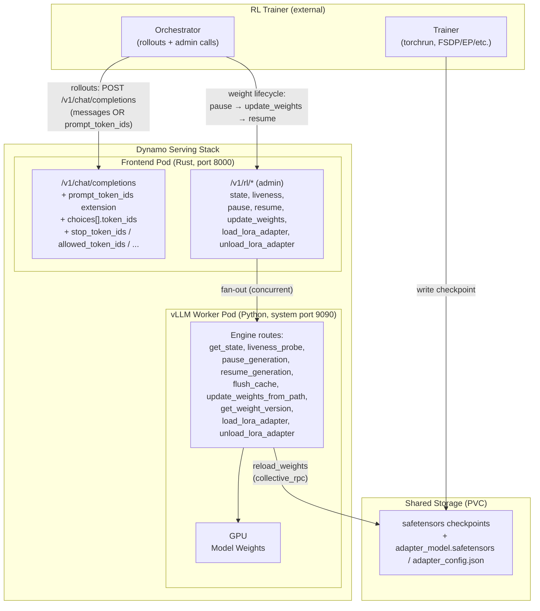
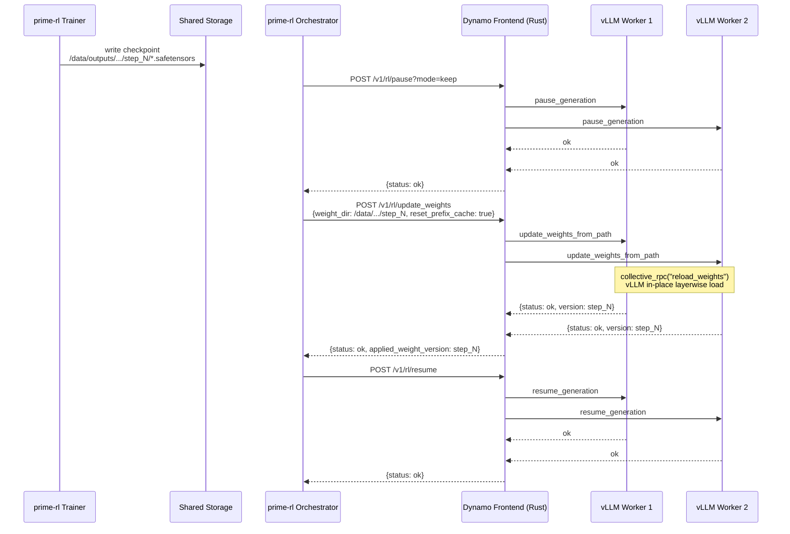
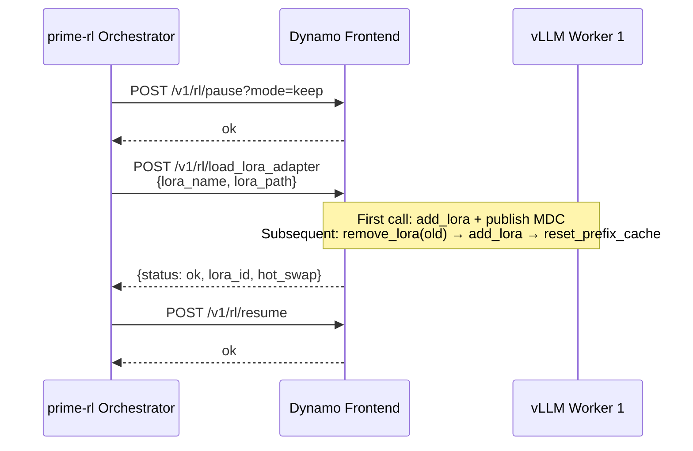

# Dynamo RL API

This document describes the RL training API surface on the Dynamo serving stack. The Dynamo Rust frontend exposes a small, focused set of endpoints that let an RL trainer drive a vLLM-served model through pause / weight-update / resume cycles, hot-swap LoRA adapters, and post pre-tokenized inputs on the standard chat-completions endpoint.

## Table of Contents

1. [Overview](#1-overview)
2. [Architecture](#2-architecture)
3. [Configuration](#3-configuration)
4. [API Reference](#4-api-reference)
   - 4.1 Chat Completions (RL-enhanced + TITO)
   - 4.2 RL Lifecycle (`/v1/rl/*`)
5. [Data Flow](#5-data-flow)
6. [Key Data Structures](#6-key-data-structures)
7. [Worker Engine Routes (Internal)](#7-worker-engine-routes-internal)
8. [Known Limitations](#8-known-limitations)
9. [What Changed vs. the Earlier Draft](#9-what-changed-vs-the-earlier-draft)

---

## 1. Overview

The Dynamo Rust frontend exposes:

- A `/v1/rl/*` router for the full RL control-plane lifecycle (composite state, liveness probe, pause/resume, weight update, LoRA hot-swap)
- Token-level data injection (`prompt_token_ids`, `choices[i].token_ids`, `nvext.completion_token_ids`) on standard chat-completion responses
- Pre-tokenized prompt support on the standard `/v1/chat/completions` endpoint via the `prompt_token_ids` extension (no separate URI)

Zero Python in the inference or admin data path. The Rust frontend handles every HTTP route; vLLM workers expose a small set of internal engine routes for pause/update/resume on the GPU.

### Endpoint Summary

| Capability | Endpoint | Method | Notes |
|---|---|---|---|
| Inference | `/v1/chat/completions` | POST | Standard OpenAI plus RL extras: `prompt_token_ids`, `stop_token_ids`, `allowed_token_ids`, `bad_words_token_ids`, `truncate_prompt_tokens`, `weight_version`, `nvext.{completion_token_ids,return_token_ids,return_routed_experts,return_prompt_logprobs}` |
| Composite state | `/v1/rl/state` | GET | Aggregated per-worker `{ready, engine_alive, pause_state, applied_weight_version, loras, workers}` |
| Liveness | `/v1/rl/liveness` | GET | Round-trips `engine_client.check_health()` so a wedged event loop surfaces 503 |
| Pause fleet | `/v1/rl/pause` | POST | `?mode=keep\|wait\|abort&clear_cache=bool` |
| Resume fleet | `/v1/rl/resume` | POST | |
| Update weights | `/v1/rl/update_weights` | POST | Typed body: `{weight_dir, weight_version?, reset_prefix_cache=true}` |
| Load LoRA adapter | `/v1/rl/load_lora_adapter` | POST | Filesystem-native PEFT-style hot-swap |
| Unload LoRA adapter | `/v1/rl/unload_lora_adapter` | POST | Idempotent |
| Legacy: health | `/v1/rl/health` | GET | Kept for back-compat; prefer `/v1/rl/state` |
| Legacy: ready | `/v1/rl/ready` | GET | Kept for back-compat; prefer `/v1/rl/state` |
| Legacy: weight_version | `/v1/rl/weight_version` | GET | Kept for back-compat; folded into `/v1/rl/state.applied_weight_version` |

Endpoints intentionally **not** present (returned 404):

| Removed | Reason |
|---|---|
| `/v1/chat/completions/tokens` | TITO collapsed into `/v1/chat/completions` via the `prompt_token_ids` top-level extension |
| `/v1/tokenize` | Out of scope for this surface (covered by a separate PR) |
| `/v1/detokenize` | Same as above |

The handler functions and route helpers are kept in source under `#[allow(dead_code)]` so downstream code that still references them compiles; physical deletion is a follow-up cleanup commit.

---

## 2. Architecture

### Component Topology



### Key Design Decisions

1. **Single entry point.** prime-rl points both `base_url` and `admin_base_url` at the Dynamo frontend. No separate admin service.
2. **Fan-out in Rust.** `/v1/rl/*` handlers fan out to all vLLM workers via `DYN_RL_WORKER_SYSTEM_URLS`. Supports DP > 1 without prime-rl needing to discover workers. Returns HTTP 200 only when every worker responds OK; otherwise 502 with per-worker details.
3. **Token IDs as a response extension.** When `DYN_ENABLE_RL=true`, `prompt_token_ids` and `choices[i].token_ids` are injected into every non-streaming response automatically. `nvext.completion_token_ids` is the canonical Dynamo location; the choice-level field is a compatibility shim for prime-rl/verifiers.
4. **Backward compatible.** All new response fields use `#[serde(skip_serializing_if = "Option::is_none")]`. Clients that don't set `DYN_ENABLE_RL` see standard OpenAI-compatible responses with no extra fields.
5. **TITO without a URI fork.** Pre-tokenized input is a top-level extension on the standard chat-completions request (`prompt_token_ids`), not a separate `/v1/chat/completions/tokens` URI. Bridges until vLLM 0.20+ accepts the same extension natively.

---

## 3. Configuration

### Environment Variables (Frontend)

| Variable | Default | Description |
|---|---|---|
| `DYN_ENABLE_RL` | `false` | Master switch. Mounts `/v1/rl/*` routes and auto-injects token IDs in chat completion responses. |
| `DYN_RL_WORKER_SYSTEM_URLS` | `http://localhost:8081` | Comma-separated vLLM worker system HTTP base URLs for fan-out. |
| `DYN_RL_LIVENESS_TIMEOUT_MS` | `5000` | Per-worker timeout for `/v1/rl/liveness`. |

### Environment Variables (Worker)

| Variable | Default | Description |
|---|---|---|
| `DYN_SYSTEM_PORT` | `8081` (local) / `9090` (k8s) | Worker's system HTTP port where engine routes are registered. |

### prime-rl `orch.toml` (representative)

```toml
[client]
base_url       = ["http://<frontend>:8000/v1"]
admin_base_url = ["http://<frontend>:8000/v1/rl"]
backend          = "vllm"
skip_model_check = true

[weight_broadcast]
type = "filesystem"   # NCCL is a Dynamo-side no-op today; see §8
```

### Kubernetes (DGD frontend env)

```yaml
- name: DYN_ENABLE_RL
  value: "true"
- name: DYN_RL_WORKER_SYSTEM_URLS
  value: "http://<dgd-name>-vllmworker.<ns>.svc.cluster.local:9090"
```

---

## 4. API Reference

### 4.1 Chat Completions (RL-enhanced + TITO)

```
POST /v1/chat/completions
```

Standard OpenAI chat completions. When `DYN_ENABLE_RL=true`, every non-streaming response is automatically enriched with token IDs.

#### RL request extensions

The following top-level fields are accepted in addition to the OpenAI schema. They are validated by `validate.rs::PASSTHROUGH_EXTRA_FIELDS` and forwarded to the engine where vLLM 0.20+ accepts them natively:

| Field | Type | Purpose |
|---|---|---|
| `prompt_token_ids` | `u32[]` | Pre-tokenized prompt (TITO). Mutually exclusive with non-empty `messages` (except for the legacy `nvext.token_data` renderer-mode placeholder, which still coexists). |
| `stop_token_ids` | `u32[]` | Plumbed into `SamplingParams.stop_token_ids`; forces stop on any of these IDs. Malformed input (e.g. `"not-an-array"`) returns a typed 400. |
| `allowed_token_ids` | `u32[]` | Restricts decoding to this set. |
| `bad_words_token_ids` | `u32[]` | Suppresses these IDs. |
| `truncate_prompt_tokens` | `int` | Truncates prompt to N most-recent tokens. |
| `weight_version` | `string` | Routing filter for IS-correction strict-version mode (today accepted; routing follow-up). |
| `cache_salt` | `string` | KV prefix-cache isolation hint. (Coordinated with #8197 → `X-Tenant-Id` header; both forms accepted for one release.) |
| `return_token_ids` | `bool` | Per-request opt-in for `nvext.completion_token_ids` (also achievable via `extra_fields`). |
| `return_routed_experts` | `bool` | MoE expert-routing replay capture. |
| `return_prompt_logprobs` | `bool` | Streaming logprobs for input tokens. |

In the legacy `nvext` channel, `nvext.token_data` (renderer-mode pre-tokenized prompt) and `nvext.extra_fields = ["token_ids", "completion_token_ids", ...]` continue to work unchanged.

#### TITO via `prompt_token_ids`

```bash
curl -s -X POST http://localhost:8000/v1/chat/completions \
  -H 'Content-Type: application/json' \
  -d '{
    "model": "Qwen/Qwen3-0.6B",
    "messages": [],
    "prompt_token_ids": [151644, 8948, 198, 151645, 198, 151644, 872, 198,
                         49, 1075, 513, 420, 25, 24748, 1879, 198, 151645,
                         198, 151644, 77091, 198],
    "stop_token_ids": [151643],
    "max_tokens": 64
  }'
```

Validation rules:

- `messages` may be empty when `prompt_token_ids` is non-empty (the chat template short-circuits).
- `messages` non-empty + `prompt_token_ids` non-empty → 400 mutual-exclusion error (canonical channel only).
- `nvext.token_data` + non-empty `messages` → still allowed (renderer-mode placeholder pattern from `verifiers.dynamo_chat_nvext` keeps working).

#### Sample response (non-streaming, `DYN_ENABLE_RL=true`)

```jsonc
{
  "id": "chatcmpl-abc123",
  "object": "chat.completion",
  "model": "Qwen/Qwen3-0.6B",
  "choices": [{
    "index": 0,
    "message": {"role": "assistant", "content": "dlrow olleh"},
    "finish_reason": "stop",
    "logprobs": {"content": [...]},
    "token_ids": [67, 1245, 893, 15]
  }],
  "prompt_token_ids": [151644, 8948, 198, ...],
  "usage": {"prompt_tokens": 21, "completion_tokens": 4, "total_tokens": 25},
  "nvext": {
    "completion_token_ids": [67, 1245, 893, 15]
  }
}
```

#### Response field reference

| Field | JSON path | Description |
|---|---|---|
| `prompt_token_ids` | `response.prompt_token_ids` | Promoted by `rl_tokenize_prompt`: messages → tokenizer (model chat template) → token IDs. |
| `token_ids` | `response.choices[i].token_ids` | Per-choice output token IDs, promoted by `rl_promote_token_ids_in_response` from `nvext.completion_token_ids`. |
| `completion_token_ids` | `response.nvext.completion_token_ids` | Canonical Dynamo location; accumulated across SSE chunks by `DeltaGenerator`. |

**Why two locations?** prime-rl/verifiers reads `response.prompt_token_ids` and `choices[i].token_ids`; Dynamo natively emits in `nvext.completion_token_ids`. The Rust post-processor promotes the latter to the former.

**Invariant:** `len(completion_token_ids) == len(logprobs.content)`.

#### Streaming (SSE)

Intermediate chunks carry `delta.content` only. Token IDs appear exclusively on the **final chunk** (the one with a non-null `finish_reason`).

---

### 4.2 RL Lifecycle (`/v1/rl/*`)

Mounted only when `DYN_ENABLE_RL=true`. All non-trivial routes fan out to the worker URLs in `DYN_RL_WORKER_SYSTEM_URLS`.

#### `GET /v1/rl/state` — composite read-only

Single endpoint that returns everything prime-rl needs to make a decision. Aggregates `get_state` per-worker payloads.

```bash
curl -s http://localhost:8000/v1/rl/state
```

```jsonc
// 200
{
  "ready": true,
  "ingress_alive": true,
  "engine_alive": true,
  "pause_state": "running",        // or "paused" | "mixed"
  "applied_weight_version": "step_5",  // null when workers disagree
  "loras": [
    {"name": "r16-a32", "loaded_on": [0, 1]}
  ],
  "workers": [<per-worker get_state payload>, ...]
}

// 503 — no workers registered
{"ready": false, "ingress_alive": true, "engine_alive": false, "pause_state": "running",
 "applied_weight_version": null, "loras": [], "workers": [],
 "status": "error", "message": "no workers registered"}
```

`ready = ingress_alive AND engine_alive AND len(workers) > 0`. `ingress_alive` is unconditionally `true` because reaching this handler proves the frontend HTTP listener is up.

#### `GET /v1/rl/liveness` — deep liveness probe

Round-trips `engine_client.check_health()` per worker so a wedged event loop or hung NCCL collective surfaces as 503. Override timeout via `DYN_RL_LIVENESS_TIMEOUT_MS` (default 5000).

```bash
curl -s http://localhost:8000/v1/rl/liveness
```

```jsonc
// 200
{"status": "ok", "alive": true, "workers": [{"alive": true}, ...]}

// 503 — at least one worker hung past timeout
{"status": "error", "alive": false, "workers": [{"alive": false, "error": "timeout"}]}
```

#### `POST /v1/rl/pause` — 3-mode pause + cache control

Query parameters (or JSON body):

| Param | Type | Default | Effect |
|---|---|---|---|
| `mode` | `keep` \| `wait` \| `abort` | `keep` | `keep`: drain in-flight (legacy behaviour). `wait`: same as `keep` but block on completion. `abort`: trigger `collective_rpc(abort_all_requests)` on the engine (graceful warn-fallback on vLLM 0.19 where that RPC isn't implemented). |
| `clear_cache` | `bool` | `false` | If `true`, calls `reset_prefix_cache` after the pause completes. |

```bash
curl -s -X POST 'http://localhost:8000/v1/rl/pause?mode=abort&clear_cache=true'
```

400 on unknown `mode`:

```json
{"status": "error", "message": "Invalid mode 'foo'; expected one of keep|wait|abort"}
```

#### `POST /v1/rl/resume`

Resumes generation on all workers.

```bash
curl -s -X POST http://localhost:8000/v1/rl/resume -H 'Content-Type: application/json' -d '{}'
```

```json
{"status": "ok", "workers": [{"status": "ok", "message": "Engine resumed"}]}
```

#### `POST /v1/rl/update_weights` — typed body

Body schema:

```jsonc
{
  "weight_dir":          "/data/outputs/.../broadcasts/step_5",  // required (string | null)
  "weight_version":      "step_5",                               // optional, defaults to basename(weight_dir)
  "reset_prefix_cache":  true                                    // optional, default true
}
```

Behaviour:

- `weight_dir = "/path/..."` → fan out `update_weights_from_path` to every worker. Each worker calls `engine_client.collective_rpc("reload_weights", kwargs={"weights_path": path})` (vLLM's in-place layerwise load).
- `weight_dir = null` → NCCL mode. Dynamo logs `"NCCL mode, no-op on Dynamo side"` and returns 200 immediately. The actual GPU↔GPU transfer happens out of band on a pre-established NCCL group between trainer and inference workers. **Today the inference-side NCCL receiver is not wired into `dynamo.vllm`**; see §8.
- `reset_prefix_cache = true` → flush prefix/KV cache after the load (default).

```bash
# Filesystem mode
curl -s -X POST http://localhost:8000/v1/rl/update_weights \
  -H 'Content-Type: application/json' \
  -d '{"weight_dir": "/data/outputs/run_default/broadcasts/step_5"}'

# NCCL mode (Dynamo no-op — see §8)
curl -s -X POST http://localhost:8000/v1/rl/update_weights \
  -H 'Content-Type: application/json' \
  -d '{"weight_dir": null}'
```

```jsonc
// 200
{
  "status": "ok",
  "applied_weight_version": "step_5",
  "workers": [
    {"status": "ok", "message": "Weights loaded from /data/...", "version": "step_5"}
  ]
}

// 502 (some worker failed)
{"status": "error", "stage": "update_weights_from_path",
 "workers": [{"status": "ok", ...}, {"status": "error", "message": "..."}]}
```

#### `POST /v1/rl/load_lora_adapter`

Hot-load / hot-swap a LoRA adapter from a filesystem path. Adapter dir must contain PEFT-style `adapter_model.safetensors` and `adapter_config.json`.

- First call for a given `lora_name` → `add_lora` + publish a ModelDeploymentCard so subsequent inference with `model=<lora_name>` routes here.
- Subsequent calls (hot-swap) → `remove_lora(old_id)` → `add_lora` with new weights → `reset_prefix_cache`. MDC is left in place.

Pair with `/v1/rl/pause` + `/v1/rl/resume` for full drain-swap-resume.

```bash
curl -s -X POST http://localhost:8000/v1/rl/load_lora_adapter \
  -H 'Content-Type: application/json' \
  -d '{"lora_name": "r16-a32", "lora_path": "/data/outputs/run_default/broadcasts/step_5"}'
```

```jsonc
// 200
{"status": "ok",
 "workers": [{"status": "ok", "message": "LoRA adapter 'r16-a32' loaded from /data/...",
              "lora_name": "r16-a32", "lora_id": 788776416, "hot_swap": false}]}

// 400 — missing/empty fields
{"status": "error",
 "message": "Expected body: {\"lora_name\": str, \"lora_path\": str} (both required, non-empty)"}
```

vLLM worker requirements: started with `--enable-lora --max-lora-rank R --max-loras N`. For prime-rl's single-adapter loop, `--max-loras 1` is sufficient.

#### `POST /v1/rl/unload_lora_adapter`

Remove an adapter by name. Idempotent — unloading an already-absent adapter returns `status: ok`.

```bash
curl -s -X POST http://localhost:8000/v1/rl/unload_lora_adapter \
  -H 'Content-Type: application/json' \
  -d '{"lora_name": "r16-a32"}'
```

#### Legacy endpoints (kept for back-compat)

`GET /v1/rl/health`, `GET /v1/rl/ready`, `GET /v1/rl/weight_version` — same shapes as the previous draft. To be removed in Phase 5 of `docs/design-docs/rl-support.md` once prime-rl's AdminAPI migrates to `/v1/rl/state`.

---

## 5. Data Flow

### 5.1 Rollout (inference) path

```mermaid
sequenceDiagram
    participant Orch as prime-rl Orchestrator
    participant FE as Dynamo Frontend (Rust)
    participant Worker as vLLM Worker (GPU)

    Orch->>FE: POST /v1/chat/completions<br/>{messages OR prompt_token_ids, stop_token_ids?, ...}
    Note over FE: validate.rs: PASSTHROUGH_EXTRA_FIELDS<br/>plumbs RL extras into SamplingParams<br/>If DYN_ENABLE_RL=true, inject<br/>nvext.extra_fields = ["token_ids","completion_token_ids"]<br/>force logprobs=true
    FE->>Worker: forward request (TCP/NATS)
    Worker-->>FE: SSE chunks (delta.content + delta.token_ids)
    Note over FE: DeltaGenerator accumulates<br/>completion_token_ids; serde failures<br/>now log tracing::warn! (no silent drops)
    Worker-->>FE: final chunk (finish_reason + nvext.completion_token_ids)
    Note over FE: rl_tokenize_prompt(messages) -> prompt_token_ids<br/>rl_promote_token_ids_in_response()<br/>nvext.completion_token_ids -> choices[i].token_ids
    FE-->>Orch: enriched response
```

### 5.2 Weight update path



NCCL mode: `weight_dir=null` returns 200 immediately; the actual GPU↔GPU broadcast must be coordinated out of band (see §8 for the wiring gap).

### 5.3 LoRA hot-swap



---

## 6. Key Data Structures

### `NvCreateChatCompletionRequest` (Rust, request side)

Custom fields (top-level, beyond stock OpenAI):

| Field | `serde` behaviour | Notes |
|---|---|---|
| `prompt_token_ids` | passthrough | Canonical TITO channel. Read by `NvExtProvider::get_pretokenized_input`. |
| `stop_token_ids` | passthrough | Read by `OpenAIStopConditionsProvider::get_stop_token_ids() → Result<Option<Vec<TokenIdType>>>`. Malformed input returns 400. |
| `allowed_token_ids`, `bad_words_token_ids`, `truncate_prompt_tokens` | passthrough | Plumbed into `SamplingParams`. |
| `weight_version`, `cache_salt`, `return_*` | passthrough | See §4.1. |
| `tokens` | `skip_serializing` | Legacy compat — caught and ignored. |
| `return_token_ids` | `skip_serializing` | Legacy compat — use `nvext.extra_fields` or `DYN_ENABLE_RL`. |

### `NvCreateChatCompletionResponse` (Rust, response side)

```rust
NvCreateChatCompletionResponse {
    inner:             CreateChatCompletionResponse,    // standard OpenAI
    nvext:             Option<serde_json::Value>,       // NvExtResponse JSON
    prompt_token_ids:  Option<Vec<u32>>,                // RL only
}
```

### `NvExtResponse`

Serialized as `nvext` on each SSE chunk and the unary response body:

```rust
NvExtResponse {
    worker_id:            Option<WorkerIdInfo>,
    timing:               Option<TimingInfo>,
    token_ids:            Option<Vec<u32>>,        // GAIE Stage 1 prompt
    routed_experts:       Option<serde_json::Value>,
    completion_token_ids: Option<Vec<u32>>,        // RL output, final chunk only
}
```

### `RlUpdateWeightsBody`

```rust
struct RlUpdateWeightsBody {
    weight_dir:         Option<String>,   // null => NCCL mode
    weight_version:     Option<String>,   // defaults to basename(weight_dir)
    #[serde(default = "default_reset_prefix_cache")]
    reset_prefix_cache: bool,             // default true
}
```

### `DeltaGenerator` (streaming pipeline)

Tracks `accumulated_completion_token_ids: Vec<u32>` per request. Activated when `extra_fields` includes `"completion_token_ids"` (auto-set under `DYN_ENABLE_RL`). Emits the full vector in `nvext.completion_token_ids` on the final chunk.

### Post-processing helpers

- `rl_tokenize_prompt(state, model, messages) -> Option<Vec<u32>>` — resolves the model card, builds `PromptFormatter`, renders messages through the chat template, tokenizes, returns IDs.
- `rl_promote_token_ids_in_response(json_val)` — copies `nvext.completion_token_ids` to `choices[i].token_ids` per choice. Doc-block now lives on this function (commit `d295ebc6` move).

---

## 7. Worker Engine Routes (Internal)

Registered on each vLLM worker's system HTTP port (default `8081` local / `9090` k8s) by `worker_factory.py::register_engine_routes()`. Called by Rust `/v1/rl/*` handlers — not by prime-rl directly.

| Route | vLLM API called | Used by |
|---|---|---|
| `pause_generation` | `engine_client.pause_generation()` (+ `abort_all_requests` when mode=abort) | `/v1/rl/pause` |
| `resume_generation` | `engine_client.resume_generation()` | `/v1/rl/resume` |
| `flush_cache` | `engine_client.reset_prefix_cache()` | `/v1/rl/update_weights` (when `reset_prefix_cache=true`) |
| `update_weights_from_path` | `collective_rpc("reload_weights", weights_path=...)` | `/v1/rl/update_weights` |
| `get_weight_version` | reads `self._weight_version` | `/v1/rl/weight_version` (legacy) |
| `get_state` | composite per-worker snapshot (engine_alive, pause_state, applied_weight_version, loras) | `/v1/rl/state` |
| `liveness_probe` | round-trips `engine_client.check_health()` so a wedged event loop returns 503 | `/v1/rl/liveness` |
| `load_lora_adapter` | `add_lora`, `remove_lora` | `/v1/rl/load_lora_adapter` |
| `unload_lora_adapter` | `remove_lora` + MDC unregister | `/v1/rl/unload_lora_adapter` |

### `publisher.py` crash guard

`DynamoStatLoggerPublisher.record()` guards against `scheduler_stats is None`. This prevents an `AttributeError` crash during the transient window right after a weight reload, when the vLLM stats logger fires before the engine core has re-initialized its scheduler.

---

## 8. Known Limitations

| Limitation | Workaround | Notes |
|---|---|---|
| **NCCL mode is a no-op on Dynamo's vLLM side.** `update_weights` with `weight_dir=null` returns 200 immediately, but `dynamo.vllm` does not load `NCCLWeightBroadcastReceiver` as a vLLM worker class — so the trainer's NCCL broadcast has no peer on the inference side. Trainer's `init_process_group` times out at `weight_broadcast.timeout` (default 1200 s). | Use `weight_broadcast.type = "filesystem"`. The `dynamo.sglang` backend ships `update_weights_from_distributed` natively and does work over NCCL. | Tracked at the prime-rl side: orchestrator already POSTs `/v1/rl/init_broadcaster` which dynamo.vllm doesn't expose (logs `route does not exist. Skipping NCCL broadcast initialization.` on the orch side). Wiring is the next workstream. |
| `cache_salt` not yet honored end-to-end | Set `[experimental] use_prefix_cache_salt = false` in prime-rl `orch.toml`; or send the equivalent `X-Tenant-Id` header (#8197). | Field is whitelisted (`PASSTHROUGH_EXTRA_FIELDS`) so requests don't 400; routing-side filter is a follow-up. |
| `prompt_token_ids` only injected for non-streaming responses | Use non-streaming mode for RL rollouts (the default). | Streaming final-chunk injection is planned. |
| Weight version `"initial"` before first update | Use `/v1/rl/state.applied_weight_version` for source-of-truth; don't rely on the version string for correctness. | |
| Filesystem weight broadcast scales poorly for large models | Ok for 0.6B (~250 ms load); marginal at 7B (~25 s); ~150 s at 30B-A3B BF16; impractical at 70B+. | RDMA / NCCL-receive on dynamo.vllm planned. |

---

## 9. What Changed vs. the Earlier Draft

For readers who know the previous `Dynamo-RL-api-draft.md`:

| Old | New |
|---|---|
| `/v1/chat/completions/tokens` (TITO URI fork) | TITO collapsed into `/v1/chat/completions` via the `prompt_token_ids` top-level extension. URI returns 404. |
| `/v1/tokenize`, `/v1/detokenize` | Removed (return 404). Owned by [#7699](https://github.com/ai-dynamo/dynamo/pull/7699), out of scope for this surface. |
| `POST /v1/rl/pause` (no params) | `POST /v1/rl/pause?mode=keep|wait|abort&clear_cache=bool` (3-mode). |
| `POST /v1/rl/update_weights` (string body) | Typed body `{weight_dir, weight_version?, reset_prefix_cache=true}`; response carries `applied_weight_version`. |
| `/v1/rl/health` + `/v1/rl/ready` + `/v1/rl/weight_version` | All three kept for back-compat, **plus** new composite `GET /v1/rl/state`. New `GET /v1/rl/liveness` does a deep `check_health()` round-trip. |
| `PASSTHROUGH_EXTRA_FIELDS = [cache_salt]` | Now: `cache_salt`, `prompt_token_ids`, `weight_version`, `return_routed_experts`, `return_token_ids`, `return_prompt_logprobs`, `stop_token_ids`, `bad_words_token_ids`, `allowed_token_ids`, `truncate_prompt_tokens`. Full `SamplingParams` parity. |
| `get_stop_token_ids() -> Option<Vec<TokenIdType>>` (silent drop on bad input) | `get_stop_token_ids() -> Result<Option<Vec<TokenIdType>>>`. Malformed input returns a typed 400. |
| nvext serde failures: `if let Ok(json) = serde_json::to_value(...) { ... }` (silent drop) | `match { Ok(json) => ..., Err(e) => tracing::warn!(...) }`. No silent corruption of promoted token IDs / weight version. |
| Engine routes: 5–7 (pause, resume, flush_cache, update_weights_from_path, get_weight_version, +load_lora, +unload_lora) | 9. Added: `get_state`, `liveness_probe`. |
