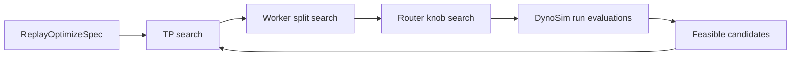

A DynoSim sweep runs many simulation trials across candidate topologies, router settings, and timing-model inputs, then ranks the results against SLA constraints and GPU budget.

Use a sweep when one DynoSim run is not enough and you want to search for candidate configurations:

- aggregated versus disaggregated topology
- tensor-parallel shape
- prefill and decode worker counts
- KV-router overlap credit and prompt-load scaling
- throughput, TTFT, ITL, or end-to-end latency objectives

The current Python API is `dynamo.profiler.utils.replay_optimize`. The docs use "DynoSim sweep" as the product term while keeping the existing implementation name for now. The input shape intentionally mirrors `DynamoGraphDeploymentRequest` concepts so successful experiments can flow toward DGDR and Planner workflows.

## How It Works



Each candidate state is evaluated by the simulation harness. The optimizer records the metrics from each run, filters candidates that violate SLA or GPU-budget constraints, and returns the best feasible state plus the full evaluated table for analysis.

## Spec Shape

| Spec | Purpose |
|---|---|
| `EngineSpec` | Model, backend, and base engine arguments |
| `HardwareSpec` | GPU SKU and total simulated GPU budget |
| `WorkloadSpec` | Synthetic workload knobs or a trace file |
| `SLASpec` | Optional TTFT, ITL, end-to-end latency, and p95 bounds |
| `RouterSpec` | Router mode and sweep values for router cost-model knobs |
| `objective` | Ranking target, such as throughput or mean end-to-end latency |
| `maxParallelEvals` | Number of candidate evaluations to run concurrently |

## Minimal Example

Run from the repository root after building the Dynamo Python bindings.

```bash
.venv/bin/python components/src/dynamo/profiler/utils/replay_optimize/example.py \
  --max-parallel-evals 4
```

The example searches a synthetic disaggregated KV-router workload using AIC-backed candidate timing. It prints the best feasible state and a table of top feasible configurations.

To run against a trace instead of the synthetic workload:

```bash
.venv/bin/python components/src/dynamo/profiler/utils/replay_optimize/example.py \
  --trace-file /path/to/mooncake_trace.jsonl \
  --arrival-speedup-ratio 1.0 \
  --max-parallel-evals 4
```

## Outputs

The optimizer returns a result object with:

- `best_feasible`: best visited state that satisfies all configured SLA and GPU-budget constraints
- `best_infeasible`: best visited state that missed at least one constraint
- `evaluated_df`: all visited states and metrics
- `feasible_df`: only feasible states

Common columns to inspect:

- topology: `prefill_tp`, `decode_tp`, `prefill_workers`, `decode_workers`
- routing: `router_mode`, `overlap_score_credit`, `prefill_load_scale`
- budget: `total_gpus_used`
- throughput: `output_throughput_tok_s`
- cache behavior: `prefix_cache_reused_ratio`
- latency: `mean_ttft_ms`, `mean_tpot_ms`, `mean_e2e_latency_ms`

## Relationship To DynoSim Runs

A [DynoSim run](runs.md) answers "how does this one configuration perform?" A DynoSim sweep answers "which configuration should I try next?"

For final validation, take the feasible candidates into a live Mocker deployment or a real-GPU AIPerf benchmark. DynoSim is designed to narrow the search space before cluster validation, not to replace it.
