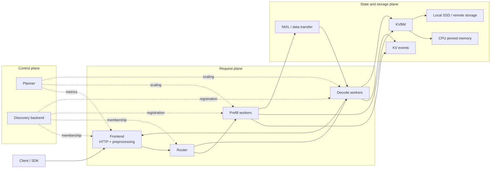

# Dynamo Learning Tutorials

Most docs tell you what Dynamo can do. This tutorial track explains why the architecture exists, which source files implement each idea, and how to reason about the math without getting buried in notation.

Dynamo sits above serving engines such as SGLang, TensorRT-LLM, and vLLM. The engines still run the model forward pass. Dynamo coordinates the cluster around them: frontend ingress, worker discovery, request routing, disaggregated prefill/decode, KV event propagation, multi-tier cache movement, and autoscaling.

> [!TIP]
> If you are new to Dynamo, read these pages in order. If you already know the product surface, jump directly to [Architecture](architecture.md) or [Source Tour](source-tour.md).

## What you will learn

- Why prefill and decode want different hardware shapes
- Why KV-aware routing can beat naive load balancing
- Why KVBM treats memory as a tiered system instead of "GPU or bust"
- How the planner turns latency goals into replica counts
- Which Python entrypoints and Rust crates own each subsystem

## Reading map

| Page | What it teaches | Best read after |
|---|---|---|
| [Quick Start](quick-start.md) | The simplest correct mental model of Dynamo | The repo `README.md` |
| [Architecture](architecture.md) | How the request, control, and state planes fit together | Quick Start |
| [Math and Systems Theory](math-theory.md) | Router cost, queue priority, planner math, and transfer logic | Architecture |
| [Source Tour](source-tour.md) | Where to read the actual Python and Rust implementation | Any page |

## One-picture mental model

## Core code landmarks

| Subsystem | First file to open | Why it matters |
|---|---|---|
| Frontend ingress | `components/src/dynamo/frontend/main.py` | Parses CLI flags, configures `DistributedRuntime`, and selects the router mode |
| Distributed runtime | `lib/runtime/src/distributed.rs` | Owns discovery, request transport, health, metrics, and the local runtime root |
| KV routing | `lib/llm/src/kv_router.rs` | Connects overlap indexing, worker selection, and routing state updates |
| Queue policy | `lib/kv-router/src/scheduling/policy.rs` | Encodes FCFS, LCFS, and WSPT in compact math |
| Autoscaling | `components/src/dynamo/planner/core/disagg.py` | Runs the split prefill/decode planning loop |
| Memory transfer | `lib/kvbm-physical/src/transfer/strategy.rs` | Chooses direct versus staged movement across GPU, host, disk, and remote memory |

## What this tutorial adds beyond the existing docs

The official docs already provide component-level and design-level coverage:

- [Overall Architecture](../design-docs/architecture.md)
- [Disaggregated Serving](../design-docs/disagg-serving.md)
- [Router Guide](../components/router/router-guide.md)
- [KVBM Guide](../components/kvbm/kvbm-guide.md)
- [Planner Guide](../components/planner/planner-guide.md)

This tutorial track complements them by doing three extra things:

1. It starts from plain-language intuition before using systems vocabulary.
2. It ties each concept back to concrete source files.
3. It explains the formulas with small numeric examples instead of only showing the symbolic form.

## Recommended reading styles

| If you are... | Start with |
|---|---|
| A new user trying to understand the product | [Quick Start](quick-start.md) |
| A systems engineer evaluating architecture tradeoffs | [Architecture](architecture.md) |
| Someone debugging router or planner behavior | [Math and Systems Theory](math-theory.md) |
| A contributor preparing to read code | [Source Tour](source-tour.md) |

## Continue

Start with [Quick Start](quick-start.md), then read [Architecture](architecture.md).
