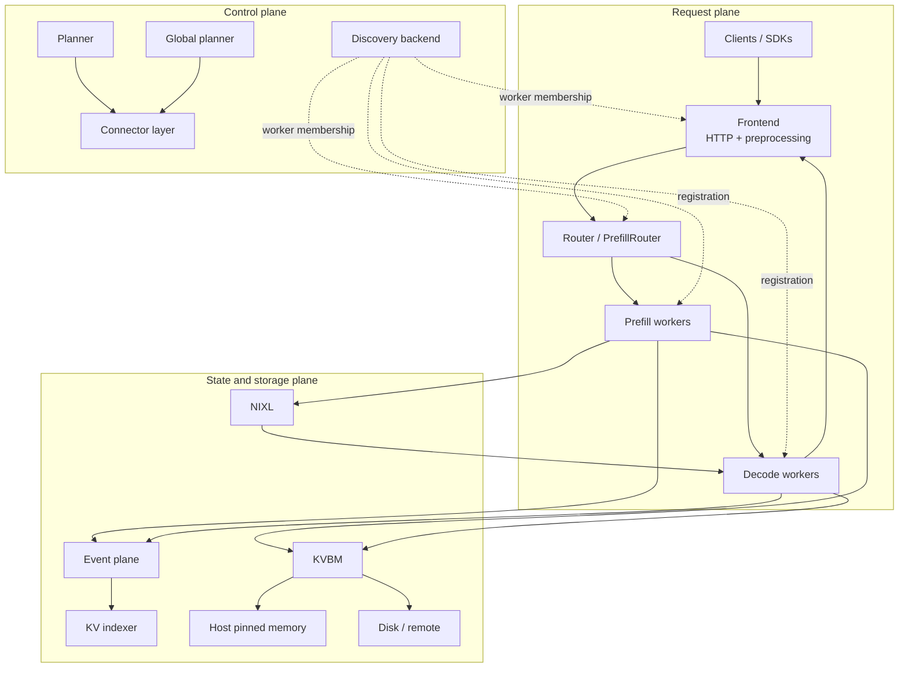
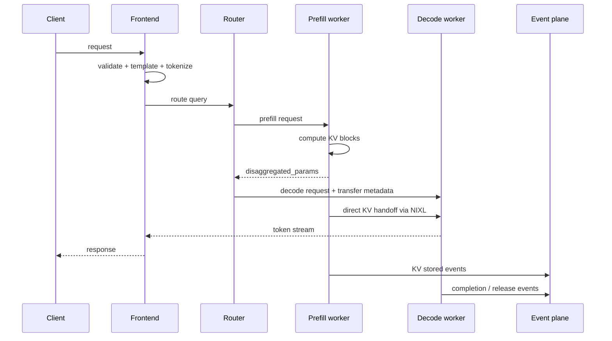

# Dynamo Architecture

The most useful way to understand Dynamo is to stop thinking of it as a single server and start thinking of it as three cooperating planes:

- a **request plane** that keeps tokens flowing
- a **control plane** that decides how much capacity should exist
- a **state plane** that decides where KV cache lives and how it moves

That split is visible not only in the product story, but also in the source tree.

## Macro architecture

## The request plane

The request plane is the fast path:

- **Frontend** normalizes OpenAI-compatible requests, applies chat templates, tokenizes, and exposes HTTP routes.
- **Router** decides which worker should process the request.
- **Prefill workers** compute prompt KV state.
- **Decode workers** generate output tokens and stream them back.

Important files:

| Role | Files |
|---|---|
| Frontend process entry | `components/src/dynamo/frontend/main.py` |
| Frontend argument model | `components/src/dynamo/frontend/frontend_args.py` |
| Pre/post-processing | `components/src/dynamo/frontend/prepost.py` |
| KV router orchestration | `lib/llm/src/kv_router.rs` |
| Queue policies | `lib/kv-router/src/scheduling/policy.rs` |
| Queue admission and utilization gates | `lib/kv-router/src/scheduling/queue.rs` |

### Why routing is more than load balancing

The router tracks two different costs at once:

1. **How much new prefill work** would be needed on a worker
2. **How much decode pressure** that worker is already carrying

That is why Dynamo can prefer a worker with a warm prefix cache even if another worker looks less busy at first glance.

## The control plane

The control plane is the adaptation loop. It is responsible for deciding whether the current deployment shape still matches traffic.

Important files:

| Role | Files |
|---|---|
| Planner entrypoint | `components/src/dynamo/planner/__main__.py` |
| Disaggregated planning loop | `components/src/dynamo/planner/core/disagg.py` |
| Prefill planner | `components/src/dynamo/planner/core/prefill.py` |
| Decode planner | `components/src/dynamo/planner/core/decode.py` |
| Load-based regression | `components/src/dynamo/planner/core/load/fpm_regression.py` |
| Global planner | `components/src/dynamo/global_planner/scale_handler.py` |

The planner can use two broad signal families:

- **throughput-based planning** from profiling data and forecasted traffic
- **load-based planning** from live ForwardPassMetrics

The key architectural point is that Dynamo does not treat scaling as a separate external concern. Scaling is wired into the runtime model of prefill and decode.

## The state plane

The state plane covers everything that makes cache reuse and cross-worker handoff possible:

- KV events
- global KV indexing
- KVBM
- NIXL transfer

Important files:

| Role | Files |
|---|---|
| Runtime root | `lib/runtime/src/distributed.rs` |
| Discovery abstraction | `lib/runtime/src/discovery/mod.rs` |
| Request-plane manager | `lib/runtime/src/pipeline/network/manager.rs` |
| Event-plane transport | `lib/runtime/src/transports/event_plane/mod.rs` |
| KVBM transfer policy | `lib/kvbm-physical/src/transfer/strategy.rs` |
| KVBM physical manager | `lib/kvbm-physical/src/manager/mod.rs` |

This is where Dynamo starts looking like an operating system for KV cache instead of a plain inference wrapper.

## End-to-end disaggregated walkthrough

Two details matter here:

- The prefill worker can finish first and hand off state instead of performing decode itself.
- The state handoff is fast only if the system can see the worker topology, choose the right transfer path, and understand where the KV blocks live.

## The three communication planes

### Discovery plane

The discovery plane answers membership and liveness questions.

- Kubernetes mode uses native resources and metadata.
- KV-store mode can use etcd, file-backed state, or in-memory discovery.

Relevant code starts in `lib/runtime/src/discovery/mod.rs`.

### Request plane

The request plane answers "how do bytes actually move between components?"

Dynamo can use multiple transport styles depending on deployment mode, but the shared control point lives in the runtime network manager.

Relevant code starts in `lib/runtime/src/pipeline/network/manager.rs`.

### Event plane

The event plane answers "how do components learn that cache state changed?"

That includes KV events, forward-pass metrics, and other asynchronous coordination signals.

Relevant code starts in `lib/runtime/src/transports/event_plane/mod.rs`.

## Why the repo is split between Python and Rust

The split is deliberate:

- **Python** owns CLI ergonomics, backend integration, and fast feature adaptation.
- **Rust** owns hot-path routing, runtime coordination, transport infrastructure, and memory-sensitive internals.

This is why a typical Dynamo process starts in a Python module such as `components/src/dynamo/frontend/main.py`, but the long-lived system substrate is powered by Rust crates under `lib/`.

## Fault handling and elasticity are part of the architecture

Dynamo assumes the cluster will change while requests are flowing:

- workers join and leave
- replicas scale up and down
- KV state may move across tiers
- routers need to keep making good decisions under partial information

That is why discovery, eventing, and autoscaling appear in the architecture diagrams right next to the serving path instead of being treated as background details.

## Suggested next readings

- [Math and Systems Theory](math-theory.md) for routing cost and scaling formulas
- [Source Tour](source-tour.md) for a concrete reading path through the code
- [Overall Architecture](../design-docs/architecture.md)
- [Request Plane](../design-docs/request-plane.md)
- [Discovery Plane](../design-docs/discovery-plane.md)
- [Event Plane](../design-docs/event-plane.md)
