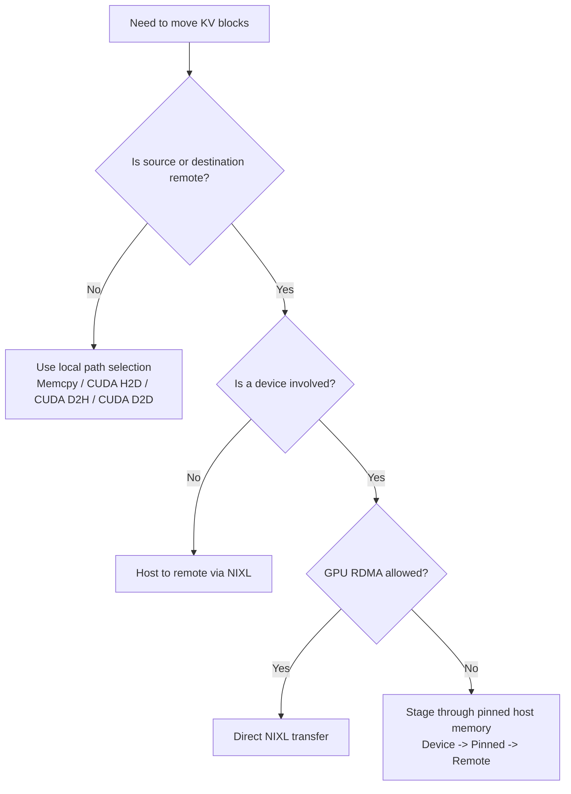

# Dynamo Math and Systems Theory

This page translates the core formulas behind Dynamo into plain language and tiny numeric examples.

The goal is not to impress you with symbols. The goal is to let you look at a log line or a source file and immediately know what the number is trying to approximate.

## 1. Router cost: cached work versus busy workers

The router design docs describe a simple but powerful idea:

$$
\text{new\_prefill\_tokens} = \text{isl\_tokens} - \text{overlap\_blocks} \times \text{block\_size}
$$

$$
\text{cost} = \text{overlap\_score\_weight} \times \text{prefill\_blocks} + \text{decode\_blocks}
$$

Where:

- `isl_tokens` means input sequence length
- `overlap_blocks` means how many KV blocks are already reusable on a worker
- `block_size` means tokens per KV block
- `prefill_blocks` means how many blocks still need fresh prefill computation
- `decode_blocks` means how much decode work is already active on the worker

This logic appears conceptually in [Router Design](../design-docs/router-design.md) and operationally in `lib/llm/src/kv_router.rs`.

### A small example

Suppose a request has:

- `isl_tokens = 1024`
- `block_size = 16`

Now compare three workers:

| Worker | Cached overlap | New prefill tokens | Decode blocks | Cost when `overlap_score_weight = 1` |
|---|---:|---:|---:|---:|
| A | 10 blocks | `1024 - 10*16 = 864` | 4 | high |
| B | 40 blocks | `1024 - 40*16 = 384` | 6 | medium |
| C | 55 blocks | `1024 - 55*16 = 144` | 9 | often lowest |

Why can C still win even though it is busier on decode? Because reusing a large prefix can save far more work than a small load imbalance costs.

### Grocery-store analogy

Imagine three cashiers:

- one has a short line but must scan your entire cart from scratch
- one has a slightly longer line but half your groceries are already bagged
- one has a longer line but almost all your groceries are already bagged

The best cashier is not automatically the least busy one. It is the one with the lowest **remaining work** after reuse is counted.

## 2. Queue priority: why WSPT favors short uncached work

In `lib/kv-router/src/scheduling/policy.rs`, Dynamo exposes FCFS, LCFS, and WSPT.

The WSPT key is:

$$
\text{priority} = \frac{1 + \text{priority\_jump}}{\text{new\_tokens}}
$$

with:

$$
\text{new\_tokens} = \max(1, \text{isl\_tokens} - \text{cached\_tokens})
$$

And:

$$
\text{cached\_tokens} = \text{max\_overlap\_blocks} \times \text{block\_size}
$$

### What the variables mean

- `priority_jump` is an explicit priority boost
- `new_tokens` is the estimated prefill work that still has to happen
- higher priority value means the request should be scheduled sooner

### A tiny numeric example

Assume:

- block size = 16
- both requests have `priority_jump = 0`

Request 1:

- `isl_tokens = 1024`
- cached overlap = 60 blocks
- cached tokens = `60 * 16 = 960`
- new tokens = `1024 - 960 = 64`
- priority = `1 / 64 = 0.015625`

Request 2:

- `isl_tokens = 1024`
- cached overlap = 0 blocks
- new tokens = `1024`
- priority = `1 / 1024 = 0.0009765625`

Request 1 gets scheduled earlier because almost all of its work is already done.

### Why this is a good systems heuristic

WSPT is not just "favor short requests." In Dynamo it is really "favor requests with the lowest **uncached** work."

That is much closer to what actually burns GPU time.

## 3. Planner math: how latency goals become replica counts

The planner design docs summarize the throughput-based logic with formulas like:

$$
\text{predicted\_prefill\_load}
= \frac{\text{next\_requests} \times \text{next\_isl}}{\text{interval}}
$$

$$
\text{prefill\_replicas}
=
\left\lceil
\frac{\text{predicted\_prefill\_load}}
{\text{throughput\_per\_gpu} \times \text{gpus\_per\_engine}}
\right\rceil
$$

and:

$$
\text{decode\_replicas}
=
\left\lceil
\frac{\text{next\_requests} \times \text{next\_osl}}
{\text{interval} \times \text{throughput\_per\_gpu} \times \text{gpus\_per\_engine}}
\right\rceil
$$

The implementation is more nuanced because it includes correction factors, interpolators, and separate prefill/decode reasoning, but this simplified view captures the intuition.

### A tiny prefill example

Suppose the next interval predicts:

- `next_requests = 120`
- `next_isl = 4000`
- `interval = 60 seconds`
- `throughput_per_gpu = 4000 tokens/second`
- `gpus_per_engine = 2`

Then:

$$
\text{predicted\_prefill\_load}
= \frac{120 \times 4000}{60}
= 8000 \text{ tokens/second}
$$

Each engine contributes:

$$
4000 \times 2 = 8000 \text{ tokens/second}
$$

So:

$$
\text{prefill\_replicas} = \lceil 8000 / 8000 \rceil = 1
$$

If traffic doubles, the answer becomes 2.

### A tiny decode example

Suppose:

- `next_requests = 120`
- `next_osl = 300`
- `interval = 60`
- `throughput_per_gpu = 300 tokens/second`
- `gpus_per_engine = 2`

Then:

$$
\frac{120 \times 300}{60} = 600 \text{ output tokens/second}
$$

Each engine contributes:

$$
300 \times 2 = 600 \text{ output tokens/second}
$$

So decode also needs:

$$
\lceil 600 / 600 \rceil = 1
$$

The key Dynamo insight is that **prefill and decode can scale independently** when their bottlenecks differ.

## 4. Transfer strategy: when direct copy is impossible

`lib/kvbm-physical/src/transfer/strategy.rs` encodes a decision tree for moving KV blocks between memory locations.

At a high level:

- host to host can use plain memcpy
- pinned host to device can use CUDA H2D
- device to pinned host can use CUDA D2H
- device to device can use CUDA D2D
- device to remote may need either direct GPU RDMA or a host bounce buffer

### Plain-language intuition

Think of a sofa that needs to move from apartment A to apartment B:

- if the hallway is wide enough, move it directly
- if the hallway is too narrow, place it in a staging area first

KVBM makes the same choice for KV blocks:

- direct path when hardware and capabilities permit
- two-hop path when the direct route is not safe or available

## 5. Why these formulas matter in practice

All four ideas above are doing the same job:

- estimate remaining work instead of raw request count
- estimate system capacity instead of guessing
- choose the cheapest safe movement path instead of assuming one memory tier

That is why Dynamo feels like a systems project first and an "AI wrapper" second.

## Related readings

- [Architecture](architecture.md)
- [Source Tour](source-tour.md)
- [Router Design](../design-docs/router-design.md)
- [Planner Design](../design-docs/planner-design.md)
- [KVBM Design](../design-docs/kvbm-design.md)
