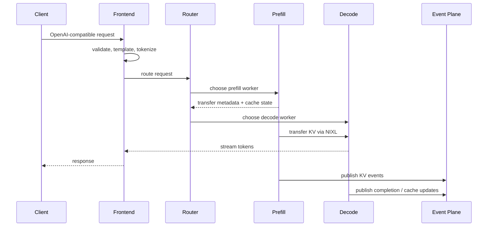
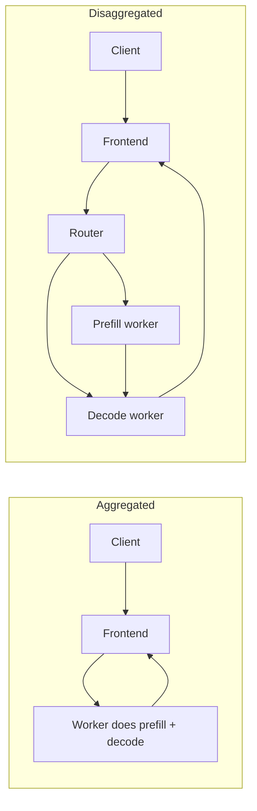

# Dynamo Quick Start

Imagine an airport with two very different bottlenecks:

- check-in is heavy, parallel, and front-loaded
- boarding is lighter per passenger but keeps going for a long time

LLM inference has the same shape:

- **prefill** is the expensive "digest the prompt" phase
- **decode** is the long-running "generate one more token" phase

Running both phases on the same worker pool is often convenient, but not always efficient. Dynamo exists to coordinate these phases across many workers and nodes without losing cache locality or operational control.

## Dynamo in one sentence

Dynamo is a distributed inference runtime and control layer that turns multiple backend workers into one coordinated serving system.

## The pains Dynamo fixes

| Pain | What goes wrong without orchestration | What Dynamo adds |
|---|---|---|
| Mixed long and short prompts | Long prefills can block decoding traffic | Disaggregated prefill/decode and smarter routing |
| Repeated prompt prefixes | The same prompt work gets recomputed | KV-aware routing and global KV visibility |
| GPU memory pressure | Long contexts fall out of HBM too early | KVBM with host, disk, and remote tiers |
| Bursty traffic | Static replica counts miss latency targets | Planner-driven scaling loops |
| Multi-node deployments | Discovery and worker coordination become ad hoc | Discovery, request, and event planes |

## From user request to generated tokens



The important idea is that the router is not "just" a load balancer. It is deciding where to spend compute, where to reuse compute, and when the next phase should run on a different worker.

## Try the smallest local setup

For the simplest path, you do not need Kubernetes, and you do not even need etcd or NATS if you are only trying the basic aggregated flow.

```bash
# Terminal 1: start the frontend
python3 -m dynamo.frontend \
  --http-port 8000 \
  --discovery-backend file

# Terminal 2: start a worker
python3 -m dynamo.sglang \
  --model-path Qwen/Qwen3-0.6B \
  --discovery-backend file

# Terminal 3: send a request
curl -s localhost:8000/v1/chat/completions \
  -H "Content-Type: application/json" \
  -d '{
    "model": "Qwen/Qwen3-0.6B",
    "messages": [{"role": "user", "content": "Explain Dynamo in one sentence."}],
    "max_tokens": 64
  }'
```

> [!NOTE]
> KV-aware routing and durable KV event flows need the event path to be configured. The tiny local setup above is meant to teach the request path, not the full production topology.

## Map that local run to the implementation

| What you launched | Main files | What they do |
|---|---|---|
| `python -m dynamo.frontend` | `components/src/dynamo/frontend/__main__.py`, `components/src/dynamo/frontend/main.py` | Build the frontend process, parse arguments, construct runtime, choose router behavior |
| `DistributedRuntime(...)` | `lib/runtime/src/distributed.rs` | Own the discovery client, request-plane manager, health, metrics, and transport setup |
| Router selection | `dynamo.llm.RouterMode`, `lib/llm/src/kv_router.rs` | Decide whether the frontend routes round-robin, random, direct, or KV-aware |
| Worker backend | `components/src/dynamo/sglang/main.py`, `components/src/dynamo/vllm/main.py`, `components/src/dynamo/trtllm/main.py` | Launch the backend worker and connect it to Dynamo runtime services |

## Aggregated versus disaggregated serving



Aggregated mode is simpler and often the right starting point.

Disaggregated mode becomes attractive when:

- prompts are long and variable
- decode traffic must stay smooth
- prefill and decode want different hardware or replica counts
- cross-worker KV handoff is still cheaper than recomputing the prompt

## What to watch during your first debugging session

1. **Frontend logs**: check which router mode is active and whether discovery succeeded.
2. **Worker registration**: if the frontend sees zero workers, start with discovery backend settings.
3. **Request plane mismatches**: TCP, HTTP, and NATS modes must align across components.
4. **KV events**: if KV-aware routing is not improving latency, confirm that cache events are actually flowing.
5. **Metrics and health**: the runtime and planner both depend on clean signal paths.

## Practical intuition to keep in mind

- Dynamo does **not** replace the backend engine.
- Dynamo does **not** make every deployment disaggregated by default.
- Dynamo's value comes from **coordination**: better placement, better reuse, and better control loops.

From here, go to [Architecture](architecture.md) for the full picture, then [Math and Systems Theory](math-theory.md) to understand the cost functions and scaling formulas.
