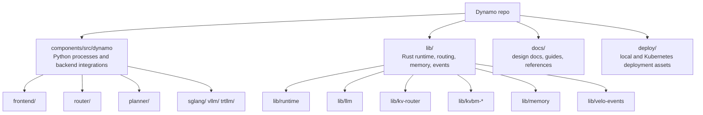
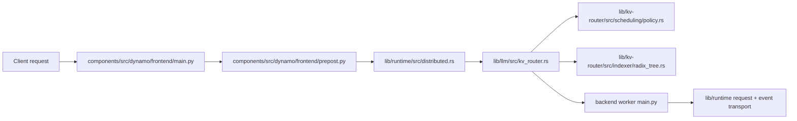

# Dynamo Source Tour

The Dynamo monorepo is large enough that a random walk is a poor learning strategy.

The best approach is:

1. start at Python entrypoints
2. identify where each process hands responsibility to the runtime
3. follow the hot path into Rust

## Repo map at 10,000 feet

## If you only have 30 minutes, read these first

| Goal | Files to open |
|---|---|
| Understand process startup | `components/src/dynamo/frontend/main.py` |
| Understand runtime construction | `lib/runtime/src/distributed.rs` |
| Understand routing decisions | `lib/llm/src/kv_router.rs` |
| Understand queue policy math | `lib/kv-router/src/scheduling/policy.rs` |
| Understand disaggregated autoscaling | `components/src/dynamo/planner/core/disagg.py` |
| Understand memory movement | `lib/kvbm-physical/src/transfer/strategy.rs` |

## Start from Python entrypoints

These are the best "doors" into the system:

| Process | Entrypoint | What you learn |
|---|---|---|
| Frontend | `components/src/dynamo/frontend/__main__.py` and `main.py` | CLI flags, router mode, runtime bootstrap, HTTP serving |
| Standalone router | `components/src/dynamo/router/__main__.py` | Router process shape and backend-specific arguments |
| Planner | `components/src/dynamo/planner/__main__.py` | Autoscaling bootstrap, config wiring, runtime integration |
| Global planner | `components/src/dynamo/global_planner/__main__.py` | Cross-pool or higher-level scaling logic |
| SGLang backend | `components/src/dynamo/sglang/main.py` | Worker registration and backend-specific runtime setup |
| vLLM backend | `components/src/dynamo/vllm/main.py` | Worker lifecycle, handlers, instrumentation |
| TRT-LLM backend | `components/src/dynamo/trtllm/main.py` | TensorRT-LLM integration hooks |

## Then follow one request across the codebase

That path is useful because it shows the boundary between:

- request normalization
- runtime coordination
- worker selection
- backend execution

## Subsystem-by-subsystem reading guide

### Frontend and preprocessing

Start here when you want to know how an OpenAI-compatible request becomes an internal engine request:

- `components/src/dynamo/frontend/main.py`
- `components/src/dynamo/frontend/prepost.py`
- `components/src/dynamo/frontend/vllm_processor.py`
- `components/src/dynamo/frontend/sglang_processor.py`

### Routing and KV overlap

Start here when you want to understand why one worker is chosen over another:

- `lib/llm/src/kv_router.rs`
- `lib/kv-router/src/scheduling/queue.rs`
- `lib/kv-router/src/scheduling/policy.rs`
- `lib/kv-router/src/indexer/kv_indexer.rs`
- `lib/kv-router/src/indexer/radix_tree.rs`

### Discovery, request plane, and event plane

Start here when you want to understand cluster coordination:

- `lib/runtime/src/distributed.rs`
- `lib/runtime/src/discovery/mod.rs`
- `lib/runtime/src/pipeline/network/manager.rs`
- `lib/runtime/src/transports/event_plane/mod.rs`

### Planner and autoscaling

Start here when you want to explain why replica counts changed:

- `components/src/dynamo/planner/__main__.py`
- `components/src/dynamo/planner/core/disagg.py`
- `components/src/dynamo/planner/core/prefill.py`
- `components/src/dynamo/planner/core/decode.py`
- `components/src/dynamo/planner/core/load/fpm_regression.py`

### KVBM and transfer logic

Start here when you want to understand tiered KV storage and movement:

- `lib/kvbm-physical/src/manager/mod.rs`
- `lib/kvbm-physical/src/layout/mod.rs`
- `lib/kvbm-physical/src/transfer/mod.rs`
- `lib/kvbm-physical/src/transfer/strategy.rs`
- `lib/memory/src/nixl/agent.rs`

## Suggested reading orders by role

| If you are... | Reading order |
|---|---|
| A new contributor | Frontend -> Distributed runtime -> KV router -> One backend |
| A routing engineer | KV router -> queue policy -> radix tree -> KV events docs |
| A platform engineer | Distributed runtime -> discovery -> planner -> connectors |
| A memory / systems engineer | KVBM design -> transfer strategy -> NIXL agent -> storage backends |

## Fast debugging checklist

| Symptom | Start reading here |
|---|---|
| Frontend starts but sees no workers | `lib/runtime/src/discovery/mod.rs` |
| Router makes surprising worker choices | `lib/llm/src/kv_router.rs` and `lib/kv-router/src/scheduling/policy.rs` |
| Scaling decisions look wrong | `components/src/dynamo/planner/core/disagg.py` and `../design-docs/planner-design.md` |
| KV transfer is slower than expected | `lib/kvbm-physical/src/transfer/strategy.rs` and `../design-docs/kvbm-design.md` |
| Event-driven cache visibility seems stale | `lib/runtime/src/transports/event_plane/mod.rs` and `../design-docs/router-design.md` |

## Final advice

Read source with a question, not with a flashlight.

Good questions are:

- Where is this process constructed?
- Which layer owns this decision?
- What quantity is the system trying to estimate?
- Which path is hot, and which path is control-only?

If you keep those questions in front of you, Dynamo becomes much easier to navigate.
