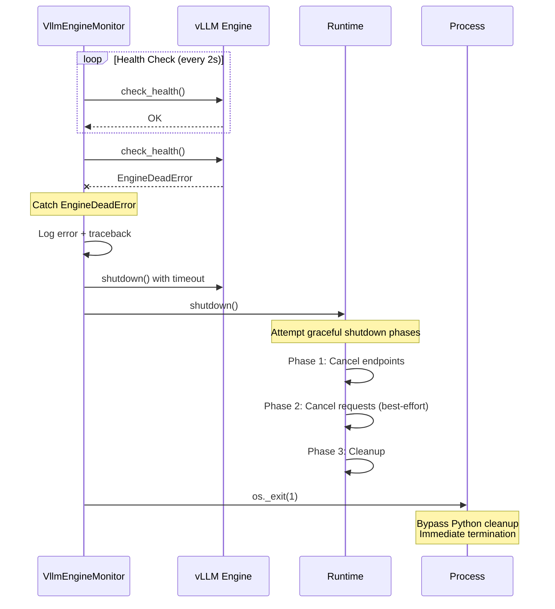
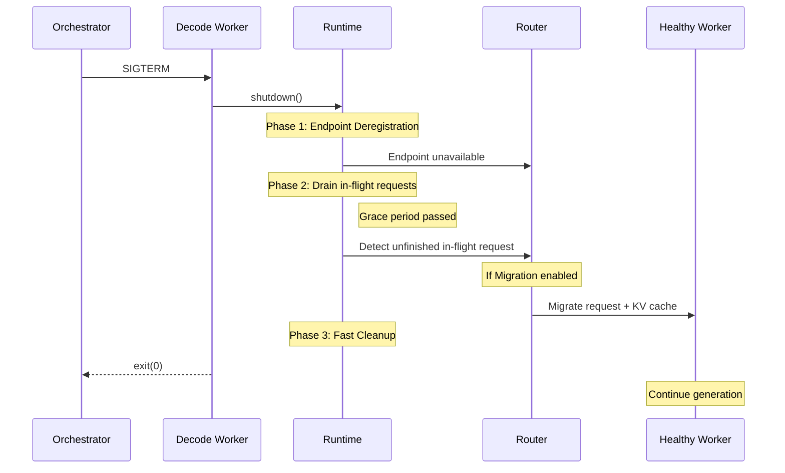

# Shutdown Handling in Dynamo

This document explains how the Dynamo should handle worker graceful termination, immediate kills, and fatal errors. Frontend shutdown is out of scope of this doc.

## Overview & Definitions

Dynamo should implement three distinct shutdown modes, each designed for specific failure scenarios and orchestrator interactions.

### Graceful Shutdown

**Triggered by:** SIGTERM or SIGINT signals from the orchestrator or user

**Behavior:**
- Three-phase coordinated shutdown with request draining
- Unregister endpoints so frontend stops routing new requests to this node
- Continue serving requests within a grace period (< 60s or K8s configured grace period)
- After the grace period, incomplete requests should be migrated.

**Exit code:** 0 (clean shutdown)

**Goal:** Complete or migrate all in-flight requests within the orchestrator's grace period (typically 60 seconds)

**Use case:** Normal pod termination, rolling updates, manual shutdown

### Immediate Shutdown

**Triggered by:** SIGKILL from orchestrator when grace period is exceeded

**Behavior:** Process terminated immediately by kernel, no cleanup possible, frontend should detect it and migrate incomplete requests.

**Exit code:** 137 (128 + 9, indicating SIGKILL)

**Use case:** Grace period timeout, force delete, OOM killer, node failure

### Self-Initiated Shutdown

**Triggered by:** Fatal errors detected internally by Dynamo

**Common causes:**
- engine death
- GPU errors (CUDA errors, driver failures)
- Health check failure
- Unrecoverable backend failures

**Behavior:** Graceful shutdown sequence initiated internally
- Attempts three-phase cleanup when possible
- May abbreviate cleanup if engine is already dead
- Uses `os._exit(1)` for immediate termination
- Incomplete requests migrated

**Exit code:** 1

**Goal:** Clean up available resources, then exit for orchestrator to restart

**Note:** When child process dies, cleanup is minimal since the engine is already gone

---

## Graceful Shutdown: Three-Phase Process

Dynamo plans to implement a sophisticated three-phase shutdown process that coordinates endpoint termination, request draining, and resource cleanup.

### Pre-Phase1: Start Grace Period Timer

***What happens:***
- Start a timer for the grace period of shutdown (60s by default)

### Phase 1: Endpoint Deregistration

**What happens:**
- All endpoints continue to accept new HTTP requests
- Frontend should see worker's endpoints being removed from routing table and stop sending new requests
- Existing request endpoints continue processing normally

**Duration:** Fast (< 5 second, considering the routing table discovery timeout)

**Observable behavior:**
- New requests can still be sent to this worker at the beginning
- Frontend detects endpoints deregistration, no more new requests sent to this worker.
- Existing requests are served as normal.

### Phase 2: Request Draining During Grace Period

**Configuration per endpoint:**

Endpoints can be configured with `graceful_shutdown=True` or `graceful_shutdown=False`:

- **`graceful_shutdown=True`**: Runtime waits for all in-flight requests to complete
  - Endpoint is registered with the tracker
  - Shutdown blocks until endpoint returns
  - Used for expensive operations (prefill) where aborting wastes resources

- **`graceful_shutdown=False`**: Runtime returns immediately
  - Endpoint is NOT registered with the tracker
  - In-flight requests can migrate to other workers
  - Used for operations that can resume elsewhere (decode with migration)

**Duration:** Variable (seconds to tens of seconds)
- Depends on number of in-flight requests
- Depends on request complexity (prefill vs decode)
- Must complete within grace period (typically 60s or configured by K8s)

**Observable behavior:**
- Logs show "Active graceful endpoints: N"
- Counter decrements as endpoints complete
- "Last endpoint completed, notifying all waiters" when done

### Phase 3: Resource Cleanup

**What happens:**
- `main_token.cancel()` triggers connection teardown
- All endpoints shut down.
- Disconnect from NATS event bus
- Disconnect from etcd service discovery
- Engine cleanup (vLLM AsyncLLM, SGLang Engine, TensorRT-LLM)
- Temporary file cleanup (LoRA adapters, model cache directories)
- Process exits with code 0

**Duration:** Typically < 5 seconds

**Observable behavior:**
- Engine shutdown logs
- Service disconnection logs
- "DistributedRuntime shutdown complete"
- Process terminates with exit code 0

### Grace Period Timer Times Out

***What happens***
- The timeout event will cancel all in-flight requests to trigger migration immediately. This is the best effort operation to clean up the state before orchestrator kills the process.

### Received Terminate Signals During Graceful Shutdown
If worker received SIGTERM/SIGINT during graceful shutdown, it will ignore such signals as system is being shutdown, no new flow shutdown should be triggered.

### Critical Timing Constraint

> ⚠️ **Important:** All three phases must complete within the orchestrator's grace period (typically 60 seconds). If the process is still running when the grace period expires, the orchestrator will send SIGKILL, resulting in immediate termination with no cleanup.

**Kubernetes default:** `terminationGracePeriodSeconds: 60`

**AWS ECS default:** `stopTimeout: 30` seconds

**Docker default:** 10 seconds (use `docker stop -t 60` for longer grace period)

---

## Immediate Shutdown (SIGKILL)

SIGKILL is a non-catchable signal that immediately terminates the process. Unlike SIGTERM, there is no opportunity for cleanup.

### When SIGKILL Occurs

| Trigger | Description | Common Cause |
|---------|-------------|--------------|
| Grace period exceeded | Process still running after terminationGracePeriodSeconds | Long-running requests, stuck cleanup |
| Force delete | `kubectl delete pod --force --grace-period=0` | Manual intervention, stuck pod |
| OOM Killer | Kernel terminates process due to memory exhaustion | Memory leak, insufficient resources |
| Node failure | Hardware crash, kernel panic, power loss | Infrastructure failure |
| Node drain with short timeout | Kubernetes node maintenance with aggressive timeout | Cluster maintenance |

### What Happens

**Kernel actions:**
1. Process terminated immediately (no signal handler execution)
2. All threads stopped
3. File descriptors closed by kernel
4. Memory freed (but GPU memory may not be released cleanly)
5. Process exit code set to 137 (128 + 9)

**No cleanup executed:**
- Signal handlers do NOT run (SIGKILL cannot be caught)
- `finally` blocks do NOT execute
- Destructor/cleanup code does NOT run
- Python `atexit` handlers do NOT run

### Behavior
1. The worker terminates immediately without cleanup
2. Frontend detects worker's endpoints shutdown after timeout
3. Frontend migrates incomplete requests if migration is enabled
---

## Self-Initiated Shutdown (Fatal Errors)

Self-initiated shutdown occurs when Dynamo detects an unrecoverable error internally and decides to terminate the process.

### Trigger Conditions

| Condition | Detection Method | Component |
|-----------|------------------|-----------|
| backend engine health check failure | `EngineDeadError` exception | Engine monitor |
| GPU errors | CUDA errors, driver errors | Backend engine |
| Critical runtime task failure | Task panic, unhandled exception | Rust runtime |
| Child process death | Health check failure, IPC error | Child process monitor |

### Shutdown Sequence

**Example:** vLLM engine monitor detecting engine death

**Detailed flow:**

### Behavior

- Use exit code 1 for all fatal errors requiring restart

- Best effort to cancel all in-flight requests as the system is not in a healthy state, future results will not be reliable

- Log at CRITICAL level before exit

- Best effort attempt cleanup before exit, even if partial

---

## Request Migration

Request migration enables fast decode worker shutdown by moving incomplete requests to healthy workers instead of returning error to user.

### Key Principle

> Graceful shutdown must complete within the grace period; unfinished work migrates to other workers rather than blocking shutdown.

### Migration-Enabled Worker Shutdown Flow (Using graceful shutdown as example)

### Request Migration Client Experience
- Brief latency spike during migration (typically < 500ms)
- Streaming continues without visible interruption
- Request ID remains the same
- Partial generation preserved via KV cache transfer

### Related Documentation

See [Request Migration](request_migration.md) for detailed migration mechanics, KV cache transfer protocol, and compatibility requirements.

---

## Related Documentation

- [Request Migration](request_migration.md) - Request migration during worker shutdown, KV cache transfer
- [Health Checks](../observability/health-checks.md) - Liveness and readiness probes
- [Fault Tolerance Overview](README.md) - Comprehensive fault tolerance mechanisms
