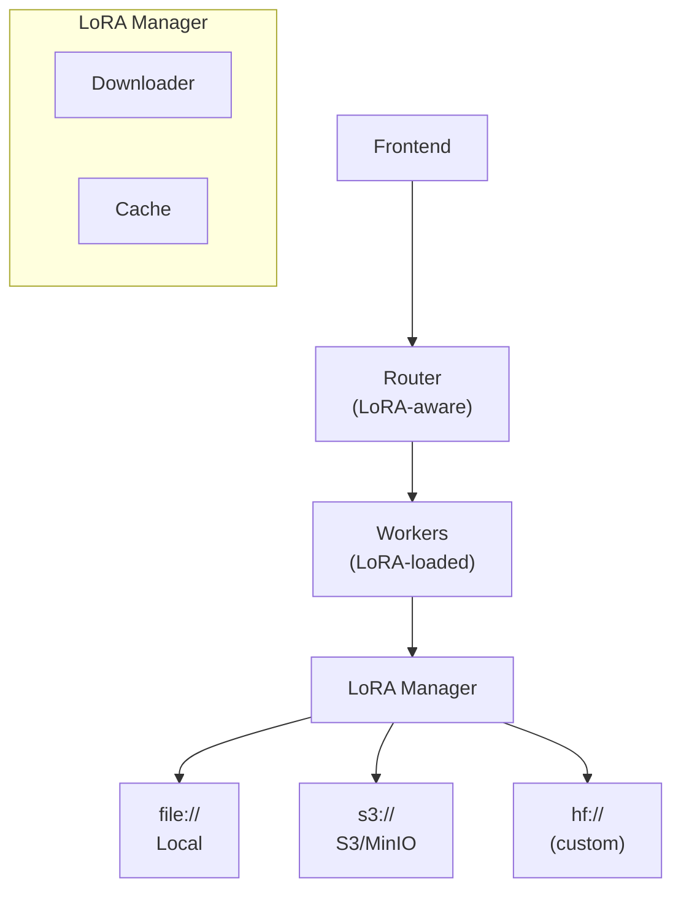

LoRA (Low-Rank Adaptation) enables efficient fine-tuning and serving of specialized model variants without duplicating full model weights. Dynamo provides built-in support for dynamic LoRA adapter loading, caching, and inference routing.

## Backend Support

| Backend | Status | Notes |
|---------|--------|-------|
| vLLM | ✅ | Full support including KV-aware routing |
| SGLang | 🚧 | In progress |
| TensorRT-LLM | ❌ | Not yet supported |

See the [Feature Matrix](../../reference/feature-matrix.md) for full compatibility details.

## Overview

Dynamo's LoRA implementation provides:

- **Dynamic loading**: Load and unload LoRA adapters at runtime without restarting workers
- **Multiple sources**: Load from local filesystem (`file://`), S3-compatible storage (`s3://`), or Hugging Face Hub (`hf://`)
- **Automatic caching**: Downloaded adapters are cached locally to avoid repeated downloads
- **Discovery integration**: Loaded LoRAs are automatically registered and discoverable via `/v1/models`
- **KV-aware routing**: Route requests to workers with the appropriate LoRA loaded
- **Kubernetes native**: Declarative LoRA management via the `DynamoModel` CRD

### Architecture



The LoRA system consists of:

- **Rust Core** (`lib/llm/src/lora/`): High-performance downloading, caching, and validation
- **Python Manager** (`components/src/dynamo/common/lora/`): Extensible wrapper with custom source support
- **Worker Handlers** (`components/src/dynamo/vllm/handlers.py`): Load/unload API and inference integration

## Quick Start

### Prerequisites

- A Kubernetes cluster with the Dynamo Platform installed and a vLLM runtime image
- For S3 sources: AWS credentials available as a Kubernetes Secret
- A LoRA adapter compatible with your base model

### Deploy a LoRA-enabled worker

Enable LoRA on the **worker**: add `--enable-lora` and `--max-lora-rank` to `args:`, and set the LoRA and worker-system environment variables in `env:`. `DYN_SYSTEM_ENABLED` / `DYN_SYSTEM_PORT` expose the load/unload API on the worker. This DGD is adapted from [`examples/backends/vllm/deploy/v1beta1/agg_lora.yaml`](https://github.com/ai-dynamo/dynamo/blob/main/examples/backends/vllm/deploy/v1beta1/agg_lora.yaml):

```yaml
apiVersion: nvidia.com/v1beta1
kind: DynamoGraphDeployment
metadata:
  name: vllm-agg-lora
spec:
  components:
  - name: Frontend
    type: frontend
    replicas: 1
    podTemplate:
      spec:
        containers:
        - name: main
          image: ${RUNTIME_IMAGE}
  - name: VllmDecodeWorker
    type: decode
    replicas: 1
    podTemplate:
      spec:
        containers:
        - name: main
          image: ${RUNTIME_IMAGE}
          workingDir: /workspace/examples/backends/vllm
          envFrom:
          - secretRef:
              name: hf-token-secret
          env:
          - name: DYN_LORA_ENABLED
            value: "true"
          - name: DYN_LORA_PATH
            value: /tmp/dynamo_loras
          - name: DYN_SYSTEM_ENABLED
            value: "true"
          - name: DYN_SYSTEM_PORT
            value: "9090"
          command:
          - python3
          - -m
          - dynamo.vllm
          args:
          - --model
          - Qwen/Qwen3-0.6B
          - --enable-lora
          - --max-lora-rank
          - "64"
          - --enforce-eager
          resources:
            limits:
              nvidia.com/gpu: "1"
```

Apply it and wait for the deployment to become ready:

```bash
kubectl apply -f vllm-agg-lora.yaml -n ${NAMESPACE}
kubectl wait --for=condition=Ready dynamographdeployment/vllm-agg-lora \
  -n ${NAMESPACE} --timeout=600s
```

### Load a LoRA adapter

For declarative, cluster-native management, use the [`DynamoModel` CRD](#dynamomodel-crd) below — it discovers the worker endpoints and loads the adapter for you. To load imperatively against the worker's system API, port-forward the worker system port (`DYN_SYSTEM_PORT`) and POST to `/v1/loras`:

```bash
kubectl port-forward svc/vllm-agg-lora-vllmdecodeworker 9090:9090 -n ${NAMESPACE}
```

```bash
curl -X POST http://localhost:9090/v1/loras \
  -H "Content-Type: application/json" \
  -d '{
    "lora_name": "my-lora",
    "source": {
      "uri": "file:///path/to/my-lora"
    }
  }'
```

### Run inference with the LoRA

Port-forward the Frontend and send a request whose `model` field is the `lora_name`:

```bash
kubectl port-forward svc/vllm-agg-lora-frontend 8000:8000 -n ${NAMESPACE}
```

```bash
curl -X POST http://localhost:8000/v1/chat/completions \
  -H "Content-Type: application/json" \
  -d '{
    "model": "my-lora",
    "messages": [{"role": "user", "content": "Hello!"}],
    "max_tokens": 100
  }'
```

### S3-Compatible Storage

For production deployments, store LoRA adapters in S3-compatible storage and give the worker credentials through its `env:`. Keep the secret keys in a Kubernetes Secret (`valueFrom.secretKeyRef`) and the non-secret endpoint/region inline:

```yaml
          env:
          - name: DYN_LORA_ENABLED
            value: "true"
          - name: AWS_ENDPOINT
            value: http://minio:9000        # for MinIO; omit for AWS S3
          - name: AWS_REGION
            value: us-east-1
          - name: AWS_ALLOW_HTTP
            value: "true"                    # MinIO/non-TLS only
          - name: AWS_ACCESS_KEY_ID
            valueFrom:
              secretKeyRef:
                name: minio-secret
                key: AWS_ACCESS_KEY_ID
          - name: AWS_SECRET_ACCESS_KEY
            valueFrom:
              secretKeyRef:
                name: minio-secret
                key: AWS_SECRET_ACCESS_KEY
```

Then load the adapter with an `s3://` URI (via the `DynamoModel` CRD or the `/v1/loras` API):

```bash
curl -X POST http://localhost:9090/v1/loras \
  -H "Content-Type: application/json" \
  -d '{
    "lora_name": "customer-support-lora",
    "source": {
      "uri": "s3://my-loras/customer-support-v1"
    }
  }'
```

## Configuration

### Environment Variables

Set these in the worker container's `env:` block (secret values via `valueFrom.secretKeyRef`, as shown in [S3-Compatible Storage](#s3-compatible-storage)):

| Variable | Description | Default |
|----------|-------------|---------|
| `DYN_LORA_ENABLED` | Enable LoRA adapter support | `false` |
| `DYN_LORA_PATH` | Local cache directory for downloaded LoRAs | `~/.cache/dynamo_loras` |
| `AWS_ACCESS_KEY_ID` | S3 access key (for `s3://` URIs) | - |
| `AWS_SECRET_ACCESS_KEY` | S3 secret key (for `s3://` URIs) | - |
| `AWS_ENDPOINT` | Custom S3 endpoint (for MinIO, etc.) | - |
| `AWS_REGION` | AWS region | `us-east-1` |
| `AWS_ALLOW_HTTP` | Allow HTTP (non-TLS) connections | `false` |

### vLLM Arguments

Add these to the worker's `args:` list:

| Argument | Description |
|----------|-------------|
| `--enable-lora` | Enable LoRA adapter support in vLLM |
| `--max-lora-rank` | Maximum LoRA rank (must be >= your LoRA's rank) |
| `--max-loras` | Maximum number of LoRAs to load simultaneously |

## Backend API Reference

### Load LoRA

Load a LoRA adapter from a source URI.

```text
POST /v1/loras
```

**Request:**
```json
{
  "lora_name": "string",
  "source": {
    "uri": "string"
  }
}
```

**Response:**
```json
{
  "status": "success",
  "message": "LoRA adapter 'my-lora' loaded successfully",
  "lora_name": "my-lora",
  "lora_id": 1207343256
}
```

### List LoRAs

List all loaded LoRA adapters.

```text
GET /v1/loras
```

**Response:**
```json
{
  "status": "success",
  "loras": {
    "my-lora": 1207343256,
    "another-lora": 987654321
  },
  "count": 2
}
```

### Unload LoRA

Unload a LoRA adapter from the worker.

```text
DELETE /v1/loras/{lora_name}
```

**Response:**
```json
{
  "status": "success",
  "message": "LoRA adapter 'my-lora' unloaded successfully",
  "lora_name": "my-lora",
  "lora_id": 1207343256
}
```

## Kubernetes Deployment

For Kubernetes deployments, use the `DynamoModel` Custom Resource to declaratively manage LoRA adapters.

### DynamoModel CRD

```yaml
apiVersion: nvidia.com/v1alpha1
kind: DynamoModel
metadata:
  name: customer-support-lora
  namespace: dynamo-system
spec:
  modelName: customer-support-adapter-v1
  baseModelName: Qwen/Qwen3-0.6B  # Must match modelRef.name in DGD
  modelType: lora
  source:
    uri: s3://my-models-bucket/loras/customer-support/v1
```

### How It Works

When you create a `DynamoModel`:

1. **Discovers endpoints**: Finds all pods running your `baseModelName`
2. **Creates service**: Automatically creates a Kubernetes Service
3. **Loads LoRA**: Calls the LoRA load API on each endpoint
4. **Updates status**: Reports which endpoints are ready

### Verify Deployment

```bash
# Check LoRA status
kubectl get dynamomodel customer-support-lora

# Expected output:
# NAME                    TOTAL   READY   AGE
# customer-support-lora   2       2       30s
```

For complete Kubernetes deployment details, see:
- [Managing Models with DynamoModel](../../kubernetes/deployment/dynamomodel-guide.md)
- [Kubernetes LoRA Deployment Example](https://github.com/ai-dynamo/dynamo/tree/main/examples/backends/vllm/deploy/lora/README.md)

## Examples

| Example | Description |
|---------|-------------|
| [Local LoRA with MinIO](https://github.com/ai-dynamo/dynamo/tree/main/examples/backends/vllm/launch/lora/README.md) | Local development with S3-compatible storage |
| [Kubernetes LoRA Deployment](https://github.com/ai-dynamo/dynamo/tree/main/examples/backends/vllm/deploy/lora/README.md) | Production deployment with DynamoModel CRD |

## Troubleshooting

### LoRA Fails to Load

**Check S3 connectivity:**
```bash
# Verify LoRA exists in S3
aws --endpoint-url=$AWS_ENDPOINT s3 ls s3://my-loras/ --recursive
```

**Check cache directory:**
```bash
ls -la ~/.cache/dynamo_loras/
```

**Check worker logs:**
```bash
# Look for LoRA-related messages
kubectl logs deployment/my-worker | grep -i lora
```

### Model Not Found After Loading

- Verify the LoRA name matches exactly (case-sensitive)
- Check if the LoRA is listed: `curl http://localhost:9090/v1/loras` (port-forward the worker's `DYN_SYSTEM_PORT` first)
- Ensure discovery registration succeeded (check worker logs)

### Inference Returns Base Model Response

- Verify the `model` field in your request matches the `lora_name`
- Check that the LoRA is loaded on the worker handling your request
- For disaggregated serving, ensure both prefill and decode workers have the LoRA

## KV Cache-Aware LoRA Routing

When KV-aware routing is enabled, the router automatically accounts for LoRA adapter identity when computing block hashes. This means:

- **Distinct hash spaces per adapter**: Blocks cached under adapter `A` will never be confused with blocks cached under adapter `B` or the base model, even if the token sequences are identical. The adapter name is mixed into the `LocalBlockHash` computation.
- **Automatic prefix sharing within the same adapter**: Requests targeting the same LoRA adapter benefit from KV cache prefix matching just like base model requests do.
- **No configuration required**: The LoRA name is propagated automatically through KV events (`BlockStored`) from the engine to the router. The router uses the `lora_name` field on events to route LoRA requests to workers that have matching cached blocks.

This works end-to-end across the publisher pipeline, the KV consolidator (for deduplication), and the routing query path.

## See Also

- [Feature Matrix](../../reference/feature-matrix.md) - Backend compatibility overview
- [vLLM Backend](../../backends/vllm/README.md) - vLLM-specific configuration
- [Dynamo Operator](../../kubernetes/dynamo-operator.md) - Kubernetes operator overview
- [Routing Concepts](../../components/router/router-concepts.md) - LoRA-aware request routing
- [KV Events for Custom Engines](../../integrations/kv-events-custom-engines.md) - Publishing LoRA-aware KV events
