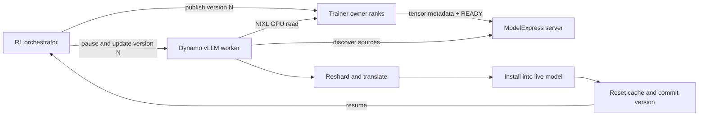

**Experimental.** ModelExpress (MX) weight refit is an opt-in integration for
mid-training policy updates. It requires a Dynamo vLLM runtime that includes the
ModelExpress refit adapter and the `modelexpress` Python package.

Track the integration work in
[ModelExpress #482](https://github.com/ai-dynamo/modelexpress/pull/482) and
[NeMo-RL #3068](https://github.com/NVIDIA-NeMo/RL/pull/3068). Released runtime
availability can differ; use the worker's advertised route list as the source of
truth.

This guide covers the RL update loop. For cold-start model distribution and
Kubernetes platform configuration, see
[ModelExpress](../../kubernetes/modelexpress.md).

## When to Use It

Use ModelExpress refit when:

- trainer weights already reside on GPUs;
- rollout workers run on separate nodes;
- policy updates occur repeatedly during an RL job;
- trainer and rollout parallelism may differ;
- rollout replicas may join or recover independently; or
- only selected layers or experts need an update.

The ModelExpress server is a metadata control plane. Weight bytes do not pass
through it. Rollout workers discover source metadata through gRPC, then pull
selected GPU ranges directly with NIXL over RDMA or another configured
transport.

## Architecture



The integration separates four responsibilities:

1. **Trainer publisher:** registers the tensors owned by each trainer rank and
   publishes a version after the optimizer step.
2. **ModelExpress server:** tracks source identity, readiness, version,
   topology signature, and worker liveness.
3. **Rollout receiver:** selects source ranks, transfers tensors with NIXL,
   translates layouts, and installs the update.
4. **Dynamo:** exposes the direct engine route and coordinates pause, update,
   cache reset, version commit, and resume.

## Publish Trainer Weights

The trainer integration is framework-specific. A publisher should:

1. Register stable GPU tensor addresses once.
2. Publish only tensors owned by the local rank.
3. Attach TP, PP, EP, tensor-role, shape, dtype, and expert-ownership metadata.
4. Publish a monotonically increasing training step.
5. Mark the version `READY` only after registration is complete.
6. Keep the source alive until all readers finish.

Megatron and DTensor publishers should publish native local shards rather than
materializing a full checkpoint on rank 0. This avoids an all-gather and lets
multiple trainer NICs serve rollout workers in parallel.

The publisher computes a stable layout signature from the world layout, rank
coordinates, tensor shapes and roles, expert ownership, and translation
metadata. A normal training-step change preserves the signature. An in-place
topology or registry change produces a new signature and forces receivers to
refresh cached metadata.

## Configure a vLLM Rollout Worker

The worker image must include the matching ModelExpress client and vLLM weight
transfer adapter. Set the ModelExpress server URL and enable the native refit
path:

```yaml
env:
  - name: MODEL_EXPRESS_URL
    value: modelexpress-server.rl.svc.cluster.local:8001
  - name: DYN_MX_REFIT_ENABLED
    value: "1"
  - name: DYN_MX_NATIVE_WEIGHT_TRANSFER
    value: "1"
  - name: MX_LOAD_MODE
    value: direct
```

Enable the Dynamo system server and RL routes as described in
[Reinforcement Learning Integration](README.md). When the integration is
available, `GET /v1/rl/workers` advertises `update_weights_via_mx` in the
worker's `routes` list. Treat this capability list as authoritative.

Do not enable the native MX and NCCL weight-transfer backends simultaneously.
Select one backend for a worker lifecycle.

## Run a Failure-Safe Refit Cycle

Call the selected worker directly through its `system_url`. Always resume the
worker in a cleanup path and verify the update response before advancing the RL
policy version.

```bash
set -euo pipefail

worker_url=http://10.0.0.12:8081
version=42

resume() {
  curl --fail-with-body "$worker_url/engine/resume_generation" \
    -H 'Content-Type: application/json' \
    -d '{}' >/dev/null
}

curl --fail-with-body "$worker_url/engine/pause_generation" \
  -H 'Content-Type: application/json' \
  -d '{"mode":"keep","clear_cache":false}' >/dev/null
trap resume EXIT

response=$(curl --fail-with-body \
  "$worker_url/engine/update_weights_via_mx" \
  -H 'Content-Type: application/json' \
  -d "{\"version\":$version}")
jq -e '.status == "ok" and .version == 42' <<<"$response" >/dev/null

resume
trap - EXIT
```

The worker must not commit the requested version when transfer or installation
fails. The orchestrator should keep the previous policy version active and
decide whether to retry, replace the worker, or abort the rollout.

## Partial Refit

The update route can scope a warm update to parameter names, transformer layers,
or layer groups when supported by the runtime:

```json
{
  "version": 43,
  "mx_config": {
    "subset_layers": [0, 1, 2, 3, 4, 5]
  }
}
```

The first cycle remains a full cold update so the receiver can build a complete
destination map. Later cycles prune the selected names before NIXL transfer and
install only those tensors. A fused group must include all of its members; for
example, Q, K, and V or gate and up weights and their quantization scales.

## Resharding and Descriptor Policy

Trainer and rollout layouts do not need to match:

- EP publishers identify the global experts owned by each source rank.
- Replicated tensors are pulled from one source instead of every EP rank.
- Contiguous TP ranges can be transferred directly.
- A strided axis-1 TP range is not decomposed into one network operation per
  row. The receiver pulls the containing contiguous source tensor and slices it
  locally.

This policy bounds descriptor count and prevents small-transfer overhead from
dominating RDMA. The fallback requests only the tensor names that require
scratch and preserves their multidimensional registry shapes for local slicing.

## Installation

The receiver can use the stock vLLM loader or an optional mapped direct-load
path. Direct loading resolves destination parameters on the cold cycle and
reuses those mappings for warm updates, including fused QKV, gated MLP, MoE
expert, and FP8 scale destinations.

Device staging can remove a GPU-to-CPU-to-GPU round trip for large EP gathers,
but it increases HBM use. Keep host staging as the compatibility choice unless
the rollout has enough memory headroom.

## Discovery and Cache Safety

The ModelExpress server filters lightweight source rows by model, rank, status,
minimum training step, and freshness before returning heavy tensor metadata.
Receivers cache stable layout metadata by model, worker ID, and layout
signature. Either a publisher restart or a topology change invalidates the
cache.

Configure realistic heartbeat and garbage-collection timeouts. Leaving old
benchmark sources permanently `READY` increases catalog scan cost and can route
receivers to dead NIXL agents.

## Observability

With timing enabled, each TP worker emits one `MX_REFIT_TIMING` JSON record per
version. The normalized stages are:

- control discovery;
- source preparation;
- registration;
- transfer planning;
- wire transfer;
- receive synchronization;
- transformation;
- installation;
- post-install; and
- rollout readiness.

Aggregate TP runs by taking the slowest rank for each version, then compute
statistics across measured warm cycles. Keep publisher preparation and cold
registration separate from recurring refit latency.

## Limitations

- Route names and request fields are available only when the runtime includes
  the ModelExpress refit integration.
- Exact NCCL broadcast, unpack, and installation timing is not exposed by the
  same interface and should not be inferred from MX stage boundaries.
- Direct translation into persistent TP-local destinations is still an
  optimization area for large EP gathers.
- Same-domain NVLink/IMEX and cross-datacenter configurations require separate
  validation.

## See Also

- [Reinforcement Learning Integration](README.md)
- [Kubernetes ModelExpress](../../kubernetes/modelexpress.md)
- [ModelExpress repository](https://github.com/ai-dynamo/modelexpress)
- [NeMo-RL](https://github.com/NVIDIA-NeMo/RL)
