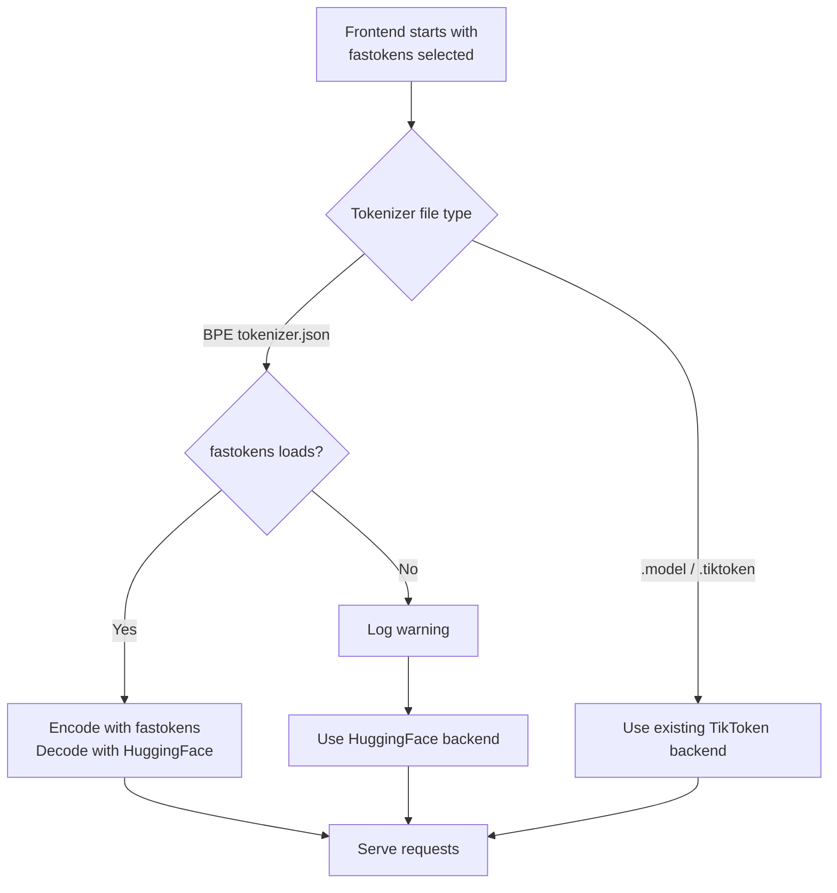

The Dynamo frontend tokenizes every incoming prompt before it sends the request to an inference backend. For short prompts, that cost is usually small. For agentic, RAG, and long-context workloads, tokenization can become a meaningful part of time-to-first-token (TTFT), especially when KV cache hit rates are high and the model path is already fast.

`fastokens` is the default tokenizer backend for BPE `tokenizer.json` models. It uses the Rust encoder from the [`fastokens` GitHub repository](https://github.com/crusoecloud/fastokens) for text-to-token-ID conversion while Dynamo continues to use HuggingFace `tokenizers` for decoding and streaming output.

Use the `huggingface` backend when validating a new or unusual tokenizer and you want maximum compatibility first.

## Why Use Fastokens?

`fastokens` is designed to make tokenization scale better on modern CPUs:

- Parallel pre-tokenization for long inputs.
- Parallel BPE encoding with per-thread and shared caches.
- Reused buffers and reduced allocation overhead.
- PCRE2 JIT regex support where the tokenizer pattern allows it.

The `fastokens` enables faster tokenization on average compared with HuggingFace `tokenizers`, with larger gains as prompt sizes grow. The [Crusoe and NVIDIA fastokens writeup](https://www.crusoe.ai/resources/blog/reducing-ttft-by-cpumaxxing-tokenization) provides benchmark details across models, datasets, CPU architectures, and input lengths from 512 to 100K tokens. The actual gain depends on prompt length, tokenizer structure, CPU, concurrency, cache hit rate, and how much of your TTFT is spent before the model starts generating.

## How Dynamo Integrates It

Dynamo exposes `fastokens` as a frontend tokenizer backend. The integration is hybrid:

- **Encoding**: `fastokens` converts prompt text to token IDs.
- **Decoding**: HuggingFace `tokenizers` converts generated token IDs back to text.

Both backends load from the same `tokenizer.json`, so supported tokenizers should produce the same token IDs as the HuggingFace path. If `fastokens` cannot load the tokenizer file, Dynamo logs a warning and falls back to the `huggingface` backend instead of dropping requests.



## When to Enable It

Use the default `fastokens` backend when:

- Prompts are long, commonly thousands to tens of thousands of tokens.
- Your workload is prefill-heavy, agentic, or RAG-heavy.
- TTFT remains high even when KV cache hit rates are strong.
- Frontend tokenizer latency shows up in metrics, traces, or profiling.
- Your model uses a BPE `tokenizer.json`.

Select the HuggingFace backend with `--tokenizer huggingface` or `DYN_TOKENIZER=huggingface` if:

- Prompts are short and tokenization is not on the critical path.
- You are validating a new or unusual tokenizer and want maximum compatibility first.
- The frontend logs that `fastokens` failed to load and fell back to HuggingFace.
- Your model uses `.model` or `.tiktoken` tokenizer files, where this flag has no effect.

## Quick Start

The frontend uses `fastokens` by default. Set the HuggingFace backend explicitly with either the CLI flag or the environment variable when you need it. The CLI flag takes precedence.

```bash
# Default fastokens backend
python -m dynamo.frontend

# Explicit HuggingFace backend
export DYN_TOKENIZER=huggingface
python -m dynamo.frontend
```

You can also select either backend with the CLI flag:

```bash
python -m dynamo.frontend --tokenizer huggingface
python -m dynamo.frontend --tokenizer fastokens
```

No client changes are required. Request payloads, OpenAI-compatible API behavior, and streamed responses remain the same.

### Configuration Reference

| CLI argument | Environment variable | Valid values | Default |
|---|---|---|---|
| `--tokenizer` | `DYN_TOKENIZER` | `fastokens`, `huggingface` | `fastokens` |

## Compatibility

| Tokenizer format | Behavior with `--tokenizer fastokens` |
|---|---|
| BPE `tokenizer.json` | Dynamo tries to encode with `fastokens` and decode with HuggingFace. |
| BPE `tokenizer.json` with unsupported components | Dynamo logs a warning and falls back to HuggingFace. |
| TikToken `.model` or `.tiktoken` | Unchanged. Dynamo uses the existing TikToken backend. |

`fastokens` targets BPE tokenizer pipelines. It is focused on inference and does not support every HuggingFace `tokenizers` feature; additional encoding outputs and some normalizers or pre-tokenizers are not available.

The `fastokens` repository maintains the current [tested models list](https://github.com/crusoecloud/fastokens#tested-models). Tested model IDs include:

- `nvidia/NVIDIA-Nemotron-3-Nano-30B-A3B-BF16`
- `openai/gpt-oss-120b`
- `deepseek-ai/DeepSeek-V3.2`, `deepseek-ai/DeepSeek-V3`, `deepseek-ai/DeepSeek-R1`
- `Qwen/Qwen3-Next-80B-A3B-Thinking`, `Qwen/Qwen3-Next-80B-A3B-Instruct`
- `Qwen/Qwen3-235B-A22B-Instruct-2507`, `Qwen/Qwen3.5-397B-A17B`
- `MiniMaxAI/MiniMax-M2.1`, `MiniMaxAI/MiniMax-M2.5`
- `mistralai/Devstral-Small-2-24B-Instruct-2512`
- `zai-org/GLM-4.7`, `zai-org/GLM-5`

For any new model, validate on representative prompts before rolling out broadly. The safest check is to compare token IDs against the HuggingFace backend and confirm the frontend logs show the fast path was selected.

## Verify the Backend

Check the frontend startup logs after enabling the flag.

When `fastokens` is active, look for:

```text
Using fastokens tokenizer backend
```

If the tokenizer is unsupported, Dynamo keeps serving with the HuggingFace backend and logs:

```text
Failed to load fastokens, falling back to HuggingFace
```

If you see the fallback warning, the deployment is still healthy, but you are not getting the `fastokens` speedup for that model.

## Measure Your Workload

Dynamo includes a frontend benchmark sweep that compares HuggingFace and `fastokens` across input sequence length, concurrency, and worker count.

```bash
cd benchmarks/frontend/scripts

python3 sweep_runner.py \
    --tokenizers hf,fastokens \
    --concurrency 32,64,128 \
    --isl 512,2048,8192
```

Use local mocker runs to isolate frontend and tokenizer overhead. Use vLLM or SGLang runs when you want end-to-end TTFT impact for a real backend.

See the [frontend benchmarking guide](https://github.com/ai-dynamo/dynamo/tree/main/benchmarks/frontend/README.md) and the [scaling-test recipe](https://github.com/ai-dynamo/dynamo/tree/main/benchmarks/frontend/scripts/scaling-test.md) for a full walkthrough.

## Troubleshooting

**I expected `fastokens`, but the logs do not show `Using fastokens tokenizer backend`.**
Make sure the setting is not overridden to `huggingface` on the frontend process. For local launches, omit `--tokenizer` or pass `--tokenizer fastokens` to `python -m dynamo.frontend`; for environment configuration, unset `DYN_TOKENIZER` or set `DYN_TOKENIZER=fastokens`. For benchmark DGD templates, use `DYN_TOKENIZER=fastokens`; the sweep runner maps `--tokenizers fastokens` to that value and restarts the frontend pod.

**The frontend logs `Failed to load fastokens, falling back to HuggingFace`.**
The model's tokenizer file uses a feature that `fastokens` does not support, or it is not a BPE `tokenizer.json` path. Dynamo has already fallen back to HuggingFace and should keep serving traffic. Check the tokenizer format, compare against the [tested models list](https://github.com/crusoecloud/fastokens#tested-models), and use `--tokenizer huggingface` if you want to avoid the warning.

**The frontend logs `Unrecognized DYN_TOKENIZER value`.**
Use only `fastokens` or `huggingface` for `DYN_TOKENIZER`. Values such as `fast`, `hf`, or `default` are benchmark-runner aliases, not valid values for the frontend environment variable.

**The model uses `.model` or `.tiktoken` files.**
The `fastokens` flag has no effect for TikToken-format tokenizers. Dynamo uses the existing TikToken backend, so you should not expect the `Using fastokens tokenizer backend` log or a `fastokens` speedup.

**TTFT does not improve.**
First confirm the fast path is active in logs. If it is, tokenization may not be the bottleneck for this workload. Check prompt length, cache hit rate, backend prefill time, frontend CPU saturation, and the `dynamo_frontend_tokenizer_latency_ms` metric. Short prompts and decode-heavy traffic often show little end-to-end change.

**The benchmark shows no difference between `hf` and `fastokens`.**
Inspect each run artifact and frontend log to confirm the backend actually changed. In Kubernetes mode, the DGD frontend pod must be replaced after `DYN_TOKENIZER` changes. In local mocker mode, start with larger ISL values such as 8192 or higher so tokenization is large enough to measure.

**Token IDs differ between backends.**
Do not roll out that model with `fastokens`. Reproduce the mismatch with a minimal prompt and file an issue with the model name, tokenizer file, prompt, and whether the model appears on the tested models list.

**Decoded output looks wrong.**
Decoding still uses HuggingFace, so this is usually not caused by the `fastokens` flag. Verify that the tokenizer files match the model weights and that the HuggingFace backend produces the expected output.

## See Also

- [`fastokens`: A Solution to the Tokenization Bottleneck](https://www.crusoe.ai/resources/blog/reducing-ttft-by-cpumaxxing-tokenization)
- [`fastokens` on GitHub](https://github.com/crusoecloud/fastokens)
- [Tokenizer component reference](../../components/frontend/Tokenizer.md)
- [Frontend configuration reference](../../components/frontend/configuration.md)
- [Frontend benchmarking](https://github.com/ai-dynamo/dynamo/tree/main/benchmarks/frontend/README.md)
