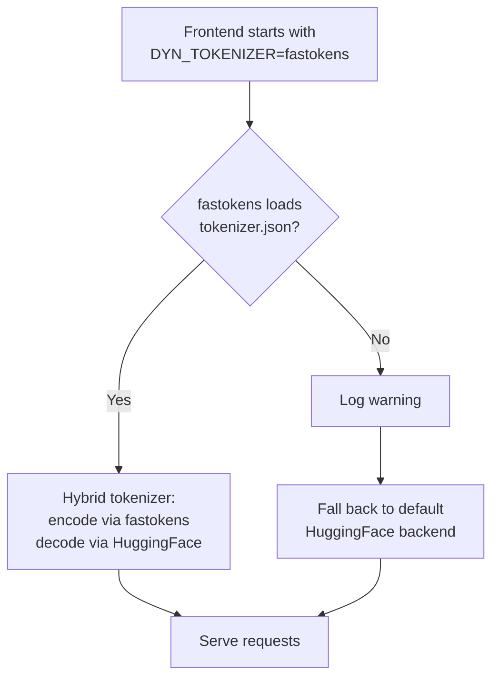

The Dynamo Frontend tokenizes every incoming prompt before the request is dispatched to an inference engine. On high-concurrency, prefill-heavy workloads this tokenization step can become a measurable bottleneck. Dynamo ships with two pluggable tokenizer backends so you can pick the right tradeoff between feature coverage and raw throughput, without changing any application code.

## Why this matters

- The frontend tokenizes every request on the hot path. Cutting that cost shows up directly as lower TTFT and higher request throughput.
- Switching backends is a one-flag change. No model conversion, no re-export of `tokenizer.json`, no client changes.
- The switch is safe by construction: if `fastokens` cannot load a given tokenizer, the frontend logs a warning and falls back to the default HuggingFace backend. Requests are never dropped.

## Available backends

| Backend | Encoding | Decoding | When to use |
|---|---|---|---|
| `default` | HuggingFace `tokenizers` (Rust) | HuggingFace `tokenizers` | Default. Full feature coverage for any BPE `tokenizer.json` (normalizers, pre-tokenizers, post-processors, added tokens, byte-fallback). |
| `fastokens` | [`fastokens`](https://github.com/Atero-ai/fastokens) crate | HuggingFace `tokenizers` (hybrid) | High-throughput prefill-heavy workloads on standard BPE models (Qwen, LLaMA, GPT-family, Mistral, DeepSeek, etc.). |

> [!NOTE]
> The `fastokens` backend is a **hybrid**: encoding uses `fastokens` for speed, while decoding (including incremental detokenization, byte-fallback, and special-token handling) still uses HuggingFace. Both halves are loaded from the same `tokenizer.json` file, so token IDs stay identical.

TikToken-format tokenizers (`.model` / `.tiktoken`) are unaffected by this flag and always use the TikToken backend.

## Quick start

Enable `fastokens` on the frontend with either a CLI flag or an environment variable. The CLI flag wins if both are set.

```bash
# CLI flag
python -m dynamo.frontend --tokenizer fastokens

# Environment variable
export DYN_TOKENIZER=fastokens
python -m dynamo.frontend
```

To go back to the default backend, omit the flag or set `DYN_TOKENIZER=default`.

## Configuration reference

| CLI Argument | Env Var | Valid values | Default |
|---|---|---|---|
| `--tokenizer` | `DYN_TOKENIZER` | `default`, `fastokens` | `default` |

## How the fallback works

When `fastokens` is requested, the frontend tries to load `fastokens::Tokenizer` from your model's `tokenizer.json`:



Reasons a particular `tokenizer.json` may not load under `fastokens` include unsupported normalizer or post-processor combinations. You will see a warning in the frontend logs but the deployment continues to serve traffic on the HuggingFace backend.

## Choosing a backend

Use the `default` backend when:

- You are bringing up a new model and want maximum compatibility.
- Tokenization is not on your performance critical path (e.g. small prompts, low concurrency).
- Your `tokenizer.json` uses features that `fastokens` does not support and you want to avoid the fallback warning.

Use the `fastokens` backend when:

- You are running a standard BPE model (Qwen, LLaMA, GPT-family, Mistral, DeepSeek, etc.).
- You have profiled the frontend and tokenization shows up as a bottleneck on high-concurrency, long-prompt, or prefill-heavy workloads.
- You want a low-risk performance win: if it doesn't load, you transparently get the default backend.

## Benchmarking

Dynamo ships a frontend sweep harness that compares the two backends side by side across concurrency, ISL, and worker counts. See:

- [Frontend benchmarking guide](https://github.com/ai-dynamo/dynamo/tree/main/benchmarks/frontend/README.md)
- [Frontend scaling-test recipe](https://github.com/ai-dynamo/dynamo/tree/main/benchmarks/frontend/scripts/scaling-test.md)

A typical comparison run:

```bash
python3 sweep_runner.py \
    --tokenizers hf,fastokens \
    --concurrency 32,64,128 \
    --isl 512,1024,2048
```

## Troubleshooting

**The frontend logs a warning about fastokens failing to load.**
Your `tokenizer.json` uses features the `fastokens` crate does not yet support. The frontend has already fallen back to the default HuggingFace backend and is serving requests normally. To silence the warning, set `--tokenizer default` (or unset `DYN_TOKENIZER`).

**Token IDs differ between backends.**
They should not for supported tokenizers. The hybrid `fastokens` tokenizer is validated to produce identical token IDs to HuggingFace on the same `tokenizer.json`. If you see a divergence, please [file an issue](https://github.com/ai-dynamo/dynamo/issues) with the model name and a minimal reproducing prompt.

**Decoded output looks wrong.**
Decoding always uses HuggingFace in both backends, so this is unrelated to the tokenizer flag. Verify your `tokenizer.json` matches the model weights.

## See also

- [Tokenizer component reference](../../components/frontend/Tokenizer.md) - Lower-level details of the frontend tokenizer subsystem.
- [Frontend configuration reference](../../components/frontend/configuration.md) - All frontend CLI and environment variables.
- [Frontend benchmarking](https://github.com/ai-dynamo/dynamo/tree/main/benchmarks/frontend/README.md) - Sweep harness for comparing tokenizer backends.
