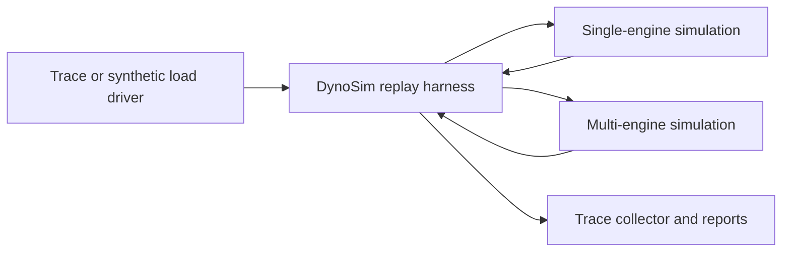
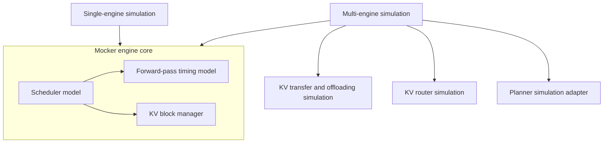

DynoSim connects a workload driver to one or more Mocker engine cores and records request and token
timing for analysis. It supports a direct offline path for fast simulation and an online path that
uses live Dynamo workers and runtime services.

For task-oriented instructions, see [Run a DynoSim Simulation](../dynosim/runs.md),
[Sweep DynoSim Configurations](../dynosim/sweeps.md), and
[Benchmark Planner Decisions](../dynosim/planner-benchmarking.md). For engine-core details, see
[Mocker Engine Architecture](mocker-architecture.md).

## Replay harness

The load driver supplies either a trace or a generated workload. The harness admits requests into a
simulated configuration, advances the simulation, and passes lifecycle timing to the trace
collector. The collector produces the AIPerf-style terminal summary and JSON report.

Single-engine simulation is the fast path for one worker. Multi-engine simulation covers aggregated
multi-worker deployments, disaggregated prefill and decode pools, KV routing, and Planner-in-the-loop
experiments.

## Component composition

The engine core owns scheduling, KV allocation, prefix caching, preemption, and forward-pass timing.
The multi-engine layer adds behavior that requires coordination across engine instances.

## Offline and online execution

Offline execution drives Mocker engine cores directly. It uses a logical clock and does not require
a frontend, worker registration, etcd, NATS, or HTTP traffic. This path is appropriate for fast,
repeatable configuration comparisons and continuous-integration tests.

Online execution launches mock workers through the live runtime path. It is useful when an
experiment must include worker registration, request transport, event publication, or runtime
coordination. The simulated engine remains the source of inference timing in both modes.

## Routing simulation

Round-robin simulation assigns requests without KV-aware scoring. KV-router simulation layers an
in-process indexer, worker queues, and routing lifecycle events over the engine cores. Router
queueing uses simulation time in offline mode.

The router observes request admission, prefill completion, and sequence release. It can estimate
prompt-side load from token counts or an AIConfigurator timing model. These estimates influence
worker selection but do not replace the engine scheduler's own queue and KV-cache behavior.

## Planner simulation adapter

Planner-in-the-loop simulation supplies traffic observations from the replay harness instead of
Prometheus. On each Planner traffic tick, the adapter reports:

| Replay metric | Planner meaning |
|---|---|
| `num_req` | Completed requests in the observation window |
| `avg_isl` / `avg_osl` | Mean raw input and output lengths |
| `avg_kv_hit_rate` | Mean router prefix-cache hit rate at admission |
| `avg_accept_length` | Mean visible output tokens per decode request-forward |

KV hit rate and speculative accept length use last-value semantics in the Planner. Missing accept
length samples preserve the previous valid value. Without valid speculative-decoding metadata, the
effective accept length is `1.0`.

Speculative decoding changes the Planner's effective decode latency and capacity calculations. It
does not rewrite raw output length, which remains the input for KV residency, context-length, and
request-length calculations.

The simulation adapter cannot auto-detect the GPU count from a deployment. Planner experiments must
set `prefill_engine_num_gpu` and `decode_engine_num_gpu` explicitly when cumulative GPU-hours are
part of the analysis.

## Timing models

DynoSim can use polynomial, profile-derived, or AIConfigurator-backed forward-pass timing. The
timing model predicts prefill and decode duration. The Mocker engine still owns batching, KV-cache
state, prefix reuse, preemption, and request progression.

AIConfigurator is used in two distinct places:

- engine-args fields configure the Mocker forward-pass timing model
- top-level replay AIC flags configure router-side prompt-load estimation

Keeping these paths separate makes it possible to test router estimates independently from engine
timing.

## Related implementation

- [Offline replay internals](https://github.com/ai-dynamo/dynamo/blob/main/lib/mocker/src/replay/offline/README.md)
- [Mocker Engine Architecture](mocker-architecture.md)
- [DynoSim Replay CLI Reference](../components/mocker/replay-cli-reference.mdx)
- [DynoSim Sweep Reference](../components/mocker/sweep-reference.mdx)
