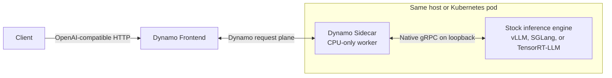

> [!WARNING]
> **Experimental.** Sidecar packaging, launchers, and API coverage are still
> evolving. The sidecar path does not yet match every feature of the in-process
> backends.

A Dynamo sidecar runs the Dynamo worker outside the inference engine process.
It connects the Dynamo request plane to the engine's native gRPC service while
the engine keeps ownership of scheduling, token generation, and GPU resources.

## Design Goals

- Keep the upstream engine's native serve path and argument surface.
- Move toward public, versioned gRPC contracts with explicit backward
  compatibility instead of importing private engine APIs.
- Isolate Dynamo and engine dependencies in separate processes.
- Attribute failures through engine-specific and Dynamo-specific logs and health
  checks.
- Reuse Dynamo's frontend, routing, planning, and disaggregated-serving
  orchestration.

## Architecture

The sidecar registers as a Dynamo worker, translates requests and responses,
and manages cancellation and lifecycle signals. The engine continues to use its
native server and owns the GPU, scheduler, sampler, and KV cache.

> [!IMPORTANT]
> The native gRPC listeners are unauthenticated and plaintext. Keep them on
> loopback or another private, access-controlled interface. The provided
> launchers bind them to loopback.

## Responsibilities

| Layer | Responsibility |
|---|---|
| Dynamo frontend and router | OpenAI-compatible API, preprocessing, routing, and prefill/decode orchestration |
| Dynamo sidecar | Worker registration, engine protocol translation, streaming, cancellation, and health bridging |
| Inference engine | Native serve API, scheduling, sampling, token generation, KV cache, and GPU execution |

## Current Readiness

| Backend | Local launcher | Kubernetes example |
|---|---|---|
| [vLLM](../backends/vllm/sidecar.md) | Aggregated and disaggregated | Aggregated and disaggregated |
| [SGLang](../backends/sglang/sidecar.md) | Aggregated and disaggregated | Aggregated and disaggregated |
| [TensorRT-LLM](../backends/trtllm/sidecar.md) | Aggregated | Aggregated |

Disaggregated launch paths require multiple GPUs and use NIXL for KV transfer.
This table describes validated launch topologies, not feature parity with the
in-process backends.

See the
[sidecar source and engine-specific READMEs](https://github.com/ai-dynamo/dynamo/tree/main/lib/sidecar)
for implementation details.
