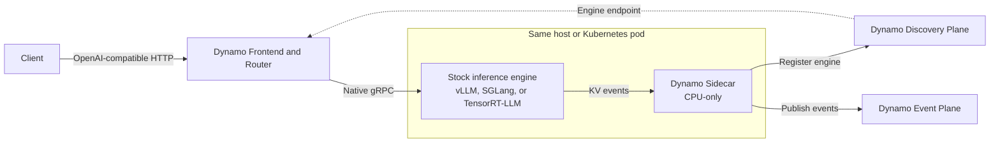

> [!WARNING]
> **Experimental.** Sidecar packaging, launchers, and API coverage are still
> evolving. The sidecar path does not yet match every feature of the in-process
> backends.

A Dynamo sidecar runs beside the inference engine process. It registers the
engine with Dynamo discovery and forwards engine events into the Dynamo event
plane. The Dynamo request plane connects directly to the engine's native gRPC
service.

## Design Goals

- Keep the upstream engine's native serve path and argument surface.
- Move toward public, versioned gRPC contracts with explicit backward
  compatibility instead of importing private engine APIs.
- Isolate Dynamo and engine dependencies in separate processes.
- Attribute failures through engine-specific and Dynamo-specific logs and health
  checks.
- Reuse Dynamo's frontend, routing, planning, and disaggregated-serving
  orchestration.

## Architecture

The frontend and router resolve the engine endpoint through discovery, then
send requests directly to the engine. The sidecar stays off the request path
and integrates the engine with Dynamo's discovery and event planes.

## Responsibilities

| Layer | Responsibility |
|---|---|
| Dynamo frontend and router | OpenAI-compatible API, preprocessing, routing, and direct native gRPC requests to the engine |
| Dynamo sidecar | Engine registration and discovery, plus event forwarding |
| Inference engine | Native gRPC request serving, scheduling, sampling, token generation, KV cache, and GPU execution |

## Current Readiness

| Backend | Local launcher | Kubernetes example |
|---|---|---|
| [vLLM](../backends/vllm/sidecar.md) | Aggregated and disaggregated | Aggregated and disaggregated |
| [SGLang](../backends/sglang/sidecar.md) | Aggregated and disaggregated | Aggregated and disaggregated |
| [TensorRT-LLM](../backends/trtllm/sidecar.md) | Aggregated | Aggregated |

Disaggregated launch paths require multiple GPUs and use NIXL for KV transfer.
This table describes validated launch topologies, not feature parity with the
in-process backends.

See the
[sidecar source and engine-specific READMEs](https://github.com/ai-dynamo/dynamo/tree/main/lib/sidecar)
for implementation details.
