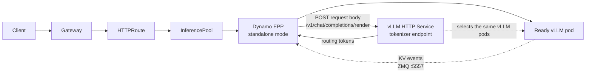
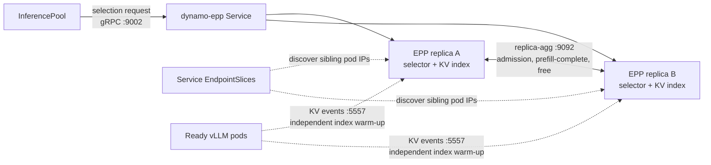

The vanilla vLLM GAIE on-ramp runs the Dynamo Endpoint Picker Plugin (EPP) in standalone mode for deployments that already use Gateway API Inference Extension (GAIE) and upstream `vllm serve` pods. It keeps the Gateway API request path and worker images in place while adding Dynamo's KV-aware endpoint selection.

Use [Vanilla vLLM GAIE On-ramp](../kubernetes/vanilla-vllm-onramp.mdx) for the task-oriented setup. Use [Route Requests with Gateway API](../kubernetes/inference-gateway.mdx) for the operator-managed DGD topology.

## Request Path

The `InferencePool` is the source of truth for worker labels and HTTP port. The EPP watches that pool and Ready pods in its namespace, subscribes directly to each worker's KV event socket, and calls vLLM's `/v1/chat/completions/render` endpoint to tokenize each routing request. The Gateway forwards the original request to the selected pod. The render Service is not a separate renderer workload; it is a stable Kubernetes Service address for the HTTP endpoint served by the same vLLM pods.

| Concern | Standalone on-ramp | Operator-managed Gateway API routing |
|---|---|---|
| Workers | Stock vLLM pods | Dynamo workers and direct-mode Frontend sidecars |
| Resource lifecycle | User-managed Deployments, Services, RBAC, `InferencePool`, and `HTTPRoute` | DGD and Dynamo operator |
| Worker discovery | Kubernetes pod watch driven by `InferencePool.spec.selector` | Dynamo runtime discovery |
| KV state | Direct per-pod vLLM ZMQ subscriptions | Dynamo event plane |
| Tokenization | vLLM `/v1/chat/completions/render` Service | Dynamo model-card preprocessor |
| Supported serving shape | Aggregated vLLM with data-parallel size 1 per pod | Aggregated and disaggregated Dynamo deployments |

Standalone mode is still a Gateway API routing topology. It changes who creates resources and how the EPP discovers worker state; it does not add a third public request-entry topology. For the operator-managed architecture and generated-resource boundary, see [Gateway API Routing Architecture](gateway-api-routing.md).

## EPP Replication

Each EPP replica has an in-process selector and KV index. When `DYN_EPP_PEER_SERVICE` is set, replicas watch their own Service's `EndpointSlice` resources and discover its named TCP `replica-agg` port. They synchronize admission, prefill-complete, and free events so active-load accounting converges across replicas.

Replica synchronization does not copy the full KV index to a new EPP. A new replica warms its index from live worker events and optional replay. For consistency details, see [Standalone Selection Service](../components/router/standalone-selection.md).

For a single EPP replica, set `spec.replicas: 1` and remove `DYN_EPP_PEER_SERVICE`, `POD_IP`, and the `replica-agg` Service port.

## Scope and Limitations

The standalone path currently targets aggregated vLLM serving with data-parallel size 1 per pod. It does not provide the DGD/operator lifecycle, Dynamo runtime discovery, disaggregated prefill/decode orchestration, request migration, topology-aware routing, or full operator-managed observability.

Use [Route Requests with Gateway API](../kubernetes/inference-gateway.mdx) when you want the supported operator-managed lifecycle, Dynamo workers, or disaggregated serving. Use [Gateway API Routing Reference](../components/router/gateway-api-reference.mdx) for DGD and standalone EPP runtime contracts.
