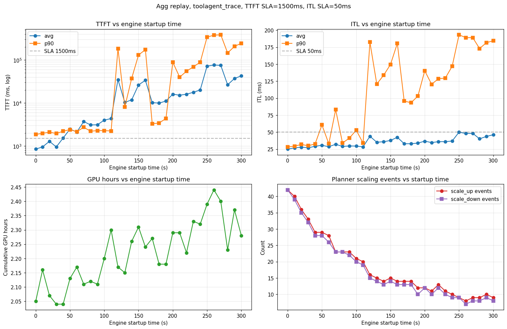

This tutorial runs the Dynamo Planner inside DynoSim so you can compare aggregated and
disaggregated topologies, tune SLA targets, and test sensitivity to worker startup time without a
live cluster.

> [!NOTE]
> The production Planner scales Kubernetes or Global Planner deployments; it does not autoscale a
> local CLI deployment. This page lives under Local (CLI) because `python -m dynamo.replay` runs the
> Planner logic through its virtual simulation environment on the local machine. The decisions being
> evaluated still represent Kubernetes deployment behavior.

For the general replay workflow, see [Run a DynoSim Simulation](runs.md). For Planner field types and
defaults, see the
[Planner Configuration reference](../components/planner/planner-config-reference.mdx). For how the
simulation supplies metrics to the Planner, see
[DynoSim Architecture](../design-docs/dynosim-architecture.md#planner-simulation-adapter).

## Prerequisites

Build the Rust runtime bindings and install the Python components from the repository root:

```bash
.venv/bin/maturin develop --release -m lib/bindings/python/Cargo.toml
uv pip install -e .
```

Use a release build because repeated simulation runs are CPU-bound.

The commands below use AIConfigurator-backed engine timing. The relevant fields are documented in
the
[DynoSim Replay CLI Reference](../components/mocker/replay-cli-reference.mdx#engine-timing-aic-fields-engine-args-json).

> [!WARNING]
> Set `prefill_engine_num_gpu` and `decode_engine_num_gpu` explicitly in every simulated Planner run.
> The simulation adapter cannot auto-detect a deployment GPU count, and leaving both values unset
> causes cumulative GPU-hours to report as zero.

## Compare aggregated and disaggregated deployments

Download the trace:

```bash
mkdir -p traces/mooncake_fast25 && cd traces/mooncake_fast25
curl -sLO https://raw.githubusercontent.com/kvcache-ai/Mooncake/main/FAST25-release/traces/toolagent_trace.jsonl
```

Run agg (2 workers, TP=1):

```bash
.venv/bin/python -m dynamo.replay traces/mooncake_fast25/toolagent_trace.jsonl \
  --planner-config '{
    "mode": "agg",
    "optimization_target": "sla",
    "ttft_ms": 1500, "itl_ms": 50,
    "enable_throughput_scaling": true, "enable_load_scaling": true,
    "pre_deployment_sweeping_mode": "rapid",
    "throughput_adjustment_interval_seconds": 300, "load_adjustment_interval_seconds": 10,
    "prefill_engine_num_gpu": 1, "decode_engine_num_gpu": 1,
    "report_filename": "dynosim_agg.html"
  }' \
  --extra-engine-args '{"aic_backend": "vllm", "aic_system": "h200_sxm", "aic_model_path": "nvidia/Llama-3.1-8B-Instruct-FP8", "aic_tp_size": 1}' \
  --num-workers 2 --arrival-speedup-ratio 1.0
```

Run disagg (1P1D, TP=1):

```bash
.venv/bin/python -m dynamo.replay traces/mooncake_fast25/toolagent_trace.jsonl \
  --planner-config '{
    "mode": "disagg",
    "optimization_target": "sla",
    "ttft_ms": 1500, "itl_ms": 50,
    "enable_throughput_scaling": true, "enable_load_scaling": true,
    "pre_deployment_sweeping_mode": "rapid",
    "throughput_adjustment_interval_seconds": 300, "load_adjustment_interval_seconds": 10,
    "prefill_engine_num_gpu": 1, "decode_engine_num_gpu": 1,
    "report_filename": "dynosim_disagg.html"
  }' \
  --prefill-engine-args '{"aic_backend": "vllm", "aic_system": "h200_sxm", "aic_model_path": "nvidia/Llama-3.1-8B-Instruct-FP8", "aic_tp_size": 1}' \
  --decode-engine-args  '{"aic_backend": "vllm", "aic_system": "h200_sxm", "aic_model_path": "nvidia/Llama-3.1-8B-Instruct-FP8", "aic_tp_size": 1}' \
  --num-prefill-workers 1 --num-decode-workers 1 --arrival-speedup-ratio 1.0
```

Each run prints the AIPerf summary table to stdout and writes an HTML diagnostics report to `./planner_reports/<report_filename>`. For this trace with a long ISL and short OSL, agg is better than disagg, which gets slightly better ITL at the cost noticeably more GPU-hours.

## Sweep cold-start time

How sensitive is SLA attainment to engine startup time? Sweep `startup_time` from 0 to 300 seconds in 10-second steps and record TTFT/ITL/GPU-hours per run.

```bash
#!/usr/bin/env bash
set -euo pipefail

TRACE=traces/mooncake_fast25/toolagent_trace.jsonl
OUT=planner_reports/sweep_startup
mkdir -p "$OUT"

run_one() {
  local s=$1
  local name=$(printf "dynosim_agg_startup_%03d.html" "$s")
  local extra
  if [[ "$s" -eq 0 ]]; then
    extra='{"aic_backend":"vllm","aic_system":"h200_sxm","aic_model_path":"nvidia/Llama-3.1-8B-Instruct-FP8","aic_tp_size":1}'
  else
    extra=$(printf '{"aic_backend":"vllm","aic_system":"h200_sxm","aic_model_path":"nvidia/Llama-3.1-8B-Instruct-FP8","aic_tp_size":1,"startup_time":%d}' "$s")
  fi
  .venv/bin/python -m dynamo.replay "$TRACE" \
    --planner-config "$(printf '{"mode":"agg","optimization_target":"sla","ttft_ms":1500,"itl_ms":50,"enable_throughput_scaling":true,"enable_load_scaling":true,"pre_deployment_sweeping_mode":"rapid","throughput_adjustment_interval_seconds":300,"load_adjustment_interval_seconds":10,"prefill_engine_num_gpu":1,"decode_engine_num_gpu":1,"report_filename":"%s"}' "$name")" \
    --extra-engine-args "$extra" \
    --num-workers 2 --arrival-speedup-ratio 1.0 \
    --report-json "$OUT/startup_$(printf '%03d' "$s").json" \
    >"$OUT/startup_$(printf '%03d' "$s").log" 2>&1
}

export -f run_one
# Run 12 sweeps in parallel; adjust -P for your machine.
seq 0 10 300 | xargs -n1 -P12 -I{} bash -c 'run_one "$@"' _ {}
```

Each run emits the AIPerf metrics table (parse TTFT / ITL avg / p90) and its HTML report (grep `GPU hours: <float>`). Plotting those against `startup_time` gives:



Observations from this sweep (agg, TTFT SLA 1,500 ms, ITL SLA 50 ms, H200-SXM, Llama-3.1-8B-FP8, TP=1):

- **SLA cliff near 100–120 s.** Below that, the planner scales up fast enough to hold TTFT; above it, p99 TTFT diverges and the system stays perpetually backlogged.
- **Scaling-event count drops monotonically** (42 → 8) as startup grows — long-startup runs require load planner to wait for stabilization before the next scaling decision.
- **ITL is less sensitive than TTFT** until the queue saturates. Below the cliff, ITL rises modestly (25 → 30 ms avg); above it, p90 ITL jumps to ~200 ms as decode requests starve.
