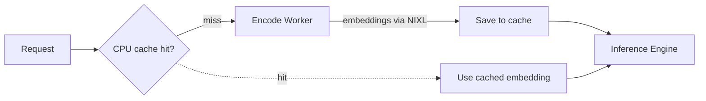

## Overview

The embedding cache (or encoder cache) is a CPU-side LRU cache that stores vision encoder outputs. When the same multimodal content, such as an image or video, appears in multiple requests, the cached embedding is reused instead of running the vision encoder again. This reduces GPU load on the encoder and lowers latency for repeated content.

<Info> Embedding cache is separate from the KV cache, which reuses attention key/value state after prefill to skip prefill and go straight to decode. For KV cache reuse and routing, see [Multimodal KV Routing](multimodal-kv-routing.md). </Info>

## When to Use

Use the embedding cache when your workload includes repeated multimodal content across requests. Common scenarios:

- Product catalog queries or multi-turn chat where users ask about the same image(s).
- Document processing pipelines that reference shared diagrams or figures
- Video QA or benchmark workloads that repeatedly reference the same clips

If your workload consists entirely of unique multimodal content, the cache provides no benefit.


## Configuration

<Tabs>
  <Tab title="vLLM" language="vllm">
    Launch a disaggregated multimodal deployment with the embedding cache enabled:

    ```bash
    cd $DYNAMO_HOME/examples/backends/vllm
    bash launch/disagg_multimodal_e_pd.sh --multimodal-embedding-cache-capacity-gb 10
    ```
  </Tab>
  <Tab title="TensorRT-LLM" language="trtllm">
    Launch a disaggregated multimodal deployment with the embedding cache enabled:

    ```bash
    cd $DYNAMO_HOME/examples/backends/trtllm
    ./launch/disagg_e_pd.sh --multimodal-embedding-cache-capacity-gb 10
    ```
  </Tab>
  <Tab title="SGLang" language="sglang">
    Launch a disaggregated multimodal E/PD deployment with the embedding cache enabled:

    ```bash
    cd $DYNAMO_HOME/examples/backends/sglang
    bash launch/multimodal_epd.sh --multimodal-embedding-cache-capacity-gb 10
    ```

    For SGLang encode/prefill/decode deployments that use `--router-mode device-aware-weighted`, set both `--multimodal-embedding-cache-capacity-gb` and `--multimodal-embedding-cache-publisher` on the encode worker. The publisher sends cache-key additions and removals over the configured event plane so the router can track which workers hold each requested embedding.

    When one or more workers hold every distinct embedding-cache key in a request, the router bypasses the CPU-to-non-CPU ratio and selects the least-loaded full-hit worker. Partial cache hits continue through the normal weighted group selection. The publisher is disabled by default and is not needed for round-robin routing or aggregated deployments.
  </Tab>
</Tabs>

Set `--multimodal-embedding-cache-capacity-gb` based on your expected working set of unique multimodal content. A larger cache holds more embeddings but consumes more host memory.

See the backend-specific documentation ([vLLM](multimodal-vllm.md#embedding-cache), [TRT-LLM](multimodal-trtllm.md#embedding-cache)) for more details.

## How It Works

In vLLM/TRT-LLM disaggregated flows, the prefill worker owns the CPU-side LRU cache. On a hit, the encode worker is skipped entirely. On a miss, the encode worker produces the embedding, transfers it via NIXL, and the prefill worker saves it to the cache.

In SGLang E/PD, the encode worker owns the cache and skips re-encoding on cache hits before forwarding the cached image or video embeddings downstream.



## Support Matrix

| Backend | Aggregated | Disaggregated (E/PD) | Notes |
|---------|------------|----------------------|-------|
| **vLLM** | <Badge intent="success" minimal>Yes</Badge> | <Badge intent="success" minimal>Yes</Badge> | Aggregated uses vLLM-native `ec_both`; disaggregated uses Dynamo `EmbeddingCacheManager` |
| **TensorRT-LLM** | — | <Badge intent="success" minimal>Yes</Badge> | Dynamo `MultimodalEmbeddingCacheManager` in PD worker |
| **SGLang** | — | <Badge intent="success" minimal>Yes</Badge> | Dynamo `MultimodalEmbeddingCacheManager` in the encode worker |

This support requires vLLM `0.17.0` or newer.
