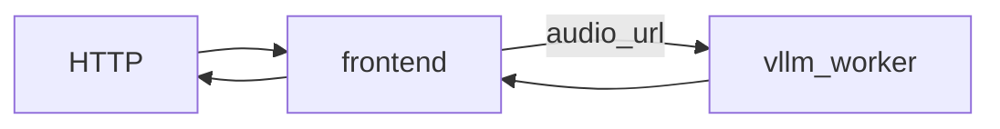
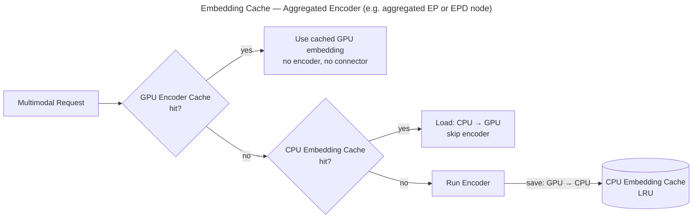
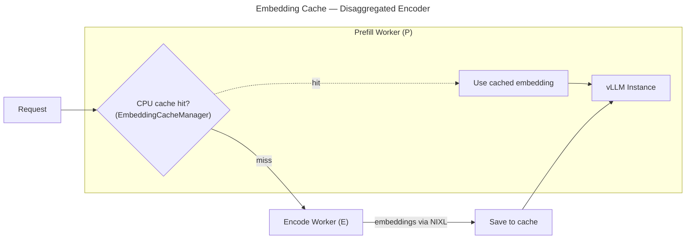

This document provides a comprehensive guide for multimodal inference using the vLLM backend in Dynamo.

<Warning>
**Security Requirement**: All multimodal workers require the
`--enable-multimodal` flag to be explicitly set at startup. This prevents
unintended processing of multimodal data from untrusted sources. Media requests
are rejected when the flag is absent, and workers configured with a multimodal
role fail at startup. This flag is analogous to `--enable-mm-embeds` in vLLM
serve but also extends it to all multimodal content (URL, embeddings, and
base64 data).
</Warning>

## Support Matrix

| Modality | Aggregated | P/D | Separate encode worker |
| --- | --- | --- | --- |
| **Image** | Yes | Yes | Legacy entry point only |
| **Video** | Yes | Yes | Processed by the language-model worker |
| **Audio** | Yes | Yes, with decode reload | Not routed to the separate encoder |

### Supported URL Formats

| Format         | Example                              | Description                |
| -------------- | ------------------------------------ | -------------------------- |
| **HTTP/HTTPS** | `http://example.com/image.jpg`       | Remote media files         |
| **Data URL**   | `data:image/jpeg;base64,/9j/4AAQ...` | Base64-encoded inline data |

## Deployment Patterns

The main multimodal vLLM launchers in this repo are:

| Pattern | Device | Launch script | Unified selection | Best for |
| --- | --- | --- | --- | --- |
| Aggregated | CUDA | `agg_multimodal.sh` | `--unified` | Simplest image/video serving from one worker |
| Aggregated | XPU | `xpu/agg_multimodal_xpu.sh` | No | Image/video serving on XPU devices |
| P/D | CUDA | `disagg_multimodal_p_d.sh` | `--unified` | Prefill/decode separation without a dedicated encoder |
| E/PD (Encode + PD) | CUDA | `disagg_multimodal_e_pd.sh` | No | Separate encoder and embedding-cache workflows |
| E/P/D (Full Disaggregation) | CUDA | `disagg_multimodal_epd.sh` | No | Separate encode, prefill, and decode workers |

### Custom Vision Encoders

The legacy aggregated vLLM worker can load an author-provided vision tower in
process, batch images across concurrent requests, and splice the resulting
embeddings into the language-model prompt. See [Custom Vision
Encoders](custom-vision-encoder.md) for the backend contract, launch instructions,
batch sizing guidance, and current limitations.

## Multimodal KV Routing

vLLM supports two multimodal KV-routing paths. Both give the router and vLLM the same image identity so requests can be placed on workers that already cache the image's KV blocks.

### Choose a Routing Path

| Consideration | Default Rust Frontend | Python Chat Processor |
|---------------|-----------------------|-----------------------|
| Frontend work | Hashes media and calculates the routing token layout | Runs vLLM's full Hugging Face multimodal processor |
| Worker work | Processes the original multimodal input | Consumes processed `mm_kwargs` when transfer succeeds |
| Model coverage | Models registered in Dynamo's `llm-multimodal` registry | Models supported by vLLM's multimodal processor |
| Data sent to worker | Original media reference plus `mm_hashes` | Processed inputs over shared memory or NIXL, with media fallback when available |
| Best fit | Lowest frontend overhead for a registered model | Broader model coverage or centralized preprocessing |

Start with the default path when the model is in Dynamo's Rust registry. It avoids running the full Hugging Face processor in the frontend and does not require a processed-input transfer channel.

Use the Python chat processor when the Rust registry does not recognize the model, when processor behavior must exactly match vLLM, or when moving preprocessing off workers is worth the added frontend CPU, memory, and transfer cost. Use shared memory for same-node deployments and NIXL for cross-node deployments.

### Default Rust Frontend

The default path keeps multimodal processing on the worker:

1. The frontend computes an `mm_hash` for each image.
2. A model-specific processor specification resolves the image placeholder and calculates its expanded token count.
3. The frontend expands the placeholder in a routing-only token view and builds per-block multimodal metadata.
4. The KV router selects the worker with the highest overlap.
5. The frontend forwards `mm_hashes`, which the worker passes to vLLM as `multi_modal_uuids`.

For `data:` URIs, the frontend hashes the decoded bytes. For HTTP URLs, it hashes the full URL by default. Set `--frontend-decoding` on the worker to register frontend media decoding and use decoded image content as the hash input. Content-addressed hashing lets different URLs for identical image bytes share a routing key.

Launch the default path:

```bash
cd $DYNAMO_HOME
bash examples/backends/vllm/launch/agg_multimodal_router.sh
```

Key settings:

| Variable | Default | Purpose |
|----------|---------|---------|
| `MODEL` | `Qwen/Qwen3-VL-2B-Instruct` | Model to serve |
| `NUM_WORKERS` | `2` | Number of backend workers |
| `BLOCK_SIZE` | `16` | Shared frontend and worker KV block size |
| `GPU_MEMORY_UTILIZATION` | `0.20` | Per-worker GPU memory fraction |
| `VLLM_EXTRA_ARGS` | unset | Additional worker flags; set `--frontend-decoding` for content-addressed image hashes |

### Python Chat Processor

Use the Python path when the model is supported by vLLM but not by the Rust model registry, or when the frontend should preprocess images:

```bash
cd $DYNAMO_HOME
bash examples/backends/vllm/launch/agg_multimodal_router_chat_processor.sh
```

This launcher sets `--dyn-chat-processor vllm`. The frontend runs vLLM's Hugging Face processor, extracts hashes and expanded multimodal inputs, builds routing metadata, and transfers processed `mm_kwargs` to the selected worker. This path supports any VLM handled by vLLM's multimodal processor.

`DYNAMO_MM_TRANSFER` selects the transfer mechanism:

- `shm` (default) uses shared memory for same-node frontend and worker deployments.
- `nixl` uses NIXL for cross-node transfer.
- `DYNAMO_DISABLE_NIXL_MM=1` disables processed-input transfer and makes the worker process the original media.

If a client supplies opaque multimodal UUIDs, Dynamo cannot derive a matching content hash. Those requests use text-prefix routing.

For the user-facing workflow, see [Multimodal KV Routing](../../../../use-cases/multimodal/multimodal-kv-routing).

## Image/Video Serving

Dynamo supports multimodal image and video requests for Vision Language Models (VLMs). `Qwen/Qwen3-VL-2B-Instruct` is a good example because the same model can handle both `image_url` and `video_url` requests through the standard OpenAI chat endpoint.

### Aggregated Serving

Use the single-worker aggregated launcher for the simplest image/video setup:

```bash
cd $DYNAMO_HOME/examples/backends/vllm

# GPU deployment
bash launch/agg_multimodal.sh --model Qwen/Qwen3-VL-2B-Instruct

# Unified backend
bash launch/agg_multimodal.sh --unified --model Qwen/Qwen3-VL-2B-Instruct

# XPU deployment
bash launch/xpu/agg_multimodal_xpu.sh --model Qwen/Qwen3-VL-2B-Instruct
```

**Image request:**

```bash
curl http://localhost:8000/v1/chat/completions \
  -H "Content-Type: application/json" \
  -d '{
      "model": "Qwen/Qwen3-VL-2B-Instruct",
      "messages": [
        {
          "role": "user",
          "content": [
            {
              "type": "text",
              "text": "What is in this image?"
            },
            {
              "type": "image_url",
              "image_url": {
                "url": "http://images.cocodataset.org/test2017/000000155781.jpg"
              }
            }
          ]
        }
      ],
      "max_tokens": 64,
      "temperature": 0.0,
      "stream": false
    }'
```

**Video request:**

```bash
curl http://localhost:8000/v1/chat/completions \
  -H "Content-Type: application/json" \
  -d '{
      "model": "Qwen/Qwen3-VL-2B-Instruct",
      "messages": [
        {
          "role": "user",
          "content": [
            {
              "type": "text",
              "text": "Describe the video in detail"
            },
            {
              "type": "video_url",
              "video_url": {
                "url": "https://qianwen-res.oss-cn-beijing.aliyuncs.com/Qwen3-Omni/demo/draw.mp4"
              }
            }
          ]
        }
      ],
      "max_tokens": 64,
      "stream": false
    }' | jq
```

### Reuse vLLM multimodal processor cache entries

vLLM can cache processed multimodal inputs under a client-provided opaque UUID.
Dynamo currently exposes this behavior for images only. The extension is
specific to vLLM; it is not part of the OpenAI Chat Completions API and is not
supported by Dynamo's other backends. Dynamo rejects UUIDs on audio or video,
and its SGLang and TensorRT-LLM backends reject image UUIDs rather than silently
ignoring unsupported cache semantics.

To enable the cache, pass a nonzero `--mm-processor-cache-gb` value to the vLLM
worker.

For an aggregated worker, enable Dynamo's CPU embedding cache alongside the
vLLM processor cache:

```bash
bash launch/agg_multimodal.sh --model Qwen/Qwen3-VL-2B-Instruct \
  --mm-processor-cache-gb 4 \
  --multimodal-embedding-cache-capacity-gb 1
```

The caches store different data. The vLLM processor cache retains the processed
media metadata required to resolve a UUID-only request. Dynamo's embedding cache
retains encoder output and can restore it after eviction from vLLM's GPU encoder
cache. Keep both caches enabled; the embedding cache alone cannot reconstruct a
UUID-only input. Both caches are local to one vLLM engine, so the fill and reuse
requests must reach the same aggregated worker.

Populate an entry by adding `uuid` beside the media field:

```json
{
  "type": "image_url",
  "image_url": {
    "url": "https://example.com/image.png"
  },
  "uuid": "catalog-image-42"
}
```

Reuse that entry in a later request by setting the media field to `null` and
sending the same top-level UUID:

```json
{
  "type": "image_url",
  "image_url": null,
  "uuid": "catalog-image-42"
}
```

UUIDs are opaque nonempty strings and must use the top-level field shown above.
A UUID-only request fails on a cache miss because it contains no media payload
to process. Dynamo also rejects a media content part that has neither a URL nor
a UUID.

When KV-aware routing is enabled, requests with client UUIDs use text-prefix
routing. Dynamo cannot convert an opaque client key into its content-derived
multimodal routing hash without risking different cache identities at the
router and worker.

### P/D Serving

Use the P/D launcher to separate prefill and decode without deploying a
dedicated multimodal encoder:

```bash
cd $DYNAMO_HOME/examples/backends/vllm

# Legacy vLLM worker path
bash launch/disagg_multimodal_p_d.sh --model Qwen/Qwen3-VL-2B-Instruct

# Unified vLLM worker path
bash launch/disagg_multimodal_p_d.sh --unified \
  --model Qwen/Qwen3-VL-2B-Instruct
```

For Qwen-VL images, prefill sends grid and embedding-shape metadata so decode
can construct schema-valid placeholder embeddings and initialize mRoPE. Other
model families use the expanded prompt token IDs produced during prefill.

<Warning>
The P/D handoff does not carry video embeddings. Video and audio inputs are
loaded again on the decode worker. This preserves current behavior but adds
media download and processing work. Mixed image-and-video P/D requests retain
the same model-specific limitations as the legacy vLLM path.
</Warning>

### Unified vLLM Backend

Pass `--unified` to the aggregated or P/D launchers to run
`python -m dynamo.vllm.unified_main`. The unified path supports HTTP URLs,
data URLs, frontend-decoded images, `mm_processor_kwargs`, frontend-provided
multimodal hashes, and Kimi-style `vision_chunk` inputs.

The Python vLLM frontend can pre-render multimodal processor inputs and send
them to an aggregated unified worker. Shared memory is the same-node default;
NIXL supports the transfer channel used by cross-node deployments:

```bash
# Same-node shared-memory transfer
DYN_CHAT_PROCESSOR=vllm DYNAMO_MM_TRANSFER=shm \
  bash launch/agg_multimodal.sh --unified \
  --model Qwen/Qwen3-VL-2B-Instruct

# NIXL transfer
DYN_CHAT_PROCESSOR=vllm DYNAMO_MM_TRANSFER=nixl \
  bash launch/agg_multimodal.sh --unified \
  --model Qwen/Qwen3-VL-2B-Instruct
```

The frontend includes the original media references when transfer preparation
is unavailable or partial. Fully transferred requests omit those references to
avoid duplicating large inline data URIs in the backend payload. A receiver-side
failure after a full transfer does not currently have a raw-media fallback.

P/D prefill deliberately uses the original media because it still needs
raw-media-derived metadata for the decode handoff.

<Warning>
The unified vLLM entry point does not provide a separate Encode worker and
rejects both `--disaggregation-mode encode` and `--route-to-encoder`. Use the
legacy E/PD or E/P/D launchers when a dedicated encoder is required.
</Warning>

### E/PD Serving (Encode + PD)

Use `disagg_multimodal_e_pd.sh` when you want a separate encode worker and a combined prefill/decode worker. This path is primarily useful for image-centric workloads and embedding-cache experiments.

<Warning>
When a separate encode worker is deployed with the current vLLM path, only `image_url` inputs are routed to it. `video_url` inputs are still processed on the combined PD worker.
</Warning>

```bash
cd $DYNAMO_HOME/examples/backends/vllm

# Multi-GPU deployment
bash launch/disagg_multimodal_e_pd.sh --model Qwen/Qwen3-VL-2B-Instruct

# Single-GPU (functional testing with small models)
bash launch/disagg_multimodal_e_pd.sh --model Qwen/Qwen3-VL-2B-Instruct --single-gpu

```

### E/P/D Serving (Full Disaggregation)

Use `disagg_multimodal_epd.sh` when you want separate encode, prefill, and decode workers for multimodal workloads.

<Warning>
In the current vLLM implementation, the separate encode worker is only used for `image_url` inputs. `video_url` inputs are still processed on the prefill worker, not on the encode worker.
</Warning>

```bash
cd $DYNAMO_HOME/examples/backends/vllm

# Multi-GPU deployment
bash launch/disagg_multimodal_epd.sh --model Qwen/Qwen3-VL-2B-Instruct

# Single-GPU (functional testing with small models)
bash launch/disagg_multimodal_epd.sh --model Qwen/Qwen3-VL-2B-Instruct --single-gpu
```

## Audio Serving

Dynamo supports `audio_url` requests for audio-capable models. Audio is loaded by the backend worker via vLLM's `AudioMediaIO` at native sample rate — vLLM's model-specific processor handles resampling and feature extraction internally. Omni models can handle `image_url`, `video_url`, and `audio_url` in the same request.

### Aggregated Serving

Use the same aggregated multimodal launcher with an audio-capable model:

```bash
pip install 'vllm[audio]'  # installs librosa and other audio dependencies
cd $DYNAMO_HOME/examples/backends/vllm

# GPU deployment
bash launch/agg_multimodal.sh --model Qwen/Qwen3-Omni-30B-A3B-Instruct

# XPU deployment
DYN_CHAT_PROCESSOR=vllm \
  bash launch/xpu/agg_multimodal_xpu.sh --model Qwen/Qwen3-Omni-30B-A3B-Instruct
```



**Audio request:**

```bash
curl http://localhost:8000/v1/chat/completions \
  -H "Content-Type: application/json" \
  -d '{
      "model": "Qwen/Qwen3-Omni-30B-A3B-Instruct",
      "messages": [
        {
          "role": "user",
          "content": [
            {
              "type": "text",
              "text": "What sound is this?"
            },
            {
              "type": "audio_url",
              "audio_url": {
                "url": "https://raw.githubusercontent.com/yuekaizhang/Triton-ASR-Client/main/datasets/mini_en/wav/1221-135766-0002.wav"
              }
            }
          ]
        }
      ],
      "max_tokens": 100,
      "stream": false
    }' | jq
```

## Embedding Cache

Dynamo supports embedding cache in both aggregated and disaggregated settings:

| Setting                   | Implementation                                                 | Launch Script               |
| ------------------------- | -------------------------------------------------------------- | --------------------------- |
| **Aggregated**            | Supported via vLLM ECConnector in vLLM 0.17+                   | `agg_multimodal.sh` (or with `vllm serve` directly) |
| **Disaggregated encoder** | Dynamo-managed cache in the worker layer on top of vLLM engine | `disagg_multimodal_e_pd.sh` |

### Aggregated Worker

A single vLLM instance caches encoded embeddings on CPU so repeated images skip encoding entirely. Supported natively with vLLM 0.17+.



**Launch with Dynamo:**

```bash
bash examples/backends/vllm/launch/agg_multimodal.sh \
    --unified \
    --model Qwen/Qwen3-VL-30B-A3B-Instruct-FP8 \
    --multimodal-embedding-cache-capacity-gb 10
```

Both `dynamo.vllm` and `dynamo.vllm.unified_main` automatically configure
`ec_both` mode with `DynamoMultimodalEmbeddingCacheConnector` when capacity is
greater than zero. A capacity of zero disables the CPU cache. Frontend-provided
multimodal hashes are reused as cache identities so routing and embedding-cache
lookups agree.

**Launch with `vllm serve` (standalone, no Dynamo):**

```bash
vllm serve Qwen/Qwen3-VL-30B-A3B-Instruct-FP8 \
    --ec-transfer-config "{
        \"ec_role\": \"ec_both\",
        \"ec_connector\": \"DynamoMultimodalEmbeddingCacheConnector\",
        \"ec_connector_module_path\": \"dynamo.vllm.multimodal_utils.multimodal_embedding_cache_connector\",
        \"ec_connector_extra_config\": {\"multimodal_embedding_cache_capacity_gb\": 10}
    }"
```

The `multimodal_embedding_cache_capacity_gb` parameter controls the CPU-side LRU cache size in GB (0 = disabled). Requires vLLM 0.17+.

### Disaggregated Encoder (Embedding Cache in Prefill Worker)

In the disaggregated setting, the Prefill Worker (P) owns a CPU-side LRU embedding cache (`EmbeddingCacheManager`). On each request P checks the cache first — on a hit, the Encode Worker is skipped entirely. On a miss, P routes to the Encode Worker (E), receives embeddings via NIXL, saves them to the cache, and then feeds the embeddings along with the request into the vLLM Instance for prefill.



**Launch:**

```bash
cd $DYNAMO_HOME/examples/backends/vllm
bash launch/disagg_multimodal_e_pd.sh --multimodal-embedding-cache-capacity-gb 10
```

**Client:** Use the same `image_url` request format shown in [Aggregated Serving](#aggregated-serving).

## LoRA Adapters on Multimodal Workers

Multimodal workers support dynamic loading and unloading of LoRA adapters at runtime via the management API. This enables serving fine-tuned multimodal models alongside the base model.

### Loading a LoRA Adapter

Load an adapter on a running multimodal worker via the `load_lora` endpoint:

```bash
# For components workers (URI-based, requires DYN_LORA_ENABLED=true)
curl -X POST http://<worker-host>:<port>/load_lora \
  -H "Content-Type: application/json" \
  -d '{
    "lora_name": "my-vlm-adapter",
    "source": {"uri": "s3://my-bucket/adapters/my-vlm-adapter"}
  }'

# For example workers (path-based)
curl -X POST http://<worker-host>:<port>/load_lora \
  -H "Content-Type: application/json" \
  -d '{
    "lora_name": "my-vlm-adapter",
    "lora_path": "/path/to/adapter"
  }'
```

### Sending Requests with a LoRA

Set the `model` field in the request to the LoRA adapter name:

```bash
curl -X POST http://<frontend-host>:<port>/v1/chat/completions \
  -H "Content-Type: application/json" \
  -d '{
    "model": "my-vlm-adapter",
    "messages": [
      {"role": "user", "content": [
        {"type": "text", "text": "Describe this image"},
        {"type": "image_url", "image_url": {"url": "https://example.com/image.jpg"}}
      ]}
    ]
  }'
```

Requests without a LoRA name (or with the base model name) will use the base model.

### Unloading a LoRA Adapter

```bash
curl -X POST http://<worker-host>:<port>/unload_lora \
  -H "Content-Type: application/json" \
  -d '{"lora_name": "my-vlm-adapter"}'
```

### Listing Loaded Adapters

```bash
curl -X POST http://<worker-host>:<port>/list_loras
```

### Disaggregated Mode

In disaggregated (prefill/decode) deployments, the **same LoRA adapter must be loaded on both the prefill and decode workers**. The LoRA identity (`model` field) is automatically propagated from the prefill worker to the decode worker in the forwarded request.

```bash
# Load on prefill worker
curl -X POST http://<prefill-worker>/load_lora \
  -d '{"lora_name": "my-adapter", "source": {"uri": "s3://bucket/adapter"}}'

# Load on decode worker (same adapter)
curl -X POST http://<decode-worker>/load_lora \
  -d '{"lora_name": "my-adapter", "source": {"uri": "s3://bucket/adapter"}}'
```

If a LoRA is loaded on the prefill worker but not on the decode worker, the decode worker will fall back to the base model for that request.

## Supported Models

For a list of multimodal models supported by vLLM, see [vLLM Supported Multimodal Models](https://docs.vllm.ai/en/latest/models/supported_models/#list-of-multimodal-language-models). Models listed there should generally work with aggregated serving, though they may not all be explicitly tested in this repo.
