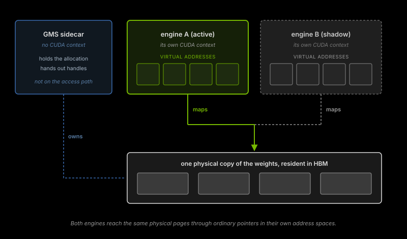

import { BlogStyles } from "@/components/BlogStyles";
import { BlogArticleMeta } from "@/components/BlogArticleMeta";

<BlogStyles />

<BlogArticleMeta
  authors={[
    { name: "Mohammed Abdulwahhab" },
    { name: "Schwinn Saereesitthipitak", href: "https://developer.nvidia.com/blog/author/schwinnsaereesitthipitak/" },
    { name: "Vikram Sharma Mailthody", href: "https://developer.nvidia.com/blog/author/vmailthody/" },
    { name: "Maksim Khadkevich", href: "https://developer.nvidia.com/blog/author/mkhadkevich/" },
  ]}
  category="Engineering"
  date="August 13, 2026"
  readTime="11 min read"
/>

When an LLM engine process fails, the standard recovery path involves a cold restart. This requires loading weights into HBM from storage, compiling kernels, and capturing CUDA graphs. For large models, this initialization period can last several minutes, during which surviving workers are strained to compensate for the loss.

**Shadow Engine Failover** keeps a second engine process, the *shadow*, fully initialized and idle on the same GPUs as the active one. What makes this possible is the **GPU Memory Service (GMS)**, which enables zero-copy weight sharing between the engines, so the shadow adds no weight memory of its own. When the active process fails, the shadow takes over within seconds. Re-initialization still occurs, but it happens in the background, entirely off the serving path. Shadow failover is available in Dynamo today as a [preview feature](../../developer-guide/knowledge-base/kubernetes/kubernetes-operator/shadow-engine-failover.md).

We measured the impact by forcing a two-minute cascade failure across all three engines of a three-node Kimi-K2.6 deployment. Without failover, the system suffered 409 failed requests and a 150-second total outage. With shadow failover, only 17 requests failed, and the service remained continuous throughout the cascade. Below, we show how the GPU Memory Service makes warm standby possible, walk through the failover sequence, and go through those measurements.

<table>
<tr><th width="50%">BASELINE (no failover)</th><th width="50%">SHADOW FAILOVER</th></tr>
<tr>
<td></td>
<td></td>
</tr>
</table>

<Info icon="hand-point-up" className="fig-caption">
Per-user decode rate through a cascade of three engine kills, 60 s apart, on a 3-worker Kimi-K2.6 deployment. The empty stretch in the baseline chart is 150 s in which no request completed anywhere. With shadow failover the series never breaks.
</Info>

---

## Background and Challenges

Recoverable software faults are common for LLM engines in production, including process crashes, recoverable CUDA errors, and transient collective failures. In these instances, the hardware, drivers, and node remain healthy; only the process holding the corrupted state is lost, and a fresh engine can typically run on the same GPUs without further issues.

So why can't that fresh engine skip the initialization cost? Two problems stand in the way:

- **Weights are tied to the engine process.** GPU memory is linked to the engine's CUDA context, which is itself tied to the engine process. When the process exits, the driver releases all resources, including weights already resident in GPU memory. Consequently, any incoming engine process must repeat the full weight-loading procedure.
- **Some initialization states are non-transferable.** NCCL and `torch.distributed` communicators bind to the specific running process, and CUDA graphs are fixed to the virtual addresses present during capture. This state cannot be handed off from a previous engine and must be re-executed during every restart.

Shadow failover addresses each with a targeted optimization: decoupling weight lifetime from the engine process, and prepaying non-transferable initialization ahead of any failure.

---

## How shadow failover works

### GPU Memory Service

The **GPU Memory Service (GMS)** manages specific memory regions, such as weights, independently of the engine process. By using a process distinct from the engine to own these regions, weights remain resident in memory even as engines are restarted. This allows a new engine on the same GPU to attach to existing memory.

GMS is a per-GPU sidecar that owns physical GPU memory on behalf of inference engines. It is mostly dormant and has no CUDA context of its own; it allocates physical pages, hands out handles to them, and arbitrates which engines may read or write at any given moment. Engines connect, import handles, and map the underlying pages at virtual addresses in their own CUDA contexts. Mapping happens once, at startup, and GMS is not involved in any access afterwards.

This functionality is built on the [CUDA Virtual Memory Management API](https://developer.nvidia.com/blog/introducing-low-level-gpu-virtual-memory-management/), which allows physical GPU memory and its associated virtual addresses to have independent lifetimes. Since physical allocations are reference-counted, they survive as long as any process maintains a mapping. Two engines mapping the same weight tensor access the same physical bytes, each using virtual addresses local to its respective context. A kernel reading a weight dereferences an ordinary pointer into the same HBM the weight would have occupied anyway, so a GMS-backed read costs no more than an engine-allocated one.

<Frame caption="Weights shared through GMS">
  
</Frame>

<Info icon="hand-point-up" className="fig-caption">
Each engine maps the weights into its own address space, but there is only one physical copy in HBM. GMS holds the allocation and hands out the handles; it does not sit between an engine and the memory it reads.
</Info>

This architecture provides two primary benefits. First, weights persist beyond engine failure. While the kernel removes the failed engine's CUDA context, the GMS reference ensures the physical pages stay resident so a fresh engine can immediately map them. Second, weights can be shared between concurrent engines; therefore, a secondary engine on the same GPU incurs zero marginal weight cost.

Integration into inference frameworks is narrow. vLLM, SGLang, and TensorRT-LLM each plug GMS in through a custom [`torch.cuda.CUDAPluggableAllocator`](https://docs.pytorch.org/docs/stable/generated/torch.cuda.CUDAPluggableAllocator.html) bound to the weight memory pool. From inside the engine, weights remain ordinary `torch.Tensor`s. Adopting GMS is essentially flipping a flag at startup.

<Note>
GMS is not limited to weights. Extending it to cover the KV cache is an active line of work,
not a capability available today. The goal is for a promoted shadow to map the outgoing
engine's cache instead of rebuilding it from traffic.
</Note>

### Shadow engines

A shadow engine is a fully initialized engine process, idle and co-resident on the same GPUs as the active one. That zero marginal weight cost is what makes it possible at all: without sharing, the second engine would need a second full copy of the weights, which for any model worth serving exceeds what HBM can hold.

A shadow runs through the same startup path as an active engine. On each of its GPUs it connects to the local GMS and imports the weight mappings, establishes communicators (NCCL, and NIXL for KV transfer between workers), captures CUDA graphs, and performs any warmup necessary. By the end of startup it is ready to serve. Then, instead of serving, it parks: it releases the materializable parts of its memory and blocks waiting for its turn.

What a shadow has prepaid by the time it parks:

- **CUDA context, captured graphs, and communicators.** This non-transferable state is ready the moment the shadow engine is activated, as it cannot be inherited from a previous process.
- **Weight mappings.** The GMS handles are already imported, so wake is a remap into addresses the engine already knows.

What it has deferred:

- **KV cache materialization.** The largest reclaimable allocation an engine holds. The shadow reserves the address range but leaves it without physical backing while parked, and materializes it on promotion.

So a parked shadow's standing cost is its context, captured graphs, and communicators, and nothing else. It holds no weights of its own and no KV cache, which leaves it small enough to sit alongside an active engine on the same devices. That co-residency is what makes failover within seconds possible.

### The failover worker

<table>
<tr>
<td width="50%"></td>
<td width="50%"></td>
</tr>
</table>

<Info icon="hand-point-up" className="fig-caption">
Left: the internals of one failover worker. Right: a fleet of them behind a single router. The pair layout is internal to the worker, so router, frontend, and orchestrator need no changes to benefit from failover.
</Info>

These foundations are integrated into a single deployable unit called the **failover worker**. This pod consists of two engine containers, a GMS sidecar to mediate GPU memory access, and a shared lock to elect the active engine.

At steady state, one engine holds the lock and is awake: connected to GMS, KV cache materialized, registered as discoverable with the frontend router. The other is dormant, fully initialized and connected to GMS, but holding no KV cache and blocked on the lock. From the router's perspective there is one inference endpoint per worker. The shadow is invisible until a failover promotes it.

---

## Failover in depth

### Sequence

A failover worker moves through four phases from steady state back to steady state.

<Frame caption="Failover sequence">
  
</Frame>

<Info icon="hand-point-up" className="fig-caption">
The four phases of a failover. Active and shadow roles swap between engine A and engine B, and the worker returns to steady state without either engine reloading weights.
</Info>

- **T₀ Steady.** Engine A holds the lock and is awake, registered with the router. Engine B is dormant, blocked on the lock.
- **T₁ Failure.** Engine A's process exits, either because it crashed outright or because a liveness probe found it hung and killed it. Either way the kernel releases its lock as the process is reaped. The worker is briefly unroutable until the shadow registers.
- **T₂ Cutover.** Engine B acquires the lock, wakes, remaps weights through GMS, materializes its KV cache, and re-registers with the router. Engine A's container is restarted by the orchestrator.
- **T₃ Restarted.** Engine A finishes initialization and enters the shadow state. Steady state, with the roles swapped.

The shadow's advantage is that it enters T₂ already initialized. The only work on the critical path is acquiring the lock, remapping weights, and materializing the KV cache.

### Synchronization

The worker requires both mutual exclusion, ensuring only one engine is awake at a time, and reliable release to ensure the standby engine takes over if the active one fails. A POSIX `flock` on a shared file provides these guarantees. When the active process exits due to a shutdown, segfault, or `SIGKILL`, the kernel reaps its file descriptors, and the shadow engine acquires the lock to begin serving.

Each engine's startup path is therefore a short leader election:

```py
await engine.initialize()  # weight load, torch.compile, autotune, CUDA graph capture
...
# put the engine to sleep while we wait on the lock
await engine.sleep()
lock = FlockFailoverLock(lock_path)
await lock.acquire(engine_id=engine.id)  # wait on the lock to wake
await engine.wake()
```

A deadlocked engine whose process is still alive falls to the Kubernetes liveness probe, which cascades to a `SIGKILL` and trips the same kernel-managed release.

### Memory accounting

Fitting two engine processes on one GPU without exhausting HBM takes careful accounting across the lifecycle.

<Frame caption="GPU memory across a failover">
  
</Frame>

<Info icon="hand-point-up" className="fig-caption">
Weights are allocated once by GMS and mapped by every engine, so they never appear twice. The KV cache belongs to whichever engine is active, released on failure and materialized again by the engine that takes over. Buffers and captured graphs are the only cost a parked engine carries.
</Info>

- **Weights.** Allocated once by GMS and mapped read-only by every engine in the worker, never duplicated.
- **KV cache.** Held only by the active engine today: materialized when it wakes, released when it dies, freeing the region for the shadow to take over.
- **Buffers and graphs.** NCCL buffers, the CUDA context, captured graphs. Held by each engine even while dormant, and the whole of a parked shadow's standing cost.


## Benchmarks

### Setup

We ran three failover workers serving Kimi-K2.6 quantized to NVFP4 on B200 nodes: one worker per node, eight GPUs each, TP=8, 256K max context, prefix caching on, and MLA prefill running on FlashInfer. The load is a code-agent trace with heavy session-level KV reuse: 100k input tokens and 1k output tokens per request, at concurrency 24.

Both arms run identical engine builds and configuration, so the only difference is the failover feature. The baseline has failover off, and each killed worker cold-restarts. The shadow failover arm has shadow mode on, and each worker pod holds a pre-initialized shadow. That parked shadow held about 6.2 GB per GPU: its CUDA context, NCCL buffers, and captured graphs, with no weights or KV cache of its own.

We injected the fault only after the workload reached its steady-state operating point: three engine kills, one per worker, 60 seconds apart. Sixty seconds is well short of a Kimi-K2.6 cold start, so on the baseline arm the third worker dies long before the first has recovered, and the fleet is left with no serving capacity at all.

We classify each request as *working*, *slow* (completed but outside the original SLA of 5 s to first token), or *truly-failed* (returned an error or never completed).

### Results

<table>
<tr><th width="50%">BASELINE (no failover)</th><th width="50%">SHADOW FAILOVER</th></tr>
<tr>
<td></td>
<td></td>
</tr>
</table>

<Info icon="hand-point-up" className="fig-caption">
Request outcomes in 30 s bins. Baseline loses 409 requests and completes nothing for roughly 150 s; shadow failover loses 17 and completes requests in every bin. Note the different y-axes: the baseline peaks near 200 per bin because its failures all land at once, while shadow failover never leaves its normal ~30.
</Info>

<table>
<tr><th width="50%">BASELINE (no failover)</th><th width="50%">SHADOW FAILOVER</th></tr>
<tr>
<td></td>
<td></td>
</tr>
</table>

<Info icon="hand-point-up" className="fig-caption">
TTFT per request with a 30 s rolling mean, on a shared 0–25 s axis. The baseline's spike is the recovery, not the failure: the cold-restarted workers come back and inherit the whole queued backlog at once. Shadow failover has no backlog to drain, so its worst window sits near the 5 s SLA line rather than four times above it.
</Info>

| Metric | Baseline | Shadow failover |
|---|---|---|
| Serving through the cascade | blackout, ~150 s | continuous |
| Truly-failed requests | 409 | 17 |
| Requests completed | 867 | 1,017 |
| Requests inside the original SLA | 699 | 907 |

Shadow failover fundamentally changes the failure profile:

- **Request health.** Failures dropped from 409 to just 17, with no complete blackout. The 17 fall inside the cutover window: between the active engine's process exiting and the shadow registering with the router, the worker is briefly unroutable, and requests in flight or arriving in that gap are dropped.
- **Decode rate.** The fleet sustained performance throughout the cascade, maintaining a steady ~70 tok/s/user compared to the baseline's complete drop-off.
- **TTFT stability.** During recovery, shadow failover kept worst-case TTFT within manageable bounds, avoiding the severe latency spikes caused by the baseline's massive backlog of queued requests.

---

## Caveats and what's next

- Shadow failover addresses common engine process failures but does not cover hardware, node, or multi-node failures, which still rely on standard rescheduling.
- It requires Dynamic Resource Allocation (DRA) on Kubernetes, so the cluster needs Kubernetes 1.34 or newer with DRA enabled and the NVIDIA GPU DRA driver installed.
- Because promoted shadows start with empty KV caches, the post-cutover TTFT experiences a slight bump. Carrying cache state across a promotion, both the prefix-cache index and the cache memory itself, is the active line of work.
- vLLM is the primary supported backend, with SGLang and TensorRT-LLM available experimentally.

To try it: [Shadow Engine Failover](../../developer-guide/knowledge-base/kubernetes/kubernetes-operator/shadow-engine-failover.md) covers the deployment workflow, the [vLLM failover example](https://github.com/ai-dynamo/dynamo/blob/main/examples/backends/vllm/deploy/agg_failover.yaml) is a complete manifest, and the [Kubernetes quickstart](../../kubernetes/getting-started/quickstart.mdx) gets you to a running deployment first. Shadow failover is being built in the open in [ai-dynamo/dynamo](https://github.com/ai-dynamo/dynamo), and issues and questions are welcome.
