import { BlogStyles } from "@/components/BlogStyles";
import { BlogArticleMeta } from "@/components/BlogArticleMeta";

<BlogStyles />

<BlogArticleMeta
  authors={[
    { name: "Mohammed Abdulwahhab" },
    { name: "Schwinn Saereesitthipitak", href: "https://developer.nvidia.com/blog/author/schwinnsaereesitthipitak/" },
  ]}
  category="Engineering"
  date="August 12, 2026"
  readTime="12 min read"
/>

When an LLM engine process dies, the standard recovery path is a cold restart: load weights into HBM, compile kernels, capture CUDA graphs. For large models, this initialization period can be several minutes long, during which surviving workers are strained picking up the slack.

Dynamo Bulwark keeps a pre-initialized *shadow* engine co-resident on the same GPUs as the active one. When the active process dies, the shadow takes over in seconds. The cold restart still happens — it just happens in the background, off the serving path. Bulwark ships in Dynamo today as the preview [Shadow Engine Failover](../../developer-guide/knowledge-base/kubernetes/kubernetes-operator/shadow-engine-failover.md) feature.

We measured it by killing all three engines of a three-node Kimi-K2.6 deployment in a two-minute cascade. Without failover that cost 409 failed requests and roughly 150 seconds in which the fleet served nothing at all. With Bulwark it cost 17 failed requests and no blackout. Below we show how the GPU Memory Service makes warm standby possible, walk through the failover sequence, and go through those measurements.

<table>
<tr><th width="50%">BASELINE — no failover</th><th width="50%">BULWARK — shadow failover</th></tr>
<tr>
<td>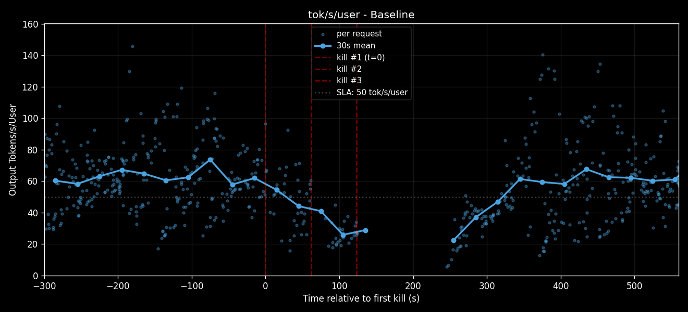</td>
<td>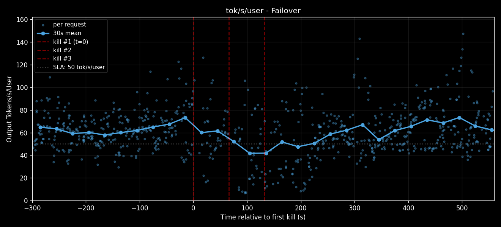</td>
</tr>
</table>

<Info icon="hand-point-up" className="fig-caption">
Per-user decode rate through a cascade of three engine kills, 60 s apart, on a 3-worker Kimi-K2.6 deployment. The empty stretch in the baseline chart is 150 s in which no request completed anywhere. With Bulwark the series never breaks.
</Info>

---

## Motivation

Recoverable software faults are routine for LLM engines in production: process crashes, recoverable CUDA errors, transient NCCL collective failures. In each case the hardware, drivers, and node are healthy — only the process holding the bad state is gone, and a fresh engine would run on the same GPUs without trouble.

So why can't that fresh engine skip the initialization cost? Two problems stand in the way:

- **Weights die with the engine process.** GPU memory is tied to the engine's CUDA context, which is tied to the engine process. When the process exits, the driver releases everything — including weights that were already resident in GPU memory. The incoming engine process must again pay the full cost of weight loading.
- **Some initialization cannot be transferred at all.** NCCL and `torch.distributed` communicators bind to the running process. CUDA graphs bake in the virtual addresses they were captured against. None of this can be handed off from a prior engine — it must be re-executed on every restart.

Bulwark addresses each with a targeted optimization: decoupling weight lifetime from the engine process, and prepaying non-transferable initialization ahead of any failure.

---

## How Bulwark works

### GPU Memory Service

The **GPU Memory Service (GMS)** manages certain regions of memory — here, the *weights* — outside the engine process. Once a process independent of any engine owns them, engines can come and go while the weights stay resident, and a new engine on the same GPU can *attach* to memory that is already there.

GMS is a per-GPU sidecar that owns physical GPU memory on behalf of inference engines. It is mostly dormant and has no CUDA context of its own; it allocates physical pages, hands out handles to them, and arbitrates which engines may read or write at any given moment. Engines connect, import handles, and map the underlying pages at virtual addresses in their own CUDA contexts.

This rests on the [CUDA Virtual Memory Management API](https://developer.nvidia.com/blog/introducing-low-level-gpu-virtual-memory-management/), which gives *physical GPU memory* and the *virtual addresses* used to reach it independent lifetimes. The physical allocation is reference-counted and survives as long as any process still holds or maps it, and handles can be exported to other processes. Two engines mapping the same weight tensor see the same bytes on the GPU, each at virtual addresses local to its own context.

The payoff falls out in two directions. First, **weights survive engine death.** The kernel tears down the crashed engine's CUDA context and its mappings vanish, but the GMS reference remains and the physical pages stay resident; a fresh engine connects, asks for the same handles, and maps them in. Second, **weights can be shared between concurrent engines**, so a second engine on the same GPU has zero marginal weight cost.

Integration into inference frameworks is narrow. vLLM, SGLang, and TensorRT-LLM each plug GMS in through a custom [`torch.cuda.CUDAPluggableAllocator`](https://docs.pytorch.org/docs/stable/generated/torch.cuda.CUDAPluggableAllocator.html) bound to the weight memory pool. From inside the engine, weights remain ordinary `torch.Tensor`s. Adopting GMS is essentially flipping a flag at startup.

### Shadow engines

A shadow engine is a fully initialized engine process, idle and co-resident on the same GPUs as the active one. That zero marginal weight cost is what makes it possible at all: without sharing, the second engine would need a second full copy of the weights, which for any model worth serving exceeds what HBM can hold.

A shadow runs through the same startup path as an active engine. On each of its GPUs it connects to the local GMS and imports the weight mappings, establishes communicators (NCCL, and NIXL for KV transfer between workers), captures CUDA graphs, and performs any warmup necessary. By the end of startup it is ready to serve. Then, instead of serving, it parks: it releases the materializable parts of its memory and blocks waiting for its turn.

What a shadow has prepaid by the time it parks:

- **CUDA context, captured graphs, and communicators.** The non-transferable state — none of it inheritable from a prior engine, all of it ready the moment the shadow wakes.
- **Weight mappings.** The GMS handles are already imported, so wake is a remap into addresses the engine already knows.

What it has deferred:

- **KV cache materialization.** The largest reclaimable allocation an engine holds. The shadow leaves the KV pool unbacked while parked (we cover the mechanism in [Shadow replenishment](#shadow-replenishment)).

So a parked shadow's standing cost is the first list and nothing else — no weights of its own, no KV cache. That is small enough to sit alongside an active engine on the same devices, which is what makes failover within seconds possible.

### The Bulwark Worker

The two foundations compose into a single deployable unit, the **Bulwark Worker**: a pod containing two engine containers, a GMS sidecar mediating GPU memory access, and a shared lock electing which engine is active.

At steady state, one engine holds the lock and is awake — connected to GMS, KV cache materialized, registered as discoverable with the frontend router. The other is dormant: fully initialized, connected to GMS, holding no KV cache, blocked on the lock. From the router's perspective there is one inference endpoint per worker. The shadow is invisible until a failover promotes it.

<table>
<tr>
<td width="50%">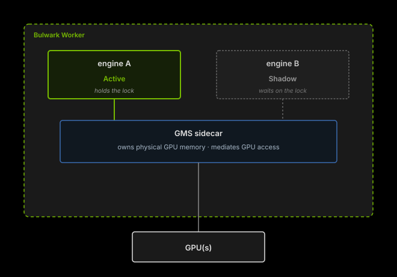</td>
<td width="50%">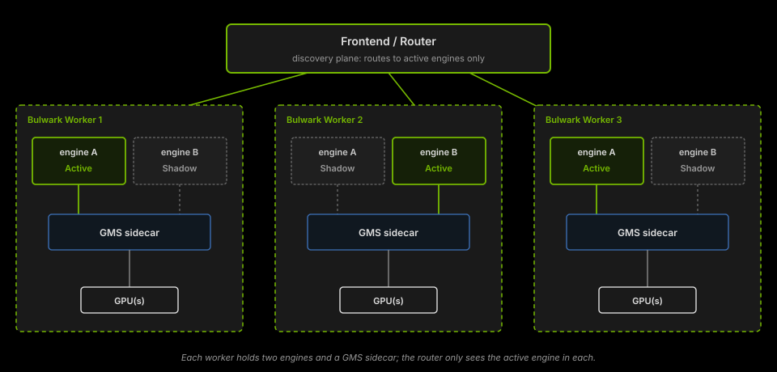</td>
</tr>
</table>

<Info icon="hand-point-up" className="fig-caption">
Left: the internals of one Bulwark Worker. Right: a fleet of them behind a single router. The pair layout is internal to the worker — router, frontend, and orchestrator need no changes to benefit from failover.
</Info>

---

## Failover in depth

### Sequence

A Bulwark Worker moves through four phases from steady state back to steady state.

<Frame caption="Failover sequence">
  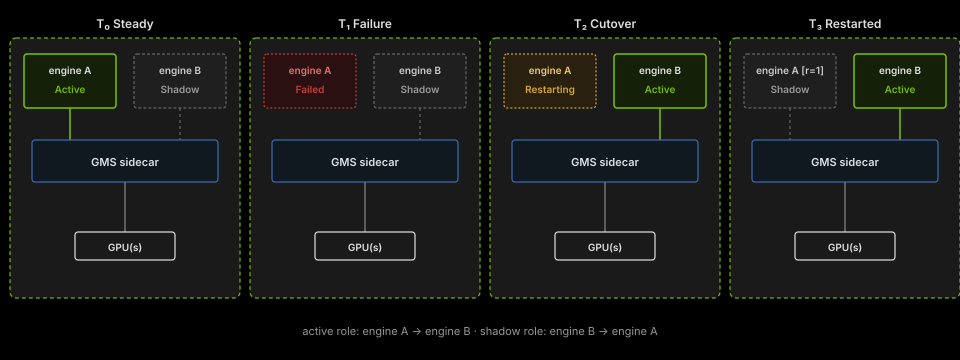
</Frame>

<Info icon="hand-point-up" className="fig-caption">
The four phases of a failover. Active and shadow roles swap between engine A and engine B, and the worker returns to steady state without either engine reloading weights.
</Info>

- **T₀ Steady.** Engine A holds the lock and is awake, registered with the router. Engine B is dormant, blocked on the lock.
- **T₁ Failure.** Engine A's process exits, releasing the lock. The worker is briefly unroutable until the shadow registers.
- **T₂ Cutover.** Engine B acquires the lock, wakes, remaps weights through GMS, materializes its KV cache, and re-registers with the router. Engine A's container is restarted by the orchestrator.
- **T₃ Restarted.** Engine A finishes initialization and enters the shadow state. Steady state, with the roles swapped.

The shadow's advantage is that it enters T₂ already initialized. The only work on the critical path is acquiring the lock, remapping weights, and materializing the KV cache.

### Synchronization

The worker needs mutual exclusion (only one engine awake and routable at a time) and reliable release (when the active engine dies, the standby takes over regardless of *how* it died). A POSIX `flock` on a file in a shared volume gives both. Each engine races for an exclusive lock on startup; whichever wins is active. When the active process exits — orderly shutdown, segfault, or `SIGKILL` — the kernel reaps its file descriptors including the `flock`, and a shadow blocked on the same file acquires it and wakes.

Each engine's startup path is therefore a short leader election:

```py
await engine.initialize()  # weight load, torch.compile, autotune, CUDA graph capture
...
# put the engine to sleep while we wait on the lock
await engine.sleep()
lock = FlockFailoverLock(lock_path)
await lock.acquire(engine_id=engine.id)  # wait on the lock to wake
await engine.wake()
```

A deadlocked engine whose process is still alive falls to the Kubernetes liveness probe, which cascades to a `SIGKILL` and trips the same kernel-managed release.

### Memory accounting

Fitting two engine processes on one GPU without exhausting HBM takes careful accounting across the lifecycle.

<Frame caption="GPU memory across a failover">
  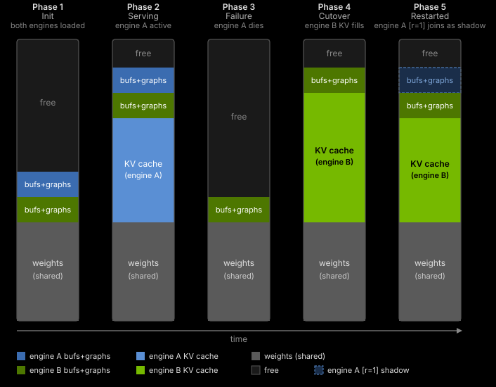
</Frame>

<Info icon="hand-point-up" className="fig-caption">
Weights are allocated once by GMS and mapped by every engine, so they never appear twice. The KV cache moves from the dying engine to the promoted one. Buffers and captured graphs are the only cost a parked engine carries.
</Info>

- **Weights** — allocated once by GMS and mapped read-only by every engine in the worker, never duplicated.
- **KV cache** — held only by the active engine: materialized when it wakes, released when it dies, freeing the region for the shadow to take over.
- **Buffers and graphs** — NCCL buffers, the CUDA context, captured graphs. Held by each engine even while dormant, and the whole of a parked shadow's standing cost.

### Shadow replenishment

After a failover the restarted engine has to re-initialize as the new shadow while the active engine serves with a full KV pool. Graph capture and warmup need valid KV block pointers, but materializing a full pool would exhaust the memory the active engine is using.

Bulwark resolves this with scratch-aliased KV: one ~2 MiB physical chunk mapped at every block virtual address across the full KV range, so every block has a valid pointer to the same chunk. Warmup does not meaningfully use the KV cache, so the conflicting writes to that page are harmless. On promotion, those virtual addresses are remapped to real physical backing — and because CUDA graphs capture virtual addresses rather than physical pages, they replay correctly without recapture.

<Frame caption="Scratch-aliased KV cache">
  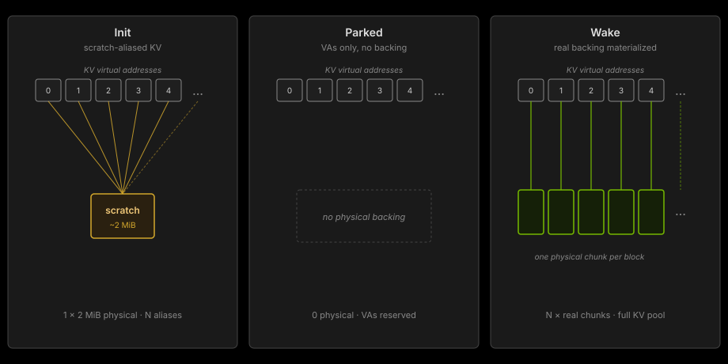
</Frame>

<Info icon="hand-point-up" className="fig-caption">
The three states of a replenishing shadow's KV pool. Aliasing every block onto one scratch chunk gives warmup and graph capture valid pointers for ~2 MiB, and promotion swaps in real backing behind virtual addresses the graphs already hold.
</Info>

---

## Benchmarks

### Setup

We ran three Bulwark Workers serving Kimi-K2.6 quantized to NVFP4 on B200 nodes — one worker per node, eight GPUs each, TP=8, 256K max context, prefix caching on, and MLA prefill running on FlashInfer. The load is a code-agent trace with heavy session-level KV reuse: 100k input tokens and 1k output tokens per request, at concurrency 24.

Both arms run identical engine builds and configuration, so the only difference is the failover feature. The baseline has failover off, and each killed worker cold-restarts. The Bulwark arm has shadow mode on, and each worker pod holds a pre-initialized shadow.

We fired the fault only after the workload reached its steady-state operating point: three engine kills, one per worker, 60 seconds apart. Sixty seconds is well short of a Kimi-K2.6 cold start, so on the baseline arm the third worker dies long before the first has recovered, and the fleet is left with no serving capacity at all.

We classify each request as *working*, *slow* (completed but outside the original SLA of 5 s to first token), or *truly-failed* (returned an error or never completed).

### Results

<table>
<tr><th width="50%">BASELINE — no failover</th><th width="50%">BULWARK — shadow failover</th></tr>
<tr>
<td>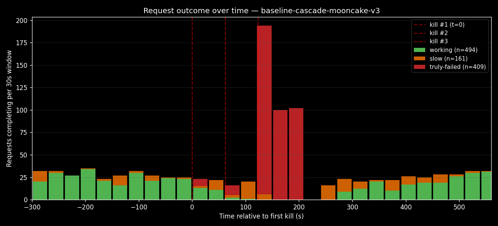</td>
<td>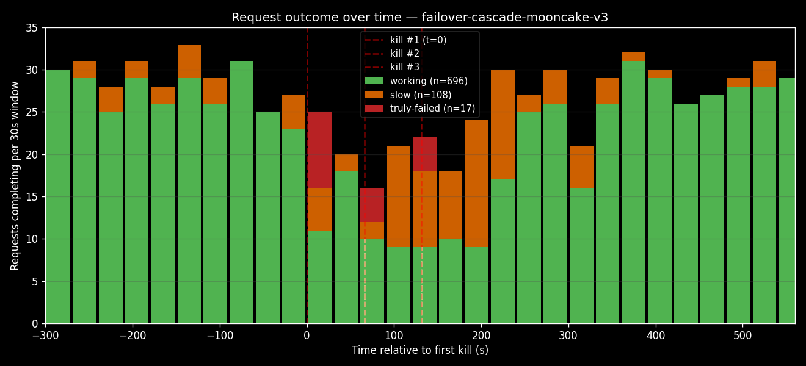</td>
</tr>
</table>

<Info icon="hand-point-up" className="fig-caption">
Request outcomes in 30 s bins. Baseline loses 409 requests and completes nothing for roughly 150 s; Bulwark loses 17 and completes requests in every bin. Note the different y-axes: the baseline peaks near 200 per bin because its failures all land at once, while Bulwark never leaves its normal ~30.
</Info>

<table>
<tr><th width="50%">BASELINE — no failover</th><th width="50%">BULWARK — shadow failover</th></tr>
<tr>
<td>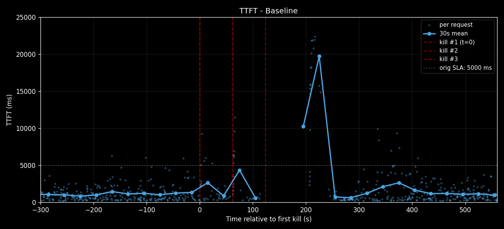</td>
<td>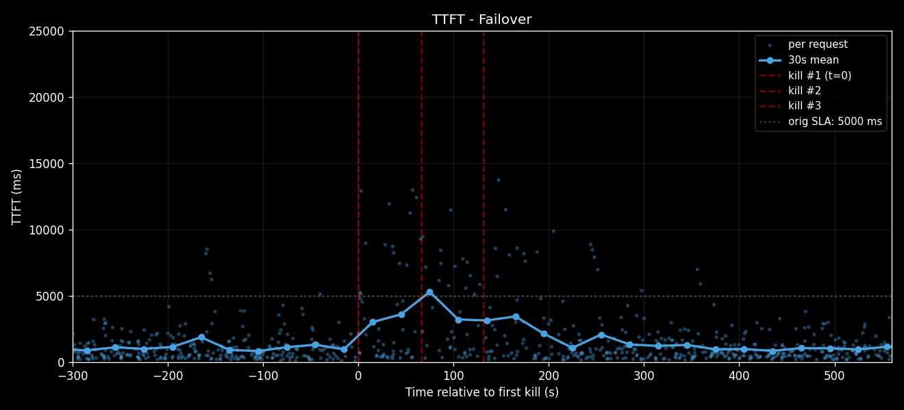</td>
</tr>
</table>

<Info icon="hand-point-up" className="fig-caption">
TTFT per request with a 30 s rolling mean, on a shared 0–25 s axis. The baseline's spike is the recovery, not the failure: the cold-restarted workers come back and inherit the whole queued backlog at once. Bulwark has no backlog to drain, so its worst window sits near the 5 s SLA line rather than four times above it.
</Info>

| Metric | Baseline | Bulwark |
|---|---|---|
| Serving through the cascade | blackout, ~150 s | continuous |
| Truly-failed requests | 409 | 17 |
| Requests completed | 867 | 1,017 |
| Requests inside the original SLA | 699 | 907 |
| TTFT p50 / max | 767 ms / 22,353 ms | 775 ms / 13,747 ms |
| Decode, pre-kill / post-recovery | 67 / 71 tok/s/user | 70 / 67 tok/s/user |

Bulwark turns 409 lost requests into 17 and completes 150 more requests over the same run. We could not measure a steady-state cost for carrying the shadow: across the pre-kill window the two arms differ by 8 ms of TTFT p50 and a few tokens per second per user, inside run-to-run noise for this workload. The shadows do hold buffers and captured graphs on the GPU, but no KV cache and no weights of their own, and at this operating point that footprint does not move latency we can detect.

What changes is the shape of the failure. Without failover, a cascade that outruns cold-start time takes the fleet to zero, and the recovery spike afterwards is worse than the outage itself. With failover, the same cascade is three brief promotions.

---

## Caveats and what's next

Bulwark targets one fault class precisely: an engine process dies while its GPUs, its node, and the weights already resident in GPU memory stay healthy. That is the common case in production, but not every case. It does not help with GPU loss, node loss, or anything needing cross-node recovery — those still take the normal rescheduling and weight-load path. Nor does it diagnose or fix whatever killed the engine; it only makes the recovery cheap. Active and shadow sharing the same GPUs is what makes the weight sharing free, and it is also what bounds the fault class to software failures.

Two limits show up in the benchmark. In-flight requests are not preserved: the 17 failures on the Bulwark arm land in the bins immediately following the kills, which is what losing an engine's in-flight batch looks like at this concurrency. And KV cache state is not carried across the cutover, so the promoted shadow starts cold and rebuilds from traffic. Carrying the prefix-cache index across a promotion is our next piece of work, and it should shrink the post-cutover TTFT bump further. On backends, vLLM is the supported path today, with SGLang and TensorRT-LLM experimental.

To try it: [Shadow Engine Failover](../../developer-guide/knowledge-base/kubernetes/kubernetes-operator/shadow-engine-failover.md) covers the deployment workflow, the [vLLM failover example](https://github.com/ai-dynamo/dynamo/blob/main/examples/backends/vllm/deploy/agg_failover.yaml) is a complete manifest, and the [Kubernetes quickstart](../../kubernetes/getting-started/quickstart.mdx) gets you to a running deployment first. Bulwark is being built in the open in [ai-dynamo/dynamo](https://github.com/ai-dynamo/dynamo) — issues and questions welcome.
