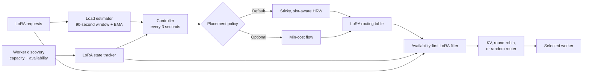
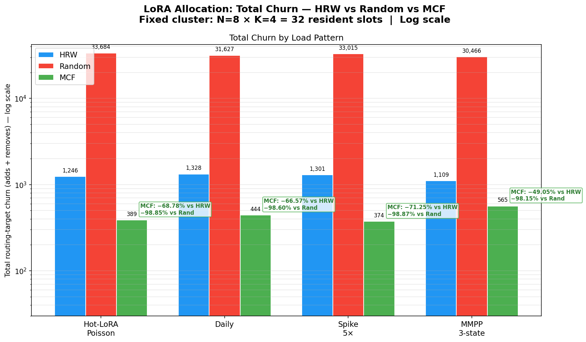
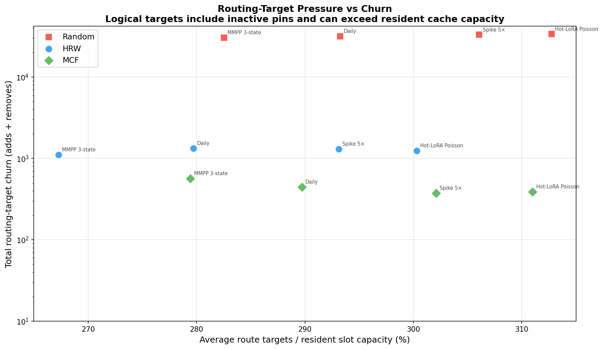
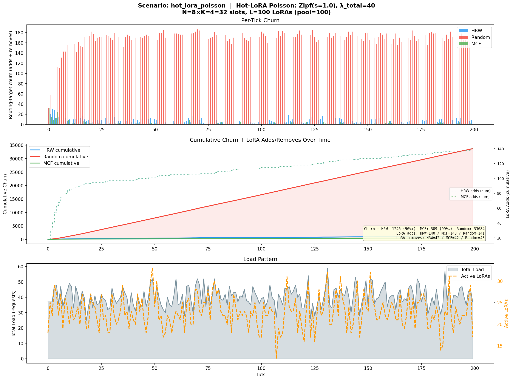
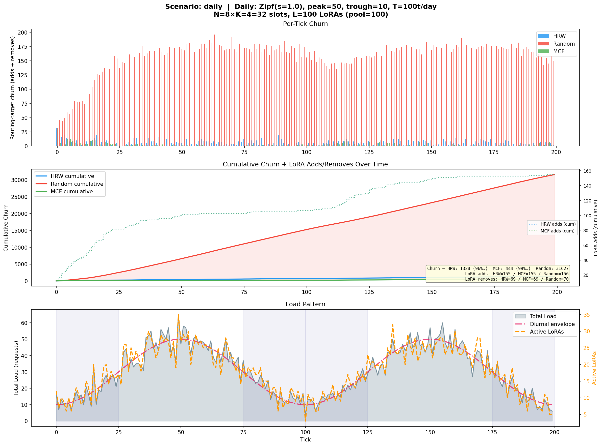
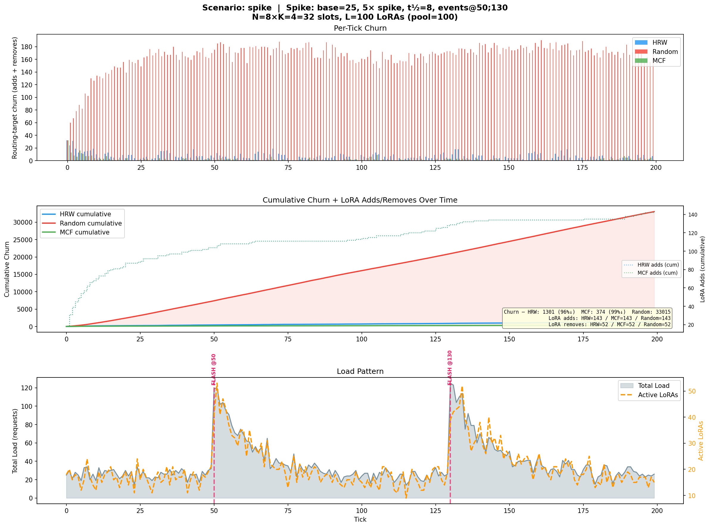
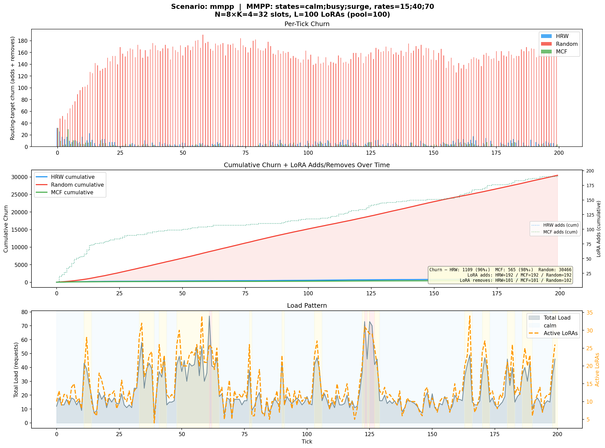

import { BlogStyles } from "@/components/BlogStyles";
import { BlogArticleMeta } from "@/components/BlogArticleMeta";

<BlogStyles />

<BlogArticleMeta
  authors={[{ name: "Biswa Ranjan Panda" }]}
  category="Engineering"
  date="September 8, 2026"
  readTime="11 min read"
/>

Reinforcement learning systems increasingly run several training jobs against one shared inference deployment. The jobs use the same base model but publish different Low-Rank Adaptation (LoRA) adapters, and their traffic changes as rollouts start, finish, and move between training phases. A router that spreads every adapter across every worker turns those changes into repeated adapter loads and evictions.

NVIDIA Dynamo now uses a load-aware control loop to keep that traffic concentrated without statically pinning every adapter. The controller sizes replica sets from recent demand, places them with deterministic Highest Random Weight (HRW) hashing or a global min-cost flow (MCF) solver, and filters each request to the selected workers before the normal routing policy runs.

In a corrected simulation of 100 LoRAs competing for 32 resident slots, the full MCF configuration reduced routing-target churn by **98.1% to 98.9%** and modeled adapter-cache churn by **34.7% to 43.0%** compared with a stateless random baseline that reselected workers every tick. Adapter hit rate increased by **17.5 to 23.8 percentage points**. The distinction between routing churn and physical adapter churn matters: MCF reduced mean route churn by another **64.4%** relative to HRW, but reduced modeled adapter-cache churn by only another **2.6%**.

This post explains the mechanism stack, the corrected measurement model, and what the results mean for multi-LoRA inference.

## Routing, Placement, and Residency

Four related states appear in the production design and simulation:

| State | Meaning | Owner |
|---|---|---|
| Lifecycle state | Which workers know about an adapter and can serve it | Worker lifecycle APIs and the deployment orchestrator |
| Desired placement | Which workers the frontend prefers for requests to an adapter | `LoraController` and `LoraRoutingTable` |
| Backend-reported availability | Which adapters workers report as registered or loaded | Worker model cards and `LoraStateTracker` |
| Simulated residency | Which adapters the benchmark's LRU cache model holds | `ResidencyModel` in the simulation harness |

The desired replica set is a routing decision, not an imperative load or unload command. Dynamo's frontend does not reconcile `LoraRoutingTable` entries into worker lifecycle calls. Workers publish adapter availability and capacity state through discovery, and each frontend uses that state when it computes and filters routes. Availability does not always prove physical engine residency: for example, a vLLM prefill worker can publish an adapter after registering its metadata and activate it lazily when a request arrives.

This separation lets the request path stay fast and keeps lifecycle ownership with the orchestrator. It also bounds the current claim: load-aware placement controls where requests go, while the backend decides whether a routed request requires physical adapter activation, loading, or eviction.

## The Closed-Loop Design

The controller connects traffic measurement, worker discovery, placement, and request routing through shared in-process state.



Each request contributes to a per-LoRA arrival-rate signal. Every three seconds, the controller reads that signal alongside worker capacity and backend-reported availability, computes a new desired placement, and updates the routing table. The filter then narrows the candidate workers for subsequent requests. Existing KV-aware or load-balancing logic chooses the final worker from that smaller set.

Each frontend owns an endpoint-scoped copy of this state. HRW and MCF sort their inputs and make deterministic decisions, so frontends with the same discovery, load, configuration, and prior-state inputs compute the same placement. Router replica synchronization improves the shared active-request view on a best-effort basis; it does not replicate the routing table or establish a leader.

## The Improvement Stack

The final behavior comes from several mechanisms. The benchmark in this post compares complete Random, HRW, and MCF configurations; it does not isolate every mechanism as an independent experimental arm. The layers below explain the design, while the results attribute measured deltas only to the configurations that were actually run.

### Windowed Load Instead of Instantaneous Load

An instantaneous in-flight count misses short requests that start and finish between controller ticks. Per-tick counts also make a long-tail adapter appear and disappear whenever a Poisson draw reaches zero.

Dynamo records arrivals in a bucketed sliding window and smooths the signal with an exponential moving average (EMA). The default three-second controller interval and 30-times window multiplier produce a 90-second history. Brief gaps no longer turn active adapters into cold adapters, while sustained demand changes still alter their share of the placement budget.

### Demand-Proportional Replica Sizing

Static pinning prevents scatter but cannot respond when one training run becomes hot. The controller computes each active LoRA's share of recent demand and turns that share into a replica count. It caps the count at the worker count and, when the raw counts exceed the cluster's reported slot budget, normalizes them down to that budget with the largest remainder method.

Hot adapters can therefore use several workers, while cold adapters consume fewer routing targets. When the number of active LoRAs exceeds the available slot budget, the controller preserves a bounded route for overflow demand instead of scattering it across the fleet.

### Sticky, Capacity-Aware HRW Placement

The default placement policy uses rendezvous hashing, also called Highest Random Weight hashing. For each adapter, Dynamo ranks workers from the adapter name and worker identity. Equal inputs produce equal rankings without a central coordinator.

The allocator skips workers whose reported LoRA slots are full and retains valid workers from the previous replica set before filling new targets. That stickiness avoids movement when demand changes but a previous worker remains a valid choice. HRW also limits disruption when workers join or leave because unrelated rankings remain stable.

### Availability-First Request Filtering

Placement only affects backend locality when requests follow it. `LoraFilter` intersects the desired replica set with available workers and backend-reported adapter locations. For an active adapter, it prefers workers that are both desired and report the adapter as available. If none do, it returns the desired replica set so the backend can activate or load on demand. This is an availability signal, not a guarantee that the adapter is physically resident in every backend engine.

Inactive adapters keep one deterministic HRW pin. A first request therefore goes to one worker instead of creating a cold-start fan-out. If the pin disappears, the filter first looks for another worker reporting the adapter as available and otherwise chooses one bounded HRW fallback.

### Scale-Down Hysteresis

Replica growth happens immediately so rising demand can spread. Replica reduction waits for a configurable number of controller ticks. The default three-tick cooldown prevents short dips from removing a route that the next tick would restore.

Hysteresis complements the rate window: the estimator filters request noise, while the cooldown filters allocation noise after the desired replica count changes.

### Global MCF Optimization

HRW places one adapter at a time. The optional MCF policy solves the cluster assignment as one capacity-constrained graph. Its edge cost combines three signals:

- Prefer workers with a high HRW rank.
- Penalize a new adapter-to-worker assignment.
- Reward retaining an existing assignment.

The solver includes previous hosts in each adapter's candidate set and freezes unaffected assignments during delta solves. It uses a high-cost overflow node when requested logical replicas exceed available slots, keeping infeasibility visible without failing the entire control tick.

MCF targets global stability. The results show that it delivers that stability at the routing-table level, while backend cache behavior determines how much of the logical win becomes fewer physical swaps.

## How the Simulation Measures the Request Path

The original simulation measured changes in desired replica sets and called them adapter churn. It also ran 200 logical ticks without advancing time, which prevented the sliding window from expiring naturally. Those choices could make placement look either artificially stable or artificially noisy.

[PR #13758](https://github.com/ai-dynamo/dynamo/pull/13758) corrected the harness in four ways:

1. A virtual clock advances three seconds per tick, which exercises the production 90-second load window and EMA behavior.
2. Simulated requests pass through the production `LoraFilter` path.
3. Each worker has a capacity-bounded least recently used (LRU) adapter cache. A request to a worker without the adapter records a load; a miss on a worker already holding four adapters evicts the least recently used one.
4. The export separates routing-target churn, adapter-cache churn, cache hit rate, occupancy, load balance, solve time, and overflow.

The harness drives `LoraStateTracker` from the synthetic LRU model, so backend-reported availability and simulated residency are identical by construction. It does not model the gap between metadata registration and engine activation that can occur on a vLLM prefill worker.

The comparison uses eight workers, four resident adapter slots per worker, 100 LoRAs, 200 controller ticks, a three-second timestep, a three-tick scale-down cooldown, and seed 42. It exercises four traffic patterns:

- **Zipf and Poisson:** skewed popularity with a long adapter tail.
- **Daily:** a smooth day-and-night demand envelope.
- **Traffic spikes:** two five-times flash-crowd events with exponential decay.
- **Markov-modulated Poisson process (MMPP):** abrupt transitions among calm, busy, and surge regimes.

Random receives the same demand-derived replica budget and load window as HRW and MCF, but selects workers independently on each tick. It is a stateless simulation baseline, not Dynamo's production default.

These are deterministic, single-seed simulation results regenerated from [`53ced98cd1`](https://github.com/ai-dynamo/dynamo/commit/53ced98cd1e3ed30297b50e53298f91227b71fa0), the `main` revision used for this analysis. Reproduce the data with `cargo test -p dynamo-llm --test lora_simulation -- test_export_csv --ignored --nocapture`, then inspect `target/lora_sim_csv/v2/summary.csv`. To generate every figure, install Matplotlib and NumPy in the active environment and run `python lib/llm/tests/lora_simulation/plot_lora_churn.py --save`. These results validate relative software behavior under a controlled residency model. They do not measure GPU load latency, Time To First Token (TTFT), throughput, or end-to-end training time.

## Results

Two metrics capture different parts of the system:

- **Routing-target churn** counts worker additions and removals in desired replica sets. Lower values mean a more stable routing plan.
- **Adapter-cache churn** counts modeled adapter loads and LRU evictions on the workers selected by actual requests. Lower values mean less physical cache movement in the simulation.

The following table averages the four workload totals. Each percentage compares that row with the stateless baseline unless the cell names another row.

| Configuration | Mean Route Churn | Mean Adapter Churn | Mean Hit Rate | Change vs Baseline |
|---|---:|---:|---:|---|
| Stateless Random baseline | 32,198 | 6,866 | 46.9% | Baseline |
| Sticky, slot-aware HRW configuration | 1,246 | 4,356 | 66.5% | 96.1% less route churn, 36.6% less adapter churn, +19.6 points hit rate |
| Global MCF configuration (replaces HRW) | 443 | 4,244 | 67.4% | 64.4% less route churn and 2.6% less adapter churn than HRW; 98.6%, 38.2%, and +20.4 points versus baseline |

Percentage and point changes use unrounded workload values; displayed averages are rounded independently.



*Figure 1. Total desired routing-target churn across the four workloads. The logarithmic axis keeps all three configurations visible.*

MCF's final improvement over the stateless baseline remained consistent across all four traffic patterns:

| Workload | Route Churn Reduction vs Baseline | Adapter Churn Reduction vs Baseline | Hit-Rate Increase vs Baseline | MCF Route Reduction vs HRW | MCF Adapter Reduction vs HRW | MCF Hit-Rate Increase vs HRW |
|---|---:|---:|---:|---:|---:|---:|
| Zipf and Poisson | 98.8% | 37.9% | +19.7 points | 68.8% | 3.1% | +1.0 points |
| Daily | 98.6% | 38.9% | +20.8 points | 66.6% | 3.6% | +1.2 points |
| Traffic spikes | 98.9% | 34.7% | +17.5 points | 71.3% | 1.4% | +0.5 points |
| MMPP | 98.1% | 43.0% | +23.8 points | 49.1% | 2.3% | +0.7 points |

### Stable, Capacity-Aware HRW Delivers Most of the Measured Gain

Moving from stateless random placement to HRW removed an average of 96.1% of routing-target changes. More importantly, modeled adapter churn fell 36.6% and hit rate rose from 46.9% to 66.5%. The cache stayed almost full in every arm, so the gain came from keeping the right adapters resident in the synthetic LRU model, not from using more capacity.

Random and HRW share the same load estimator, demand-derived replica budget, production request filter, and synthetic cache model in this experiment. The measured delta therefore reflects the complete HRW controller configuration: deterministic sticky, capacity-aware placement together with scale-down hysteresis and warm-route retention, compared with per-tick random selection under the same replica budget. It does not independently quantify load estimation, filtering, or hysteresis. A hardware benchmark still needs to translate the modeled cache reduction into TTFT and throughput.

### MCF Stabilizes the Plan More Than the Cache

Switching from the HRW allocator to MCF reduced routing-target churn by another 49.1% to 71.3%, depending on workload. The same change reduced modeled adapter churn by 1.4% to 3.6% and raised hit rate by 0.5 to 1.2 percentage points.

This is not a contradiction. A route-set change does not always cause a cache miss, and a stable route cannot prevent eviction when 100 adapters compete for 32 resident slots. In the simulation, warm-first filtering and the worker LRU cache absorb many logical changes before they become physical movement. MCF still provides a substantially calmer desired-placement surface, which becomes more valuable when adapter load cost is high, topology changes are frequent, or an external lifecycle controller acts on placement decisions.

### Saturation Makes Zero Churn Unrealistic

Mean occupancy stayed between 98.8% and 99.8%. Every workload asked a 32-slot cluster to serve a 100-adapter catalog, and the MCF solver reported soft overflow in every workload. Under that pressure, every algorithm recorded adapter movement on nearly every tick.

The useful result is therefore not a claim of churn-free operation. It is the reduction in cache movement and the increase in hits while the cache remains saturated.



*Figure 2. Desired routing-target pressure versus routing-target churn. The target count includes inactive cold-start pins, so values above 100% do not imply simultaneous adapter residency or measured GPU occupancy.*

## Workload Traces

The aggregate values hide when movement occurs. Each dashboard below shows per-tick desired routing-target churn, cumulative desired routing-target churn, and the generated demand trace. These figures do not show physical adapter loads or evictions; those remain the separate adapter-cache metrics reported in the tables above.

### Zipf and Poisson



*Figure 3. A skewed popularity distribution keeps a few adapters hot while a long tail appears intermittently.*

### Daily Traffic



*Figure 4. Two smooth day-and-night cycles test whether placement follows sustained demand without reacting to every short dip.*

### Traffic Spikes



*Figure 5. Two flash-crowd events test placement response and recovery after abrupt load increases.*

### Markov-Modulated Poisson Process



*Figure 6. Correlated regime changes test stability during steady states and movement at abrupt transitions.*

## Operating the Feature

Set `DYN_LORA_ENABLED=true` to enable LoRA request handling. Allocation defaults to enabled with HRW; to select MCF, set the algorithm explicitly:

```bash
export DYN_LORA_ENABLED=true
export DYN_LORA_ALLOCATION_ALGORITHM=mcf
```

Keep the default three-second timestep, 90-second effective window, EMA smoothing, and three-tick scale-down cooldown as a starting point. Tune them only against measured traffic: a shorter window reacts faster but follows more noise, while a longer cooldown retains replicas longer after demand falls.

Monitor `dynamo_frontend_lora_replica_factor{endpoint,lora}`, `dynamo_frontend_lora_estimated_load{endpoint,lora}`, and `dynamo_frontend_lora_active_requests{endpoint,lora}`. When using MCF, also monitor `dynamo_frontend_lora_churn_loads_total{endpoint}`, `dynamo_frontend_lora_churn_unloads_total{endpoint}`, and `dynamo_frontend_lora_overflow_count{endpoint}`. The MCF churn gauges count changes to desired placement, not physical adapter loads or evictions on workers. Use the [LoRA adapter operations guide](../../kubernetes/operations/lora-adapters.md) for lifecycle configuration and the [router operations guide](../../developer-guide/knowledge-base/modular-components/router/router-operations.md) for frontend replica synchronization behavior.

## Current Boundary and Next Measurements

The routing table remains frontend-local and advisory. It does not expose a public desired-placement API or issue worker load and unload commands. `DynamoModel` currently registers an adapter across the discovered base-model endpoints; on vLLM, decode and aggregated workers preload it, while prefill workers register metadata and activate it lazily. Load-aware routing still bounds request scatter, but sparse lifecycle reconciliation requires additional control-plane work.

The next experiments should extend the evidence in four directions:

- Run the Random, HRW, and MCF comparison across multiple seeds and report confidence intervals.
- Add a full ablation that isolates windowing, EMA, filtering, stickiness, and hysteresis.
- Add and remove workers during a run to measure hit-rate recovery and HRW disruption bounds.
- Measure adapter-load latency, TTFT, throughput, and training rollout time on GPU workers.

The corrected results make the design tradeoff clearer. Under a shared load estimator, request filter, and synthetic cache model, stable capacity-aware HRW placement delivers most of the measured adapter-cache gain. Replacing HRW with MCF adds a much more stable global placement plan. Keeping routing targets, backend-reported availability, and lifecycle state separate lets Dynamo use both allocators without turning the request path into a distributed reconciliation protocol.
