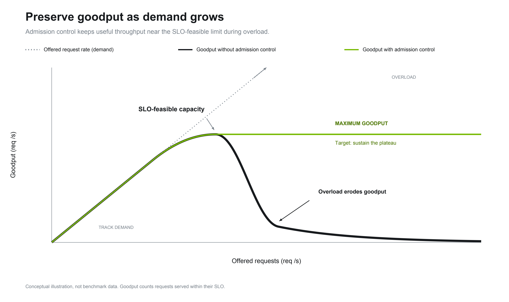
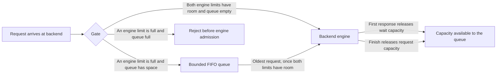

NVIDIA Dynamo admission control aims to sustain useful work as offered load grows. The current
implementation places an admission gate before the backend engine, with two engine limits and a
bounded first-in, first-out (FIFO) queue.

For deployment instructions, see [Admission Control on Kubernetes](../../../../kubernetes/fault-tolerance/admission-control.md).

## Goal

Goodput is the rate of requests served within their service-level objective (SLO). When offered load
exceeds the engine's capacity to meet that objective, accepting more work can increase contention,
lengthen waits, and reduce goodput even while the engine remains busy.

Admission control keeps excess work outside the engine and admits work as capacity becomes available.
The goal is to sustain goodput near the engine's SLO-feasible capacity as demand continues to rise.

This graph illustrates the goal; it is not benchmark data or a guarantee for every workload.

## Backend

### Gate Placement and Request Flow

Each backend worker process has one admission gate immediately before requests enter its engine.
The gate shares its limits and queue across the process's endpoints. Backend workers have independent
gates, including separate prefill and decode workers in a disaggregated deployment.

The gate tracks two kinds of engine capacity for each admitted request, one per limit:

| Limit | Bounds | Held from | Released at |
|---|---|---|---|
| Engine request limit | Admitted requests that have not finished | Admission | The end of the response stream |
| Engine wait limit | Admitted requests still awaiting their first engine response | Admission | The first engine response |

A request enters the engine only when both limits have room, and the gate reserves both kinds of
capacity together. The first response is the first item the gate observes in the engine's response
stream, whatever it carries; it does not need to contain a token. Returning a stream object alone is
not a response. After its first response, a request keeps its request capacity while the stream
continues, so the requests awaiting a first response are always a subset of the unfinished requests.

If a request fails, ends without a response, or is cancelled or dropped, the gate releases whatever
capacity it still holds during cleanup. A request cancelled or dropped after its first response
releases only its request capacity, because its wait capacity is already released.

When either limit is full, the gate places the request in its bounded FIFO queue. Queued requests hold
no engine capacity. A new arrival cannot bypass an older queued request: capacity released by a first
response or a finished request goes to the oldest queued request once both limits have room. A first
response therefore admits a queued request only if the request limit also has room. When the queue is
full, the gate rejects the new request before it enters the engine. A queued request leaves the queue
only when it is admitted or when the gate receives its cancellation signal; queue wait time has no
limit.

### Configuration

Set these on the backend worker process. They are read when the gate is created; restart the worker
process to change them.

| Setting | Environment variable | Also configured by | Default | Behavior |
|---|---|---|---|---|
| Engine request limit | `DYN_BACKEND_ADMISSION_ENGINE_REQUEST_LIMIT` | `--engine-request-limit`; legacy `DYN_ENGINE_REQUEST_LIMIT` | `10000` | Maximum admitted requests that have not finished. Accepts a positive integer. |
| Engine wait limit | `DYN_BACKEND_ADMISSION_ENGINE_WAIT_LIMIT` | None | `10000` | Maximum admitted requests still awaiting their first engine response. Accepts a positive integer. |
| Request queue limit | `DYN_BACKEND_ADMISSION_REQUEST_QUEUE_LIMIT` | Legacy `DYN_DYNAMO_REQUEST_QUEUE_LIMIT` | `40000` | Maximum requests waiting in the gate queue. Accepts a non-negative integer; `0` disables queueing, so a request that cannot be admitted immediately is rejected. |

The CLI flag and legacy aliases configure the same settings; they are not separate controls. An
explicit `--engine-request-limit` takes precedence over both engine request limit variables, and each
canonical variable takes precedence over its legacy alias. Without any of them, the setting uses its
default. The gate skips an invalid value, logs a warning, and uses the next source in that order. A
valid canonical value is used without reading its legacy alias. A worker that accepts
`--engine-request-limit` rejects a flag value that is not a positive integer at startup.

Both engine limits are fixed for the life of the worker process. The gate does not derive or resize
them from `max_num_seqs`, `data_parallel_size`, model registration, or any capacity a model reports.
The worker logs the effective values once, in its `Backend admission gate created` message.

### Best Practices

**Treat the defaults as safety bounds.** The defaults do not depend on the engine: `10000` for each
engine limit and `40000` for the queue. With them, the gate holds work back only at very high
concurrency, and the engine's own scheduler queues requests beyond its batch capacity.

**Set the engine limits explicitly to keep excess work outside the engine.** The engine's
`max_num_seqs` bounds how many sequences each data-parallel rank processes in an iteration. Admitting
more requests than the engine can process adds waiting work inside the engine without adding processing
capacity. To hold that work in the gate queue instead, where it uses no engine resources, set the
engine request limit to the number of requests the engine should run concurrently, and use the engine
wait limit to bound how many of them can wait for a first response at the same time.

**Size the queue for the bursts you expect.** Queued requests wait without a time limit, so a deeper
queue absorbs longer bursts at the cost of longer waits before admission. Set the queue limit to `0`
to reject requests whenever an engine limit is full.

### Metrics

The backend worker exposes the following metrics at its metrics endpoint. Counts apply to that
worker's gate.

| Metric | Type | Meaning |
|---|---|---|
| `dynamo_backend_admission_engine_request_count` | Gauge | Admitted requests that have not finished, including requests that have already produced their first response. |
| `dynamo_backend_admission_engine_wait_count` | Gauge | Admitted requests still awaiting their first engine response. Always a subset of the engine request count. |
| `dynamo_backend_admission_request_queue_count` | Gauge | Requests waiting in the gate queue. Queued requests count toward neither engine count. |
| `dynamo_backend_admission_request_receive_total` | Counter | All requests received by the gate, counted once on entry, including requests already cancelled. No admission-path label. |
| `dynamo_backend_admission_request_admit_total` | Counter | Requests passed into the engine. Label `source="direct"` means no gate queue wait; `source="queue"` means admitted after queueing. |
| `dynamo_backend_admission_rejection_total` | Counter | Requests rejected before engine admission because an engine limit was full and the queue had no space. No labels. |
| `dynamo_backend_admission_cancellation_total` | Counter | Requests cancelled before engine admission, either on arrival or when cancellation reaches the gate while queued. |

The limits are configuration rather than state, so the gate does not export them as metrics.

The admission counter advances at engine handoff, not when a request joins the queue or is offered
capacity. An engine failure or cancellation after handoff does not undo that count. Cancellation
before admission is counted separately from rejection.

Compare each engine count with its configured limit to see which limit holds work back, and watch the
queue count for a growing backlog. Compare received and admitted rates with rejections and
client-visible goodput when tuning under load.

## Router

Router admission control is planned for future work.
