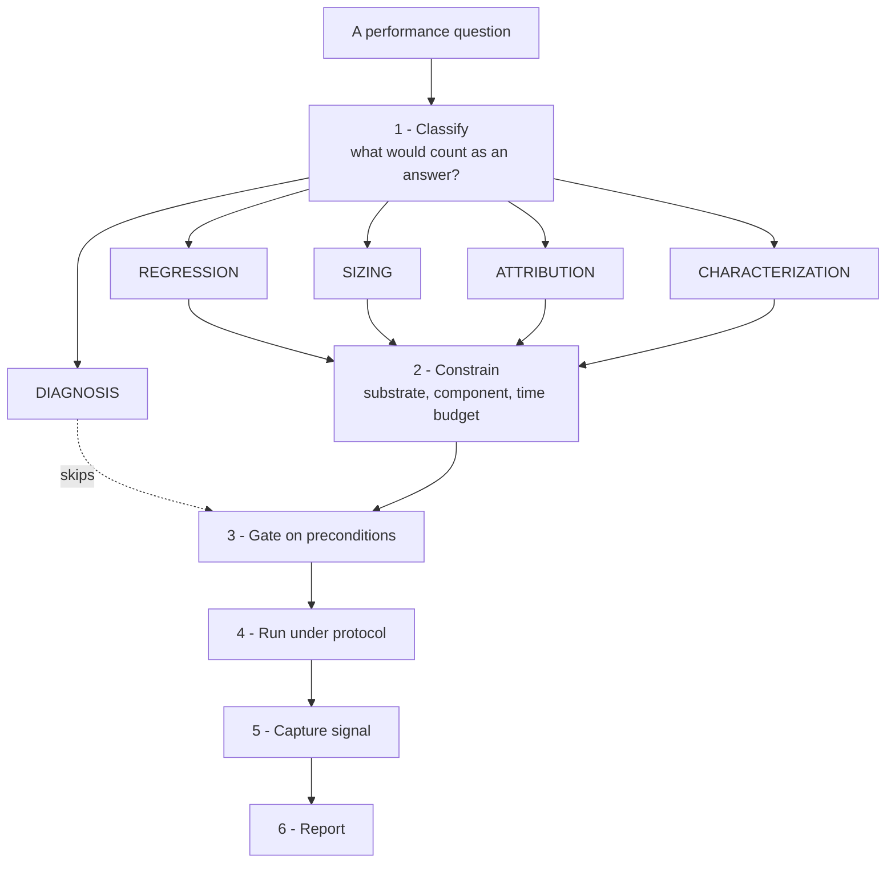

Dynamo has many performance tools. This page covers what is true regardless of which one you pick: what must hold before a measurement counts, how to run it so the result is stable, how to compare two revisions, and what a quotable result must state.

Substrate-specific tool selection lives in the Operations guides. This page owns the method.

> [!NOTE]
> This page names no commands and no thresholds. Each tool's flags live in that tool's own documentation, and each harness's counts live in that harness. Naming them twice guarantees they diverge.

## The procedure

Classification is interpretation of intent and picks the family of tool. The constraints are facts about your environment and pick which member of that family. Keep them separate: the same request, "benchmark the router", is a different job depending on whether you want a number for a report or a verdict on a change you made.

| Class | The question | A finished answer looks like |
| --- | --- | --- |
| Regression | Did my change slow things down? | A paired comparison with a stated interval |
| Sizing | How many GPUs, which parallelism? | A configuration plus the curve behind it |
| Attribution | Where is the time going? | A named function, stage, or component |
| Characterization | What is the throughput of X? | A number with its workload and concurrency |
| Diagnosis | Why is this slower than expected? | A root cause, or a violated precondition |

Diagnosis does not start with a benchmark. It starts at the preconditions below. Benchmarking a misconfigured deployment produces a number that describes the misconfiguration.

## Preconditions

Verify these before a measurement counts. Each is owned elsewhere; this is the checklist, not the procedure.

- The endpoint passes a single-request smoke test.
- For disaggregated serving, the KV transport is on the intended path. A silent fallback to a slower transport turns a transport problem into a fictitious performance characteristic.
- The router is in the mode you believe it is in. KV-aware routing degrades to approximate matching when workers do not publish KV events.
- Nothing else runs on the machine. A concurrent build steals cores and invalidates the run.
- The load generator is not itself the bottleneck. Client-side tokenization and stream management are expensive; if the client and server share cores, a throughput ceiling may belong to the client.
- The first run after a fresh build is a cold-start outlier. Discard it.

> [!IMPORTANT]
> A closed-loop client at fixed concurrency measures concurrency divided by latency, not the server's maximum throughput. A single concurrency point is not a saturation measurement. To find saturation, sweep concurrency and look for the knee.

## Run protocol

Six invariants. Concrete counts belong to whichever harness you are running.

1. Tear down fully between runs. Router and cache state accumulates across runs and inflates later ones.
2. Warm up before the measured phase.
3. Run more than once. A single sample has no error bar.
4. Compare medians, not means. A cold first run drags a mean.
5. Interleave arms. Run A, B, A, B rather than all of A then all of B, so drift affects both equally.
6. Change one variable per comparison.

## A/B design

For comparing two revisions, the design that holds up is: **paired** runs, with **arm order randomized within each pair**, compared by a **distribution-free interval on the median ratio** against an equivalence threshold, where an interval that straddles the threshold is **inconclusive and blocks the claim** rather than passing it.

Dynamo has one fully worked instance of this design, in the offline KV replay parity workflow. Follow that design. Do not transplant its constants: they are calibrated to a fast, deterministic, single-process workload that yields one elapsed value per run, which is what makes a large sample affordable and what licenses attributing the difference to overhead.

> [!WARNING]
> No equivalent procedure exists for request-level distributions, where the unit of analysis is the request rather than the run. Questions of the form "did p99 time to first token get worse under load" are not covered by the design above, and the repository has no rigorous substitute. Treat conclusions there as provisional and say so.

## What to capture during a run

Choose by the question, not by availability.

| You want to know | Capture |
| --- | --- |
| Where latency accumulates within a request | Per-request stage traces, converted to a timeline view |
| Which component along the path is slow | Prometheus metrics for stage duration and queue depth |
| Where CPU time goes inside a process | On-CPU profile and flame graph |
| What blocked threads are waiting on | Off-CPU profile |
| Whether the deployment is healthy at all | Dashboards and worker health, before anything else |

See [Observability Architecture](observability-architecture.md) for how these signals are transported, and the observability reference for the metric and environment-variable catalogs.

## Simulation is for ranking, not for numbers

Simulation-based tools answer sizing questions cheaply and without GPUs. They report computed values, not measurements.

The default timing model is an uncalibrated synthetic baseline. Several paths are not modelled at all, including multimodal encoder compute and some disaggregation and cache-offload movement. No calibration harness exists, so the difference between a simulated figure and hardware is undocumented.

Use simulation to rank candidates under one frozen configuration, then validate the winner on hardware. Never quote a simulated figure as a measured one. See [Simulation Model](../../../cli/operations/simulation-with-dynosim/simulation-model.md) for the fidelity boundaries.

## Reporting

Cross-configuration performance claims published in this repository carry a machine-checked contract: the claim under test, the hardware, the traffic definition, and every arm bound to the deployment and benchmark manifests that produced it. Follow that contract, and state which of the preconditions above you verified.

The contract covers what was run. It does not cover how well it was measured, so add:

- how many times each arm ran;
- the spread across those runs, not just the central value;
- whether arms were interleaved;
- for a simulated result, that it is simulated.

A figure without a sample count and a spread is a single observation. That may be enough when the effect is large and the mechanism is understood, but the reader can only tell if you say so.
