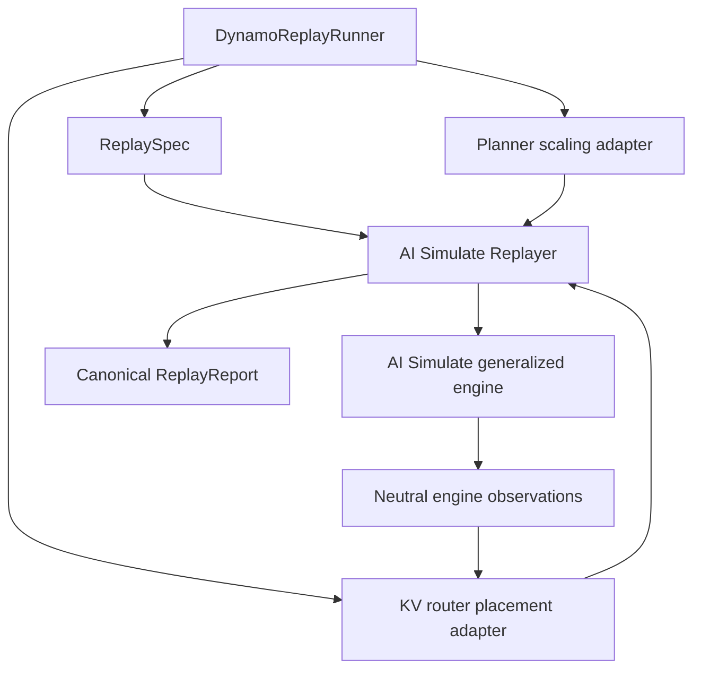
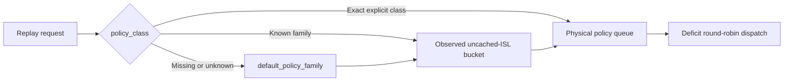

Dynamo composes KV router placement, Planner scaling, and online-runtime behavior around the
AI Simulate Replayer and generalized engine. AI Simulate remains responsible for deterministic
virtual time, logical workers, scheduler behavior, KV-cache accounting, timing, and canonical
reports.

For the neutral replay loop, see [AI Simulate Replayer Architecture](../../modular-components/ai-simulate-experimental/replayer-experimental/architecture.md).
For shared engine internals, see [AI Simulate Engine Architecture](../../modular-components/ai-simulate-experimental/engine-experimental/architecture.md).

## Composition Boundary

`DynamoReplayRunner` materializes Dynamo runtime hooks from the serializable `ReplaySpec`. It injects
those hooks through `ReplayComposition`; AI Simulate does not import Router or Planner types.

The `python -m dynamo.replay` command composes the
[AI Simulate base arguments](../../modular-components/ai-simulate-experimental/replayer-experimental/cli-reference.md)
with Dynamo-only options. Use [Dynamo Replay CLI Reference](../../../../reference/components/dynosim-replay-cli-reference.mdx)
for the extension arguments.

## KV Router Placement

KV router replay uses an in-process indexer, worker queues, and routing lifecycle state over the
logical engine workers. The adapter converts neutral engine KV observations into the event batches
consumed by Dynamo's existing placement policy.

The adapter observes request admission, prefill completion, cache changes, and sequence release.
Queueing and policy decisions use replay time rather than wall time. No background indexer task or
distributed event plane runs in offline mode.

Policy-class replay uses the same policy-family and cache-bucket model as the live router:

The CLI loads the startup-only policy YAML and selects an exact model profile when `--model-name` is
set. A recognized family combines with the router-observed uncached Input Sequence Length (ISL)
bucket. An exact explicit class bypasses bucketing.

## Planner Simulation Adapter

Planner-in-the-loop replay supplies traffic observations from the Replayer instead of Prometheus. On
each Planner traffic tick, the adapter reports:

| Replay metric | Planner meaning |
|---|---|
| `num_req` | Completed requests in the observation window |
| `avg_isl` / `avg_osl` | Mean raw input and output lengths |
| `avg_kv_hit_rate` | Mean router prefix-cache hit rate at admission |
| `avg_accept_length` | Mean visible output tokens per decode request-forward |

KV hit rate and speculative accept length use last-value semantics. Missing accept-length samples
preserve the previous valid value. Without valid speculative-decoding metadata, the effective accept
length is `1.0`.

Planner scaling decisions become deterministic replay events. Scale-up creates logical workers after
the configured startup delay; scale-down removes eligible workers at a settled event boundary. The
adapter records scaling events and Planner diagnostics alongside the canonical replay report.

The simulation adapter cannot infer GPU count from a deployment. Set `prefill_engine_num_gpu` and
`decode_engine_num_gpu` explicitly when cumulative GPU-hours are part of the analysis.

## Router-Side AI Configurator Modeling

Dynamo can use NVIDIA AI Configurator in two independent locations:

- engine-args fields select AI Configurator as the generalized engine's timing provider
- top-level `--aic-*` flags configure Router-side prompt-load estimation

The first path changes simulated pass duration. The second changes placement scoring. Keeping the
paths separate supports experiments that vary Router estimates without changing engine timing.

## Offline and Online Execution

Offline execution injects Router and Planner policies into the AI Simulate Replayer. It does not
start a frontend, worker processes, etcd, NATS, or HTTP transport.

Online execution uses Dynamo's live replay path. It starts simulated workers and includes worker
registration, request transport, event publication, and runtime coordination. The generalized engine
still supplies inference scheduling and timing, but Dynamo owns the clock and runtime effects.

Use offline execution for deterministic configuration comparison. Use online execution when an
experiment must exercise Dynamo runtime integration.

## Related Documentation

- [Run a DynoSim Simulation](../../../../cli/operations/simulation-with-dynosim/dynosim-replay.mdx)
- [Benchmark Planner Decisions](../../../../kubernetes/operations/simulation-with-dynosim/dynosim-planner-replay.mdx)
- [Live Mocker Architecture](../../modular-components/backends/mocker/mocker-engine-architecture.md)
