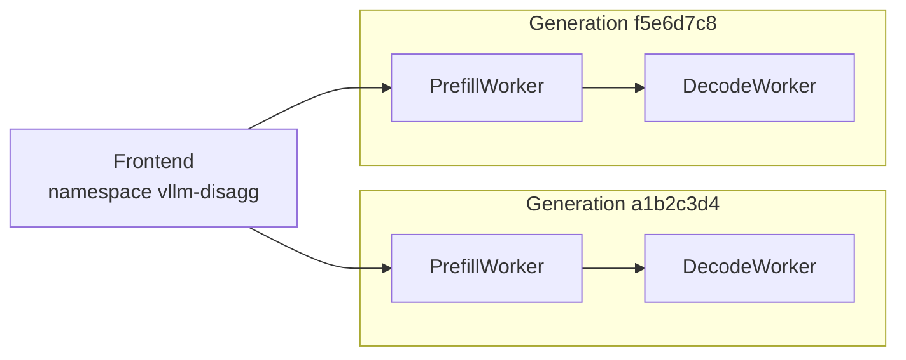
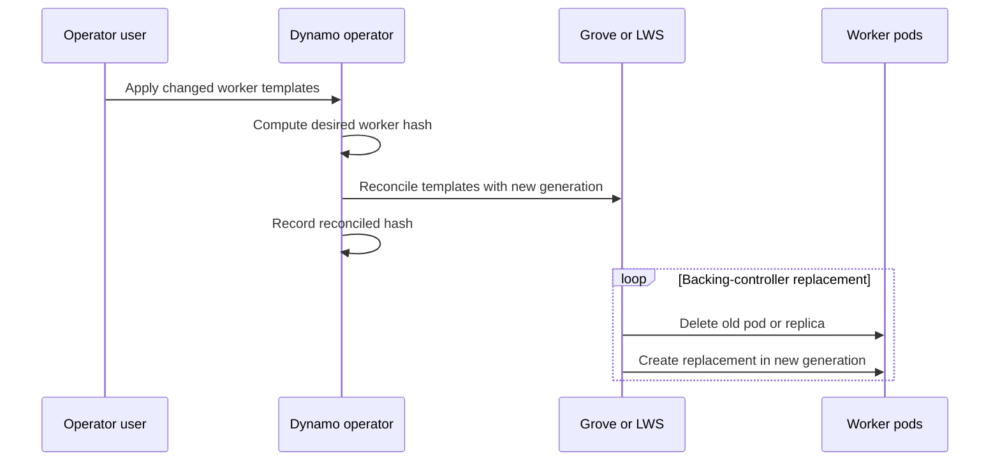

NVIDIA Dynamo groups cooperating workers into generations so a deployment can replace worker configurations without mixing incompatible prefill and decode peers. Frontends update independently and discover the worker generations that are serving. This page covers frontend replacement and worker generations for components with `type: worker`, `type: prefill`, or `type: decode`.

For the operator procedure, see [Rolling Updates](../../../../kubernetes/operations/rolling-updates.mdx). For annotation names, defaults, and status fields, see the [DGD Reference](../../../../reference/kubernetes-api/dynamo-graph-deployment.mdx#rolling-update-controls).

## Overview

### Responsibilities

The Dynamo operator derives the desired worker generation from a `DynamoGraphDeployment` (DGD). The backing resource determines how pods are replaced:

| Backing resource | Used for | Replacement owner |
|---|---|---|
| Kubernetes Deployment | Single-node workers without Grove | Dynamo's managed worker rollout reconciler coordinates old and new `DynamoComponentDeployments` (DCDs). |
| Grove PodCliqueSet | Workers using Grove | Grove updates the existing PodCliqueSet's pods. |
| LeaderWorkerSet (LWS) | Multinode workers without Grove | LWS updates the existing LeaderWorkerSet's replicas. |

Workers register in a generation-specific runtime namespace. The frontend discovers workers across generations and evaluates whether each generation has the worker types needed to serve requests. Kubernetes readiness, controller rollout progress, and runtime routing eligibility are separate signals.

Frontend, planner, and other non-worker components update independently when their own pod templates change. A worker update does not itself restart them. Provider selection is described in [Multinode Orchestration](../../../../kubernetes/installation/multinode-orchestration.md).

## Worker Generations

### Hash Inputs

The operator computes an eight-character v2 worker hash from rendered worker component specifications. Changes to worker images, arguments, resources, labels, or annotations can change the hash. The canonical resolved runtime version also participates for runtimes at or above 1.5.0.

The hash covers all worker components. Changing one worker component therefore changes the generation of every worker component, including those whose own configuration is unchanged. Replica counts, `minAvailable`, and scaling-adapter settings are excluded from ordinary worker generation inputs, so scaling does not by itself create a generation.

The [hash implementation](https://github.com/ai-dynamo/dynamo/blob/main/deploy/operator/internal/dynamo/hash.go) and [worker hash compatibility contract](https://github.com/ai-dynamo/dynamo/blob/main/deploy/operator/internal/dynamo/worker-hash.md) describe the exact inputs and legacy v1 migration behavior.

### Generation Identity

A v2 worker generation appears in three places:

- `nvidia.com/current-worker-hash-v2` on the DGD records the reconciled hash. On the managed Deployment path, it remains at the previous completed generation until the rollout completes.
- `nvidia.com/dynamo-worker-hash` labels identify the generation of worker DCDs and pods.
- `DYN_NAMESPACE_WORKER_SUFFIX` adds the generation to each worker's runtime namespace. For example, generation `a1b2c3d4` of `vllm-disagg` uses `vllm-disagg-a1b2c3d4`.

On Grove and LWS paths, the operator records the hash after reconciling the changed workload template; that annotation alone does not prove the backing controller has finished replacing pods. Use its progress status and the actual pod generations together.

## Discovery and Routing

### Generation Isolation

Workers discover peers in their own runtime namespace. A new prefill worker connects to decode workers in the new generation, while old prefill workers continue using old decode workers. This prevents cross-generation KV transfers during a change to the worker configuration.

When a protocol or backend/runtime upgrade changes how prefill and decode communicate, both component changes belong in the same desired DGD manifest. The operator derives one new generation for that configuration, isolating the new pair from the old pair. Applying a prefill-only protocol change would instead create a generation containing the new prefill configuration and the unchanged decode configuration; namespace isolation cannot make that pair compatible.

The frontend retains the base runtime namespace and can discover both generations:



### Readiness Gates

A generation becomes routable only when its discovered worker set satisfies the worker types' declared peer requirements. In a prefill/decode deployment, prefill requires a decode peer and decode requires a prefill peer. A generation containing only one of those types cannot serve the full request path.

During an update, a complete old generation can continue serving while the new generation starts. Both can serve once the new generation is complete. This routing gate does not preserve a particular prefill-to-decode ratio and does not reserve capacity in the old generation.

Pod availability budgets are enforced separately from this gate. Having Ready pods somewhere in each component does not establish that those pods belong to a complete, routable generation. See [Disaggregated Serving](disaggregated-serving.md) for the request and KV-transfer flow.

## Rollout Execution

### Deployment-Backed Rollout

For single-node workers without Grove, Dynamo coordinates the rollout across separate old and new DCDs. Worker DCD names include the component and generation: `<dgd>-<component>-<hash>`, in lowercase.

```mermaid
sequenceDiagram
    participant U as Operator user
    participant O as Dynamo operator
    participant Old as Old DCDs
    participant New as New DCDs
    U->>O: Apply changed worker templates
    O->>O: Compute desired hash; phase Pending
    O->>New: Create target-generation DCDs
    loop Until replacement completes
        O->>New: Scale up within maxSurge
        O->>Old: Scale down within maxUnavailable
    end
    O->>Old: Delete drained old DCDs
    O->>O: Commit hash; phase Completed
```

For each component, the reconciler observes old and new replica state and computes scaling targets within that component's budget. A component enters `updatedComponents` after its new replicas are ready and its old replicas are gone.

With `Recreate`, the reconciler first scales the old component DCDs to zero, waits for their pods to terminate, and then scales up the target generation. Surge and unavailable budgets do not apply to that component, so it has an outage during replacement.

The state machine is implemented in the [worker rollout reconciler](https://github.com/ai-dynamo/dynamo/blob/main/deploy/operator/internal/controller/dgd_worker_rollout_reconciler.go).

### Grove-Backed and LWS-Backed Rollout

For Grove and LWS, the operator updates pod templates on the existing backing resource. New templates carry the new worker hash and namespace suffix; the backing controller owns pod replacement.



#### Grove

`RollingRecreate` replaces pods within each PodClique without a surge. `OnDelete` updates the templates but leaves existing pods running until they are deleted. The DGD exposes the strategy selection, but not Grove's per-PodClique unavailable budget.

#### LWS

The operator uses LWS's default rolling replacement: one replica, including its ranks, at a time, without surge. DGD does not expose LWS update-budget settings.

These paths do not use Dynamo's managed DCD replacement state machine. The `RollingUpdateNotSupported` event indicates that distinction; it does not mean that Grove or LWS failed to update the workload.

### Frontend Replacement

A frontend's pod template is outside the worker-generation hash. A frontend-only change updates its existing Deployment or Grove PodClique without creating a new worker generation. Conversely, a worker-generation change does not restart an unchanged frontend.

For a Deployment-backed frontend, Kubernetes performs replacement using the Deployment strategy rendered by the operator. The Deployment strategy annotations also apply here, but Dynamo's cross-generation worker reconciler does not coordinate frontend replicas. With Grove, the frontend PodClique follows the PodCliqueSet's update strategy and has no surge path.

Frontend and worker replacement can overlap. Each old or new frontend must be compatible with every worker generation it may discover during that overlap. Sequential updates under live traffic reduce the number of changing components and allow application behavior to be verified after each stage; they are an operational recommendation, not a controller-enforced ordering.

Frontend readiness determines which replicas should receive new traffic through the Service or load balancer. Existing requests and streams remain attached to the frontend that accepted them. HTTP draining gives them time to finish, bounded by the frontend's shutdown timeout and the pod's termination grace period. A replacement frontend does not inherit those connections. See [Graceful Shutdown Architecture](../fault-tolerance/graceful-shutdown-architecture.md).

## Version Compatibility During Transitions

An update can temporarily contain old and new frontend replicas and multiple worker generations. Compatibility must hold for those intermediate states, as well as for the intended final and rollback states. The [tutorial's compatibility checks](../../../../kubernetes/operations/rolling-updates.mdx#check-version-compatibility) describe the operator/runtime and frontend/worker support windows.

Frontend-to-worker compatibility covers Dynamo discovery metadata and wire protocols; generation isolation handles separation of old and new cooperating workers. These are separate mechanisms. Prefill and decode must still use a compatible protocol within each generation, which is why their protocol upgrades are applied together.

The operator resolves each component's runtime version from its runtime image or `runtimeVersionOverride` and uses that version to select PodSpec feature gates, including flags, environment variables, and probes. The override declares the runtime actually present in the image; it does not change the image or make unsupported versions compatible. In sidecar mode, the relevant runtime image belongs to the `runtime` init container. See [Runtime Version Compatibility](../../../../reference/kubernetes-api/dynamo-component-deployment.mdx#runtime-version-compatibility).

## Capacity During Transitions

### Surge and Unavailability

For a Deployment-backed component with desired replicas `R`, Dynamo's managed rollout uses `R + maxSurge` as its replica target ceiling and `R - maxUnavailable` as its availability budget. These budgets control replacement; they do not guarantee request throughput or recovery from unrelated failures.

Percentages resolve against each component's desired replicas. Surge rounds up, unavailable rounds down, and a zero/zero result falls back to one surge replica. The default 25%/25% therefore resolves to surge 1 and unavailable 0 for one or two replicas, and surge 1 and unavailable 1 for four replicas.

A surge slot requires the resources of an additional worker. Components can surge independently, so the graph may need spare GPUs for more than one component at once. Smaller unavailable budgets generally require more replacement steps, each waiting for model loading and readiness.

Grove and LWS do not provide this surge path. Replacing one replica out of `R` leaves at most `R - 1` of those replicas serving until the replacement is ready; a single-replica component has a gap. Multinode replicas also depend on their constituent ranks, so count serving replicas rather than treating every Ready pod as independent capacity.

### Disaggregated Capacity

Prefill and decode components progress independently. Their old and new capacities can change at different rates, and the routing readiness gate checks peer presence rather than the configured replica ratio. A generation can therefore serve with a different prefill-to-decode ratio until the rollout finishes.

A pod-count capacity estimate is not an end-to-end availability guarantee. Application traffic must be checked alongside controller status, particularly while a disaggregated generation is becoming routable or losing peers.

## Draining and Cache State

### In-flight Requests

Replacing a pod initiates graceful shutdown: workers stop taking new requests and drain admitted work before exiting. Kubernetes eventually enforces the pod's termination grace period. Requests still running at forced termination need eligible request migration to recover; draining alone does not guarantee completion.

Changing shutdown settings in the desired pod template affects replacement pods, not pods already terminating. Drain time also extends each replacement step. See [Graceful Shutdown Architecture](../fault-tolerance/graceful-shutdown-architecture.md) and [Request Migration Architecture](../fault-tolerance/request-migration-architecture.md) for the shutdown and recovery mechanisms.

### Cold Starts

New workers normally start with empty KV caches. Initial requests pay prefill cost, and KV-aware routing cannot find cached prefixes on the new workers until caches warm. The rollout can therefore finish at the controller level before request latency returns to its previous level.

Cache offload inside the old pod, such as host memory or local disk, does not make that cache available to a replacement pod. Reuse needs an external tier, such as an LMCache MP server on the same node, a Mooncake pool with SGLang HiCache, or a remote LMCache tier. It also depends on compatible model and KV layout; changes to tensor parallelism, quantization, or KV dtype can invalidate reuse.

See [KV Cache Offloading](../../../../kubernetes/kv-cache-offloading/overview.mdx) for supported deployments. When a worker image changes its bundled LMCache version, the external server must remain protocol-compatible; the LMCache MP upgrade sequence updates the server first.

## Rollback and Interrupted Updates

Rollback restores the affected components' previous desired configuration while preserving compatibility with components that remain upgraded. Worker rollback recomputes the worker hash and converges the backing resources toward that generation; frontend rollback replaces frontend pods through their Deployment or Grove controller without changing the worker generation. A prefill/decode protocol rollback restores both component configurations together.

During a managed Deployment rollout, reverting the worker templates changes the target generation. The generation being rolled out becomes old capacity, while the restored generation scales up within the selected budget. Old DCD deletion waits until replicas reach zero and their pods have terminated. Mid-rollout rollback with this behavior is supported from operator 1.5.0.

Reconciliation observes existing resources and retries after errors; the worker hash is a comparison value, not a standalone record of rollout completion. On Grove and LWS, restoring templates delegates convergence to the backing controller. With Grove `OnDelete`, restoring a template still requires manual replacement of affected pods.

## Status and Limitations

### Progress Reporting

Dynamo reports managed Deployment rollout progress in `status.rollingUpdate`. The normal sequence is `Pending` → `InProgress` → `Completed`; `updatedComponents` records completed components and `endTime` records completion. The API defines `Failed`, but the managed reconciler does not currently set it.

During managed replacement, `status.components.<name>.componentNames` can contain both generations, and `runtimeNamespace` retains the old generation's namespace until the component completes. Exact field definitions live in the [DGD status reference](../../../../reference/kubernetes-api/dynamo-graph-deployment.mdx#status).

Grove reports replacement progress through PodCliqueSet `status.updateProgress`, including `updateEndedAt`; LWS reports replica progress in LeaderWorkerSet status. The DGD hash annotation alone cannot establish their completion. The [tutorial's verification step](../../../../kubernetes/operations/rolling-updates.mdx#watch-the-rollout) combines backing-controller status, worker readiness, generation labels, and application checks.

Frontend replacement is observed through its Deployment or PodClique status, the DGD's frontend component status, and application requests. `status.rollingUpdate` does not describe frontend progress and may still show a completed worker rollout while a frontend is being replaced. See [Verify the frontend rollout](../../../../kubernetes/operations/rolling-updates.mdx#verify-the-frontend-rollout).

### Unsupported Controls

- Dynamo's managed `maxSurge`, `maxUnavailable`, and `Recreate` controls apply to Deployment-backed workers, not Grove or LWS workers.
- The DGD does not expose Grove's per-PodClique unavailable budget or LWS update budgets.
- Per-component rollout budgets do not enforce a prefill-to-decode ratio or guarantee a complete serving generation throughout replacement.
- Pod replacement does not migrate KV cache by itself; cache reuse and request recovery depend on separately configured mechanisms.
