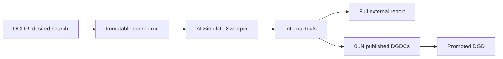

> [!WARNING]
> **Design draft.** This page describes proposed DGDR v2 behavior. The API and resources shown here
> are not implemented and must not be used as a compatibility contract.

The current `v1beta1` DynamoGraphDeploymentRequest (DGDR) accepts a deployment intent, runs one
rapid or thorough profile, and stores one selected DynamoGraphDeployment (DGD) in status. Its spec
becomes immutable after profiling starts.

AI Simulate Sweeper changes the shape of that workflow. It evaluates many complete deployment
configurations against Replay, supports scalar and Pareto optimization goals, and returns multiple
viable candidates. DGDR v2 should expose that search as a long-running Kubernetes workflow without
turning every internal optimizer trial into a custom resource.

This document starts with user and controller use cases. It intentionally leaves field naming and
the choice of a separate run resource open where the lifecycle requirements do not force one design.

## Design Principles

- Treat one search as an immutable input snapshot that produces zero or more candidates.
- Expect replay-backed searches to run for hours and make their progress observable.
- Keep optimizer trials internal. Publish only a bounded set of useful deployment candidates.
- Represent every published candidate as a complete DGD spec that a user or controller can promote.
- Separate stable Kubernetes semantics from experimental Sweeper knobs.
- Keep large reports and historical result sets outside Kubernetes object status.
- Preserve the current `v1beta1` behavior through explicit API-version envelopes instead of
  interleaving incompatible old and new schemas.

## Current and Proposed Behavior

| Concern         | Current `v1beta1`                                     | Proposed v2 behavior                                                          |
| --------------- | ----------------------------------------------------- | ----------------------------------------------------------------------------- |
| Search engine   | Rapid AI Configurator model or thorough GPU profiling | AI Simulate Sweeper with Replay                                               |
| Search duration | About 30 seconds for rapid; hours for thorough        | Normally minutes to hours; large searches take O(hours)                       |
| Results         | One selected DGD embedded in DGDR status              | Bounded, user-visible DGD candidates plus an external full report             |
| Objectives      | Latency or throughput selection                       | Sweeper scalar goals or a Pareto front                                        |
| Progress        | High-level profiling sub-phase                        | Rounds, evaluations, feasibility counts, heartbeat, and best-known results    |
| Mutability      | Spec becomes immutable after profiling starts         | Each run remains immutable; whether one DGDR can create multiple runs is open |
| Search knobs    | Typed DGDR fields plus raw Planner configuration      | Stable typed inputs plus unstructured experimental parameters                 |

## Object Model

The lifecycle requires a request, an immutable run, and published results. The run can be a distinct
resource or an immutable snapshot represented inside DGDR status; that API choice remains open.



The working name for a published result is
`DynamoGraphDeploymentCandidate` (DGDC). One DGDC represents one evaluated deployment
configuration, not one profiler execution and not every sampled configuration.

## Use Case: Find One Deployment

A user supplies a model, hardware budget, workload, and one scalar objective. Sweeper evaluates
legal deployment configurations and ranks feasible results. Examples of objectives already
supported by Sweeper include throughput, throughput per GPU, per-user throughput, end-to-end
latency, goodput, and goodput per GPU.

The integration publishes at most `maxCandidates` best-known results. A user can inspect the first
recommendation and its alternatives before promoting one to a DGD. An automatic apply policy, if
supported, must wait until the run completes.

## Use Case: Explore a Pareto Front

A user selects `pareto` and two or more objectives. Sweeper returns the complete non-dominated set,
which can be much larger than is practical to store as Kubernetes resources. The integration
therefore publishes at most `maxCandidates` DGDCs and writes the complete front to the run report.

Sweeper currently returns the complete front sorted by one objective. It does not select a diverse
representative subset. A future UI needs candidates spread across the front to present meaningful
tradeoffs; taking the first N points can cluster the visible candidates in one region. Diversity is
an output and visualization concern, not a requirement for the initial DGDR v2 API.

## Use Case: Follow a Long-Running Search

Replay-backed search is asynchronous and long-running. A documented GLM-5-FP8 Pareto experiment
evaluated 640 successful unique samples in 80 rounds with eight parallel evaluations and completed
in 12 hours, 6 minutes, and 56 seconds. It reached:

- 88.8% of its final hypervolume after 7 rounds and about 46 minutes;
- 95.6% after 40 rounds and about 5.5 hours;
- 98.95% after 53 rounds and about 7.5 hours.

The last 27 rounds took about 4 hours and 39 minutes for another 1.05% of hypervolume. This example
does not define a runtime guarantee, but it establishes that DGDR v2 must treat search duration as
O(hours), not O(seconds).

The run-owning resource reports at least:

```yaml
status:
  phase: Running
  observedGeneration: 4
  progress:
    completedRounds: 7
    totalRounds: 80
    evaluatedCandidates: 56
    feasibleCandidates: 48
    rejectedCandidates: 8
    publishedCandidates: 10
    discoveredParetoCandidates: 34
    lastProgressTime: "2026-07-17T17:28:42Z"
  conditions:
    - type: Completed
      status: "False"
      reason: EvaluatingCandidates
```

`Completed=True` is terminal for the run. Failure and cancellation use different reasons on the
same condition rather than inverse `Running` and `Final` conditions.

## Use Case: Inspect Best-Known Candidates While Searching

Sweeper exposes an `on_round(round, candidates)` callback with all feasible candidates discovered
so far. The Kubernetes integration can reconcile the visible DGDC set after each completed round:

1. For a scalar objective, select the current best N candidates.
2. For a Pareto objective, select at most N candidates from the current non-dominated set.
3. Create newly visible DGDCs, update retained DGDCs, and remove provisional candidates that leave
   the bounded set.
4. Mark the remaining set stable when the run completes.

Candidate names should include a stable hash of the materialized DGD spec. The same deployment
configuration then retains its identity across progress updates.

While the run is active, visible DGDCs are provisional and can be displaced by later results. A UI
can obtain finality from the owning run's `Completed` condition; each DGDC does not need to duplicate
that run condition.

## Use Case: Promote a Candidate

The DGDC spec is exactly a `DynamoGraphDeploymentSpec`. Its status describes evaluation rather than
deployment state:

```yaml
apiVersion: nvidia.com/v1beta1
kind: DynamoGraphDeploymentCandidate
metadata:
  name: search-4-8f2a
  ownerReferences:
    - apiVersion: nvidia.com/v1beta2
      kind: DynamoGraphDeploymentRequest
      name: search
spec: # exactly DynamoGraphDeployment.spec
  backendFramework: vllm
  components: []
status:
  rank: 1
  conditions:
    - type: Evaluated
      status: "True"
      reason: ReplayCompleted
  experimental: {} # unstructured simulation metrics and diagnostics
```

Promotion copies the DGDC spec into a DGD. DGDC status must not reuse DGD deployment status: the
candidate has been simulated but has not been deployed.

## Use Case: Repeat a Search for New Traffic

Users and the Planner may periodically search again as observed traffic changes. Every execution
still has one immutable input and independent candidates. The API must decide between:

- a one-shot DGDR, where each new search requires another DGDR; or
- a persistent DGDR intent that creates one immutable child run per accepted generation or trigger.

A separate run resource makes retries, cancellation, progress, history, and garbage collection
explicit. Keeping the run in DGDR status reduces the number of resource kinds but pushes those
concerns into one reconciliation state machine. The initial API proposal must resolve this choice.

Cross-run optimizer hints are future work. Sweeper currently creates fresh studies, caches, runners,
and worker pools for every `run` call.

## Stable and Experimental API Boundaries

The CRD should validate only semantics expected to remain stable. A field does not become part of
the typed API merely because it exists in the current Sweeper Pydantic model.

Good candidates for typed fields include:

- Kubernetes object identity, ownership, and references;
- the immutable-run lifecycle and standard conditions;
- progress counters and timestamps whose meaning is independent of optimizer implementation;
- the DGD-compatible DGDC spec;
- model, hardware, workload, and objective concepts after their semantics are agreed;
- coarse sweep budgets such as maximum rounds and parallel evaluations.

Keep unstable inputs and outputs unstructured:

```yaml
spec:
  search:
    maxRounds: 80
    parallelEvaluations: 8
    parameters: # unstructured; passed to the selected search implementation
      adapters:
        dynamo.router:
          search_space:
            mode: [kv_router, round_robin]
        dynamo.planner:
          search_space:
            scaling_policy: [disabled, load_180_5]
status:
  experimental: {} # unstructured diagnostics and implementation-specific details
```

This boundary lets Sweeper evolve without requiring a Kubernetes conversion for every knob. Stored
unstructured values must still round-trip losslessly across served DGDR versions.

## API Evolution

The proposed `v1beta2` schema is not mutually representable with the existing `v1beta1` schema. A
conversion webhook cannot invent a lossless field-by-field mapping between one selected embedded DGD
and a long-running multi-candidate search.

Use an explicit major-version envelope:

- a native `v1beta2` object places the new schema directly under `spec` and carries an old-world
  object under `spec.v1beta1` when needed;
- a native `v1beta1` object keeps its current schema directly under `spec` and carries a new-world
  object under `spec.v1beta2` when needed;
- native and enveloped variants are mutually exclusive;
- conversion moves the lossless payload between the native position and its versioned envelope
  instead of attempting semantic conversion.

The same pattern may be required for incompatible status data.

## Initial Scope

The initial DGDR v2 API should expose only behavior already supported by Sweeper and the Kubernetes
integration needed to run it:

- scalar and Pareto goals supported by Sweeper;
- synthetic and trace workloads supported by Sweeper;
- current search-space and adapter parameters through an unstructured boundary;
- sweep rounds, concurrency, and per-evaluation timeout;
- aggregate progress and a terminal `Completed` condition;
- a bounded set of DGDC resources and a reference to the full external report.

The initial API does not add a generic optimization-constraint language, post-search cost filters,
or a Pareto-diversity policy.

## Future Considerations

Search constraints and result-selection constraints may diverge. A user may want Sweeper to explore
deployments up to 48 GPUs, then select a cheaper P16/D16 result instead of P16/D32. Sweeper currently
supports a search-time GPU budget and explicit parallel configuration allowlists, but not a generic
post-search constraint language. A cost-sensitive result can also disappear from a Pareto front when
cost is not one of its objectives.

A future revision can consider absolute provisioned GPUs, average GPUs, or GPU-hours as objectives,
or apply selection constraints to the full report. These capabilities should not be added to the
first API before their Sweeper semantics exist.

## Related Documentation

- [Dynamo Sweeper Integration](../../modular-components/ai-simulate-experimental/sweeper-experimental/dynamo-integration.md)
- [Sweeper Results](../../modular-components/ai-simulate-experimental/sweeper-experimental/results.md)
- [Sweeper Optimization Goals](../../modular-components/ai-simulate-experimental/sweeper-experimental/optimization-goals.md)
- [Current DGDR workflow](../../../../kubernetes/auto-deployment/auto-deploy-with-dgdr.md)
- [DGDR Replay refactor proposal](https://github.com/ai-dynamo/dynamo/issues/9410)
- [DGDR v2 API and lifecycle DEP](https://github.com/ai-dynamo/dynamo/issues/13092)
