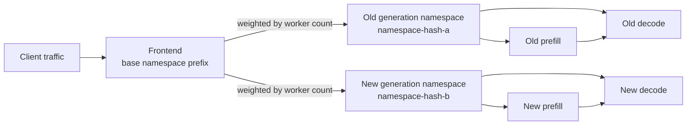

This guide covers how rolling updates work for `DynamoGraphDeployment` (DGD) resources. Rolling updates allow you to update worker configurations (images, resources, environment variables, etc.) with minimal downtime by gradually replacing old pods with new ones.

The behavior of rolling updates depends on the backing resource type of your deployment. DGDs backed by Kubernetes Deployments use **operator-managed rolling updates**, while Grove and LWS-backed deployments use their native update mechanisms. All three backing types isolate worker generations with hash-suffixed Dynamo runtime namespaces (service-discovery scopes, not Kubernetes namespaces); the difference is which controller owns the rollout lifecycle.

## Example

Consider a disaggregated deployment with separate prefill and decode workers. You want to update the tensor parallelism of the decode worker to 2.

**Before** — original deployment:

```yaml
apiVersion: nvidia.com/v1alpha1
kind: DynamoGraphDeployment
metadata:
  name: vllm-disagg
spec:
  services:
    Frontend:
      componentType: frontend
      replicas: 1
      extraPodSpec:
        mainContainer:
          image: nvcr.io/nvidia/ai-dynamo/vllm-runtime:1.4.0
    VllmDecodeWorker:
      componentType: worker
      replicas: 1
      extraPodSpec:
        mainContainer:
          image: nvcr.io/nvidia/ai-dynamo/vllm-runtime:1.4.0
          command:
          - python3
          - -m
          - dynamo.vllm
          args:
            - --model
            - Qwen/Qwen3-0.6B
            - --disaggregation-mode
            - decode
    VllmPrefillWorker:
      componentType: worker
      subComponentType: prefill
      replicas: 1
      extraPodSpec:
        mainContainer:
          image: nvcr.io/nvidia/ai-dynamo/vllm-runtime:1.4.0
          command:
          - python3
          - -m
          - dynamo.vllm
          args:
            - --model
            - Qwen/Qwen3-0.6B
            - --disaggregation-mode
            - prefill
```

**After** — updated with parallelism tuning:

```yaml
apiVersion: nvidia.com/v1alpha1
kind: DynamoGraphDeployment
metadata:
  name: vllm-disagg
spec:
  services:
    Frontend:
      componentType: frontend
      replicas: 1
      extraPodSpec:
        mainContainer:
          image: nvcr.io/nvidia/ai-dynamo/vllm-runtime:1.4.0
    VllmDecodeWorker:
      componentType: worker
      replicas: 1
      extraPodSpec:
        mainContainer:
          image: nvcr.io/nvidia/ai-dynamo/vllm-runtime:1.4.0
          command:
          - python3
          - -m
          - dynamo.vllm
          args:
            - --model
            - Qwen/Qwen3-0.6B
            - --disaggregation-mode
            - decode
            - --tensor-parallelism
            - "2"
    VllmPrefillWorker:
      componentType: worker
      subComponentType: prefill
      replicas: 1
      extraPodSpec:
        mainContainer:
          image: nvcr.io/nvidia/ai-dynamo/vllm-runtime:1.4.0
          command:
          - python3
          - -m
          - dynamo.vllm
          args:
            - --model
            - Qwen/Qwen3-0.6B
            - --disaggregation-mode
            - prefill
```

Apply the update:

```bash
kubectl apply -f vllm-disagg.yaml
```

Monitor rolling update progress:

```bash
kubectl get dgd vllm-disagg -n dynamo -o jsonpath='{.status.rollingUpdate}'
```

## Native Updates (Grove and LWS)

For DGDs backed by **Grove** (PodCliques, PodCliqueSets) or **LWS** (LeaderWorkerSets), the operator does not manage rolling updates directly. Instead, these deployments rely on the native rolling update mechanisms of their underlying resources.

### What Happens

- A modification to a pod spec triggers the rolling update behavior of the backing resource.
- With Grove's default rolling behavior or `RollingRecreate`, PodCliques (PCLQ) and PodCliqueScalingGroups use `maxUnavailable: 1` and `maxSurge: 0`. These values do not apply when `OnDelete` is selected. LWS uses `maxUnavailable: 1` and `maxSurge: 0`.
- The operator assigns one worker-spec hash to all Grove worker components. A changed worker spec therefore moves prefill, decode, and other worker components to the new generation namespace together. New DGDs use hash suffixes from their first generation; existing DGDs adopt them on their next worker-generation change.
- LWS also uses the DGD worker hash in worker runtime namespaces, while its underlying LeaderWorkerSets retain their native update behavior.

The frontend stays on the base namespace prefix and discovers every ready worker generation. It can share incoming traffic across old and new generations while prefill/decode communication remains inside one generation:



The frontend routes only to complete namespaces for ready generations. See [Mixed-Version Compatibility](../../../../reference/general/compatibility.mdx#mixed-version-compatibility) for the supported frontend/worker version window and WorkerSet selection behavior.

### Grove Update Strategy Annotation

For Grove-backed DGDs, set `nvidia.com/grove-update-strategy` on the `DynamoGraphDeployment` metadata to pass a Grove `PodCliqueSet` update strategy through to the generated `PodCliqueSet`. This annotation does not affect Deployment-backed or LWS-backed DGDs. For the Grove-side design, see [GREP-291: `OnDelete` update strategy for `PodCliqueSet`](https://github.com/ai-dynamo/grove/pull/403).

Supported values are:

| Value | Behavior |
|-------|----------|
| `RollingRecreate` | Use Grove's rolling recreate behavior. |
| `OnDelete` | Create a new pod revision, but replace old pods only after you delete them. |

If the annotation is omitted, Dynamo leaves the Grove update strategy unset and Grove uses its default behavior. Invalid values are rejected. Values must match Grove's exact spelling, including case.

```yaml
metadata:
  annotations:
    nvidia.com/grove-update-strategy: OnDelete
```

Inspect the generated Grove strategy:

```bash
kubectl get podcliqueset -n dynamo vllm-disagg -o jsonpath='{.spec.updateStrategy.type}'
```

For `OnDelete`, delete old Grove-managed pods when you are ready to replace them:

```bash
kubectl get pods -n dynamo -l nvidia.com/dynamo-graph-deployment-name=vllm-disagg
kubectl delete pod -n dynamo <old-pod-name>
```

Use `OnDelete` for updates that require manual coordination, such as maintenance windows. Dynamo still assigns different runtime namespaces to old and new Grove worker generations; `OnDelete` controls when Grove replaces the pods.

### Implications for Disaggregated Deployments

The shared worker hash keeps prefill and decode workers from the same generation in one runtime namespace. This prevents direct worker-to-worker discovery across old and new generations. The frontend can still discover both namespaces and route requests across ready WorkerSets.

Grove and LWS still own their respective pod replacement mechanics. The hash suffix provides runtime discovery isolation; it does not add the operator-managed rollout phases, surge controls, or status tracking described in the next section.

## Managed Rolling Updates (Deployments)

For DGDs backed by Kubernetes **Deployments** (single-node, non-multinode services), the Dynamo operator implements managed rolling updates with namespace isolation. This is tracked in the DGD status and provides stronger guarantees for disaggregated deployments.

### How It Works

1. **Spec change detection** — The operator computes a hash of all worker service specs (prefill, decode, and worker component types). When this hash changes, a rolling update is triggered.

2. **Namespace isolation** — New worker `DynamoComponentDeployments` (DCDs) are created with the spec hash appended to their Dynamo namespace. This means new workers register in a different Dynamo namespace than old workers, preventing cross-generation discovery. A new prefill worker will only discover and route to new decode workers, avoiding compatibility issues.

3. **Gradual replacement** — The operator gradually scales up new worker DCDs and scales down old ones, respecting `maxSurge` and `maxUnavailable` constraints. When a worker service is updated (all new replicas are ready, all old replicas are terminated), it is marked as completed.

4. **Cleanup** — Once all worker services have completed the transition, old worker DCDs are deleted and the rolling update is marked as completed.

```
┌─ DynamoGraphDeployment: vllm-disagg ──────────────────────────────────────────────┐
│                                                                                    │
│  ┌─ DCD: Frontend ──────────┐                                                      │
│  │                          │                                                      │
│  │  ┌────────────────────┐  │   No changes —                                       │
│  │  │ Pod (v1) ✓         │  │   not a worker component                             │
│  │  └────────────────────┘  │                                                      │
│  │                          │                                                      │
│  └──────────────────────────┘                                                      │
│                                                                                    │
│  ┌─ OLD DCDs (hash: a1b2c3d4) ──────────────────────────────────────────────────┐  │
│  │                                                                               │  │
│  │  ┌─ DCD: VllmDecodeWorker-a1b2c3d4 ──┐  ┌─ DCD: VllmPrefillWorker-a1b2c3d4 ┐│  │
│  │  │                                    │  │                                   ││  │
│  │  │  ┌──────────────────────┐          │  │  ┌─────────────────────┐          ││  │
│  │  │  │ Pod (v1) Terminating │          │  │  │ Pod (v1) Terminating│          ││  │
│  │  │  └──────────────────────┘          │  │  └─────────────────────┘          ││  │
│  │  │                                    │  │                                   ││  │
│  │  │  Dynamo Namespace: vllm-disagg     │  │  Dynamo Namespace: vllm-disagg    ││  │
│  │  │                  -a1b2c3d4         │  │                  -a1b2c3d4        ││  │
│  │  └────────────────────────────────────┘  └───────────────────────────────────┘│  │
│  │                                                                               │  │
│  └───────────────────────────────────────────────────────────────────────────────┘  │
│                                                                                    │
│  ┌─ NEW DCDs (hash: f5e6d7c8) ──────────────────────────────────────────────────┐  │
│  │                                                                               │  │
│  │  ┌─ DCD: VllmDecodeWorker-f5e6d7c8 ──┐  ┌─ DCD: VllmPrefillWorker-f5e6d7c8 ┐│  │
│  │  │                                    │  │                                   ││  │
│  │  │  ┌──────────────────────┐          │  │  ┌─────────────────────┐          ││  │
│  │  │  │ Pod (v2) ✓ NEW      │          │  │  │ Pod (v2) ✓ NEW     │          ││  │
│  │  │  └──────────────────────┘          │  │  └─────────────────────┘          ││  │
│  │  │                                    │  │                                   ││  │
│  │  │  Dynamo Namespace: vllm-disagg     │  │  Dynamo Namespace: vllm-disagg    ││  │
│  │  │                  -f5e6d7c8         │  │                  -f5e6d7c8        ││  │
│  │  └────────────────────────────────────┘  └───────────────────────────────────┘│  │
│  │                                                                               │  │
│  └───────────────────────────────────────────────────────────────────────────────┘  │
│                                                                                    │
│  Old and new workers are in different Dynamo namespaces —                           │
│  new prefill only discovers new decode, preventing cross-generation routing.        │
│                                                                                    │
└────────────────────────────────────────────────────────────────────────────────────┘
```

> [!NOTE]
> Only worker component types (`worker`, `prefill`, `decode`) participate in managed rolling updates. Non-worker components like `frontend` are updated in-place without namespace isolation.

### Rolling Update Phases

The rolling update progress is tracked in `.status.rollingUpdate` with the following phases:

| Phase | Description |
|-------|-------------|
| `Pending` | A spec change was detected and the rolling update has been initialized. |
| `InProgress` | New worker DCDs are being scaled up and old ones are being scaled down. |
| `Completed` | All worker services have transitioned to new replicas. Old DCDs have been cleaned up. |

The status also tracks:
- `startTime` — When the rolling update began.
- `endTime` — When the rolling update completed.
- `updatedComponents` - List of worker components that have completed the transition.

### Configuring maxSurge and maxUnavailable

You can configure the rolling update strategy per service using annotations:

| Annotation | Description | Default |
|------------|-------------|---------|
| `nvidia.com/deployment-rolling-update-max-surge` | Maximum number of extra pods that can be created above the desired count during the update. | `25%` |
| `nvidia.com/deployment-rolling-update-max-unavailable` | Maximum number of pods that can be unavailable during the update. | `25%` |

Values can be absolute integers (e.g., `"1"`, `"2"`) or percentages (e.g., `"25%"`, `"50%"`). Percentages are resolved against the desired replica count — rounding up for `maxSurge` and rounding down for `maxUnavailable`. The operator ensures at least one of `maxSurge` or `maxUnavailable` is greater than zero to guarantee forward progress.

**Example** — zero-downtime update with surge capacity:

```yaml
VllmPrefillWorker:
  componentType: worker
  subComponentType: prefill
  replicas: 4
  annotations:
    nvidia.com/deployment-rolling-update-max-surge: "1"
    nvidia.com/deployment-rolling-update-max-unavailable: "0"
```

This ensures that all 4 existing prefill replicas remain available while 1 new replica is brought up at a time.

**Example** — fast update allowing temporary capacity reduction:

```yaml
VllmDecodeWorker:
  componentType: worker
  subComponentType: decode
  replicas: 8
  annotations:
    nvidia.com/deployment-rolling-update-max-surge: "0"
    nvidia.com/deployment-rolling-update-max-unavailable: "2"
```

This avoids creating extra pods but allows up to 2 decode replicas to be unavailable at a time, speeding up the transition.

### Recreate Strategy

For a Deployment-backed worker component that cannot use temporary surge capacity, set
`nvidia.com/deployment-strategy: Recreate` on its pod template. The operator scales every old DCD
for that component to zero, waits for the DCDs to observe the scale-down and for every old worker
pod to reach a terminal phase or be deleted, and then scales the new DCD to the requested replica
count.

```yaml
apiVersion: nvidia.com/v1beta1
kind: DynamoGraphDeployment
metadata:
  name: vllm-agg
spec:
  components:
    - name: worker
      type: worker
      replicas: 1
      podTemplate:
        metadata:
          annotations:
            nvidia.com/deployment-strategy: Recreate
        spec:
          containers:
            - name: main
              image: nvcr.io/nvidia/ai-dynamo/vllm-runtime:1.4.0
```

`Recreate` applies independently to each worker component. Other worker components without the
annotation continue to use `RollingUpdate`. The operator ignores
`nvidia.com/deployment-rolling-update-max-surge` and
`nvidia.com/deployment-rolling-update-max-unavailable` on a component that uses `Recreate`.

> [!WARNING]
> `Recreate` causes an availability gap while the old workers stop and the new workers start. Use
> it when old and new generations must not run concurrently or when the cluster has no spare GPU
> capacity for a surge. This annotation affects only operator-managed, Deployment-backed updates;
> use `nvidia.com/grove-update-strategy` for Grove-backed DGDs.

### Worker Hash and DCD Naming

Worker DCDs always include a hash suffix derived from the worker specs: `{dgd-name}-{service-name}-{hash}` (e.g., `vllm-disagg-vllmdecodeworker-a1b2c3d4`). During a rolling update, the new worker DCDs are created with the new spec hash while the old DCDs retain the previous hash, allowing both generations to coexist:

- **Old worker DCD:** `vllm-disagg-vllmdecodeworker-a1b2c3d4` (previous hash)
- **New worker DCD:** `vllm-disagg-vllmdecodeworker-f5e6d7c8` (new hash)

The hash is computed from a SHA-256 digest of all worker service specs (excluding non-pod-template fields like `replicas`, `autoscaling`, and `ingress`). This means:

- Scaling changes (replica count) do **not** trigger a rolling update.
- Pod template changes (image, resources, env vars, volumes, etc.) **do** trigger a rolling update.
- The hash covers **all** worker services together — changing any single worker's spec triggers a rolling update for all workers.

The current worker hash is stored as the annotation `nvidia.com/current-worker-hash` on the DGD resource, and individual worker DCDs are labeled with `nvidia.com/dynamo-worker-hash` for filtering.

### Status During Rolling Updates

During a rolling update, the DGD status aggregates information from both old and new worker DCDs:

- **Replicas** — Total count across old and new.
- **ReadyReplicas** — Aggregate ready count across old and new.
- **UpdatedReplicas** — Only new worker replicas.

This provides a holistic view of the deployment's health during the transition.

## Comparison

| Aspect | Grove | LWS | Deployments (Managed) |
|--------|-------|-----|----------------------|
| Update mechanism | Native Grove rollout | Native LWS rollout | Operator-managed with DCD lifecycle |
| Worker-generation runtime namespace | Shared hash suffix across all worker components | Shared hash suffix across all worker components | Hash-based separation |
| Direct cross-generation worker discovery | Prevented by runtime namespace isolation | Prevented by runtime namespace isolation | Prevented by runtime namespace isolation |
| Update strategy | Grove native strategy; `OnDelete` can require manual pod deletion | LWS native strategy | `RollingUpdate` or component-scoped `Recreate` |
| maxSurge / maxUnavailable | Determined by Grove | Determined by LWS | Configurable per component when using `RollingUpdate` |
| Status tracking | Native resource status | Native resource status | DGD `.status.rollingUpdate` with phase and per-service tracking |
| Multinode support | Yes | Yes | No (single-node only) |

## Future Work

The following enhancements are planned for future releases:

- **Managed rollout lifecycle for Grove and LWS** — Extending DGD-level rollout progress and policy controls to workloads that currently use their native update mechanisms.
- **Partitioned rollouts** — The ability to roll out updates to a percentage of workers (e.g., 30%), pause, observe metrics, and then continue. This enables canary-style deployments for safer rollouts.
- **DGD-level rolling update configuration** — The ability to configure `maxSurge` and `maxUnavailable` at the DGD API level, regardless of the backing resource type.
