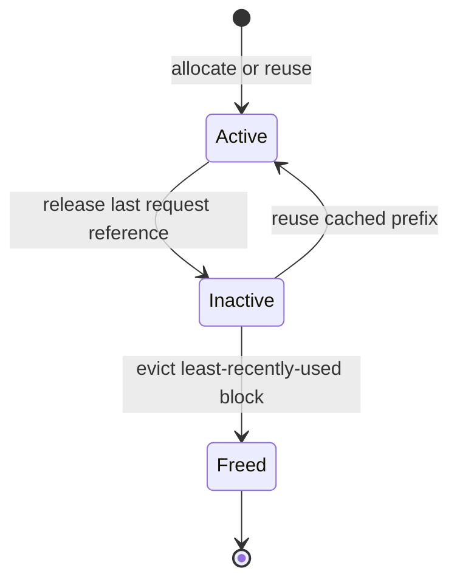

<!--
Generated from `aisimulate/docs/engine/architecture.md` by `docs/fern/scripts/sync_aisimulate_docs.py`.
Edit the canonical source instead of this Fern copy.
-->

> [!WARNING]
> **Experimental.** AI Simulate engine APIs and configuration can change without a standard
> deprecation period.

The `aisimulate_core::engine` module simulates one inference engine without requiring a GPU. It owns
scheduling, native GPU KV-cache accounting, prefix reuse, preemption, timing, and grouped
attention data-parallel (DP) execution. The engine does not own a clock, workload driver, network
transport, Router, or Planner integration.

## Generalized Engine

`GeneralizedMockerEngine<C>` groups one or more scheduler ranks behind one engine contract. A
single-rank engine starts a pass whenever its scheduler has ready work. An attention-DP engine starts
a pass only when every sibling rank reaches the barrier and completes the group at the slowest rank's
modeled completion time.

The caller supplies time and consumes the pass result:

- the offline Replayer advances the engine with deterministic virtual time
- Dynamo Live Mocker advances the engine with Tokio and wall-clock timers

This separation keeps scheduler and KV behavior identical across offline and live simulation while
leaving runtime effects with the caller.

## Scheduler Models

AI Simulate provides scheduler models for vLLM, SGLang, and TensorRT-LLM:

- The vLLM model uses waiting and running queues, spends one token budget across running requests
  first, and recomputes preempted requests under decode memory pressure.
- The SGLang model uses waiting and running queues around a radix-style prefix cache. It retracts
  decode requests under pressure while retaining reusable prefixes.
- The TensorRT-LLM model uses the native physical block-pool behavior shared with the vLLM-style
  scheduler and applies TensorRT-LLM-specific scheduling controls.

Each scheduler models continuous batching, chunked prefill, decode progression, memory pressure, and
prefix reuse. Scheduling decisions remain local to a rank; the generalized engine owns only group
readiness and pass completion.

## Native GPU KV Accounting

The vLLM and TensorRT-LLM scheduler cores own a physical GPU block pool. Each slot records its content
identity, request references, cache visibility, and last-use order. A request can reuse a contiguous
cached prefix or allocate free slots.

Blocks move through these states:

An active block has one or more request references. Releasing its final reference leaves the block
inactive when prefix caching retains it. Allocation pressure evicts unreferenced cached blocks in
least-recently-used order. SGLang uses its token-pool and radix-cache model instead of this block pool.

The engine emits neutral stored and removed observations when visible cache state changes. Consumers
decide whether to ignore those observations or translate them into a runtime-specific event type.

## Sequence Tracking

Each request tracks token-block identities, computed tokens, generated tokens, cached-prefix state,
and preemption history. Completed block boundaries receive content hashes and become eligible for
prefix matching. Partial blocks remain request-local until they cross a block boundary.

The engine owns request progression through scheduler passes. It does not own cluster placement,
cross-worker queueing, simulated arrival time, or request transport.

## Timing Models

Each pass obtains a duration from an injected timing provider. Supported providers include:

- fixed timing for deterministic tests and small examples
- polynomial timing for a lightweight analytical approximation
- interpolated timing loaded from measured profile data
- NVIDIA AI Configurator timing for a model, backend, GPU, and parallelism tuple

The timing provider predicts pass duration. The scheduler still owns batching, cache state,
preemption, and token progression. Applying a speedup changes modeled duration without changing those
scheduler decisions.

## Ownership Boundary

`aisimulate_core::engine` owns effects that happen inside one simulated engine:

- rank-local scheduling and admission
- GPU KV-cache allocation and prefix reuse
- preemption or retraction
- pass timing and attention-DP barriers
- neutral output, lifecycle, KV, and metric observations

The caller owns effects outside the engine:

- the logical or wall clock
- workload arrival and cluster placement
- disaggregated handoff and scaling
- network transport, discovery, cancellation, and publication
- Dynamo Router and Planner composition
