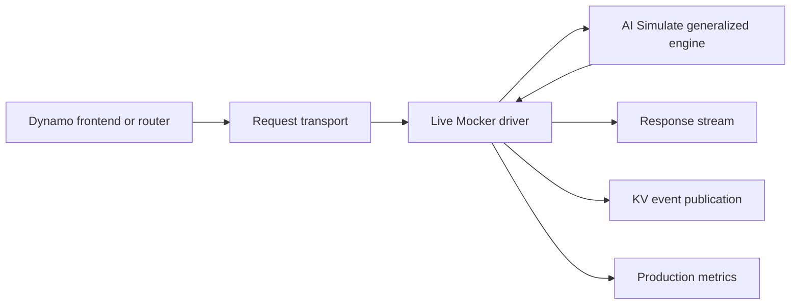

Live Mocker runs the AI Simulate generalized engine as a simulated Dynamo worker. It adds Tokio
driving, worker registration, transport, cancellation, output publication, KV events, and production
metrics without duplicating scheduler or KV-cache behavior.

For scheduler, native GPU KV accounting, preemption, timing, and attention data-parallel (DP)
behavior, see [AI Simulate Engine Architecture](../../ai-simulate-experimental/engine-experimental/architecture.md).

## Runtime Flow

The driver accepts Dynamo requests, converts them to neutral engine requests, starts grouped engine
passes when the scheduler is ready, and waits for the modeled duration with Tokio timers. At each
completion boundary it publishes visible tokens, request lifecycle changes, cache observations, and
metrics through Dynamo-owned interfaces.

## Worker Lifecycle

Live Mocker registers endpoints through the selected Dynamo discovery backend. The frontend and
Router see simulated workers through the same discovery and request paths used by real backends.

One process can host multiple logical workers. Each worker owns one generalized engine; an
attention-DP worker groups multiple scheduler ranks behind one endpoint identity. Group shutdown
drains and acknowledges the final pass boundary before cancellation.

## Request and Event Transport

Dynamo owns the request and event planes around the shared engine. Live Mocker supports the same
runtime-selected discovery, request, and event transports as its deployment configuration. These
planes are not part of `aisimulate-core`.

The engine returns neutral observations. Live Mocker translates them into:

- streamed output and terminal responses
- request lifecycle and cancellation effects
- Router-visible stored and removed KV events
- worker and per-rank production metrics

Reusing a visible cached block does not emit a second stored event because the Router already tracks
that cache entry.

## Metrics Publication

Live Mocker publishes scheduler and cache state at the same modeled pass-completion boundary used for
tokens and KV events. Metrics include active requests, cache usage, and decode-block pressure per DP
rank. The Router and Planner consume these runtime metrics as they would for a real backend.

Offline Replayer records equivalent neutral evidence in its report instead of publishing production
metrics.

## Disaggregated Serving

In a live disaggregated deployment, prefill and decode workers coordinate through Dynamo-owned
bootstrap and request paths. The prefill worker models compute, then waits for the configured KV
transfer duration before decode becomes eligible.

Transfer duration depends on input tokens, modeled KV bytes per token, and configured bandwidth. Set
`--kv-transfer-bandwidth 0` to disable the transfer delay. The rendezvous and wall-clock wait remain
Live Mocker behavior; offline Replayer models handoff as a virtual-time event.

## Ownership Boundary

| AI Simulate engine | Dynamo Live Mocker |
|---|---|
| scheduler and batching | worker registration and discovery |
| native GPU KV accounting | request and event transport |
| prefix reuse and preemption | cancellation and response publication |
| pass timing and DP barrier | wall-clock/Tokio driving |
| neutral engine observations | Dynamo KV events and production metrics |

Live Mocker depends on `aisimulate_core::engine`. The engine does not depend on Dynamo, Tokio, or a
distributed runtime.

## Related Documentation

- [Simulate a Local Deployment](../../../../../cli/operations/simulation-with-dynosim/mocker-live-simulation.mdx)
- [Simulate a Kubernetes Deployment](../../../../../kubernetes/operations/simulation-with-dynosim/mocker-live-simulation.mdx)
- [Mocker CLI Reference](../../../../../reference/components/mocker-cli-reference.mdx)
- [Dynamo Replay Integration](../../../concepts/simulation/dynosim-architecture.md)
