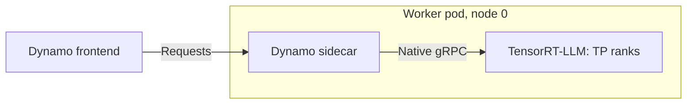
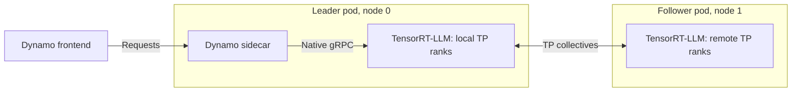

> [!WARNING]
> **Experimental.** The sidecars and their deployment examples are
> experimental. Manifests, flags, and behavior may change without notice.

`dynamo-trtllm-sidecar` connects a Dynamo worker to TensorRT-LLM's OpenEngine
gRPC server. See [Sidecar Backends](../../../concepts/system-architecture/sidecar-backends.md)
for the architecture.

## Support Matrix

| Feature | Supported |
|---|---|
| Aggregated | Yes |
| Disaggregated | Yes |
| KV routing | No |

## Launch Locally

See [`lib/sidecar/trtllm/launch/`](https://github.com/ai-dynamo/dynamo/tree/main/lib/sidecar/trtllm/launch)
for all topologies. For example, aggregated serving on one GPU:

```bash
export DYN_DISCOVERY_BACKEND=file
./lib/sidecar/trtllm/launch/agg.sh
```

In a second terminal:

```bash
curl -s localhost:8000/v1/chat/completions \
  -H 'Content-Type: application/json' \
  -d '{"model":"Qwen/Qwen3-0.6B","messages":[{"role":"user","content":"Hello"}],"max_tokens":32}'
```

## Deploy on Kubernetes

See [`lib/sidecar/trtllm/deploy/`](https://github.com/ai-dynamo/dynamo/tree/main/lib/sidecar/trtllm/deploy)
for all manifests. For example, aggregated serving:

```bash
kubectl apply -f lib/sidecar/trtllm/deploy/agg.yaml -n <namespace>
kubectl port-forward -n <namespace> svc/trtllm-sidecar-agg-frontend 8000:8000
```

## Topologies

Arrows carry inference requests. The TensorRT-LLM sidecar does not publish KV
cache events.

### Single-node TP

One engine on one node, with one sidecar.



### Multi-node TP

One engine spans two nodes. Only the leader pod has a sidecar; the follower
pod holds the remaining TP ranks.

> [!NOTE]
> This topology has not been validated with the TensorRT-LLM sidecar yet.



### Multi-node DP

Not supported yet. The TensorRT-LLM sidecar does not target DP ranks or
publish KV events.
