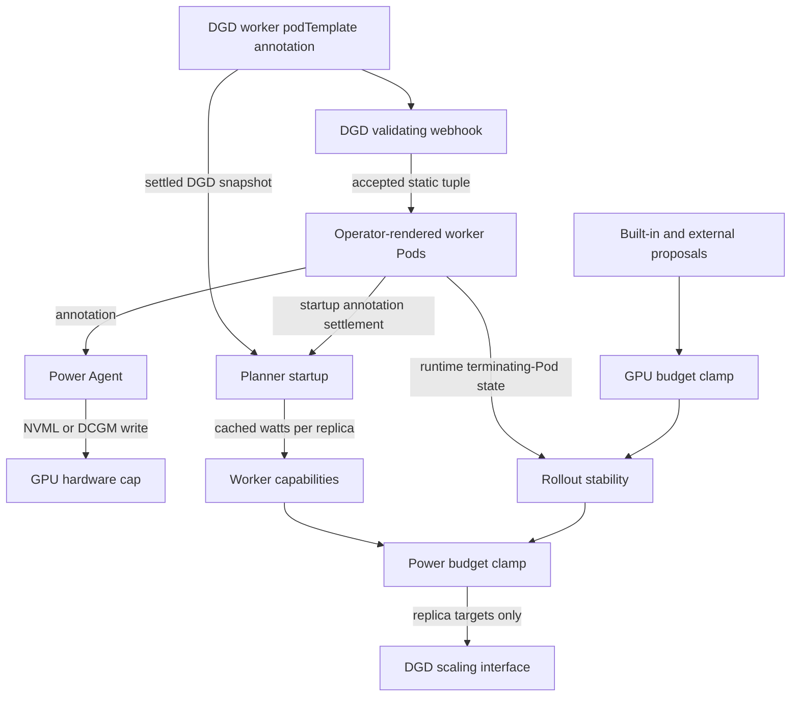

> [!NOTE]
> **Tier 3 design documentation** for contributors and architects. For configuration and deployment,
> see [Planner Examples](planner-examples.md#power-aware-budget-scaling).

> [!WARNING]
> **Experimental.** The power-aware Planner adds a projected GPU power ceiling to NVIDIA Dynamo
> autoscaling. It admits or reduces replica proposals according to requested per-GPU caps and one
> DynamoGraphDeployment (DGD) budget. It does not measure power, prove that a cap reached the hardware,
> change a cap at runtime, or remediate a deployment that is already over budget.

## Decision Summary

| Decision | Current static behavior |
| --- | --- |
| Cap owner | Worker `podTemplate` annotation in the DGD |
| Admission owner | DGD validating webhook with fail-closed admission |
| Cap enforcer | Node-local Power Agent |
| Planner reads | Settled DGD intent plus list-only Pod state |
| Projection unit | Watts per replica: cap per GPU multiplied by GPUs per logical replica |
| Budget owner | `PlannerConfig.total_gpu_power_limit` for one DGD |
| Supported modes | `disagg`, `prefill`, and `decode` |
| Enforcement point | GPU clamp, rollout hold, then power clamp |
| Cap or topology changes | Delete and recreate the DGD |
| Total-budget changes | Restart the Planner |
| Proven guarantee | Admitted scale-ups do not push an in-budget ready baseline above the static requested-cap projection |
| Excluded guarantee | Hardware-enforced caps, measured draw, or facility power remain within the budget |

## Goals and Non-Goals

The static design has four goals:

- Keep cap authorship with the workload definition.
- Keep the Planner read-only with respect to Pods and GPU power controls.
- Apply the power ceiling to built-in and external-plugin proposals at one final boundary.
- Preserve partial proposals and in-progress operator rollouts.

The design does not:

- observe instantaneous GPU power or the hardware-enforced cap;
- coordinate budgets across DGDs, namespaces, clusters, or racks;
- lower replica counts solely because the current deployment is over budget;
- retarget caps on a live DGD;
- support power-aware planning for multiple Pods on one physical GPU, Multi-Instance GPU (MIG)
  partitions, or GPU allocation through Dynamic Resource Allocation (DRA);
- enable power awareness for aggregated, virtual, replay, or Global Planner environments; or
- change the existing GPU-budget unit for multinode workers.

## Ownership and Data Flow



The shared contract is `dynamo.nvidia.com/gpu-power-limit`, expressed in watts per GPU:

```yaml
podTemplate:
  metadata:
    annotations:
      dynamo.nvidia.com/gpu-power-limit: "350"
```

The operator renders the annotation onto worker Pods. Every 15 seconds, the Power Agent lists and
reconciles Pods on its node and applies the requested limit through NVML or DCGM. The Planner resolves
the requested limit from the DGD, verifies its propagation on Pods before caching it, and never writes
the annotation.

This ownership boundary prevents the Planner and Power Agent from competing over a cap. It also
creates the main limitation: the Planner knows the requested cap, while the Power Agent computes the
post-clamp target and tracks the actuator write outcome. The Power Agent does not read the cap back
after every write, and no enforcement feedback path connects it to the Planner.

## Admission Contract

The DGD validating webhook establishes the static inputs before the Planner starts. For every
power-annotated component, it:

- requires the annotation value to be a positive decimal integer;
- rejects GPU allocation through DRA, including GPU Memory Service and consumed resource claims;
- rejects adding, removing, or changing the power annotation after creation;
- rejects changes to the effective scalar `nvidia.com/gpu` count, preferring the `main` container
  limit over its request; and
- rejects changes to `multinode.nodeCount`.

These rules apply to the power tuple that the Planner caches:

```text
T_r = (C_r, G_r, M_r)
```

Here, `C_r` is the requested per-GPU cap, `G_r` is the scalar GPUs per Pod, and `M_r` is the
multinode node count for role `r`. Delete and recreate the DGD to change any member of this tuple.

The webhook protects the DGD inputs, while startup settlement protects the transition from DGD intent
to applied Pod annotations. Both are required for a stable cached projection.

This invariant requires the validating webhook to be enabled, reachable, and configured with
`webhook.failurePolicy: Fail`, which is the platform chart default. `Ignore` is an emergency-only
bypass: if the webhook is unavailable, Kubernetes can accept DGD writes without validation. Pause DGD
writes during that window and audit every accepted change afterward. If a cached power input might
have changed, recreate the DGD with the intended tuple and restart the Planner against the settled
replacement.

## Planner Access and RBAC

The Planner needs list-only Pod access when power awareness is installed. To add `pods/list` to either
the namespace-restricted Role or the cluster-wide ClusterRole, set the following value on the platform
chart's `dynamo-operator` subchart:

```yaml
dynamo-operator:
  planner:
    powerAwareness:
      enabled: true
```

The value defaults to `false`, so power-disabled installations do not gain the permission.

The Planner uses this permission for two read paths:

- **Startup settlement:** verify that relevant non-terminal Pods carry the exact annotation string
  from the settled DGD snapshot.
- **Runtime stability:** detect terminating Pods while classifying a worker rollout.

The Planner has no Pod mutation permission for this feature. It writes only replica targets through
the existing DGD scaling interface. See [Planner Examples](planner-examples.md#power-aware-budget-scaling)
for the Helm and Planner configuration.

## Configuration Contract

Enable the feature with these Planner fields:

```json
{
  "environment": "kubernetes",
  "mode": "disagg",
  "enable_power_awareness": true,
  "total_gpu_power_limit": 5200
}
```

| Field | Default | Validation | Meaning |
| --- | ---: | --- | --- |
| `enable_power_awareness` | `false` | Boolean | Enables startup settlement, projection metrics, rollout holds, and the final power clamp |
| `total_gpu_power_limit` | unset | Integer greater than or equal to 1; required when enabled | Projected GPU power ceiling for this DGD |
| `environment` | varies | Must be `kubernetes` when enabled | Selects the connector that resolves DGD-owned caps and Pod state |
| `mode` | `disagg` | Must be `disagg`, `prefill`, or `decode` when enabled | Selects the power-relevant worker roles; `agg` is unsupported |

Per-GPU caps are not Planner configuration fields. Every required worker role must carry the
annotation. The total budget is process-static and a changed value takes effect only after a Planner
restart.

## Startup Resolution

Initialization establishes one settled snapshot before permanently caching power facts:

1. Validate that the DGD contains every required worker role.
2. Wait for the DGD observed generation and worker rollout state to settle.
3. List DGD-scoped Pods and compare the raw annotation string on every relevant non-terminal Pod with
   the DGD template value.
4. Resolve the annotation as a positive integer.
5. Resolve scalar GPUs from the `main` container limit, falling back to its request.
6. Multiply GPUs per Pod by `multinode.nodeCount`, which defaults to `1`.
7. Cache the per-GPU cap and watts per logical replica in deployment state and worker capabilities.
8. Verify that `min_endpoint` replicas of every required role fit `total_gpu_power_limit`.

Terminating Pods still consume power, so they block startup settlement even when their annotation
matches. Pods in terminal `Succeeded` or `Failed` phases are ignored. A component with zero desired
replicas and no Pods is settled because future Pods will inherit the current template.

For role `r`:

```text
G_r = GPUs per Pod_r x nodeCount_r
W_r = requested cap per GPU_r x G_r
```

For a disaggregated target:

```text
W_projected = N_p x W_p + N_d x W_d
```

Prefill-only and decode-only modes apply the same calculation to their one required role.

Initial deployment validation reports missing or ambiguous required roles with
`DeploymentValidationError`. A connector without the power-aware interface, an invalid cached GPU or
topology input, or an infeasible minimum footprint also raises `DeploymentValidationError`. During
settlement, a missing or invalid annotation raises `PowerAnnotationMissingError` or
`PowerAnnotationInvalidError`, a failed operator rollout raises `RolloutFailedError`, and convergence
that exceeds the 30-minute polling limit raises `TimeoutError`. DRA-backed power components are
normally rejected earlier by DGD admission.

## Static Snapshot Lifecycle

`refresh()` does not reread the power annotation or recalculate watts per replica. The admission
contract keeps the DGD tuple immutable for the lifetime of the DGD, and the Planner uses its cached
tuple for the lifetime of the process.

To change a per-GPU cap, scalar GPU count, or `nodeCount`:

1. Delete the existing DGD.
2. Create a replacement DGD with the new tuple.
3. Start the Planner against the settled replacement.

To change only `total_gpu_power_limit`, update the Planner configuration and restart the Planner.

## Runtime Rollout Safety

`KubernetesConnector.get_power_aware_worker_counts()` issues one DGD GET and one DGD-scoped Pod LIST
together off the event loop through a single `asyncio.to_thread` dispatch. The Pod snapshot is
partitioned by component and used only to detect terminating Pods.

The surrounding `PlannerEnvironmentImpl.refresh()` also calls synchronous connector methods to refresh
GPU counts and the model name. On the Kubernetes path, each call issues an additional DGD GET on the
event-loop thread. These runtime reads do not validate annotations or recalculate the cached power caps.

The rollout hold applies only after the DGD GET and Pod LIST succeed. An exception from either read
propagates through `refresh()` and out of the Planner run loop; the Planner does not convert the error
into an unstable snapshot or retry it inside the loop.

The connector combines Pod termination state with DGD ready counts, component stability, and the
rolling-update phase. A terminating Pod, an unstable component, or a blocking or failed rolling-update
phase marks the deployment unstable. The environment then sets the settled `expected` count of both
power-relevant roles to `None`.

If either role is unstable, the final power boundary:

- suppresses every proposed scale-up;
- continues to allow scale-down;
- logs at most one warning per continuous unstable interval when it suppresses a scale-up; and
- leaves already-issued desired counts untouched.

This deployment-wide hold is conservative. It cannot distinguish the settled target of one rolling
role from another stable role, so it blocks both roles from scaling up until the deployment settles.

## Final Budget Boundary

The plugin pipeline merges omitted roles from the ready-count baseline. Before applying budgets,
`PipelineOutcome.proposed_components` restores the explicit PROPOSE-stage mask. A role omitted by
PROPOSE is charged at its ready count for arithmetic but cannot become an adjustable or emitted target.

```text
merged proposal
  -> restore the explicit PROPOSE-stage component mask
  -> GPU budget clamp
  -> rollout scale-up hold
  -> power budget clamp
  -> suppress targets equal to known settled expected counts
  -> replica target
```

The GPU clamp runs first and the power clamp runs second. The operations are not commutative. The
power ceiling can undo an increase introduced by the GPU floor, so the ceiling wins when the two
constraints conflict.

Only a target equal to a known settled `expected` count is suppressed as a no-op. During a rollout,
`expected` is unknown. An explicit target equal to the transient ready count can intentionally cancel
an in-flight desired count and must remain observable.

### Power Clamp Cases

| Input state | Result |
| --- | --- |
| Post-GPU-clamp proposal fits | Preserve the proposal |
| Both roles are proposed and exceed the ceiling | Apply the pair clamp within the ceiling, respect `min_endpoint`, and never exceed either post-GPU-clamp count |
| One role is proposed and exceeds the residual budget | Charge the peer at its ready count and shrink only the proposed role |
| The fixed peer leaves less than one role's minimum footprint | Suppress that role's scale-up instead of mutating the peer |
| One role grows while the other shrinks and the parallel peak exceeds the budget | Emit the scale-down leg first and defer the scale-up |
| Proportional shrinking creates an opposing rebalance with an excessive parallel peak | Apply the same scale-down-first staging |
| No role is adjustable while the baseline is over budget | Emit no power-driven remediation |

The parallel projection is:

```text
W_peak =
    max(N_p,ready, N_p,target) x W_p
  + max(N_d,ready, N_d,target) x W_d
```

This peak protects opposing prefill/decode rebalances from assuming that a scale-down completes before
a simultaneous scale-up. It is not a complete model of Kubernetes surge, pending Pods, or terminating
Pods; the deployment-wide rollout hold covers those states conservatively.

## Guarantees and Failure Boundaries

| Statement | Status | Reason |
| --- | --- | --- |
| An admitted scale-up from an in-budget ready baseline fits the static requested-cap model | Guaranteed within the cached inputs | The final power clamp runs after proposal merging and the GPU clamp |
| A partial proposal does not mutate its unproposed peer | Guaranteed | Explicit proposal provenance keeps the peer fixed while charging its ready count |
| An opposing rebalance does not intentionally exceed the modeled parallel peak | Guaranteed within the ready/target model | Scale-up legs are deferred |
| Planner power awareness does not patch Pods | Guaranteed | The connector, RBAC, and integration test expose list-only Pod access |
| Current replicas are automatically reduced when already over budget | Not guaranteed | The clamp changes only adjustable proposals and has no emergency reconciliation policy |
| A runtime DGD or Pod read failure becomes a rollout hold | Not guaranteed | The exception propagates out of the Planner run loop instead of producing an unstable snapshot |
| GPU hardware enforces the requested DGD value exactly | Not guaranteed | The Power Agent can clamp to hardware limits, apply its safe default for malformed or conflicting annotations, or fail an actuator write |
| Actual draw stays below `total_gpu_power_limit` | Not guaranteed | The Planner observes neither hardware-enforced caps nor measured draw |
| A shared rack or cluster stays below a facility budget | Not guaranteed | The budget applies to one DGD and has no global allocator |
| A cap update becomes visible on the existing DGD | Not supported | Admission makes the power tuple immutable |

The distinction between requested caps, post-clamp targets, and hardware-enforced caps is
safety-critical. If a requested value is below a GPU's supported minimum, the Power Agent selects a
higher post-clamp target. Malformed or conflicting annotations on a GPU can select the configured
safe-default cap, and an actuator failure can leave hardware outside the Planner's model. Treat
`total_gpu_power_limit` as an admission policy, not a facility protection mechanism.

## Observability

When Prometheus and power awareness are enabled and the required per-replica values are resolved, the
Planner publishes:

| Metric | Meaning |
| --- | --- |
| `dynamo_planner_power_budget_total_watts` | Configured DGD budget |
| `dynamo_planner_power_projected_watts` | Ready replica counts multiplied by cached watts per replica |
| `dynamo_planner_power_budget_utilization` | Projected watts divided by the budget |

These metrics contain requested-cap projections. They do not report measured power,
hardware-enforced caps, actuator health, the proposed target, the modeled parallel peak, or the clamp
reason. Clamp and rollout-hold details are logged.

## Test Evidence

The test suite divides the contract into explicit layers:

| Layer | Evidence |
| --- | --- |
| DGD admission | Positive cap values, DRA rejection, and annotation/GPU/node-count immutability |
| DGD parsing | Disaggregated, asymmetric, multinode, renamed, missing, duplicate, and invalid-component cases |
| Startup settlement | Generation convergence, exact annotation strings, terminating and terminal Pods, zero replicas, and missing Pods |
| Configuration | Default-off behavior, required budget, Kubernetes-only environment, supported modes, and positive budget |
| Runtime state | One off-thread Pod snapshot, terminating-Pod detection, blocking/failed rollout phases, and power-off compatibility |
| Pure budget logic | Fit, proportional shrink, partial proposals, fixed-peer residuals, no-upscale invariant, baseline over-budget behavior, and rebalance peaks |
| Adapter boundary | Explicit proposal provenance, GPU-then-power ordering, plugin proposal coverage, rollout holds, and stable no-op suppression |
| Metrics | Projection, asymmetric and multinode values, feature gates, invalid-budget guards, and unresolved-cap suppression |
| Ownership | Conditional `pods/list`, annotation-key equality, and a resolve/project/clamp integration test with no Pod patch surface |

These tests establish deterministic controller behavior. They do not constitute a live GPU
enforcement test or validate a facility-level power ceiling.

## Phase 2 Runtime Qualification

Phase 2 keeps the DGD power-cap annotation immutable but replaces the requested-cap estimate with
identity-bound enforcement evidence and operator-owned replica admission. Transactional mode remains
disabled by default. Static Phase 1 deployments do not use the qualification catalog or the Phase 2
replica fence.

### Exact Product and Catalog Boundary

Each transactional power-managed worker component must select exactly one GPU product through
`podTemplate.spec.nodeSelector["nvidia.com/gpu.product"]`. The value must match the GPU Feature
Discovery label and one entry in the operator-owned qualification catalog. Different components can
select different qualified products, but one component cannot use affinity-only or multi-product
eligibility. The catalog is keyed by product, not by node or hostname.

For requested cap `R_c` and the selected product's qualified range `[Qmin_c, Qmax_c]`, the operator
uses:

```text
B_c = clamp(R_c, Qmin_c, Qmax_c)
U_c = Qmax_c
```

`B_c` reserves a newly admitted GPU while its workload waits in the startup gate. `U_c` is the
conservative charge for missing, stale, failed, mismatched, or safe-default evidence. A positive
out-of-range request remains valid immutable intent: the Power Agent clamps it and the operator emits
bounded `PowerCapClamped` diagnostics. Clamping alone does not mean `UnqualifiedHardware`. An unknown
product or an assigned GPU whose live minimum or maximum differs from the qualified pair does mean
`UnqualifiedHardware`, closes scale-up, and uses the conservative live-maximum charge when it exceeds
`U_c`.

The platform chart supplies the process-start catalog at
`dynamo-operator.dynamo.powerManagement.qualificationCatalog`. An empty catalog is the default and
causes transactional workloads to fail closed. This example is valid only after the listed product
and values have passed the qualification procedure in the target environment:

```yaml
dynamo-operator:
  dynamo:
    powerManagement:
      qualificationCatalog:
        NVIDIA-GB200:
          minWatts: 200
          defaultWatts: 1200
          maxWatts: 1200
```

### Product Canary Procedure

Qualify and canary every exact product independently before expanding transactional mode:

1. Read the exact `nvidia.com/gpu.product` label from GPU Feature Discovery. On an isolated node pool,
   test both NVML and DCGM with the driver, DCGM version, and runtime images intended for production.
2. Verify minimum, default, maximum, below-minimum clamp, and above-maximum clamp behavior with an
   independent UUID-bound hardware read. Exercise gate presence, Agent restart, DaemonSet rollout,
   DCGM reconnect, device re-enumeration, Pod replacement, and external cap changes.
3. Add the observed minimum, default, and maximum under the exact product key. Restart the operator so
   it receives the new process-start catalog, and keep the Power Agent limited to the canary pool.
4. Enroll one DGD whose power-managed worker component selects only that product. Wait for its
   `DynamoGraphPowerBudget` phase to reach `Idle`; check `DynamoGraphDeploymentScalingAdapter`
   `status.pendingReason` for `UnqualifiedHardware`, and verify that any intentional clamp produces a
   `PowerCapClamped` Event.
5. Expand beyond the canary pool only after the same evidence passes for every approved product. Repeat
   qualification after a product constraint, driver, DCGM, Power Agent, gate, or runtime-image change.

The runtime controls remain required even when configuration normally produces an in-range request.
They protect against hardware replacement and qualification drift, failed or stale enforcement
evidence, rollout overlap, and simultaneous replica requests that could otherwise exceed the budget.

## Deferred Dynamic Control and Follow-Up Priorities

### Generate Qualified Intent Through DGDR

The next release should extend the existing DynamoGraphDeploymentRequest (DGDR) hardware-discovery
and configuration-generation workflow. DGDR should discover or consume trusted minimum, maximum, and
default power capabilities for the hardware eligible for each component, normalize the requested
Total Graphics Power (TGP) to the supported range, and generate a DGD whose immutable cap intent is
bound to an exact placement constraint and qualification snapshot.

That workflow should make out-of-range generated intent exceptional, but it does not replace the
Phase 2 runtime controls. The startup gate, live Power Agent constraints and readback, aggregate
ledger, serialized replica admission, rollout and termination reservations, and recovery still cover
runtime drift and failures. The Phase 2 qualification-provider interface is the integration seam for
the future DGDR-produced capability snapshot. Phase 2 does not infer that an arbitrary directly
authored DGD came from DGDR.

### Close the Enforcement Feedback Gap

A future feedback contract must distinguish these values:

- **Requested cap:** the committed DGD intent.
- **Post-clamp target:** the value that the Power Agent intends to write after applying the physical
  GPU's supported range or selecting the configured safe default.
- **Enforced cap:** a fresh power-limit read from the same GPU UUID after a successful actuator write.
  A write result or post-clamp target alone is not enforcement evidence.
- **Measured draw:** instantaneous consumption, which is an optimization signal with explicit
  headroom, not proof that a later workload spike will fit.
- **Cap-intent revision:** the monotonically increasing identity of a requested-cap transaction,
  scoped to a DGD UID and component.

Have the Power Agent atomically publish the exact cap-intent revision, requested cap, post-clamp
target, enforced-cap readback, actuator backend, apply and readback outcomes, and observation time.
Key the report by DGD UID, component, Pod UID, allocation epoch, and GPU UUID. The allocation epoch
identifies one Pod-to-GPU binding and changes when either side of that binding changes. Publish no
enforced cap when the write or identity-bound readback fails. Refresh hardware readback periodically
so external cap changes become stale or mismatched status instead of trusted state. The Planner
accepts an enforced cap only when the report has the expected allocation identity and meets a defined
freshness limit; missing, stale, or unverifiable status blocks scale-up and retains its conservative
charge.

Define two conservative bounds. The intent bound for requested cap `R` is the maximum, across every
eligible physical GPU, of both the post-clamp value of `R` and the post-clamp safe-default value. The
unenforced bound is the maximum current, factory-default, or supported settable limit across those
GPUs. Charge an unassigned or newly assigned GPU at the unenforced bound until identity-bound apply
and readback succeed. A pre-workload enforcement barrier can instead prevent the workload from using
the GPU until that success and reserve the intent bound. Treat the safe default as enforced only after
readback. After placement binds a Pod to a known GPU, use that GPU's constraints for both bounds. If
eligible placement, GPU constraints, the safe default, or enforcement status is unknown or stale, do
not admit scale-up.

### Make Cap Updates Transactional

Before allowing changes to the currently immutable DGD cap annotation, define one DGD-UID-scoped
transaction resource with proposed and committed cap intent, a scale-up fence, an inventory epoch,
and a reservation ledger. Updating only the DGD `podTemplate` is insufficient because it does not
define an in-place update for existing Pods.

Keep ownership explicit:

- The Planner evaluates the power budget and authorizes cap-intent commit, but does not deliver caps,
  patch Pods, or enforce the fence by itself.
- The operator maintains the transaction resource and a monotonic inventory epoch. The epoch changes
  when desired counts, Pod lifecycle, GPU assignment, enforcement value, or enforcement freshness
  changes. Timestamp-only status refreshes do not change it.
- The operator and admission path enforce the fence for every replica increase and every new
  DGD-owned Pod, regardless of which supported scaler requested the change.
- Power Agents consume only committed intent, apply it to physical GPUs, and publish enforcement
  status.

Use this transaction sequence:

1. Accept at most one active cap transition for a DGD. Close the operator-enforced scale-up fence and
   wait until the operator reports it observed before collecting admission inputs. Scale-down and Pod
   deletion can continue, but each change advances the inventory epoch and forces reevaluation.
2. Build one consistent snapshot from the transaction resource. Include desired counts; ready,
   pending, surge, and terminating Pods; GPU assignments; reservations; and fresh enforcement status.
   Do not attempt a compare-and-set across independent Pod and status objects.
3. Maintain the ledger in physical-GPU units. Create base reservations for every GPU implied by the
   desired replica counts, bind those reservations to Pods and GPUs as placement progresses, and add
   separate reservations for surge or terminating GPUs not represented by the desired slots. Charge
   an assigned GPU with fresh readback at the higher of its current enforced cap and its
   placement-specific proposed intent bound. Charge a GPU without successful identity-bound apply and
   readback, including an unassigned reservation, at the unenforced bound unless a pre-workload
   enforcement barrier reserves the higher of the committed and proposed intent bounds. Retain every
   unresolved and additional reservation in later admission decisions.
4. Commit any proposed revision when its conservative transition peak fits the budget. If the baseline
   is already over budget, also permit a component-wise non-increasing revision when neither its
   requested caps nor intent bounds increase; retain the fence and prohibit all scale-up while it
   reconciles toward the lower caps. In both cases, use a compare-and-set on the transaction
   resource's inventory epoch and resource version, and retry from a new snapshot if either changed.
5. Expose only the committed revision to Power Agents. Apply it to GPUs owned by already-running Pods
   without recreating the Pods. The operator can deliver committed intent through in-place live Pod
   annotation updates, or Power Agents can observe the transaction resource directly.
6. When an unassigned reservation receives a GPU, retain its unenforced bound until successful apply
   and readback, then atomically replace that bound with the assigned GPU's transition charge. Do not
   omit or double-count it. A pre-workload barrier must keep the workload stopped through this swap.
   Continue charging additional surge and terminating reservations until the operator confirms that
   their GPUs are gone.
7. Require every assigned GPU to report a fresh, identity-matched enforced cap for the exact committed
   revision. Only genuinely unassigned desired capacity can remain reconciled through an explicit
   conservative reservation. The operator releases the fence only after the Planner authorizes
   release against an unchanged inventory epoch and an in-budget inventory that includes all remaining
   reservations.

Power Agent actuation and reporting must remain monotonic across restarts. Persist the last accepted
revision high-water mark at its actual DGD UID and component scope, and reject an older revision before
calling the actuator. Key each enforcement report separately by Pod UID, allocation epoch, and GPU
UUID in addition to that revision scope. Update enforcement status with a monotonic compare-and-set so
a delayed report cannot overwrite newer state. Retry a failed transition or supersede it with a newer
compensating revision that passes the same fenced admission flow; never recover by replaying an older
revision. A failed, incomplete, or stale assigned-GPU transition remains unreconciled and retains its
fence and reservations until it is repaired or superseded.

This protocol removes the static delete-and-recreate lifecycle without requiring a Pod restart, DGD
replacement, or Planner-owned Pod patching.

### Define Over-Budget Reconciliation

Specify behavior for budget decreases, enforced-cap increases, failed cap application, and external
replica changes. The policy must define role priority, `min_endpoint` behavior, service-level objective
interactions, emergency cooldown rules, and recovery without oscillation.

### Replace the Rollout Approximation

Expose per-role desired, ready, pending, unavailable, and terminating counts. Include the operator's
surge behavior in the peak model. This would permit safe scale-up of an unrelated stable role and
account for transient Pods directly.

### Introduce Budget Scope and Allocation

Define a hierarchy for shared facility, rack, cluster, namespace, and DGD budgets, including
reservation, borrowing, and revocation. Global Planner integration should follow that allocation
model instead of forwarding independent local budgets.

### Reconcile Multinode Resource Units

Power projection multiplies GPUs per Pod by `nodeCount`, while the existing GPU-budget path retains
its per-Pod GPU count. Name and type both units before extending the feature so one multinode replica
cannot satisfy the two budgets under different interpretations.

### Add Decision-Level Telemetry

Build on the existing Power Agent metrics for applied limits, actuator failures, safe-default use, cap
clamping, unsupported multi-Pod placement, and Kubernetes LIST failures. Add bounded Planner counters
for clamp and hold reasons, gauges for target and peak watts, cached cap-intent revision and age, and
enforced-cap health. Use GPU UUIDs for enforcement identity, define freshness and alert thresholds,
and retire stale identity series after device re-enumeration. Use this evidence before enabling
automated remediation or adaptive control.

### Qualify Enforcement on Real Hardware

Run a gated GPU qualification path for both NVML and DCGM. Verify annotation propagation, cap
clamping, and restoration with an independent hardware read across supported GPU SKUs, drivers, and
DCGM versions. Cover DCGM reconnect and device re-enumeration, Power Agent restart and shutdown,
orphan recovery, safe-default selection, and safe-default containment of unsupported multi-Pod
conflicts.

### Scale Kubernetes Observation and Failure Recovery

Replace the Power Agent's periodic per-node Pod LIST and the Planner's per-tick DGD and Pod reads with
watch or informer-backed caches. Define relist, freshness, backoff, and resynchronization behavior,
and keep Planner Kubernetes I/O off the asynchronous event loop. Decide whether transient Planner
read failures trigger bounded retries or a fail-closed scale-up hold instead of terminating the run
loop. This work improves control-plane scale and availability but does not close the enforcement
feedback or reconciliation gaps.

## Code Reference Map

| Contract | Implementation | Tests |
| --- | --- | --- |
| Configuration and cross-field validation | [`PlannerConfig`](https://github.com/ai-dynamo/dynamo/blob/main/components/src/dynamo/planner/config/planner_config.py) | [`test_planner_config.py`](https://github.com/ai-dynamo/dynamo/blob/main/components/src/dynamo/planner/tests/unit/test_planner_config.py) |
| DGD admission and static tuple | [`dynamographdeployment.go`](https://github.com/ai-dynamo/dynamo/blob/main/deploy/operator/internal/webhook/validation/dynamographdeployment.go) and [`dynamographdeployment_helpers.go`](https://github.com/ai-dynamo/dynamo/blob/main/deploy/operator/internal/webhook/validation/dynamographdeployment_helpers.go) | [`dynamographdeployment_validation_envtest_test.go`](https://github.com/ai-dynamo/dynamo/blob/main/deploy/operator/internal/webhook/validation/dynamographdeployment_validation_envtest_test.go) |
| Annotation, GPU topology, and role resolution | [`dgd_services.py`](https://github.com/ai-dynamo/dynamo/blob/main/components/src/dynamo/planner/monitoring/dgd_services.py) | [`test_dgd_power_annotation.py`](https://github.com/ai-dynamo/dynamo/blob/main/components/src/dynamo/planner/tests/unit/test_dgd_power_annotation.py) |
| Startup settlement and Pod convergence | [`kubernetes_api.py`](https://github.com/ai-dynamo/dynamo/blob/main/components/src/dynamo/planner/connectors/clients/kubernetes_api.py) | [`test_kube.py`](https://github.com/ai-dynamo/dynamo/blob/main/components/src/dynamo/planner/tests/unit/test_kube.py) |
| Startup cache and minimum footprint | [`environment/base.py`](https://github.com/ai-dynamo/dynamo/blob/main/components/src/dynamo/planner/environment/base.py) | [`test_power_environment.py`](https://github.com/ai-dynamo/dynamo/blob/main/components/src/dynamo/planner/tests/unit/test_power_environment.py) |
| Runtime rollout state | [`connectors/kubernetes.py`](https://github.com/ai-dynamo/dynamo/blob/main/components/src/dynamo/planner/connectors/kubernetes.py) | [`test_kubernetes_connector.py`](https://github.com/ai-dynamo/dynamo/blob/main/components/src/dynamo/planner/tests/unit/test_kubernetes_connector.py) |
| Projection and clamp logic | [`budget.py`](https://github.com/ai-dynamo/dynamo/blob/main/components/src/dynamo/planner/core/budget.py) | [`test_power_budget.py`](https://github.com/ai-dynamo/dynamo/blob/main/components/src/dynamo/planner/tests/unit/test_power_budget.py) |
| Proposal provenance and final boundary | [`pipeline.py`](https://github.com/ai-dynamo/dynamo/blob/main/components/src/dynamo/planner/plugins/orchestrator/pipeline.py) and [`engine_adapter.py`](https://github.com/ai-dynamo/dynamo/blob/main/components/src/dynamo/planner/plugins/orchestrator/engine_adapter.py) | [`test_pipeline.py`](https://github.com/ai-dynamo/dynamo/blob/main/components/src/dynamo/planner/tests/plugins/orchestrator/test_pipeline.py) and [`test_power_budget.py`](https://github.com/ai-dynamo/dynamo/blob/main/components/src/dynamo/planner/tests/unit/test_power_budget.py) |
| Projection metrics | [`core/base.py`](https://github.com/ai-dynamo/dynamo/blob/main/components/src/dynamo/planner/core/base.py) and [`planner_metrics.py`](https://github.com/ai-dynamo/dynamo/blob/main/components/src/dynamo/planner/monitoring/planner_metrics.py) | [`test_metric_publication.py`](https://github.com/ai-dynamo/dynamo/blob/main/components/src/dynamo/planner/tests/unit/test_metric_publication.py) |
| Power Agent enforcement boundary | [`power_agent.py`](https://github.com/ai-dynamo/dynamo/blob/main/deploy/power-agent/power_agent.py) and [`actuator.py`](https://github.com/ai-dynamo/dynamo/blob/main/deploy/power-agent/actuator.py) | [`test_apply_cap.py`](https://github.com/ai-dynamo/dynamo/blob/main/deploy/power-agent/tests/test_apply_cap.py), [`test_multi_pod_policy.py`](https://github.com/ai-dynamo/dynamo/blob/main/deploy/power-agent/tests/test_multi_pod_policy.py), and [`test_dcgm_actuator.py`](https://github.com/ai-dynamo/dynamo/blob/main/deploy/power-agent/tests/test_dcgm_actuator.py) |
| Conditional Pod RBAC | [`planner.yaml`](https://github.com/ai-dynamo/dynamo/blob/main/deploy/helm/charts/platform/components/operator/templates/planner.yaml) | [`planner_rbac_test.yaml`](https://github.com/ai-dynamo/dynamo/blob/main/deploy/helm/charts/platform/tests/planner_rbac_test.yaml) |
| No Pod mutation | [`KubernetesConnector`](https://github.com/ai-dynamo/dynamo/blob/main/components/src/dynamo/planner/connectors/kubernetes.py) | [`test_power_no_mutation.py`](https://github.com/ai-dynamo/dynamo/blob/main/components/src/dynamo/planner/tests/integration/test_power_no_mutation.py) |

## Related Documentation

- [Planner Design](planner-design.md) describes the complete Planner pipeline and scaling algorithms.
- [Planner Examples](planner-examples.md#power-aware-budget-scaling) shows the configuration and Helm
  enablement.
- [Power-aware budget example](https://github.com/ai-dynamo/dynamo/tree/main/examples/power-aware-budget)
  contains the DGD annotation and Planner configuration contract.
