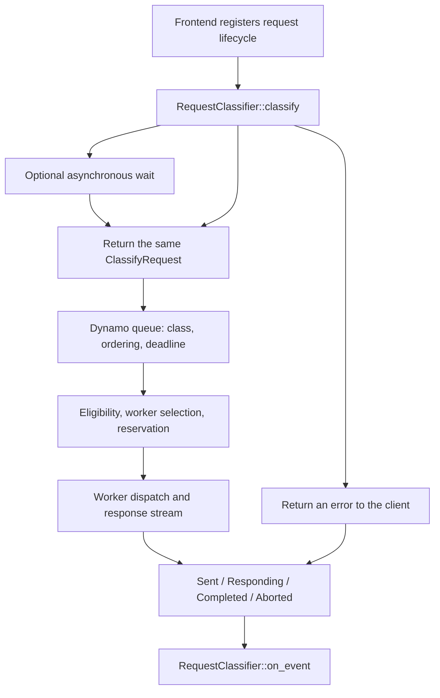

> [!WARNING]
> **Experimental.** The request-classifier API and its inputs can change. Build your plugin against the same NVIDIA Dynamo revision as the frontend. Custom plugins are linked at build time; YAML selects a linked type at startup.

Implement `RequestClassifier` to decide when a request can enter the KV router's scheduling queue. A classifier can return the request immediately, wait asynchronously before returning it, or reject it. It can also choose a queue class, set a queue deadline or scheduling cost, and supply a preferred worker and data-parallel rank.

The native [ThunderAgent plugin](../../../../use-cases/agents/thunderagent-program-scheduler.md#native-frontend-plugin) uses this API to hold requests from paused or busy sessions. Its worker-selection plugin handles placement after admission. You can write a classifier without replacing worker selection.

## Request Flow



Returning `Ok(request)` releases the request into Dynamo's scheduler. It does not guarantee immediate dispatch. Dynamo still owns worker eligibility, hard pins, queue limits, reservations, retries, and transport. Class fairness applies after the classifier releases a request; it does not order requests waiting inside your plugin.

Use the public types in `dynamo_kv_router::plugins::request_classifier` and register through `dynamo_kv_router::plugins::RouterPluginRegistry`. The provider validates YAML once at startup and returns a factory. Dynamo calls the factory when constructing each model's router. Plugin state is local to that instance unless you explicitly arrange sharing; multiple frontend replicas do not share an admission budget.

## Inputs and Decisions

| Input | Meaning |
|---|---|
| `request_id()` | Optional logical request ID; lifecycle events use this ID. |
| `session_context()` | Optional session ID, parent ID, final marker, input trigger, and captured agent headers. Headers are untrusted ingress observations; see [Agent Harnesses](../../../../use-cases/agents/agent-harnesses.mdx#agent-headers). |
| `input_tokens()` | Input size on the scheduler's routing-token basis. |
| `scheduling_cost_tokens()` | Initial uncached-work estimate, or your explicit override. This is one scalar, not a per-worker cache view. |
| `policy_class()` | Requested policy class, or your override. |
| `ingress_at()` | Original router ingress time on Tokio's monotonic clock. |
| `due_at()` | Deadline set by this classifier, if any. |
| `progress().context_tokens()` | Live logical context high-water mark, initialized from input size and raised by host observations of prompt plus output tokens. Clone the progress handle to retain it. This is not physical KV occupancy. |

The factory receives a `RequestClassifierContext`. Its `block_size()` is tokens per KV block. Its `workers()` returns registered worker/rank identities and each rank's optional `total_kv_blocks()`, from cached discovery configuration. These are advertised total capacities, not currently free blocks or health checks. A registered worker may be ineligible for a particular request. The current API returns a new vector on each read.

The classifier does not currently receive prefix hashes, expected output length, effective placement restrictions, or per-worker cache and load views. Worker-selection plugins have a separate input API; their `WorkerInputs` declarations do not apply to classifiers.

| Setter | Effect |
|---|---|
| `set_policy_class(name)` | Select a configured family or standalone explicit class. Family selection preserves Dynamo's uncached-input bucketing. A family-backed physical queue name is not a valid override. |
| `set_due_at(instant)` | Bound subsequent router queue waiting. It does not time out a pending classifier future or stop an already dispatched generation. |
| `set_scheduling_cost_tokens(tokens)` | Override the cost used by queue scheduling. It does not reserve that many KV tokens. |
| `set_worker_selection_target(worker)` | Replace this request's soft worker/rank preference. Hard pins and eligibility remain authoritative. |
| `clear_worker_selection_target()` | Clear the soft preference without removing hard pins. |

Dynamo recomputes cache eligibility when the released request enters the queue. Only explicit overrides survive classification; an estimate read before a long wait can be stale. Reconcile preferred placement with the actual worker reported by `Sent`.

## Implement and Register a Classifier

This example gives requests a router queue budget measured from original ingress. It rejects requests whose budget has already expired and immediately releases the rest with the same absolute deadline. It demonstrates registration and typed rejection without maintaining session state. Deferral and state cleanup are covered below.

Create an external library crate. Set `DYNAMO_DIR` to the checkout that will build your frontend and `PLUGIN_DIR` to the new crate directory:

```bash
export DYNAMO_DIR=/work/dynamo
export PLUGIN_DIR=/work/acme-admission
cargo init --lib --name acme-admission "$PLUGIN_DIR"
cargo add --manifest-path "$PLUGIN_DIR/Cargo.toml" --path "$DYNAMO_DIR/lib/kv-router" dynamo-kv-router
cargo add --manifest-path "$PLUGIN_DIR/Cargo.toml" --path "$DYNAMO_DIR/lib/runtime" dynamo-runtime
cargo add --manifest-path "$PLUGIN_DIR/Cargo.toml" serde --features derive
cargo add --manifest-path "$PLUGIN_DIR/Cargo.toml" tokio --features time
```

Put this implementation and catalog entry point in `src/lib.rs`:

```rust
use std::sync::Arc;
use std::time::Duration;

use dynamo_kv_router::plugins::RouterPluginRegistry;
use dynamo_kv_router::plugins::request_classifier::{
    ClassifierError, ClassifyFuture, ClassifyRequest, RequestClassifier,
    RequestClassifierFactory, RequestClassifierParameters,
    RequestClassifierProviderError, RequestClassifierRegistryError,
};
use dynamo_runtime::error::{DynamoError, ErrorClass};
use tokio::time::Instant;

struct QueueBudget {
    budget: Duration,
}

impl RequestClassifier for QueueBudget {
    fn classify(&mut self, mut request: ClassifyRequest) -> ClassifyFuture {
        let deadline = request.ingress_at() + self.budget;
        Box::pin(async move {
            if Instant::now() >= deadline {
                return Err(Box::new(
                    DynamoError::builder()
                        .class(ErrorClass::CapacityExhausted)
                        .diagnostic("admission wait budget exhausted")
                        .public_message("Admission wait budget exhausted; retry later")
                        .build(),
                ) as Box<ClassifierError>);
            }
            request.set_due_at(deadline);
            Ok(request)
        })
    }
}

#[derive(serde::Deserialize)]
#[serde(deny_unknown_fields)]
struct Parameters {
    max_wait_ms: u64,
}

fn provider(
    parameters: &RequestClassifierParameters,
) -> Result<RequestClassifierFactory, RequestClassifierProviderError> {
    let parameters: Parameters = parameters.deserialize()?;
    if !(1..=60_000).contains(&parameters.max_wait_ms) {
        return Err(RequestClassifierProviderError::new(
            "max_wait_ms must be between 1 and 60000",
        ));
    }
    let budget = Duration::from_millis(parameters.max_wait_ms);
    Ok(Arc::new(move |_context| Box::new(QueueBudget { budget })))
}

pub fn register(
    registry: &mut RouterPluginRegistry,
) -> Result<(), RequestClassifierRegistryError> {
    registry.register_request_classifier("acme-queue-budget", Arc::new(provider))
}
```

Choose a unique registered type name. Unknown types, duplicate registrations, and invalid parameters fail startup. The name `default` is reserved: omit `request_classifier` to use pass-through behavior.

### Link and Enable It

The Python binding has one replaceable catalog dependency, `dynamo-worker-selection-policy-catalog`. Despite its name, it registers both worker-selection policies and request classifiers. A crate with the `register` entry point above can occupy that slot directly. If you already have a catalog, add this crate as a dependency and call its registration function from your existing catalog instead.

```bash
cargo add \
  --manifest-path "$DYNAMO_DIR/lib/bindings/python/Cargo.toml" \
  --optional \
  --rename dynamo-worker-selection-policy-catalog \
  --path "$PLUGIN_DIR" \
  acme-admission
```

Build from a [source-build environment](../../../advanced-customizations/building-from-source.md), using that checkout's virtual environment:

```bash
cd "$DYNAMO_DIR"
test -d .venv || uv venv .venv
source .venv/bin/activate
cd lib/bindings/python
CARGO_TARGET_DIR="$DYNAMO_DIR/target" maturin develop --uv --features custom-policy
cd "$DYNAMO_DIR"
uv pip install -e .
```

The linked catalog adds plugins alongside Dynamo's builtins. Selecting the built-in ThunderAgent type needs no custom catalog or rebuild on a build that includes it. An external crate does require rebuilding the frontend extension or image; placing a Rust library next to a stock wheel does not load it.

Save this as `admission.yaml`:

```yaml
request_classifier:
  type: acme-queue-budget
  parameters:
    max_wait_ms: 2000
```

Start against existing workers with matching discovery configuration:

```bash
DYN_HTTP_OVERLOAD_STATUS_CODE=429 python3 -m dynamo.frontend \
  --router-mode kv \
  --router-policy-config admission.yaml
```

Intentional rejection should return a typed `DynamoError`. `ErrorClass::CapacityExhausted` maps to HTTP status 529 by default, or 429 with the environment variable above. `ErrorClass::RateLimited` is for caller-specific limits and maps to 429. Untyped plugin errors and panics become sanitized internal errors. Classifier rejection does not trigger worker migration. This path does not add a `Retry-After` header.

## Deferral and Lifecycle State

`classify` returns a `Send + 'static` future. The router calls its synchronous prologue under the classifier lock, then releases the lock before polling the future. Return promptly and do the wait inside the future. Move owned values or cloned `Arc` handles into it; the future cannot borrow `self`.

For a capacity gate, register a waiter and create a cleanup guard before returning the future. Inside the future, check shared state and await a notification when capacity is unavailable. Release the state lock before awaiting. Register notifications before checking the condition to avoid lost wakeups. Wrap the wait in `tokio::time::timeout_at` if admission has a budget, then carry that same absolute deadline into `set_due_at` after release. Setting `due_at` alone cannot interrupt this wait.

The native [ThunderAgent classifier](https://github.com/ai-dynamo/dynamo/blob/main/lib/router-plugins/builtin/src/thunderagent/request_classifier/mod.rs) implements this pattern with `PendingClassification` and `await_release`. Its guard removes a pending registration when the future is dropped. Give each registration its own identity so cleanup from an old future cannot remove a new request that reuses the same public ID.

Override `on_event` with `#[async_trait::async_trait]` when your policy retains state after admission; add `async-trait` to your crate. The default callback does nothing.

| Event | Use |
|---|---|
| `Sent` | Record the actual dispatched worker/rank. Dispatch does not prove backend admission. |
| `Responding` | Record response progress. It is not a measurement of pure decode time. |
| `Completed` | Release request state and reconcile optional final context-token usage. Completion can occur without a prior `Sent` when selection recorded a worker but dispatch never happened. |
| `Aborted` | Release request state after rejection, cancellation, or failure. Worker and error can be absent. |

Events arrive asynchronously, one callback at a time in lifecycle order. A pending classification does not block events. A slow `on_event` holds the classifier lock and delays new classifications, so keep callbacks short. Internal retries retain the logical lifecycle and classification overrides; do not equate a dispatch attempt with a new admitted request. Dynamo orders the previous terminal callback before classifying a reused request ID.

Queued events are dropped at router shutdown. Use drop guards for pending resources and make cleanup idempotent; do not depend on a final callback to release an external resource. Bound retained session state separately from active request state.

## Current Scope

- Use the embedded KV routing path in `dynamo.frontend`. The host registers the logical lifecycle and supplies progress and terminal events.
- Query-only selection probes do not run classification. Stateful `best_worker` and `RouterRequest::New` calls without a registered classifier lifecycle also bypass it. Standalone selection, including standalone EPP, rejects a configured classifier.
- Decode or aggregated routing owns the classifier lifecycle. The prefill leg skips it. In ordinary disaggregated serving, remote prefill can start before decode-side classification; this hook alone cannot prevent all prefill work before admission.
- A preferred worker is advisory. A plugin's token accounting does not pin cache, reserve physical KV memory, or preempt a running generation.

## Verify Your Plugin

Run `cargo check --manifest-path "$PLUGIN_DIR/Cargo.toml"` against the matching checkout, then test through the rebuilt frontend. Cover immediate admission, deliberate rejection, and any deferred path. Cancel a request while it waits, fail a dispatch, retry, and reuse a request ID; confirm no plugin state or reservation survives incorrectly. If you read worker capacity or progress, test missing capacities, rank removal, and growth while waiting. Confirm the client-visible error and that rejection sends no worker request.

For the queue-budget example, create queue contention and confirm requests past the deadline expire before dispatch. A successful idle request alone does not exercise the deadline.

Measure classification time and allocations with the plugin disabled, pass-through, and active. For stateful policies, also measure deferred age, completed requests, and latency tails under overload. The [request-classifier contract](https://github.com/ai-dynamo/dynamo/blob/main/lib/kv-router/src/plugins/request_classifier.rs), [router lifecycle tests](https://github.com/ai-dynamo/dynamo/blob/main/lib/llm/src/kv_router/routing_host/tests.rs), and [ThunderAgent implementation](https://github.com/ai-dynamo/dynamo/tree/main/lib/router-plugins/builtin/src/thunderagent) are the source references for these behaviors.
