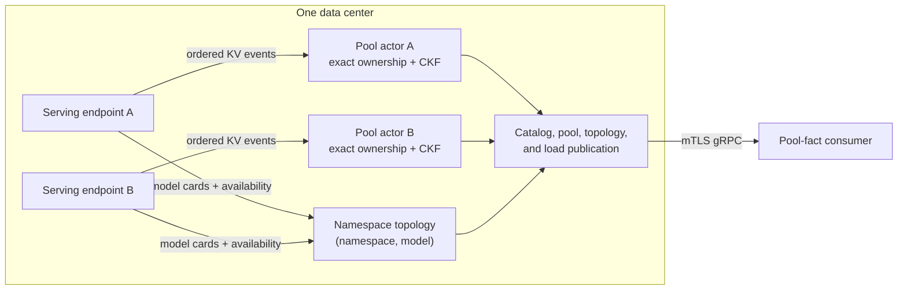

**Experimental.** NVIDIA Dynamo includes a data-center-local Relay, a versioned Cuckoo-filter
(CKF) publication contract, and an optional mutual TLS (mTLS) gRPC server. The Relay exports facts
for each Dynamo pool. A consumer decides which pools to compare and how to use those facts.

Sending every worker's full key-value (KV) event stream across a wide-area boundary would duplicate
exact ownership state outside its data center. The Relay keeps exact ownership local and publishes a
compact CKF projection for each pool.

## Architecture



The Relay maintains these boundaries:

- One serving endpoint with an active KV event source contributes one atomic pool, actor, and
  physical KV stream.
- Independent endpoints stay separate even when they advertise the same canonical model.
- The pool actor owns exact worker/rank membership, full-hash refcounts, CKF mutation, and
  publication sequencing.
- The catalog is endpoint-local. Serving topology is grouped independently by
  `(namespace, canonical_model_id)` and links members to pools by stable `PoolId`.
- Catalog, topology readiness, and load are separate projections. Their recovery does not mutate
  CKF state.
- A publication hub exists only after the first client subscribes to that pool.

Combining KV state from independent endpoints would make a hit ambiguous: a consumer could choose
one endpoint while the matching prefix exists only in another. Separate streams preserve the
physical routing boundary and let the consumer apply its own policy.

The Relay materializes an endpoint pool only while all of these conditions hold:

- The endpoint membership has an indexer domain, at least one valid model registration, and no
  structural conflict.
- The endpoint's runtime configuration resolves one unambiguous KV-state endpoint.
- At least one expected worker/rank advertises an active KV event source.

If any condition stops holding, the Relay withdraws the pool before actor teardown. The endpoint
can remain in serving topology while its member link changes from a `PoolId` to no pool link.

## Pool and Producer Identity

An indexer domain combines cache semantics with a routing-isolation scope. The normal derived
routing scope includes the Dynamo endpoint identity, so two endpoints produce different domains.
An explicit indexer identity can override that derivation.

A pool adds the logical data-center identity to one indexer domain:

```text
PoolId = (identity_version, IndexerDomainId, DcId)
```

`PoolId` identifies the stable logical pool. The serving `namespace.component.endpoint` is carried
separately in the pool descriptor so a consumer can resolve the stream to the endpoint that owns
it. It is not an inference ingress. The descriptor also carries the endpoint's declared worker
roles. `ProducerIdentity` identifies one physical CKF generation for that pool. If two live
endpoints resolve to the same `PoolId`, the Relay treats ownership as ambiguous, fences the identity,
and withdraws it from the catalog instead of aggregating both endpoints.

The wire contract uses typed lifecycle identities:

- `RelayIdentity` contains the Dynamo runtime instance ID and a random Relay incarnation generated
  by each `KvDcRelay::start` call.
- `ProducerIdentity` contains the complete `PoolId`, producer incarnation, layout generation, and
  CKF format.

Consumers reject Relay, producer, layout, or format drift before applying payload bytes. A new
producer generation starts a new sequence space and requires a new snapshot.

## Canonical Models and LoRA

Each endpoint pool has one canonical base-model target. Additional registrations can expose
Low-Rank Adaptation (LoRA) adapters backed by that model. Every registration includes:

- the canonical request model ID;
- a target that is either the pool's base model or a LoRA adapter with that backing base model;
- zero or more aliases.

LoRA adapters share the KV domain of their backing base model. They remain nested registrations on
that pool and do not create separate CKF streams. In the topology projection an adapter is nested
under its base model instead of creating a top-level entry, so the base model can be ready while a
specific adapter is unavailable.

The Relay does not flatten descriptors into model-to-pool or alias-to-model indexes. A consumer can
derive the lookup shape it needs from catalog snapshots. Two endpoints that register the same
canonical model therefore remain two candidate descriptors with independent producer identities.

## Aggregated, PD, and EPD Topologies

An aggregated deployment normally contributes one KV-publishing endpoint, one pool, and one
`AGGREGATED` topology member. Prefill/decode (PD) disaggregation contributes separate Prefill and
Decode endpoints and therefore separate physical pools. Both CKFs are meaningful: the Prefill CKF
describes prefill-side prefix reuse, while the Decode CKF describes decode-side reuse. Consumers
must hash a request separately for each pool using its own `query_semantics`; the two endpoints can
use different hash formats.

Encode/prefill/decode (EPD) adds an `ENCODE` topology dependency. Encode is required for base-model
readiness but is not an adapter-bearing role; Low-Rank Adaptation membership is evaluated only for
Prefill, Decode, and Aggregated roles. An Encode-only endpoint remains an `ENCODE` topology member,
but its `pool_id` is present only while the Relay observes an active KV event source. Without one,
the Relay allocates no CKF or load state. If an Encode implementation starts publishing KV events,
the Relay materializes its endpoint-local pool and updates the topology link. Removing that source
withdraws the pool and changes the member's `pool_id` from present to absent.

## WAN API

The protobuf package is `dynamo.kvrelay.v1`. Every top-level request and response carries the v1
contract marker, and every response carries protocol version `1` and a typed Relay identity.

| RPC | Contract |
| --- | --- |
| `GetRelayInfo` | Returns the protocol version and current `RelayIdentity`. |
| `WatchKvPoolCatalog` | Sends the current revisioned catalog snapshot, then a new complete snapshot after each observed catalog change. |
| `SubscribeKvPool` | Selects one exact `ProducerIdentity` from the catalog; sends an initial chunked CKF snapshot, contiguous deltas, and application heartbeats. |
| `SubscribeServingReadiness` | Sends the current namespace topology projection, updates on revision changes, and repeats it on heartbeats. |
| `SubscribeKvPoolLoad` | Sends the current complete load window, then complete windows for all active pools. |

Each streaming request includes a non-empty subscriber ID of at most 128 bytes. Subscriber limits
are finite for every stream type. Pool subscriber queues have independent message and byte limits;
a client that falls behind receives `RESOURCE_EXHAUSTED` and must resubscribe. Load stream lag uses
the same resubscribe boundary. Reconnecting one stream does not reset the others.

A pool subscription carries the complete `ProducerIdentity` from a catalog snapshot. An absent
pool returns `NOT_FOUND`. If that pool now has a different producer generation, the Relay returns
`FAILED_PRECONDITION` without initializing the replacement generation's publication hub. Refresh
the catalog before retrying either response.

## CKF Publication

For each pool, ordered KV events identify an owner by `(worker_id, dp_rank)` and carry full block
hashes. The Relay tracks each owner's exact hashes and a pool-wide refcount for every full hash.

| Ownership change | Relay behavior |
| --- | --- |
| First owner of a full hash | Insert one CKF fingerprint. |
| Another owner of the same full hash | Increment the refcount only. |
| One of several owners removes it | Decrement the refcount only. |
| Final owner removes it | Remove one CKF fingerprint. |

Full hashes remain authoritative because a fingerprint is lossy, can collide, and has no owner
identity. The CKF projection can return false positives. A capacity failure before mutation commit
can also leave an observable omission without corrupting exact ownership.

The first `SubscribeKvPool` call for a generation initializes its publication hub:

1. The hub acquires one actor publication lease and copies a complete CKF snapshot.
2. The subscriber captures that snapshot cut and a bounded delta queue.
3. Snapshot encoding runs outside async worker threads under a finite concurrency limit.
4. Ordered deltas follow the snapshot sequence.
5. Later subscribers reuse the same hub and receive their own snapshot cut and bounded queue.

No publication hub or full CKF mirror is allocated for a pool without subscribers. A terminal hub
failure fences and withdraws the owning producer generation so later discovery can bind a fresh
generation.

`FilterUpdate.payload` uses Cuckoo Bucket Images v1 (CBI1). A snapshot contains ordered chunks of
dense `u64` bucket words. A delta contains absolute `(bucket, value)` images and the base sequence it
extends. Absolute images are idempotent at the bucket level. Sequence numbers detect gaps but do
not make a multi-bucket update atomic.

## Serving Readiness

Readiness answers whether a canonical model in one Dynamo namespace has an authoritative serving
topology with the required live roles. Each entry is keyed by
`(namespace, canonical_model_id)`; producer replacement does not change that key.

- `READY` means at least one worker is live and Dynamo's namespace-wide dependency DNF is
  satisfied.
- `UNAVAILABLE` means availability is authoritative but a declared role is absent or no worker is
  live.
- `UNKNOWN` means at least one participating endpoint has not produced an authoritative
  availability snapshot.

`TopologyEntry.members` lists each endpoint, its declared roles, and an optional stable
`PoolId`. Consumers resolve the current `ProducerIdentity` through the catalog. Any legacy model
card activates Dynamo's compatibility fallback—ready when any worker is live—and sets
`legacy_fallback_active`. `duplicate_role_endpoints` lists each typed Prefill or Decode role that is
advertised by more than one endpoint for the key. This is an observable topology fact, not a
version-independent conclusion that serving is degraded or that local Prefill/Decode rendezvous is
disabled. Consumers decide how to interpret it for their Dynamo version and deployment policy.

For a LoRA target, the nested adapter status also requires adapter membership with the advertised
backing base model on each applicable role. Readiness is a serving fact, not a CKF hit guarantee.
The Relay does not publish a request ingress; mapping a topology key to an ingress remains consumer
or deployment policy.

## Pool Load

The load stream publishes one atomic update per configured window. Each pool entry reports these
independent signals:

- used and total KV blocks;
- active decode blocks;
- active prefill tokens and prefill token capacity.

Each signal includes observed-rank and expected-rank counts. Missing observations remain missing;
the Relay does not convert partial coverage into zero load. A consumer can ignore or degrade a
signal whose coverage is incomplete. `window_sequence` orders complete windows, while local receive
time determines freshness across data centers.

## Recovery Boundaries

| Failure | Recovery boundary |
| --- | --- |
| Worker event gap or source replacement | Rebuild the affected worker rank before activating its replacement source. |
| Suspect exact pool state or duplicate `PoolId` | Withdraw and fence the producer generation, then materialize a fresh generation when discovery is valid. |
| Catalog disconnect | Reopen `WatchKvPoolCatalog` and replace the local catalog with its first snapshot. |
| Pool stream lag, sequence gap, identity drift, or malformed CBI1 | Retire only that consumer pool state, reopen `SubscribeKvPool`, and install a complete snapshot. |
| Topology disconnect | Reopen `SubscribeServingReadiness` and replace the complete topology projection. |
| Load lag or disconnect | Reopen `SubscribeKvPoolLoad` and accept the next complete window. |

A fenced pool is withdrawn before actor teardown begins, so the catalog does not advertise a
generation whose recovery is draining.

## Transport and Metrics

Setting `--bind` enables the WAN server and requires `--tls-server-cert`, `--tls-server-key`, and
`--tls-client-ca`. The listener fails startup if it cannot load the TLS material or bind the socket.
Omit `--bind` to run the local producer without a WAN listener.

The server applies finite message sizes, subscriber counts, publication queue sizes, snapshot
encoding concurrency, HTTP/2 keepalive, and heartbeat intervals. A terminal transport task failure
cancels the Relay and appears in its health response.

Relay metrics use Dynamo's system metrics endpoint. Set `DYN_SYSTEM_PORT` to expose them; the Relay
does not open a separate metrics listener. See the [Metrics Catalog](../../reference/observability/metrics-catalog.mdx#kv-dc-relay-metrics)
and [Metric Labels](../../reference/observability/metric-labels.mdx#metric-specific-labels).

For launcher configuration and examples, see the
[DC KV Relay README](https://github.com/ai-dynamo/dynamo/blob/main/components/src/dynamo/kv_dc_relay/README.md).
