NVIDIA Dynamo is a high-performance distributed inference platform designed to be
deployed within a secure, trusted environment. A deployment coordinates many
parts — a frontend, backend workers, a KV router, and internal communication
planes for discovery, events, and requests — across a cluster. This guide
describes Dynamo's trust model and how to secure each part of a deployment.

Dynamo assumes it runs inside a trusted network boundary: untrusted clients reach
only the frontend, through an authenticating gateway, while the internal
communication planes and infrastructure run on a network the operator isolates.
The sections below explain that boundary and how to harden each component and
plane.

> [!IMPORTANT]
> The `docker compose` files and example manifests in this repository are
> provided for **local development and demonstration only**. They are not a
> hardened, production deployment mechanism. For secure, production deployments,
> use the Kubernetes deployment path.

## Trust Model

Dynamo separates client-facing traffic from internal coordination:

- The **external-facing inference API** — the frontend's OpenAI-compatible HTTP
  endpoint, which serves inference requests to clients.
- The **internal communication planes** — discovery, event, and request planes,
  plus infrastructure services (NATS, ModelExpress, and the NIXL/RDMA
  data-transfer fabric) that components use to find each other and coordinate.

The security posture rests on two assumptions:

1. The **internal communication planes and infrastructure services** are deployed by the
   operator in a secure fashion and reside within a **trusted network** that
   untrusted clients cannot reach.
2. **Untrusted clients reach only the frontend**, and only through a gateway or
   proxy that terminates authentication and TLS.

If both hold, the externally reachable surface is limited to the frontend's
inference API. The sections below explain how to satisfy each assumption.

The gateway is the only entry point into the cluster for untrusted clients; it forwards to the
frontends (the external-facing inference API). Everything inside — the frontends,
the internal communication planes, and the workers — runs on the trusted network
and must be protected from any untrusted peer.

## Securing the External-Facing Inference API

Do not expose the Dynamo frontend directly to an untrusted network. Deploy it as
a microservice behind a dedicated gateway or proxy that provides:

- **Authentication and authorization** of clients.
- **TLS termination** and encryption in transit.
- **Rate limiting** and request-size limits.
- **Load balancing** across frontend replicas.

On Kubernetes, place a standard ingress or Gateway that you configure for
authentication and TLS in front of the Dynamo Frontend service. The frontend
implements no client authentication; that is the gateway's responsibility. If you
adopt Dynamo's optional [Gateway API routing topology](../../kubernetes/installation/gateway-api-routing.mdx),
note that its Endpoint Picker selects a backend for load and KV-cache reasons and
does not authenticate clients, so it still sits behind your authenticating
gateway.

## Securing the Internal Communication Planes

Dynamo components coordinate over three internal communication planes —
**discovery**, **event**, and **request**. All three are intended to run within
the trusted network and must never be reachable by untrusted clients. Secure each
as follows.

### Discovery plane

Workers register their endpoints and are discovered through the discovery plane.

- **Recommended — Kubernetes-based discovery.** Set
  `DYN_DISCOVERY_BACKEND=kubernetes`. Dynamo discovers workers through RBAC-gated
  custom resources; reads and writes are authorized by the Kubernetes API server
  using each pod's ServiceAccount, so there is no anonymous, network-reachable
  discovery store to protect.
- **Alternative — authenticated etcd.** If you use etcd for discovery, enable
  authentication; never run it with anonymous access on a shared network.
  Dynamo's etcd client supports username/password
  (`ETCD_AUTH_USERNAME`/`ETCD_AUTH_PASSWORD`) and mutual TLS (`ETCD_AUTH_CA`,
  `ETCD_AUTH_CLIENT_CERT`, `ETCD_AUTH_CLIENT_KEY`); provide the matching
  credentials to every component.

**Why it matters:** an unauthenticated discovery plane lets any peer on the
network enumerate workers and inject or alter routing metadata. See the
[Discovery Plane](../knowledge-base/concepts/communication-planes/discovery-plane.md)
reference.

### Event plane

Components exchange coordination events — including the KV-cache events used for
KV-aware routing — over the event plane. Dynamo supports two event transports,
selected by `DYN_EVENT_PLANE`:

- **NATS** (preferred where the event plane must be authenticated). Enable NATS
  authentication — `NATS_AUTH_USERNAME`/`NATS_AUTH_PASSWORD`, or
  `NATS_AUTH_TOKEN`, `NATS_AUTH_NKEY`, or `NATS_AUTH_CREDENTIALS_FILE` — and TLS
  (`NATS_TLS_CA_CERT_PATH`). Whether the NATS server *requires* these is enforced
  by the NATS server configuration (for example `tls { ca_file: …; verify: true }`),
  not by Dynamo, so harden the server config as well.
- **ZMQ** is the default event transport in configurations without NATS, and some
  backends (for example, vLLM) publish KV-cache events over ZMQ natively. ZMQ
  carries KV-cache **event metadata**, not request or response content, and has no
  built-in authentication or encryption, so keep every ZMQ endpoint on the trusted
  network: bind the broker (`ZMQ_BROKER_XSUB_BIND` / `ZMQ_BROKER_XPUB_BIND`) and
  the advertised KV-event host to cluster-internal addresses, keep intra-node
  sockets on loopback, and restrict the ports with NetworkPolicy. Authenticated
  encryption for ZMQ is possible future hardening but requires additional
  key-management infrastructure.

**Why it matters:** keep the event plane on the trusted network so peers cannot
subscribe to KV-cache event metadata or inject events. Prefer NATS with
authentication and TLS wherever the event plane crosses a trust boundary. See the
[Event Plane](../knowledge-base/concepts/communication-planes/event-plane.md)
reference.

### Request plane

Requests and KV-cache data move between components over the request plane (TCP,
and the NIXL/RDMA fabric for data transfer).

- **Encrypt the request plane with TLS (available today).** Enable TLS on the TCP
  request plane with `DYN_TCP_TLS_CERT_PATH` + `DYN_TCP_TLS_KEY_PATH` (server side);
  clients verify the server with `DYN_TCP_TLS_CA_CERT_PATH` (and
  `DYN_TCP_TLS_SERVER_NAME` to pin the expected name). This protects the
  confidentiality and integrity of request-plane traffic in transit.
- Keep the **NIXL/RDMA** data-transfer fabric on the trusted network.

> [!NOTE]
> Server TLS above encrypts the request plane but does not *authenticate* the
> client. Mutual TLS (both ends present certificates, so an unauthenticated client
> is rejected at the handshake), along with Helm-based setup of the TCP and NATS
> certificates, is in progress
> ([#13528](https://github.com/ai-dynamo/dynamo/pull/13528),
> [#10809](https://github.com/ai-dynamo/dynamo/issues/10809)). Until it lands,
> authenticate the request plane by keeping it on the trusted network.

**Why it matters:** without mutual authentication, any peer that can reach a
worker on the request plane can deliver requests or data-transfer payloads to it,
so network isolation is required in addition to TLS encryption. See the
[Request Plane](../knowledge-base/concepts/communication-planes/request-plane.md)
reference.

## Restrict or Disable Optional Surfaces

Dynamo exposes optional control and extension surfaces beyond plain inference.
Disable the ones you do not need so that only the required capabilities are
reachable.

### Frontend extensions and admin API

- **Client-controlled routing (`nvext`).** By default the frontend honors an
  `nvext` request extension and routing-override headers that let a client pin a
  request to a specific worker instance. In a multi-tenant or untrusted-client
  setting, set `DYN_DISABLE_FRONTEND_NVEXT=1` so clients cannot target individual
  workers. This drops `request.nvext` at handler entry and ignores the
  routing-override headers.
- **Admin API.** The frontend's HTTP admin API (for example,
  `GET`/`POST /busy_threshold`) is enabled by default. If operators do not need to
  change runtime tunables through it, set `DYN_DISABLE_FRONTEND_ADMIN_API=1`.
  Inference, metrics, models, health, and liveness routes are unaffected.
- **Metrics endpoint.** The `/metrics` endpoint is intended for scraping by
  trusted monitoring systems; scope it to your observability stack rather than
  exposing it to untrusted networks.

### Worker control surface

Each worker runs a system server (the `/engine/*` routes on `DYN_SYSTEM_PORT`)
that exposes advanced control operations — profiling, memory management, and
weight updates. Keep this port on the trusted network only, and expose only the
routes a deployment actually uses.

## Securing Model and Backend Code

Dynamo loads models, tokenizers, chat templates, and (depending on the backend)
executable model code. Treat all of these as code that runs with the worker's
privileges.

- **Load models only from trusted sources.** Restrict which model repositories and
  registries workers may pull from, and restrict write access to any shared model
  cache or storage so that only trusted principals can publish artifacts.
- **Be deliberate about remote code execution options.** Framework options that
  execute model-supplied Python (for example, `trust_remote_code`) should be
  enabled only for models you trust.
- **Validate request-derived values.** When integrating or extending Dynamo,
  validate values taken from a request before using them in security-sensitive
  operations such as outbound network requests, file paths, or deserialization.

## Running with Least Privilege

### Kubernetes deployments

- Use **RBAC** and grant each component's ServiceAccount only the permissions it
  needs. The Dynamo operator ships with scoped roles; do not broaden them.
- Apply **NetworkPolicies** so the internal communication planes, the workers, and the
  NIXL/RDMA fabric are reachable only by the components that need them, and never
  from outside the cluster boundary.
- Run pods as **non-root** with a read-only root filesystem where possible, drop
  unneeded Linux capabilities, and set resource limits.

### Standalone Docker deployments

Apply standard Docker hardening: restrict container network access to the trusted
segment, set CPU/memory limits, avoid `--privileged`, drop unneeded capabilities,
and run as a non-root user.

## Reporting a Vulnerability

To report a potential security vulnerability in Dynamo, follow the process in
[`SECURITY.md`](https://github.com/ai-dynamo/dynamo/blob/main/SECURITY.md) —
NVIDIA PSIRT via the
[Security Vulnerability Submission Form](https://www.nvidia.com/en-us/support/submit-security-vulnerability/)
or [psirt@nvidia.com](mailto:psirt@nvidia.com). Do not open a public GitHub issue
for security reports.
