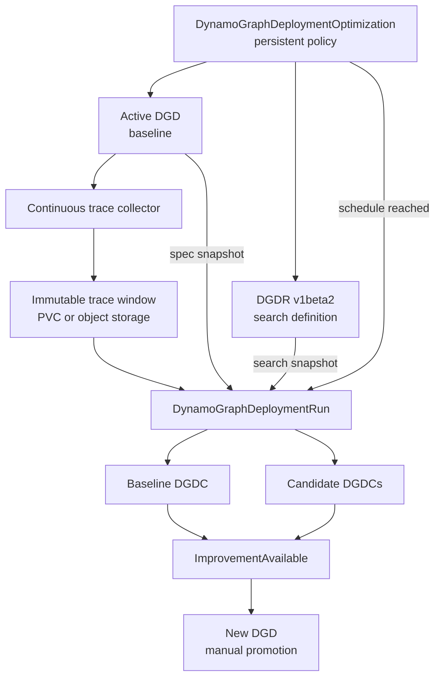

Continuous profiling periodically captures traffic from an active `DynamoGraphDeployment` (DGD),
searches alternative configurations, and reports whether any candidate is a meaningful improvement.
It extends the one-time [DGDR v1beta2 search workflow](dgdr-v1beta2.md) with trace collection,
scheduling, baseline evaluation, comparison, and retention.

> [!WARNING]
> **Experimental design sketch.** `DynamoGraphDeploymentOptimization` and the continuous tracing
> workflow described here are not implemented. The resource shape and comparison policy can change.

## Optimization Policy

A long-lived `DynamoGraphDeploymentOptimization` represents the recurring policy. The referenced
DGD is the baseline for every run. The controller resolves the current DGD generation and creates an
immutable `DynamoGraphDeploymentRun` when a trace window closes.

| Resource | Responsibility |
| --- | --- |
| `DynamoGraphDeploymentOptimization` | Select the active DGD, DGDR, trace window, schedule, and comparison policy |
| `DynamoGraphDeploymentRun` | Snapshot one baseline, trace artifact, and resolved search configuration |
| `DynamoGraphDeploymentCandidate` | Store the evaluated baseline or one candidate DGD spec and its simulation results |
| `DynamoGraphDeploymentRequest` | Define the reusable search and run it directly without continuous tracing or scheduling |

The higher-level resource and a manually created DGDR share the same run and candidate machinery:



## Proposed Resource

The following sketch runs a daily Pareto search against the preceding 24 hours of traffic:

```yaml
apiVersion: nvidia.com/v1alpha1
kind: DynamoGraphDeploymentOptimization
metadata:
  name: qwen-daily
  namespace: inference
spec:
  targetRef:
    apiVersion: nvidia.com/v1beta1
    kind: DynamoGraphDeployment
    name: qwen-production

  requestRef:
    apiVersion: nvidia.com/v1beta2
    kind: DynamoGraphDeploymentRequest
    name: qwen-search

  schedule:
    interval: 24h

  trace:
    window: 24h
    retention: 7d
    storage:
      pvc:
        name: workload-traces
        path: qwen-production
    parameters: # unstructured
      format: dynamo
      records:
        - request_end

  comparison:
    parameters: # unstructured
      minimumRelativeImprovement: 0.10

  promotion:
    mode: Manual
```

Create `qwen-search` as a regular [DGDR v1beta2](dgdr-v1beta2.md) resource. It defines the model,
hardware bounds, objective, search budget, unstructured Sweeper parameters, candidate limit, and DGD
overrides. You can still run that DGDR manually for an ad hoc search.

The optimization controller does not own or mutate the referenced DGDR. For each scheduled run, it
snapshots the DGDR UID, generation, and spec. The captured trace artifact replaces the concrete
trace source in that snapshot while preserving the DGDR's trace format and Replay controls. A
referenced DGDR therefore uses a trace workload rather than a static workload.

Updating the DGDR does not modify or cancel an active run. The next scheduled run uses the new DGDR
generation. Multiple optimization resources can reference one DGDR when they intentionally share
the same search definition.

Keep collector-specific tracing settings and evolving comparison knobs unstructured until their
semantics stabilize. Keep the trace contents outside Kubernetes objects; the CRD and run status
store only artifact references, digests, time ranges, and summary statistics.

## Run Scheduling

One optimization resource has at most one active run. This is a fixed invariant rather than a
configurable concurrency policy. Parallel runs could evaluate overlapping trace windows, consume
the same simulation capacity, and produce competing recommendations for one baseline.

When another interval expires during an active run, the controller skips that occurrence instead of
queueing it. The next regular interval can create a run after the active run reaches a terminal
state. Status records skipped occurrences:

```yaml
status:
  activeRunRef:
    name: qwen-daily-20260812
  lastSkippedScheduleTime: "2026-08-13T00:00:00Z"
```

A manual restart first cancels the active run and then creates a new run. It does not allow two runs
for the same optimization resource to overlap.

## Baseline Evaluation

Resolve `targetRef` for every run instead of comparing new candidates with results from an older
trace window. Store these inputs in the immutable run:

- the baseline DGD name, UID, generation, and complete spec snapshot;
- the trace artifact reference, digest, start time, and end time;
- the referenced DGDR name, UID, generation, and resolved spec snapshot; and
- the versions of Sweeper, Replay, and their performance data.

Evaluate the baseline with the same trace and Replay implementation as every alternative. Comparing
new simulated candidates with live baseline metrics would mix different measurement methods and
could report an improvement caused only by model bias.

Represent the baseline evaluation as a DGDC with `role: Baseline`. It contains the copied DGD spec
and simulation metrics, remains visible with the other run results, and does not count against
`recommendation.maxCandidates`. If Replay cannot represent the active DGD, report the baseline as
unsupported and leave the improvement condition unknown.

## Improvement Semantics

Sweeper currently ranks scalar candidates or returns the non-dominated candidate set for a Pareto
search. It does not accept a baseline. The continuous profiling controller adds the baseline
comparison after Sweeper evaluates the candidates.

For a scalar objective, compare each candidate score with the baseline score. Sweeper normalizes
scores so a larger value is always better, including objectives such as end-to-end latency that are
minimized in their natural units.

For a Pareto objective, classify every published candidate relative to the baseline:

| Classification | Meaning |
| --- | --- |
| `DominatesBaseline` | No worse in every objective and strictly better in at least one objective |
| `Tradeoff` | Better in at least one objective and worse in another |
| `DominatedByBaseline` | The baseline is no worse in every objective and strictly better in at least one objective |
| `EquivalentToBaseline` | No objective differs beyond the configured comparison margin |

This comparison is component-wise; it is not the minimum score across the candidates. Several
candidates can dominate the baseline while representing different positions on the Pareto front.
The candidate selection step should preserve a bounded, diverse set so the user can choose the
preferred tradeoff.

Strict dominance treats any measurable difference as an improvement. Apply an explicit comparison
margin before notifying the user so simulation noise does not create recommendations. The first
version can keep this policy unstructured while the project determines whether thresholds belong to
individual objectives, one primary objective, or confidence intervals.

Report the comparison on the run rather than on the persistent optimization policy alone:

```yaml
status:
  baselineCandidateRef:
    name: qwen-daily-20260812-baseline
  comparison:
    improvingCandidateRefs:
      - name: qwen-daily-20260812-0
      - name: qwen-daily-20260812-2
    tradeoffCandidateRefs:
      - name: qwen-daily-20260812-1
  conditions:
    - type: ImprovementAvailable
      status: "True"
      reason: CandidatesDominateBaseline
```

`ImprovementAvailable=False` means that the completed run found no candidate meeting the comparison
policy. It does not mean that the search failed. Use the run's `Completed` condition to report
execution success or failure separately.

## Promotion

Keep promotion manual for the first version. A candidate contains a complete DGD spec, but not every
DGD change is safe to apply in place. Create a new DGD from the selected candidate, review it, move
traffic to it, and retain the old DGD for rollback.

After the new deployment becomes the production baseline, update `targetRef` to its name. The next
run snapshots and evaluates that DGD rather than continuing to compare with the retired deployment.
A future promotion controller can classify in-place changes, replacement-required changes, and
traffic migration, but that behavior is outside Sweeper.

## Trace Lifecycle

Capture only the request metadata needed by Replay by default. Prompt and response payloads are not
required for length, timing, and cache-reuse simulation and introduce additional privacy and storage
requirements.

Store completed trace windows on a persistent volume or in object storage. Delete an artifact only
after no retained run references it. The optimization controller can garbage-collect run metadata
and trace artifacts according to their configured retention periods.

See [Sweeper Traffic](../../developer-guide/knowledge-base/modular-components/ai-simulate-experimental/sweeper-experimental/traffic.md)
for workload and trace semantics and [Sweeper Optimization
Goals](../../developer-guide/knowledge-base/modular-components/ai-simulate-experimental/sweeper-experimental/optimization-goals.md)
for scalar and Pareto evaluation.
