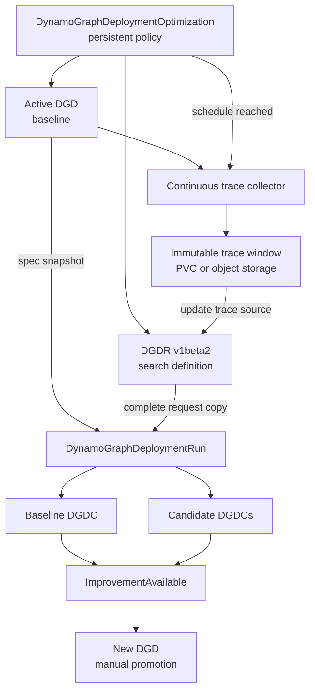

Continuous profiling periodically captures traffic from an active `DynamoGraphDeployment` (DGD),
searches alternative configurations, and reports whether any candidate is a meaningful improvement.
It extends the one-time [DGDR v1beta2 search workflow](dgdr-v1beta2.md) with trace collection,
scheduling, baseline evaluation, comparison, and retention.

> [!WARNING]
> **Experimental.** The continuous profiling API, trace settings, and comparison parameters can
> change in a future release.

## How Continuous Profiling Works

A long-lived `DynamoGraphDeploymentOptimization` represents the recurring policy. The referenced
DGD is the baseline for every run. When a trace window closes, Dynamo stores it at a new location
and updates the referenced DGDR's trace source. The resulting DGDR generation creates an immutable
`DynamoGraphDeploymentRun` with a complete copy of the request.

Continuous profiling uses the same run and candidate resources as a manually created DGDR:



## Create an Optimization

Create a `v1beta2` DGDR that defines the model, hardware bounds, objective, search budget,
unstructured Sweeper parameters, candidate limit, and DGD overrides. Set a trace workload; the
optimization updates its trace source to the location of each completed trace window. This normal
DGDR spec change starts the search; the optimization does not use `spec.rerun.reason` for scheduled
runs. You can run the same DGDR manually for an ad hoc search. See [Auto Deploy with DGDR
v1beta2](dgdr-v1beta2.md) for a complete request.

Create an optimization that references the DGDR and the active DGD. The following manifest runs a
daily Pareto search against the preceding 24 hours of traffic:

```yaml
apiVersion: nvidia.com/v1alpha1
kind: DynamoGraphDeploymentOptimization
metadata:
  name: qwen-daily
  namespace: inference
spec:
  targetRef:
    apiVersion: nvidia.com/v1beta1
    kind: DynamoGraphDeployment
    name: qwen-production

  requestRef:
    apiVersion: nvidia.com/v1beta2
    kind: DynamoGraphDeploymentRequest
    name: qwen-search

  schedule:
    interval: 24h

  trace:
    window: 24h
    retention: 7d
    storage:
      pvc:
        name: workload-traces
        path: qwen-production
    parameters: # unstructured
      format: dynamo
      records:
        - request_end

  comparison:
    parameters: # unstructured
      minimumRelativeImprovement: 0.10
```

Apply the optimization:

```bash
kubectl apply -f qwen-daily.yaml
kubectl get dynamographdeploymentoptimization qwen-daily -n inference -w
```

At the end of a trace window, the optimization writes the completed trace to a unique URI or PVC
path and updates the referenced DGDR's trace source. The DGDR controller then creates a run whose
spec contains the complete updated DGDR request. The request's trace format and Replay controls
remain unchanged.

Updating the DGDR does not modify or cancel an active run. The next scheduled run uses the new DGDR
generation. Use a dedicated DGDR for each optimization because the optimization changes its trace
source. Share common search parameters through manifest generation instead of allowing multiple
optimizations to write one request.

`trace.parameters` and `comparison.parameters` are unstructured. Use them for collector-specific
settings and comparison knobs supported by the installed version. Trace contents remain outside
Kubernetes objects; the optimization and run status store only artifact references, time ranges,
and summary statistics.

## Run Scheduling

One optimization resource has at most one active run. This behavior is not configurable.

When another interval expires during an active run, Dynamo skips that occurrence instead of
queueing it. The next regular interval can create a run after the active run reaches a terminal
state. For an accepted occurrence, Dynamo closes the window, writes it to a new S3 URI or PVC path,
and updates `workload.trace.source` in the referenced DGDR. Status records skipped occurrences:

```yaml
status:
  activeRunRef:
    name: qwen-daily-20260812
  lastSkippedScheduleTime: "2026-08-13T00:00:00Z"
```

To restart immediately with unchanged inputs, cancel the active run and change the referenced
DGDR's `spec.rerun.reason`. Dynamo does not allow two runs for the same optimization resource to
overlap.

## Baseline Evaluation

Dynamo resolves `targetRef` for every run instead of comparing new candidates with results from an
older trace window. The immutable run records:

- the baseline DGD name, UID, generation, and complete spec snapshot;
- the trace artifact reference, start time, and end time;
- the referenced DGDR name, UID, generation, and complete request copy; and
- the versions of Sweeper, Replay, and their performance data.

Dynamo evaluates the baseline with the same trace and Replay implementation as every alternative.
It does not compare simulated candidates with live baseline metrics because the two measurement
methods are not equivalent.

The baseline evaluation appears as a DGDC with `role: Baseline`. Its spec contains the flat copied
DGD fields plus the resolved evaluation parameters, while its status contains simulation metrics.
It remains visible with the other run results and does not count against
`recommendation.maxCandidates`. If Replay cannot represent the active DGD, the baseline is
`Unsupported` and the improvement condition remains `Unknown`.

## Improvement Semantics

Sweeper ranks scalar candidates or returns the non-dominated candidate set for a Pareto search.
Continuous profiling compares those results with the evaluated baseline.

For a scalar objective, compare each candidate score with the baseline score. Sweeper normalizes
scores so a larger value is always better, including objectives such as end-to-end latency that are
minimized in their natural units.

For a Pareto objective, classify every published candidate relative to the baseline:

| Classification | Meaning |
| --- | --- |
| `DominatesBaseline` | No worse in every objective and strictly better in at least one objective |
| `Tradeoff` | Better in at least one objective and worse in another |
| `DominatedByBaseline` | The baseline is no worse in every objective and strictly better in at least one objective |
| `EquivalentToBaseline` | No objective differs beyond the configured comparison margin |

This comparison is component-wise; it is not the minimum score across the candidates. Several
candidates can dominate the baseline while representing different positions on the Pareto front.
Dynamo publishes at most the referenced DGDR's `recommendation.maxCandidates` limit. Inspect the
published tradeoffs before selecting a replacement deployment.

Strict dominance treats any measurable difference as an improvement. Apply an explicit comparison
margin to prevent simulation noise from creating recommendations. Set the supported threshold keys
under `comparison.parameters`.

Inspect the comparison on the run:

```yaml
status:
  baselineCandidateRef:
    name: qwen-daily-20260812-baseline
  comparison:
    improvingCandidateRefs:
      - name: qwen-daily-20260812-0
      - name: qwen-daily-20260812-2
    tradeoffCandidateRefs:
      - name: qwen-daily-20260812-1
  conditions:
    - type: ImprovementAvailable
      status: "True"
      reason: CandidatesDominateBaseline
```

`ImprovementAvailable=False` means that the completed run found no candidate meeting the comparison
policy. It does not mean that the search failed. Use the run's `Completed` condition to report
execution success or failure separately.

Resolve the active run from the optimization and inspect its status:

```bash
RUN=$(kubectl get dynamographdeploymentoptimization qwen-daily -n inference \
  -o jsonpath='{.status.activeRunRef.name}')

kubectl get dynamographdeploymentrun "$RUN" -n inference -o yaml
```

## Promotion

Promotion is manual. A candidate contains the flat DGD fields plus resolved evaluation parameters,
but not every DGD change is safe to apply in place. Create a new DGD from the selected candidate's
DGD fields, review it, move traffic to it, and retain the old DGD for rollback.

After the new deployment becomes the production baseline, update `targetRef` to its name. The next
run snapshots and evaluates that DGD rather than continuing to compare with the retired deployment.
Continuous profiling does not modify or replace the active DGD automatically.

## Trace Lifecycle

Configure the collector to capture only the request metadata needed by Replay. Prompt and response
payloads are not required for length, timing, and cache-reuse simulation and introduce additional
privacy and storage requirements.

Store completed trace windows at distinct PVC paths or object-storage URIs. DGDR treats each
location as immutable and uses a changed location as the trigger for the next run. Delete an
artifact only after no retained run references it. Dynamo garbage-collects run metadata and trace
artifacts according to their configured retention periods.

See [Sweeper Traffic](../../developer-guide/knowledge-base/modular-components/ai-simulate-experimental/sweeper-experimental/traffic.md)
for workload and trace semantics and [Sweeper Optimization
Goals](../../developer-guide/knowledge-base/modular-components/ai-simulate-experimental/sweeper-experimental/optimization-goals.md)
for scalar and Pareto evaluation.
