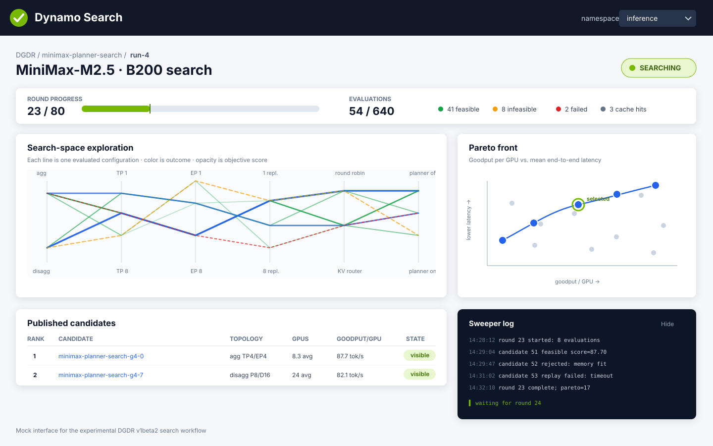
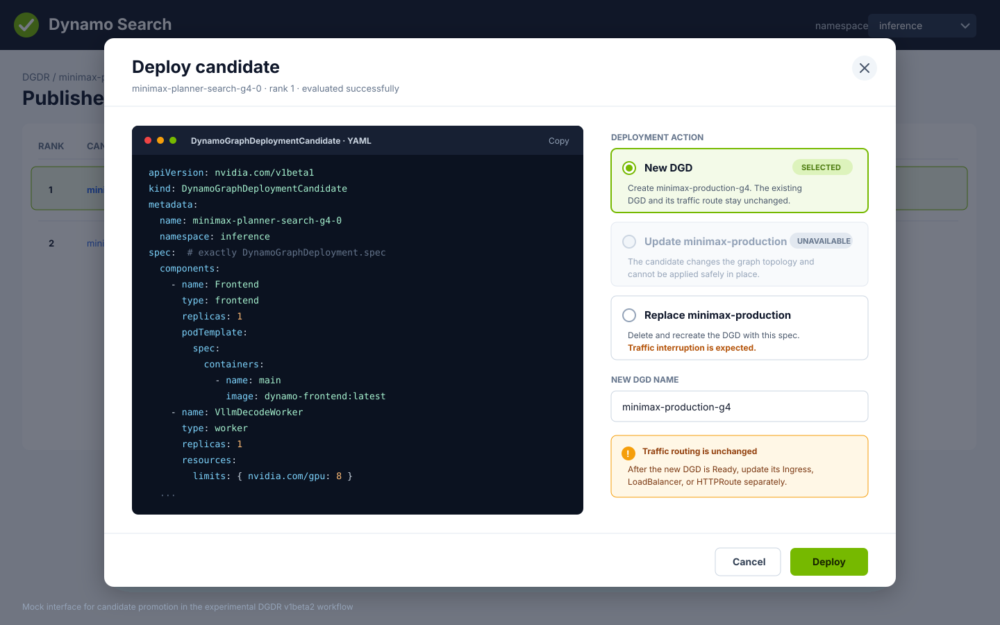

`DynamoGraphDeploymentRequest` (DGDR) `v1beta2` uses [AI Simulate
Sweeper](../../developer-guide/knowledge-base/modular-components/ai-simulate-experimental/sweeper-experimental/overview.md)
to evaluate deployment configurations with Replay. A request can optimize one metric or search for
a Pareto front. During the search, Dynamo publishes a bounded set of
`DynamoGraphDeploymentCandidate` (DGDC) resources. Each candidate contains a complete
`DynamoGraphDeployment` (DGD) spec that you can inspect and deploy.

Each accepted change to the DGDR spec creates an immutable `DynamoGraphDeploymentRun`. Its spec is
a complete copy of the request that started it. The run owns the Sweeper Job, its DGDCs, progress,
and report references. This lets one DGDR retain a history of independent searches without keeping
completed Jobs alive.

> [!WARNING]
> **Experimental.** The `v1beta2` API and its unstructured search parameters can change in a future
> release.

Unlike the `v1beta1` profiler, Sweeper searches commonly run for hours and can return multiple
useful configurations. DGDR reports progress after each search round and refreshes its visible
candidates as better configurations are found.

This guide describes the Kubernetes workflow and the stable DGDR fields. Use the Sweeper
documentation as the reference for traffic, optimization goals, and the unstructured search
parameters supported by the installed Sweeper version.

## Create a Search

The following request searches for a vLLM deployment for MiniMax-M2.5 on up to 32 B200 GPUs. It
replays a Mooncake trace and optimizes goodput per GPU while enforcing Time To First Token (TTFT)
and Inter-Token Latency (ITL) limits.

```yaml
apiVersion: nvidia.com/v1beta2
kind: DynamoGraphDeploymentRequest
metadata:
  name: minimax-planner-search
  namespace: inference
spec:
  modelRef:
    name: MiniMaxAI/MiniMax-M2.5
    revision: f710177d938eff80b684d42c5aa84b382612f21f
    remoteCode: AlwaysTrust # AlwaysTrust | TrustCacheAndRevision | Never
    cache:
      pvc:
        name: model-cache
        modelPath: minimax-m2.5
        mountPath: /opt/model-cache

  backend: vllm
  image: nvcr.io/nvidia/ai-dynamo/dynamo-planner:latest

  hardware:
    gpu:
      sku: b200_sxm
      budget: 32
      perNode: 8
    capabilities:
      interconnect: nvlink
      rdma: required

  workload:
    trace:
      format: mooncake
      source:
        pvc:
          claimName: workload-traces
          path: mooncake/trace.jsonl
      replay:
        arrivalSpeedupRatio: 1.0

  objective:
    mode: optimize
    metric: goodputPerGpu
    latency:
      ttftMs: 2000
      itlMs: 50

  search:
    budget:
      maxRounds: 80
      maxConcurrentCandidates: 8
      maxEvaluationDuration: 120s
    parameters: # unstructured
      fixed:
        model/hw: MiniMax-M2.5 + B200
        deployment: agg vLLM, TP4/EP4
        replicas: planner-managed 1..8
        gpu budget: 32
        router: kv router, overlap=1.0
        prefill_load_scale: 4.0
      swept planner:
        scaling_policy: throughput_180_5, throughput_600_5
          load_180_5, load_180_10
          hybrid_180_5, hybrid_600_5
        load_sensitivity: aggressive, default, conservative
        fpm_sampling: small, default, large, fine
      workload: Mooncake trace, open-loop

  recommendation:
    maxCandidates: 5

  overrides:
    profilingJob:
      backoffLimit: 2
    dgd:
      apiVersion: nvidia.com/v1beta1
      kind: DynamoGraphDeployment
```

Apply the request:

```bash
kubectl apply -f minimax-planner-search.yaml
kubectl get dgdr minimax-planner-search -n inference -w
```

`modelRef.revision` pins the model contents. For models that execute repository-provided Python
code, set `remoteCode` explicitly:

| Value                   | Behavior                                                                                   |
| ----------------------- | ------------------------------------------------------------------------------------------ |
| `Never`                 | Reject models that require remote code                                                     |
| `TrustCacheAndRevision` | Allow remote code only when both a pinned revision and the configured model cache are used |
| `AlwaysTrust`           | Allow the backend to execute remote model code                                             |

Use `AlwaysTrust` only for a repository and revision that you trust.

## Choose a Workload

Set exactly one of `workload.static` or `workload.trace`.

Use a static workload when a fixed traffic shape represents the expected load:

```yaml
spec:
  workload:
    static:
      isl: 1024
      osl: 1024
      concurrency: 32
      # requestRate: 10 # alternative to concurrency
```

Use a trace workload to preserve request timestamps and sequence lengths from recorded traffic:

```yaml
spec:
  workload:
    trace:
      format: mooncake
      source:
        pvc:
          claimName: workload-traces
          path: mooncake/trace.jsonl
      replay:
        arrivalSpeedupRatio: 1.0
```

`arrivalSpeedupRatio` maps directly to the Replay traffic-rate control. A value of `1.0` preserves
the recorded arrival rate. [Sweeper Traffic](../../developer-guide/knowledge-base/modular-components/ai-simulate-experimental/sweeper-experimental/traffic.md)
defines the supported workload shapes, trace fields, and open-loop versus closed-loop behavior.

To create a Mooncake-format trace for testing, follow [Generate a Synthetic Trace in the Sweeper
examples](https://github.com/ai-dynamo/dynamo/blob/main/aisimulate/examples/sweeper/README.md#generate-a-synthetic-trace),
then copy the generated JSONL file to the PVC referenced by `workload.trace.source`.

## Choose an Objective

For a scalar search, set `mode: optimize` and one metric:

```yaml
spec:
  objective:
    mode: optimize
    metric: goodputPerGpu
    latency:
      ttftMs: 2000
      itlMs: 50
```

Common Sweeper metrics include throughput, end-to-end latency, goodput, and their per-GPU variants.
See [Sweeper Optimization Goals](../../developer-guide/knowledge-base/modular-components/ai-simulate-experimental/sweeper-experimental/optimization-goals.md)
for the supported targets, directions, and SLA semantics.

For a multi-objective search, set `mode: pareto` and list the metrics:

```yaml
spec:
  objective:
    mode: pareto
    metrics:
      - goodput
      - goodputPerGpu
      - meanE2eLatency
    latency:
      e2eMs: 2000
```

Set either `latency.ttftMs` with `latency.itlMs`, or `latency.e2eMs`. Do not combine both latency
forms.

Sweeper computes the complete non-dominated front. DGDR publishes no more than
`recommendation.maxCandidates` candidates from that front as Kubernetes resources.

## Configure the Search

`search.budget` controls how long and how broadly Sweeper evaluates configurations:

| Field                     | Meaning                                                |
| ------------------------- | ------------------------------------------------------ |
| `maxRounds`               | Maximum optimizer rounds                               |
| `maxConcurrentCandidates` | Maximum candidates evaluated concurrently in one round |
| `maxEvaluationDuration`   | Timeout for one candidate evaluation                   |

`search.parameters` is an unstructured object passed to the search implementation. The Kubernetes
API preserves these values but does not validate their nested schema. Use [Sweeper
Configuration](../../developer-guide/knowledge-base/modular-components/ai-simulate-experimental/sweeper-experimental/configuration.md)
as the parameter reference for the installed Sweeper version. For Dynamo-specific Planner and
Router parameters, see [Dynamo Sweeper Integration](../../developer-guide/knowledge-base/modular-components/ai-simulate-experimental/sweeper-experimental/dynamo-integration.md).

The unstructured boundary is intentional. Search adapters and experimental knobs evolve faster than
the Kubernetes API. Stable concepts such as the workload, objective, hardware budget, and search
budget use typed fields; implementation-specific search spaces remain under `parameters`.

## Monitor Progress

Large searches can take several hours. Inspect `status.progress` instead of treating the profiling
Job as a short, opaque operation:

```bash
RUN=$(kubectl get dgdr minimax-planner-search -n inference \
  -o jsonpath='{.status.activeRunRef.name}')

kubectl get dynamographdeploymentrun "$RUN" -n inference \
  -o jsonpath='{.status.progress}'
```

The DGDR points to the active run:

```yaml
status:
  activeRunRef:
    name: minimax-planner-search-run-4
```

While the search is active, the run status resembles:

```yaml
status:
  phase: Searching
  conditions:
    - type: Completed
      status: "False"
      reason: EvaluatingCandidates
  progress:
    rounds:
      completed: 23
      limit: 80
    candidates:
      pending: 3
      evaluating: 8
      succeeded: 41
      failed: 2
      published: 5
    startedAt: "2026-07-16T13:20:00Z"
    lastProgressTime: "2026-07-16T13:28:42Z"
  recommendation:
    selectedCandidateRef:
      name: minimax-planner-search-g4-0
```

`Completed=True` marks a terminal run. Inspect its `reason` to distinguish success, failure, and
cancellation.

DGDR refreshes the visible candidate set after completed search rounds. While `Completed=False`, a
candidate is provisional and can be replaced when Sweeper finds a better result. DGDR publishes at
most `recommendation.maxCandidates` resources even when Sweeper evaluates hundreds of internal
configurations.

## Open the Search UI

The Dynamo Search UI runs as a cluster service, independently of individual Sweeper Jobs. Port
forward the service to inspect active and completed runs in a local browser:

```bash
kubectl port-forward service/dynamo-search-ui \
  -n dynamo-system 8080:8080
```

Open the local address:

```text
http://localhost:8080
```

Select the `inference` namespace, `minimax-planner-search`, and its active run. The first UI version
shows:

- completed rounds and evaluations;
- feasible, infeasible, failed, and cached evaluations;
- evaluated configurations across the resolved search-space dimensions;
- the current scalar leaders or Pareto front;
- published DGDCs and their ranks; and
- an optional Sweeper log panel.



The UI does not run in the Sweeper Job. A Job-local server would stop when the search process exits,
and a long-running sidecar would prevent the Job from completing. The cluster UI reads run status
and DGDCs from Kubernetes and loads detailed evaluation points from the run's report artifacts.

For an active run, the optional log panel streams the Sweeper Pod log. After the Pod is deleted, the
log remains available only when log retention is enabled for the run. Progress, candidates, and the
search report remain available independently of the Job.

## Inspect Candidates

DGDC resources carry the owning run UID, DGDR generation, and input hash as labels. List the
candidates for the active run:

```bash
RUN=$(kubectl get dgdr minimax-planner-search -n inference \
  -o jsonpath='{.status.activeRunRef.name}')
RUN_UID=$(kubectl get dynamographdeploymentrun "$RUN" -n inference \
  -o jsonpath='{.metadata.uid}')

kubectl get dgdc -n inference -l "nvidia.com/dgdr-run-uid=${RUN_UID}"
```

Inspect the selected candidate:

```bash
CANDIDATE=$(kubectl get dgdr minimax-planner-search -n inference \
  -o jsonpath='{.status.recommendation.selectedCandidateRef.name}')

kubectl get dgdc "$CANDIDATE" -n inference -o yaml
```

A candidate contains a complete DGD spec. Its status reports simulation results rather than
deployment health:

```yaml
apiVersion: nvidia.com/v1beta1
kind: DynamoGraphDeploymentCandidate
metadata:
  name: minimax-planner-search-g4-0
  ownerReferences:
    - apiVersion: nvidia.com/v1beta2
      kind: DynamoGraphDeploymentRun
      name: minimax-planner-search-run-4
  labels:
    nvidia.com/dgdr-run-uid: ddc22b7a-6557-4a3e-a1d7-a32da8849694
    nvidia.com/dgdr-generation: "4"
    nvidia.com/dgdr-input-hash: 7d3a9c18e24f9468b307c21f03c4a662
spec: # exactly DynamoGraphDeployment.spec
  components:
    - name: Frontend
      type: frontend
      replicas: 1
      podTemplate:
        spec:
          containers:
            - name: main
              image: nvcr.io/nvidia/ai-dynamo/dynamo-frontend:latest
    - name: VllmDecodeWorker
      type: worker
      replicas: 1
      podTemplate:
        spec:
          containers:
            - name: main
              image: nvcr.io/nvidia/ai-dynamo/vllm-runtime:latest
              command:
                - python3
                - -m
                - dynamo.vllm
                - --model
                - MiniMaxAI/MiniMax-M2.5
                - --trust-remote-code
              resources:
                limits:
                  nvidia.com/gpu: "8"
status:
  rank: 1
  conditions:
    - type: Evaluated
      status: "True"
      reason: ReplayCompleted
  experimental: # unstructured
    metrics:
      averageGpus: 8.3
      goodputPerGpuTokensPerSecond: 87.7
      meanTtftMs: 1840
      meanItlMs: 42
    replayReportRef:
      configMap:
        name: minimax-planner-search-g4-0
        key: report.json
```

The `experimental` status object is unstructured. Treat its metrics and diagnostics as specific to
the Sweeper version that produced the candidate.

## Promote a Candidate

Copy a candidate's `spec` into a DGD after the owning DGDR reports `Completed=True`:

The Search UI shows the selected DGDC as syntax-highlighted YAML before deployment. Choose
`Rolling Update` to update an existing DGD while keeping ready capacity available, or choose
`Replace` to replace the target in one deployment operation. Review the materialized DGD spec, then
select **Deploy**.



```bash
kubectl get dgdc minimax-planner-search-g4-0 -n inference -o json \
  | jq '{
      apiVersion: "nvidia.com/v1beta1",
      kind: "DynamoGraphDeployment",
      metadata: {name: "minimax-production", namespace: "inference"},
      spec: .spec
    }' \
  | kubectl apply -f -
```

The new DGD starts its own deployment lifecycle. DGDC `status.conditions` only confirms that Replay
evaluated the configuration; it does not indicate that the configuration has been deployed.

## Start a New Search

Changing a search input creates a new immutable run for the new DGDR generation. The run contains a
complete copy of the accepted DGDR spec, so later edits to the request do not change an active or
completed run. Use `status.activeRunRef` to find the run currently being evaluated. Run and
candidate labels identify the generation and input hash that produced each result.

Changes that affect the model, hardware, workload, objective, search budget, or unstructured
parameters require new evaluations. Metadata-only changes do not change the search input.

For recurring trace-based searches, write every completed trace to a new location and update the
trace source. An object-storage URI identifies a trace directly:

```yaml
spec:
  workload:
    trace:
      source:
        uri: s3://dynamo-traces/qwen/2026-08-12.jsonl
```

For a trace stored on a PersistentVolumeClaim (PVC), update the path within the claim:

```yaml
spec:
  workload:
    trace:
      source:
        pvc:
          claimName: workload-traces
          path: qwen/2026-08-12.jsonl
```

DGDR treats the contents at a trace location as immutable. Updating the URI or PVC path starts the
new run; it does not require a separate trigger or content digest.

To repeat a search without changing its inputs, change `spec.rerun.reason`:

```yaml
spec:
  rerun:
    reason: "Repeat after Sweeper upgrade on 2026-08-12"
```

Every new value requests one run and is copied into that run's DGDR snapshot. Reapplying the same
value does not request another run. If a trace is replaced at the same location, change
`spec.rerun.reason` because Kubernetes cannot observe the content change.

To capture traffic from an active DGD and repeat this workflow on a schedule, see [Continuous
Profiling](continuous-profiling.md). That higher-level workflow treats the active DGD as the
baseline and creates independent runs from successive trace windows.

## Customize Generated DGD Specs

Use `spec.overrides.dgd` to merge common settings into every generated candidate. The override uses
the `nvidia.com/v1beta1` DGD schema:

```yaml
spec:
  overrides:
    dgd:
      apiVersion: nvidia.com/v1beta1
      kind: DynamoGraphDeployment
      spec:
        components:
          - name: Frontend
            podTemplate:
              spec:
                containers:
                  - name: main
                    env:
                      - name: DYN_ROUTER_MODE
                        value: kv
```

Use `spec.overrides.profilingJob` for Kubernetes Job settings such as tolerations, node selectors,
and retry limits.

## Work with v1beta1 Clients

`v1beta1` and `v1beta2` represent different workflows. Conversion preserves the complete source
payload instead of selecting one candidate or discarding search state:

- A native `v1beta2` request stores its fields directly under `spec`. A `v1beta1` client sees that
  payload under `spec.v1beta2`.
- A native `v1beta1` request keeps its profiler fields directly under `spec`. A `v1beta2` client sees
  that payload under `spec.v1beta1`.
- The native schema and the versioned compatibility payload are mutually exclusive.

Use the same API version for reads and writes when updating a request. The versioned compatibility
payload is for lossless round trips; it does not translate a single `v1beta1` result into a
multi-candidate `v1beta2` search.

## Clean Up

Delete the request and its owned runs and candidates:

```bash
kubectl delete dgdr minimax-planner-search -n inference
```

Promoted DGDs have an independent lifecycle and remain after the DGDR is deleted:

```bash
kubectl delete dgd minimax-production -n inference
```

## Related Documentation

- [Auto Deployment Overview](overview.mdx)
- [Auto Deploy with DGDR v1beta1](auto-deploy-with-dgdr.md)
- [Continuous Profiling](continuous-profiling.md)
- [DynamoGraphDeployment Reference](../../reference/kubernetes-api/dynamo-graph-deployment.mdx)
- [AI Simulate Sweeper Overview](../../developer-guide/knowledge-base/modular-components/ai-simulate-experimental/sweeper-experimental/overview.md)
- [Sweeper Configuration](../../developer-guide/knowledge-base/modular-components/ai-simulate-experimental/sweeper-experimental/configuration.md)
- [Sweeper Traffic](../../developer-guide/knowledge-base/modular-components/ai-simulate-experimental/sweeper-experimental/traffic.md)
- [Sweeper Optimization Goals](../../developer-guide/knowledge-base/modular-components/ai-simulate-experimental/sweeper-experimental/optimization-goals.md)
- [Dynamo Sweeper Integration](../../developer-guide/knowledge-base/modular-components/ai-simulate-experimental/sweeper-experimental/dynamo-integration.md)
