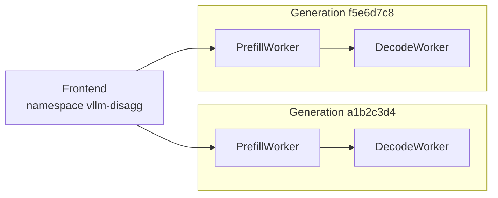
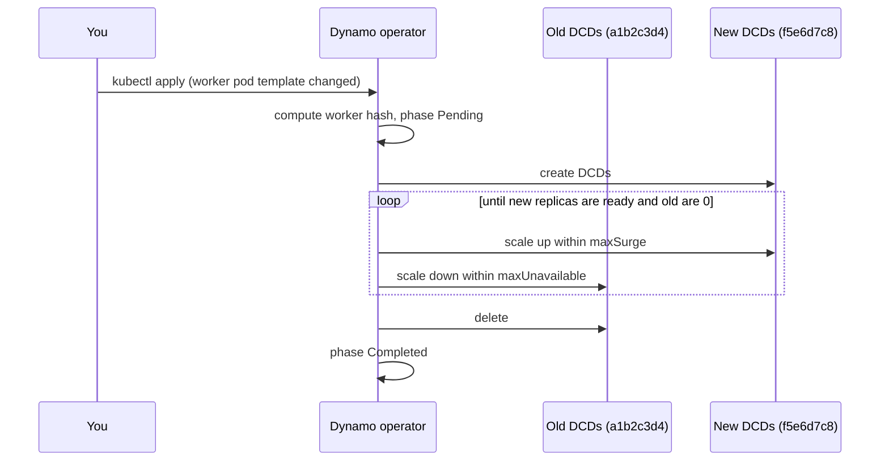
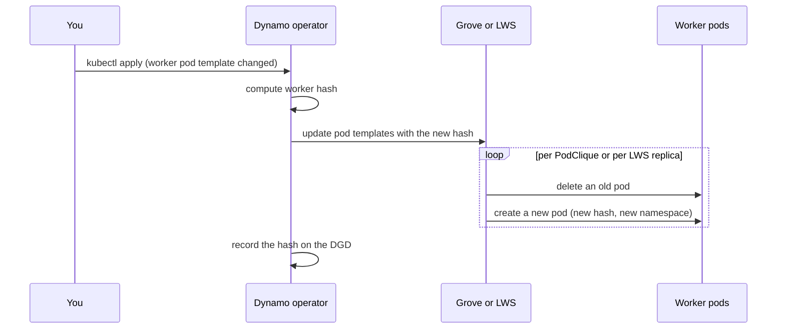

This guide shows how to change the image, arguments, or resources of the workers in a `DynamoGraphDeployment` (DGD) while the deployment keeps serving. It covers how to apply the change, how to watch it, how to control its pace, how to roll back, and what the operator does underneath.

## Before You Start

The operator renders each worker component into one of three backing resources. The backing resource decides who replaces the pods and which controls you have.

| Backing resource | Used for | Who replaces pods | Pace controls | Surge | Progress in |
|---|---|---|---|---|---|
| Kubernetes Deployment | Single-node workers without Grove | The Dynamo operator (managed rolling update) | `maxSurge`, `maxUnavailable`, `Recreate` | Yes | `status.rollingUpdate` on the DGD |
| Grove PodCliqueSet | Any workers when Grove is installed | Grove | `nvidia.com/grove-update-strategy` | No | `status.updateProgress` on the PodCliqueSet |
| LeaderWorkerSet (LWS) | Multinode workers without Grove | LWS | None through the DGD | No | The LeaderWorkerSet status |

Two rules apply to every backing resource:

- **Worker components roll together.** A worker component has `type: worker`, `type: prefill`, or `type: decode`. The operator hashes the pod templates of every worker component into one worker hash. When the pod template of one, some, or all worker components changes, the hash changes and every worker component rolls, including the ones whose template did not change. Changing `replicas` or `minAvailable` does not change the hash.
- **Other components roll on their own.** A frontend, planner, or other non-worker component rolls only when its own pod template changes, through the rolling update of its own Deployment or PodClique. A worker change does not restart it, and a change to it does not create a new worker generation.

See [Multinode Orchestration](../installation/multinode-orchestration.md) for how a DGD selects Grove or LWS.

## Plan the Rollout

A rollout replaces worker pods. How many pods it replaces at once decides how much capacity you keep, how many GPUs you need, and how long the rollout takes. Decide these before you apply the change.

### Capacity During the Rollout

On Deployment-backed workers the operator keeps at least `replicas - maxUnavailable` workers of each component available and creates at most `maxSurge` extra workers. The capacity floor during the rollout is `(replicas - maxUnavailable) / replicas`.

| Replicas | `maxSurge` / `maxUnavailable` | Capacity floor | Spare GPUs needed | Notes |
|---|---|---|---|---|
| 2 | `0` / `1` | 50% | None | One worker serves while the other restarts |
| 1 | `0` / `1` | 0% | None | No worker serves until the new pod is Ready |
| 1 or 2 | `25%` / `25%` (default) | 100% | One worker's GPUs | Resolves to surge 1, unavailable 0 |
| 4 | `25%` / `25%` (default) | 75% | One worker's GPUs | Resolves to surge 1, unavailable 1 |
| 4 | `1` / `0` | 100% | One worker's GPUs | Zero downtime |
| Any | `Recreate` | 0% | None | The whole component restarts |

A surge slot is one extra worker pod, so it needs the GPUs that one worker requests, on one node. A worker with `--tensor-parallel-size 4` requests four GPUs, and its surge pod needs four free GPUs on a single node. A multinode worker has no surge path, because Grove and LWS do not surge.

Grove and LWS replace one pod per PodClique, or one replica per LeaderWorkerSet, at a time and never surge. Their capacity floor is `(replicas - 1) / replicas`, and a component with one replica has a gap.

### Zero-Downtime Updates

A zero-downtime update keeps at least one Ready worker of each worker component serving at every moment and never restarts the frontend. The conditions are:

- **Deployment-backed workers**: `replicas - maxUnavailable` is at least 1. To keep full capacity as well, set `maxUnavailable: "0"`, set `maxSurge` to at least `"1"`, and have the GPUs for the surge. The defaults already resolve to surge 1 and unavailable 0 for a component with one or two replicas, so a gap appears only when you set `maxSurge: "0"` or use `Recreate`.
- **Grove-backed and LWS-backed workers**: every worker component needs at least two replicas, because there is no surge.

In a disaggregated deployment, the frontend routes to a generation only after that generation has both a prefill and a decode worker Ready. A prefill worker declares that it needs a decode peer, and a decode worker declares that it needs a prefill peer, so a generation with only one of them is not routable and requests keep going to the complete generation. Nothing holds the prefill to decode ratio inside a generation while it rolls, so the new generation can serve at a different ratio than you configured until the rollout finishes.

### Warm-Up and Latency

New workers start with an empty KV cache. Their first requests pay a full prefill, so time to first token and end-to-end latency rise until the cache warms, and KV-aware routing finds no cached prefixes on them until then. Nothing moves cache between generations by default. [KV cache offloading](../kv-cache-offloading/overview.mdx) reduces the penalty by letting new workers load blocks from a shared tier.

The budgets also set the rollout's shape. A smaller `maxUnavailable` means more steps, and each step waits for a new pod to load the model and pass its readiness probe, so the rollout takes longer but disturbs less capacity at once. Roll during low traffic when you can.

### Graceful Shutdown

Every pod a rollout replaces goes through [graceful shutdown](../fault-tolerance/graceful-shutdown.md): the worker stops taking new requests, finishes the ones in flight, and exits. Kubernetes waits `terminationGracePeriodSeconds` for that, 60 seconds by default on operator-created pods, and then kills the pod. A request still running at that point fails unless request migration recovers it.

To size the grace period, measure the worker's P99 request duration from the `dynamo_component_request_duration_seconds` histogram, add a buffer, and set that value in the worker's `podTemplate.spec.terminationGracePeriodSeconds`. Keep the Dynamo shutdown timeouts described on the graceful shutdown page below it. The grace period also bounds the rollout: each step can take up to that long for an old pod to leave.

## Update the Workers

The examples use a disaggregated vLLM deployment with one frontend, one prefill worker, and one decode worker.

```yaml
apiVersion: nvidia.com/v1beta1
kind: DynamoGraphDeployment
metadata:
  name: vllm-disagg
spec:
  backendFramework: vllm
  components:
    - name: Frontend
      type: frontend
      replicas: 1
      podTemplate:
        spec:
          containers:
            - name: main
              image: nvcr.io/nvidia/ai-dynamo/vllm-runtime:1.6.0
              command: [python3]
              args: [-m, dynamo.frontend]
    - name: PrefillWorker
      type: prefill
      replicas: 2
      podTemplate:
        spec:
          containers:
            - name: main
              image: nvcr.io/nvidia/ai-dynamo/vllm-runtime:1.6.0
              command: [python3]
              args: [-m, dynamo.vllm, --model, Qwen/Qwen3-0.6B, --disaggregation-mode, prefill]
              resources:
                limits:
                  nvidia.com/gpu: "1"
    - name: DecodeWorker
      type: decode
      replicas: 4
      podTemplate:
        spec:
          containers:
            - name: main
              image: nvcr.io/nvidia/ai-dynamo/vllm-runtime:1.6.0
              command: [python3]
              args: [-m, dynamo.vllm, --model, Qwen/Qwen3-0.6B, --disaggregation-mode, decode]
              resources:
                limits:
                  nvidia.com/gpu: "1"
```

To update the workers:

1. Edit the pod template of a worker component. This example raises the decode context length.

   ```yaml
       - name: DecodeWorker
         type: decode
         replicas: 4
         podTemplate:
           spec:
             containers:
               - name: main
                 image: nvcr.io/nvidia/ai-dynamo/vllm-runtime:1.6.0
                 command: [python3]
                 args: [-m, dynamo.vllm, --model, Qwen/Qwen3-0.6B, --disaggregation-mode, decode, --max-model-len, "32768"]
   ```

2. Apply the manifest.

   ```bash
   kubectl apply -n dynamo -f vllm-disagg.yaml
   ```

3. Watch the rollout. See [Watch the Rollout](#watch-the-rollout).

Both worker components roll, even though only the decode template changed, because the worker hash covers all workers. The frontend does not restart.

> [!NOTE]
> Keep the manifest in version control. Rolling back is applying the previous version of the file.

## Watch the Rollout

Every worker pod carries its generation in the `nvidia.com/dynamo-worker-hash` label. This command works for every backing resource and shows old and new pods side by side:

```bash
kubectl get pods -n dynamo -l nvidia.com/dynamo-graph-deployment-name=vllm-disagg \
  -L nvidia.com/dynamo-worker-hash
```

The DGD records the active generation in the `nvidia.com/current-worker-hash-v2` annotation and lists the backing resources and runtime namespace of each component in `status.components`:

```bash
kubectl get dgd vllm-disagg -n dynamo -o jsonpath='{.metadata.annotations.nvidia\.com/current-worker-hash-v2}{"\n"}'
kubectl get dgd vllm-disagg -n dynamo -o jsonpath='{.status.components.DecodeWorker}{"\n"}'
```

The rollout is complete when `status.state` returns to `successful` and every worker pod shows the new hash.

### Deployment-Backed Workers

The operator tracks a managed rolling update in `status.rollingUpdate`:

```bash
kubectl get dgd vllm-disagg -n dynamo -o jsonpath='{.status.rollingUpdate}{"\n"}'
```

```text
{"phase":"InProgress","startTime":"2026-10-06T18:02:11Z","updatedComponents":["PrefillWorker"]}
```

| Phase | Meaning |
|---|---|
| `Pending` | A new worker generation was detected. |
| `InProgress` | New worker `DynamoComponentDeployments` (DCDs) are scaling up and old ones are scaling down. |
| `Completed` | Every worker component has moved to the new generation and the old DCDs are deleted. |

`updatedComponents` lists the worker components that have finished. `endTime` is set when the phase becomes `Completed`. The API also defines a `Failed` phase, which the operator does not set today.

During the update, `status.components.<name>.componentNames` lists both the old and the new DCD, and `runtimeNamespace` keeps the old generation's namespace until the component finishes. To see both generations:

```bash
kubectl get dcd -n dynamo -l nvidia.com/dynamo-graph-deployment-name=vllm-disagg \
  -L nvidia.com/dynamo-worker-hash
```

### Grove-Backed Workers

Grove tracks the update on the PodCliqueSet, which is named after the DGD:

```bash
kubectl get podcliqueset vllm-disagg -n dynamo -o jsonpath='{.status.updateProgress}{"\n"}'
```

`updateEndedAt` is set when Grove has replaced every pod.

### LWS-Backed Workers

LWS replaces one replica, all of its ranks, at a time:

```bash
kubectl get leaderworkerset -n dynamo -l nvidia.com/dynamo-graph-deployment-name=vllm-disagg
```

## Roll Back

A rollback is an update to the previous pod templates. Apply the previous version of the manifest:

```bash
kubectl apply -n dynamo -f vllm-disagg.yaml
```

The operator computes the previous worker hash, so the workers return to the previous generation through the same rollout as any other change. Watch it the same way.

You can roll back while a rollout is still in progress. On Deployment-backed workers the operator treats the previous pod templates as the new target: the generation that was rolling out becomes the old generation and scales down within `maxUnavailable`, while the previous generation scales back up within `maxSurge`. The operator deletes an old DCD only after it reaches zero replicas and its pods have terminated. Available since operator 1.5.0; earlier releases could delete the serving generation on a mid-rollout rollback.

## Control the Pace

### Deployment-Backed Workers

Set these annotations on a worker component's `podTemplate.metadata.annotations`, or on `spec.annotations` to apply them to every component.

| Annotation | Meaning | Default |
|---|---|---|
| `nvidia.com/deployment-rolling-update-max-surge` | Extra pods the operator may create above `replicas` during the update. | `25%` |
| `nvidia.com/deployment-rolling-update-max-unavailable` | Pods that may be unavailable during the update. | `25%` |
| `nvidia.com/deployment-strategy` | `RollingUpdate` (default) or `Recreate`. | `RollingUpdate` |

Values are integers (`"1"`) or percentages (`"25%"`). Percentages resolve against `replicas`, rounding up for `maxSurge` and down for `maxUnavailable`. If both resolve to zero, the operator sets `maxSurge` to 1 so the rollout can progress. See [Capacity During the Rollout](#capacity-during-the-rollout) for what these numbers mean for serving capacity and GPUs.

To keep full capacity while the new generation comes up:

```yaml
    - name: PrefillWorker
      type: prefill
      replicas: 4
      podTemplate:
        metadata:
          annotations:
            nvidia.com/deployment-rolling-update-max-surge: "1"
            nvidia.com/deployment-rolling-update-max-unavailable: "0"
```

To finish faster and accept reduced capacity:

```yaml
    - name: DecodeWorker
      type: decode
      replicas: 8
      podTemplate:
        metadata:
          annotations:
            nvidia.com/deployment-rolling-update-max-surge: "0"
            nvidia.com/deployment-rolling-update-max-unavailable: "2"
```

To stop the old generation before the new one starts, set `Recreate`. The operator scales the old DCDs for that component to zero, waits for every old pod to terminate, and then scales the new DCD to `replicas`. The surge and unavailable annotations are ignored for that component.

```yaml
    - name: DecodeWorker
      type: decode
      replicas: 4
      podTemplate:
        metadata:
          annotations:
            nvidia.com/deployment-strategy: Recreate
```

> [!WARNING]
> `Recreate` causes an outage of that component while its pods restart. Use it when old and new generations must not run at the same time, or when the cluster has no spare GPUs for a surge.

### Grove-Backed Workers

Set `nvidia.com/grove-update-strategy` on the DGD's `metadata.annotations` to choose the PodCliqueSet update strategy. Values must match Grove's spelling.

| Value | Behavior |
|---|---|
| `RollingRecreate` | Grove replaces pods one at a time per PodClique. This is Grove's default when the annotation is absent. |
| `OnDelete` | Grove updates the pod template but replaces a pod only after you delete it. |

```yaml
metadata:
  annotations:
    nvidia.com/grove-update-strategy: OnDelete
```

With `OnDelete`, replace pods when you are ready:

```bash
kubectl get pods -n dynamo -l nvidia.com/dynamo-graph-deployment-name=vllm-disagg -L nvidia.com/dynamo-worker-hash
kubectl delete pod -n dynamo <old-pod-name>
```

Use `OnDelete` for updates that need manual coordination, such as a maintenance window. Grove has no surge: it deletes an old pod before it creates the replacement. The DGD does not expose Grove's per-PodClique `maxUnavailable`; Grove's default is 1. For the Grove design, see [GREP-291](https://github.com/ai-dynamo/grove/pull/403).

### LWS-Backed Workers

LWS uses its default rolling update: one replica at a time, no surge. The DGD does not expose LWS update settings.

## How It Works

### Worker Generations

The operator hashes the rendered pod templates of all worker components, including labels, annotations, and the resolved runtime version, into an 8-character worker hash. Replica counts, `minAvailable`, and scaling-adapter settings are left out. The hash is:

- recorded on the DGD as the `nvidia.com/current-worker-hash-v2` annotation,
- set as the `nvidia.com/dynamo-worker-hash` label on every worker DCD and worker pod,
- appended to each worker's runtime namespace through the `DYN_NAMESPACE_WORKER_SUFFIX` environment variable, so workers of generation `a1b2c3d4` register under `vllm-disagg-a1b2c3d4`.

Workers discover only workers in their own runtime namespace. A new prefill worker therefore sends KV cache only to a new decode worker, and old workers keep talking to old workers. The frontend keeps the base runtime namespace and discovers every generation. It routes to a generation only after that generation's worker set is complete, meaning every worker type that the other types declare they need is present. Until then, requests keep going to the generation that is already complete, so both generations serve during the update. See [Disaggregated Serving](../disaggregated-serving/overview.md) for the prefill and decode flow.



### Deployment-Backed Rollout

For Deployment-backed workers the operator runs the rollout itself. Worker DCDs are named `<dgd>-<component>-<hash>` in lowercase, so both generations exist at once.



Each worker component is marked in `updatedComponents` when all of its new replicas are ready and all of its old replicas are gone.

### Grove-Backed and LWS-Backed Rollout

For Grove and LWS, the operator writes the new pod templates to the existing PodCliqueSet or LeaderWorkerSet, and the backing resource replaces the pods. The new pod template carries the new worker hash, so new pods join the new generation's runtime namespace as they start. Grove replaces pods per PodClique and LWS per replica, each with its own budget. Neither coordinates across worker components, so the ratio of old to new capacity can differ between prefill and decode while the update runs.



The operator emits a `RollingUpdateNotSupported` event on the DGD for these paths. It means the managed controls above do not apply, not that the update failed.

## Limitations

- `status.rollingUpdate`, `maxSurge`, `maxUnavailable`, and `Recreate` apply only to Deployment-backed workers. See the [DGD reference](../../reference/kubernetes-api/dynamo-graph-deployment.mdx).
- A change to the pod template of any worker component rolls every worker component, including the ones whose template did not change.
- Prefill and decode workers roll independently on every backing resource. Nothing holds the prefill to decode ratio inside a generation during the update, so capacity can skew between generations.
- Grove and LWS have no surge. A worker component with one replica has a serving gap during its update.
- New workers start with an empty KV cache. Nothing moves cache between generations.
- The DGD has no fields for Grove or LWS update budgets.
- `RollingUpdatePhase` `Failed` is defined but not set by the operator.
