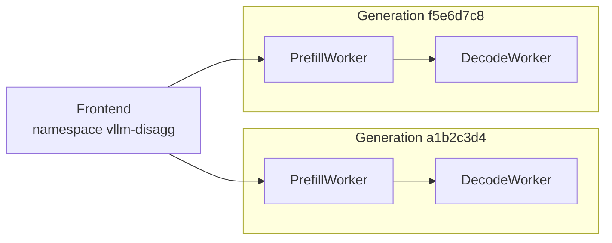
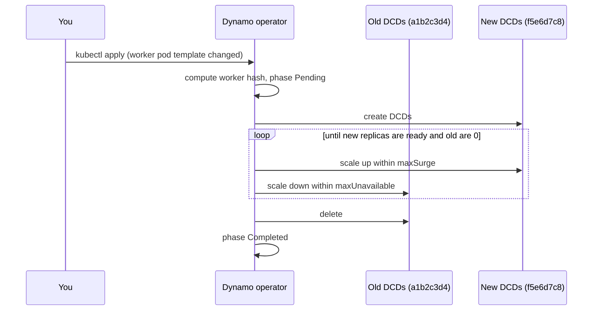
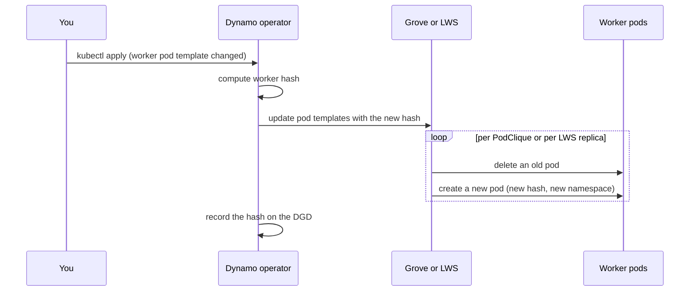

This guide shows how to change the image, arguments, or resources of the workers in a `DynamoGraphDeployment` (DGD) while the deployment keeps serving. It covers how to apply the change, how to watch it, how to control its pace, how to roll back, and what the operator does underneath.

## Before You Start

The operator renders each worker component into one of three backing resources. The backing resource decides who replaces the pods and which controls you have.

| Backing resource | Used for | Who replaces pods | Pace controls | Progress in |
|---|---|---|---|---|
| Kubernetes Deployment | Single-node workers without Grove | The Dynamo operator (managed rolling update) | `maxSurge`, `maxUnavailable`, `Recreate` | `status.rollingUpdate` on the DGD |
| Grove PodCliqueSet | Any workers when Grove is installed | Grove | `nvidia.com/grove-update-strategy` | `status.updateProgress` on the PodCliqueSet |
| LeaderWorkerSet (LWS) | Multinode workers without Grove | LWS | None through the DGD | The LeaderWorkerSet status |

Two rules apply to every backing resource:

- **Only worker components roll.** A worker component has `type: worker`, `type: prefill`, or `type: decode`. Frontends and other components update in place.
- **One worker generation covers all workers.** The operator hashes the pod templates of every worker component into one worker hash. A change to any worker's pod template creates a new generation and rolls every worker component. Changing `replicas` or `minAvailable` does not create a new generation.

See [Multinode Orchestration](../installation/multinode-orchestration.md) for how a DGD selects Grove or LWS.

## Update the Workers

The examples use a disaggregated vLLM deployment with one frontend, one prefill worker, and one decode worker.

```yaml
apiVersion: nvidia.com/v1beta1
kind: DynamoGraphDeployment
metadata:
  name: vllm-disagg
spec:
  backendFramework: vllm
  components:
    - name: Frontend
      type: frontend
      replicas: 1
      podTemplate:
        spec:
          containers:
            - name: main
              image: nvcr.io/nvidia/ai-dynamo/vllm-runtime:1.6.0
              command: [python3]
              args: [-m, dynamo.frontend]
    - name: PrefillWorker
      type: prefill
      replicas: 2
      podTemplate:
        spec:
          containers:
            - name: main
              image: nvcr.io/nvidia/ai-dynamo/vllm-runtime:1.6.0
              command: [python3]
              args: [-m, dynamo.vllm, --model, Qwen/Qwen3-0.6B, --disaggregation-mode, prefill]
              resources:
                limits:
                  nvidia.com/gpu: "1"
    - name: DecodeWorker
      type: decode
      replicas: 4
      podTemplate:
        spec:
          containers:
            - name: main
              image: nvcr.io/nvidia/ai-dynamo/vllm-runtime:1.6.0
              command: [python3]
              args: [-m, dynamo.vllm, --model, Qwen/Qwen3-0.6B, --disaggregation-mode, decode]
              resources:
                limits:
                  nvidia.com/gpu: "1"
```

To update the workers:

1. Edit the pod template of a worker component. This example raises the decode context length.

   ```yaml
       - name: DecodeWorker
         type: decode
         replicas: 4
         podTemplate:
           spec:
             containers:
               - name: main
                 image: nvcr.io/nvidia/ai-dynamo/vllm-runtime:1.6.0
                 command: [python3]
                 args: [-m, dynamo.vllm, --model, Qwen/Qwen3-0.6B, --disaggregation-mode, decode, --max-model-len, "32768"]
   ```

2. Apply the manifest.

   ```bash
   kubectl apply -n dynamo -f vllm-disagg.yaml
   ```

3. Watch the rollout. See [Watch the Rollout](#watch-the-rollout).

Both worker components roll, because the worker hash covers all workers. The frontend does not restart.

> [!NOTE]
> Keep the manifest in version control. Rolling back is applying the previous version of the file.

## Watch the Rollout

Every worker pod carries its generation in the `nvidia.com/dynamo-worker-hash` label. This command works for every backing resource and shows old and new pods side by side:

```bash
kubectl get pods -n dynamo -l nvidia.com/dynamo-graph-deployment-name=vllm-disagg \
  -L nvidia.com/dynamo-worker-hash
```

The DGD records the active generation in the `nvidia.com/current-worker-hash-v2` annotation and lists the backing resources and runtime namespace of each component in `status.components`:

```bash
kubectl get dgd vllm-disagg -n dynamo -o jsonpath='{.metadata.annotations.nvidia\.com/current-worker-hash-v2}{"\n"}'
kubectl get dgd vllm-disagg -n dynamo -o jsonpath='{.status.components.DecodeWorker}{"\n"}'
```

The rollout is complete when `status.state` returns to `successful` and every worker pod shows the new hash.

### Deployment-Backed Workers

The operator tracks a managed rolling update in `status.rollingUpdate`:

```bash
kubectl get dgd vllm-disagg -n dynamo -o jsonpath='{.status.rollingUpdate}{"\n"}'
```

```text
{"phase":"InProgress","startTime":"2026-10-06T18:02:11Z","updatedComponents":["PrefillWorker"]}
```

| Phase | Meaning |
|---|---|
| `Pending` | A new worker generation was detected. |
| `InProgress` | New worker `DynamoComponentDeployments` (DCDs) are scaling up and old ones are scaling down. |
| `Completed` | Every worker component has moved to the new generation and the old DCDs are deleted. |

`updatedComponents` lists the worker components that have finished. `endTime` is set when the phase becomes `Completed`. The API also defines a `Failed` phase, which the operator does not set today.

During the update, `status.components.<name>.componentNames` lists both the old and the new DCD, and `runtimeNamespace` keeps the old generation's namespace until the component finishes. To see both generations:

```bash
kubectl get dcd -n dynamo -l nvidia.com/dynamo-graph-deployment-name=vllm-disagg \
  -L nvidia.com/dynamo-worker-hash
```

### Grove-Backed Workers

Grove tracks the update on the PodCliqueSet, which is named after the DGD:

```bash
kubectl get podcliqueset vllm-disagg -n dynamo -o jsonpath='{.status.updateProgress}{"\n"}'
```

`updateEndedAt` is set when Grove has replaced every pod.

### LWS-Backed Workers

LWS replaces one replica, all of its ranks, at a time:

```bash
kubectl get leaderworkerset -n dynamo -l nvidia.com/dynamo-graph-deployment-name=vllm-disagg
```

## Roll Back

A rollback is an update to the previous pod templates. Apply the previous version of the manifest:

```bash
kubectl apply -n dynamo -f vllm-disagg.yaml
```

The operator computes the previous worker hash, so the workers return to the previous generation through the same rollout as any other change. Watch it the same way.

> [!WARNING]
> On Deployment-backed workers, wait for `status.rollingUpdate.phase` to reach `Completed` before you apply another change, including a rollback. Changing the spec while a managed rolling update is in progress can remove the serving generation faster than the `maxUnavailable` budget allows.

## Control the Pace

### Deployment-Backed Workers

Set these annotations on a worker component's `podTemplate.metadata.annotations`, or on `spec.annotations` to apply them to every component.

| Annotation | Meaning | Default |
|---|---|---|
| `nvidia.com/deployment-rolling-update-max-surge` | Extra pods the operator may create above `replicas` during the update. | `25%` |
| `nvidia.com/deployment-rolling-update-max-unavailable` | Pods that may be unavailable during the update. | `25%` |
| `nvidia.com/deployment-strategy` | `RollingUpdate` (default) or `Recreate`. | `RollingUpdate` |

Values are integers (`"1"`) or percentages (`"25%"`). Percentages resolve against `replicas`, rounding up for `maxSurge` and down for `maxUnavailable`. If both resolve to zero, the operator sets `maxSurge` to 1 so the rollout can progress.

To keep full capacity while the new generation comes up:

```yaml
    - name: PrefillWorker
      type: prefill
      replicas: 4
      podTemplate:
        metadata:
          annotations:
            nvidia.com/deployment-rolling-update-max-surge: "1"
            nvidia.com/deployment-rolling-update-max-unavailable: "0"
```

To finish faster and accept reduced capacity:

```yaml
    - name: DecodeWorker
      type: decode
      replicas: 8
      podTemplate:
        metadata:
          annotations:
            nvidia.com/deployment-rolling-update-max-surge: "0"
            nvidia.com/deployment-rolling-update-max-unavailable: "2"
```

To stop the old generation before the new one starts, set `Recreate`. The operator scales the old DCDs for that component to zero, waits for every old pod to terminate, and then scales the new DCD to `replicas`. The surge and unavailable annotations are ignored for that component.

```yaml
    - name: DecodeWorker
      type: decode
      replicas: 4
      podTemplate:
        metadata:
          annotations:
            nvidia.com/deployment-strategy: Recreate
```

> [!WARNING]
> `Recreate` causes an outage of that component while its pods restart. Use it when old and new generations must not run at the same time, or when the cluster has no spare GPUs for a surge.

### Grove-Backed Workers

Set `nvidia.com/grove-update-strategy` on the DGD's `metadata.annotations` to choose the PodCliqueSet update strategy. Values must match Grove's spelling.

| Value | Behavior |
|---|---|
| `RollingRecreate` | Grove replaces pods one at a time per PodClique. This is Grove's default when the annotation is absent. |
| `OnDelete` | Grove updates the pod template but replaces a pod only after you delete it. |

```yaml
metadata:
  annotations:
    nvidia.com/grove-update-strategy: OnDelete
```

With `OnDelete`, replace pods when you are ready:

```bash
kubectl get pods -n dynamo -l nvidia.com/dynamo-graph-deployment-name=vllm-disagg -L nvidia.com/dynamo-worker-hash
kubectl delete pod -n dynamo <old-pod-name>
```

Use `OnDelete` for updates that need manual coordination, such as a maintenance window. The DGD does not expose Grove's per-PodClique `maxUnavailable`; Grove's default is 1. For the Grove design, see [GREP-291](https://github.com/ai-dynamo/grove/pull/403).

### LWS-Backed Workers

LWS uses its default rolling update: one replica at a time, no surge. The DGD does not expose LWS update settings.

## How It Works

### Worker Generations

The operator hashes the rendered pod templates of all worker components, including labels, annotations, and the resolved runtime version, into an 8-character worker hash. Replica counts, `minAvailable`, and scaling-adapter settings are left out. The hash is:

- recorded on the DGD as the `nvidia.com/current-worker-hash-v2` annotation,
- set as the `nvidia.com/dynamo-worker-hash` label on every worker DCD and worker pod,
- appended to each worker's runtime namespace through the `DYN_NAMESPACE_WORKER_SUFFIX` environment variable, so workers of generation `a1b2c3d4` register under `vllm-disagg-a1b2c3d4`.

Workers discover only workers in their own runtime namespace. A new prefill worker therefore sends KV cache only to a new decode worker, and old workers keep talking to old workers. The frontend keeps the base runtime namespace and discovers every generation, so both generations serve requests during the update. See [Disaggregated Serving](../disaggregated-serving/overview.md) for the prefill and decode flow.



### Deployment-Backed Rollout

For Deployment-backed workers the operator runs the rollout itself. Worker DCDs are named `<dgd>-<component>-<hash>` in lowercase, so both generations exist at once.



Each worker component is marked in `updatedComponents` when all of its new replicas are ready and all of its old replicas are gone.

### Grove-Backed and LWS-Backed Rollout

For Grove and LWS, the operator updates the pod templates in place and the backing resource replaces the pods. The new pod template carries the new worker hash, so new pods join the new generation's runtime namespace as they start. Grove replaces pods per PodClique and LWS per replica, each with its own budget. Neither coordinates across worker components, so the ratio of old to new capacity can differ between prefill and decode while the update runs.



The operator emits a `RollingUpdateNotSupported` event on the DGD for these paths. It means the managed controls above do not apply, not that the update failed.

## Limitations

- `status.rollingUpdate`, `maxSurge`, `maxUnavailable`, and `Recreate` apply only to Deployment-backed workers. See the [DGD reference](../../reference/kubernetes-api/dynamo-graph-deployment.mdx).
- A change to any worker's pod template rolls every worker component.
- Prefill and decode workers roll independently on every backing resource. Capacity can skew between generations during the update.
- The DGD has no fields for Grove or LWS update budgets.
- `RollingUpdatePhase` `Failed` is defined but not set by the operator.
