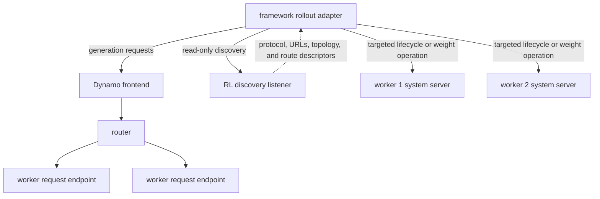

**Experimental.** This page is the shared contract and authoritative status reference for RL integrations. The contract section describes how a framework should use Dynamo. The compatibility section records which concrete combinations have public evidence. A protocol capability does not by itself make a framework integration supported.

## Contract at a Glance

An RL adapter must treat inference and worker administration as different planes:



| Plane | Send here | Use it for | Do not use it for |
|---|---|---|---|
| Request plane | Dynamo frontend, normally port `8000` | Token-native generation, streaming, cancellation, routing, and model-facing responses | Fleet-wide mutating administration |
| Discovery plane | Dedicated frontend RL listener, normally port `8001` | Read current RL worker descriptors, direct control URLs, optional transfer topology, and advertised capabilities | Proxying engine calls, inferring missing metadata, or assuming a worker remains available after discovery |
| Administration plane | The selected worker's `system_url` | Pause/resume, weight operations, health checks, and backend-specific controls | Untrusted client traffic or implicit broadcast |

> [!WARNING]
> Discovery and worker system-server routes do not add a separate authentication layer. Restrict both to a trusted orchestrator network. Never expose a generic engine method surface to public inference clients.

## Adopt Dynamo Incrementally

Treat a framework integration as a sequence of independently reversible changes. Moving generation, routing, discovery, and weight transfer at once makes correctness and performance regressions difficult to attribute.

| Stage | Change | Evidence required before advancing | Rollback boundary |
|---|---|---|---|
| 0. Preserve the framework contract | Record token authority, terminal-state handling, retry/deduplication, current worker topology, and the existing direct-backend baseline | One deterministic sample and one representative rollout batch with accepted-token, logprob, latency, and failure evidence | No Dynamo dependency has been introduced. |
| 1. Move only generation | Send one pinned model/backend path through a shared Dynamo frontend while leaving framework-owned training and weight control unchanged | Exact token/logprob equivalence at the framework scoring boundary, terminal/cancellation behavior, and matched request counts | Gate new attempts, drain or explicitly discard in-flight attempts, and return generation to the pinned direct endpoint. |
| 2. Enable routing and correlation | Add the selected router mode, bounded trace capture, and the framework-to-request join | Matched baseline/variant results, causal router/cache/queue evidence, trace coverage, and measured tracing overhead | Return to the recorded distribution baseline and disable optional capture; do not change the weight path. |
| 3. Integrate worker administration | Add discovery or another validated registry plus direct per-worker lifecycle and policy-update calls | Stable membership snapshot, capability negotiation, all-worker target verification, cache handling, post-update generation, and partial-failure recovery | Keep the rollout phase gated and restore the last known-good framework control path or worker deployment; never reopen a mixed fleet merely to complete rollback. |
| 4. Qualify a production topology | Exercise the intended colocated or external, aggregated or P/D, model-parallel, multi-node, and failure domains | Complete the framework and cross-cutting validation checklists on immutable pins, then have an independent reviewer reproduce the documented journey | Roll back the topology or maturity claim, not the evidence boundary; untested combinations remain unvalidated. |

The unit of progress is a proven boundary, not the number of Dynamo components enabled. In particular, do not replace a working framework-native weight path merely to make the architecture look uniform. Keep the last known-good generation and update procedures independently selectable until the combined lifecycle has passed failure injection.

## Choose a Request Interface

| Adapter requirement | Interface | Default port | Contract |
|---|---|---:|---|
| Native SGLang token-input streaming | `POST /generate` or `PUT /generate` | `8000` | Preserves supported SGLang request fields and returns SGLang streaming objects as server-sent events. |
| Cross-backend completions | `POST /v1/completions` | `8000` | Accepts token arrays through `prompt` or `nvext.token_data` and can return selected named `nvext` fields. |
| Cross-backend chat | `POST /v1/chat/completions` | `8000` | Uses normal messages or bypasses frontend tokenization with `nvext.token_data`. |
| RL worker discovery | `GET /v1/rl/workers` | `8001` | Returns protocol version `1` and live RL endpoint descriptors. Model, direct URLs, and transfer topology are capability-dependent and can be omitted. |
| One worker administration call | `POST <system_url>/engine/<route>` | Worker-specific | Calls one selected worker directly with a backend-specific JSON body and result. |

Use SGLang `/generate` when the framework already speaks SGLang's token-native streaming schema. Use an OpenAI-compatible route when the adapter needs one request envelope across backends or needs NVIDIA request extensions. TensorRT-LLM does not expose a dedicated engine-native RL generation route through Dynamo.

## Define Token Authority

The framework and serving stack must agree which token sequence is authoritative. Retokenizing generated text is not equivalent: normalization, special tokens, chat templates, and tokenizer versions can change the sequence used for training.

For OpenAI-compatible completions, send an integer array in `prompt` and request generated token IDs:

```bash
curl http://localhost:8000/v1/completions \
  -H 'Content-Type: application/json' \
  -d '{
    "model": "Qwen/Qwen3-0.6B",
    "prompt": [151644, 8948, 198],
    "max_tokens": 32,
    "temperature": 0,
    "logprobs": 0,
    "prompt_logprobs": 0,
    "nvext": {
      "extra_fields": ["completion_token_ids", "prompt_logprobs"]
    }
  }'
```

The adapter should verify all of the following before admitting a sample to the trainer:

1. `nvext.completion_token_ids` exists, contains integers, and has the expected choice cardinality.
2. The number and order of selected completion log probabilities match the generated token IDs.
3. Prompt log probabilities preserve unsupported or undefined positions such as the first token as `null` rather than silently shifting alignment.
4. The response has a terminal reason that the framework recognizes; a canceled, failed, disconnected, or incomplete stream is not a scoreable completion unless the framework explicitly defines that behavior.
5. The tokenizer/model identity used to construct the prompt is the identity expected by the selected rollout worker.

`nvext.token_data` is also available when a normal text or chat envelope must be present but frontend tokenization should be bypassed. See [NVIDIA Request Extensions](../../developer-guide/additional-resources/nvidia-request-extensions-nvext.md) for the complete field contract.

### SGLang native token streaming

Enable the native SGLang-compatible route on the frontend:

```bash
DYN_SGLANG_ENABLE_GENERATE=1 python -m dynamo.frontend
```

Start a token-input SGLang worker and send a single streaming sample:

```bash
python -m dynamo.sglang --model-path Qwen/Qwen3-0.6B
```

```bash
curl -N http://localhost:8000/generate \
  -H 'Content-Type: application/json' \
  -d '{
    "input_ids": [151644, 8948, 198],
    "sampling_params": {
      "max_new_tokens": 32,
      "temperature": 0,
      "n": 1
    },
    "stream": true,
    "return_logprob": true,
    "top_logprobs_num": 0
  }'
```

Dynamo forwards native response objects as server-sent events and terminates the successful stream with `[DONE]`. The current Dynamo route requires one non-empty token sequence, `stream: true`, and `sampling_params.n: 1`; it does not accept text, batched, multimodal, or non-streaming requests. Prompt log probabilities are not parity-complete for prefill/decode deployments, so validate an aggregated deployment before depending on them. See the [SGLang backend reference](../../developer-guide/knowledge-base/modular-components/backends/sglang/reference-guide.md) for current backend behavior.

The experimental out-of-process SGLang sidecar can serve the same frontend route. It discovers SGLang's HTTP port through `GetServerInfo`, requires `--incremental-streaming-output`, and probes `/health` before advertising native-generate capability. When either check fails, the sidecar continues serving its gRPC generation path for other compatible frontend interfaces but does not advertise native `/generate`. When the checks pass, it forwards the preserved SGLang request fields to the worker's HTTP `/generate` endpoint and replaces only Dynamo-owned input, request, and routing fields. Pin this behavior to the reviewed sidecar source; it does not establish a released SLIME integration.

## Treat Streaming as a State Machine

An adapter should maintain explicit per-request state rather than treating the first HTTP 200 as success.

| State | Adapter action |
|---|---|
| Accepted | Allocate framework sample identity and record the Dynamo request identity when available. |
| Streaming | Append token IDs and their aligned metadata exactly once and monitor client cancellation. |
| Terminal success | Verify terminal reason, token/logprob lengths, masks, choice count, and any uploaded metadata before admitting the sample. |
| Client disconnect or cancellation | Mark the sample incomplete. Do not assume the engine produced no additional work while cancellation propagated. |
| Backend or transport error | Preserve the failure class and discard partial scoring data unless the framework has an explicit partial-rollout contract. |
| Retry | Allocate a new request attempt and let the framework deduplicate by its own rollout/sample identity. Dynamo generation endpoints do not promise idempotent sampling. |

Dynamo propagates client disconnect cancellation to supported workers. SGLang aggregated and decode paths support cancellation; cancellation during remote prefill in a disaggregated SGLang deployment is not currently supported. See [Request Cancellation](../../developer-guide/knowledge-base/concepts/fault-tolerance/request-cancellation-architecture.md) for the general lifecycle.

[Open issue #8549](https://github.com/ai-dynamo/dynamo/issues/8549) records backend failures whose bare `finish_reason: "error"` cannot be decoded by the frontend's structured error variant and surface as HTTP 500. A recent reproducer reaches the vLLM token path through a structured-output failure, and the original report covered SGLang. Until the protocol is normalized and the fix is pinned, treat an HTTP 500 as a failed attempt, preserve the framework attempt ID plus worker/frontend logs, and never reinterpret an empty or partial body as a successful terminal sample.

Do not retry a timed-out generation blindly and count both results. Sampling can be nondeterministic, and the first attempt may have completed after the client stopped waiting. The framework should own attempt IDs, duplicate suppression, and whether a failed sample is rescheduled.

## Request and Return Metadata Deliberately

| Data | Request | Returned data | Boundary |
|---|---|---|---|
| Completion token IDs | Add `completion_token_ids` to `nvext.extra_fields` | `nvext.completion_token_ids` | Requires one prompt and one generated choice. |
| Prompt log probabilities | Set top-level `prompt_logprobs` and request the named extra field | `nvext.prompt_logprobs` on the final response | Backend support differs; the initial position can be `null`. |
| Completion log probabilities | Use the standard completion or chat logprob controls | Standard `choices[].logprobs` | Verify positional alignment against completion token IDs. |
| Routed experts | Add `routed_experts` to `nvext.extra_fields` | `nvext.routed_experts` | Requires a compatible engine build and opt-in configuration; encoding is backend-specific. |
| Raw backend metadata | Add `engine_data` to `nvext.extra_fields` | `nvext.engine_data` | Not a stable cross-backend schema. Prefer named fields. |
| Large SGLang metadata | Set `nvext.metadata_upload.url` | One compressed object per choice at the destination | Trusted control-plane input; upload failure fails the request. |

Do not substitute open training-metadata proposals for this current-release contract. As checked on 2026-08-27, [Dynamo PR #13588 at `c3439e2`](https://github.com/ai-dynamo/dynamo/pull/13588) proposes vLLM-compatible `return_token_ids` request and response parity, while [Dynamo PR #13640 at `23b3d91`](https://github.com/ai-dynamo/dynamo/pull/13640) proposes opt-in exact prompt token IDs and sampled chat logprobs. Both remain open, review required, and merge-conflicted against current `main`; a branch-level GPU result in a PR description is not a released API. Recheck their final merged shapes before documenting either interface.

SGLang metadata upload writes the final cumulative `meta_info` as Zstandard-compressed MessagePack through the installed fsspec backend. Use a unique destination for every request attempt. When upload is enabled, the worker omits the corresponding large inline metadata and waits for the upload before completing the response.

> [!WARNING]
> `metadata_upload.url` is passed to fsspec with the worker's filesystem and cloud credentials. Do not allow untrusted callers to choose the scheme or destination, and do not reuse a path across attempts.

## Discover Workers and Negotiate Capabilities

Discovery currently covers vLLM workers started with RL enabled. Start the dedicated listener and worker:

```bash
DYN_ENABLE_RL=true DYN_RL_PORT=8001 python -m dynamo.frontend
```

```bash
DYN_SYSTEM_PORT=8081 python -m dynamo.vllm \
  --model Qwen/Qwen3-0.6B \
  --enable-rl
```

```bash
curl http://localhost:8001/v1/rl/workers
```

The response is versioned independently of the generation API. Check `protocol_version` before interpreting worker fields; the reviewed release emits integer version `1` and does not negotiate another version.

| Field | Contract in protocol version `1` |
|---|---|
| `namespace`, `component`, `endpoint`, `instance_id`, `transport`, `request_plane_url` | Required Dynamo identity for the live RL endpoint. Use the tuple, not list position, to compare membership snapshots. |
| `routes` | Required list of advertised Dynamo engine-route names. It can be empty when the worker probe fails. |
| `system_url` | Optional direct Dynamo system-server base URL. Use it for the advertised `/engine/<route>` calls; never derive it from `request_plane_url`. |
| `model` | Optional model identity. Dynamo omits it when model metadata is unavailable or when one worker advertises multiple distinct base models. |
| `world_size` | Optional positive producer-declared inference or transfer world size. It is not the number of worker descriptors or a fleet-atomicity guarantee. |
| `admin_base_url` | Optional backend HTTP or HTTPS compatibility endpoint. It is valid only with `world_size` and is distinct from the Dynamo `system_url`. |
| `error` | Optional probe error. A failed descriptor remains visible with empty routes and without direct URLs so the controller can fail closed on the intended membership. |

For every Dynamo engine operation, use the returned `system_url` and treat `routes` as that worker's live capability list. Use `admin_base_url` only when the pinned backend integration defines the compatibility operation that belongs there, validate it as a trusted HTTP or HTTPS control endpoint, and never substitute it for `system_url`. Do not assume every worker has the same optional routes or metadata, and do not cache discovery indefinitely.

The shared Rust worker contract can publish `world_size` and `admin_base_url`, but the reviewed Python-backed workers remain unchanged unless they explicitly opt into that endpoint. At this source pin, the [vLLM sidecar producer PR #13607](https://github.com/ai-dynamo/dynamo/pull/13607) is still open. Therefore the fields are part of protocol version `1`, not evidence that every current vLLM worker supplies transfer metadata. Scope discovery with `DYN_RL_COMPONENTS` (or the single-component `DYN_RL_COMPONENT`) when a deployment contains unrelated RL endpoints, and define how the framework selects a worker when `model` is absent.

The discovery endpoint is intentionally read-only. It does not implement a mutating `/v1/rl/engine` or `/v1/rl/engines` proxy, which prevents accidental frontend fan-out. The framework or its control service must select the target worker set and call each system URL directly.

## Coordinate the Weight Lifecycle

The adapter owns the fleet-level barrier around policy refresh:

1. Stop or gate new rollout work for the target workers.
2. Resolve the current worker set and required update capabilities.
3. Pause or otherwise place each worker in the backend-required state.
4. Transfer/apply the new policy using the framework/backend-specific path.
5. Invalidate stale KV state when the update path does not do so automatically.
6. Read back a supported per-worker version or run an equivalent backend-specific verification.
7. Run post-update generation and only then admit the worker to the next rollout phase.
8. Apply a defined recovery policy if any worker fails; per-worker success is not a fleet transaction.

See [Update rollout weights](weight-updates.md) for the current vLLM and SGLang control surfaces, the verl CUDA-IPC path, ModelExpress boundaries, and partial-failure handling.

## Minimal Adapter Structure

This pseudocode shows ownership and ordering; route bodies and result fields remain backend-specific:

```python
async def generate_sample(sample):
    attempt = sample.new_attempt()
    response = await rollout_client.generate(
        prompt_token_ids=sample.prompt_token_ids,
        request_completion_token_ids=True,
        request_logprobs=True,
    )
    validated = verify_terminal_token_and_logprob_contract(response)
    return sample.accept_attempt(attempt, validated)


async def refresh_policy(target_version):
    block_new_rollouts()
    workers = await discovery.list_workers()
    require_capabilities(workers, target_version.required_routes)
    results = await update_each_worker(workers, target_version)
    require_one_consistent_verified_version(results, target_version.id)
    await post_update_generation_smoke()
    allow_new_rollouts()
```

The adapter must define what happens if discovery changes during the update, one worker returns an error object with HTTP 200, the update transport times out, a worker restarts with the initial version, or post-update generation fails. Dynamo does not choose those framework semantics.

## Framework Compatibility

This table is the single framework-status source for the RL documentation. “Evidence checked” means the cited public source and status were inspected; it does not mean this documentation change independently ran the workload.

| Framework | Integration artifact and pin | Generation and routing | Weight path | Topology | Status | Evidence checked and validation | Freshness owner |
|---|---|---|---|---|---|---|---|
| verl | [verl-recipe main at `461b830c`](https://github.com/verl-project/verl-recipe/tree/461b830cfee4f5a67c21edc300c24373230babc7/dynamo), requiring [verl core `d82d2777`](https://github.com/verl-project/verl/tree/d82d2777b5dc3e96a8a45168d02660312707ab98); Dynamo recipe content last changed at [`52cdedf7`](https://github.com/verl-project/verl-recipe/commit/52cdedf7e0cfbc3b7d518faefcb2035b12f689f4) | Shared Dynamo frontend; native Dynamo routing when ThunderAgent is disabled, or a separately versioned ThunderAgent scheduler when enabled | Current recipe: verl colocated CUDA IPC through recipe-owned control components; [open, blocked PR #136 at `0956843`](https://github.com/verl-project/verl-recipe/pull/136) proposes a separate NIXL checkpoint-engine path and is not released | Colocated trainer and Dynamo vLLM workers; one or multiple nodes described upstream | Experimental | 2026-08-27; public recipe contains smoke/training and benchmark evidence, but its required core commit records recipe gitlink `e7f88957`, which predates `dynamo/`; the guide documents an explicit nested-recipe override, no complete Dynamo runtime image is pinned, and no independent reproduction is recorded. The NIXL proposal's branch-level smokes do not validate the reviewed main pin | verl recipe maintainers and Dynamo RL maintainers |
| NeMo RL | [NeMo RL main at `6ae03578`](https://github.com/NVIDIA-NeMo/RL/tree/6ae035784fe40fd9c9e31d27fffa4a403243a0bd); managed integration merged in [PR #3391 at `85e02cca`](https://github.com/NVIDIA-NeMo/RL/commit/85e02cca39968ec5997cc0833bef419895f566f7); runtime pins `ai-dynamo[vllm]==1.3.0.post1` from [`d14d9290`](https://github.com/ai-dynamo/dynamo/commit/d14d9290c7a616db2225f459f8a66d8c1bc63fda) | Driver-owned frontend and fixed Ray-managed vLLM fleet; configured native Dynamo router, with `kv` in the smoke recipe | NeMo RL NCCL collective sender to fixed per-engine system URLs; separate pause, cache-clear, and resume barrier; not ModelExpress | Managed Slurm/Ray only; non-colocated; every TP × PP engine fits on one node; vLLM/BF16 only | Experimental | 2026-08-27; dedicated two-GPU functional check passed on the merge PR and a four-step three-node run is recorded upstream, but no independent Dynamo-docs reproduction or elastic recovery path is recorded | NeMo RL generation maintainers and Dynamo RL maintainers |
| SLIME | Closed upstream streaming prototype [PR #2 at `4d39b5a`](https://github.com/Aphoh/slime/pull/2), open upstream discovery [PR #3 at `06d397f`](https://github.com/Aphoh/slime/pull/3), and open draft Dynamo example [PR #12856 at `84babe1`](https://github.com/ai-dynamo/dynamo/pull/12856) | Intended shared SGLang-compatible `/generate` endpoint; accepted upstream discovery contract unresolved | Prototype used backend-specific distributed update control | External rollout serving; the draft Dynamo example uses Kubernetes discovery, but Kubernetes is not a framework-contract requirement | Integration in progress | 2026-08-27; no merged, released, independently validated integration | SLIME integration contributors and Dynamo RL maintainers |
| Prime-RL | Open discovery [PR #3176 at `828ddc7`](https://github.com/PrimeIntellect-ai/prime-rl/pull/3176), open recipes [PR #3180 at `2f67c72`](https://github.com/PrimeIntellect-ai/prime-rl/pull/3180), draft sidecar [PR #3181 at `b17ceea`](https://github.com/PrimeIntellect-ai/prime-rl/pull/3181), and open Dynamo umbrella [PR #13481 at `b3d6a63`](https://github.com/ai-dynamo/dynamo/pull/13481) | Intended frontend inference plus per-engine discovery and control | Proposed external NCCL/NIXL paths; the umbrella PR records one branch-level NIXL update and post-update rollout | External Dynamo/vLLM sidecar recipes; final release contract unresolved | Integration in progress | 2026-08-27; live composite-branch evidence is recorded, but prerequisite leaves remain open and no released independent reproduction exists | Prime-RL integration contributors and Dynamo RL maintainers |

### Framework candidates without Dynamo guides

This discovery record prevents adjacent projects or shared components from being mistaken for integrations. It is not a support matrix for the frameworks themselves.

| Candidate | Reviewed primary source | Current Dynamo boundary | Documentation decision |
|---|---|---|---|
| OpenRLHF | [OpenRLHF at `3c3be623`](https://github.com/OpenRLHF/OpenRLHF/tree/3c3be6234e0cb353e76bb8019947db9dfe99fca7); its [ProRL V2 launch script](https://github.com/OpenRLHF/OpenRLHF/blob/3c3be6234e0cb353e76bb8019947db9dfe99fca7/examples/scripts/train_prorlv2_math_hybrid_engine.sh) is an OpenRLHF training recipe | No Dynamo-specific adapter or recipe appears in the reviewed snapshot | Matrix only. Do not create a separate ProRL V2 framework page. |
| Miles | [Miles at `778227d6`](https://github.com/fleet-ai/miles-fleet/tree/778227d6d7cf7b581d1eb07910c873516b6baca9) | Miles owns an SGLang rollout/router and Megatron or FSDP training stack; no Dynamo-specific adapter or recipe appears in the reviewed snapshot | Matrix only until a public adapter preserves Miles token, routing, update, and recovery contracts. |
| SkyRL | [SkyRL at `59d4daed`](https://github.com/NovaSky-AI/SkyRL/tree/59d4daedee24c7b1a79d857bbf322a6d195c3792) and merged [ThunderAgent PR #1645](https://github.com/NovaSky-AI/SkyRL/pull/1645) | The recipe launches direct SkyRL vLLM servers and uses an embedded or external ThunderAgent router; ThunderAgent reuse does not make it a Dynamo deployment | Matrix only until SkyRL publishes and validates a Dynamo-owned serving path. |
| Polar, formerly ProRL-Agent-Server | [Polar at `6a1ead6b`](https://github.com/NVIDIA-NeMo/ProRL-Agent-Server/tree/6a1ead6bfac054fce6c1e62d1a77b330d96c58db) | Polar is a rollout service with SGLang/vLLM and a SLIME bridge; no Dynamo adapter appears in the reviewed snapshot | Matrix only. Keep Polar distinct from the OpenRLHF ProRL V2 training method. |

A candidate does not receive a dedicated guide solely because it can call an OpenAI-compatible endpoint or uses a component that Dynamo also integrates. Graduation requires a maintained Dynamo adapter or recipe, a pinned generation smoke, a complete training iteration, token/logprob verification, a weight refresh, post-update generation, recovery evidence, and a named owner.

For verl, choose the native-router or ThunderAgent variant before constructing the environment. The reviewed recipe config enables ThunderAgent by default, the validation smoke disables it explicitly, and the recipe publishes a separate exact Dynamo source requirement for ThunderAgent. Its installer pins and installs core verl only; it does not establish one complete Dynamo/vLLM container for either path. See [Integrate with verl](verl.md#choose-one-recipe-variant) for the resulting version and validation boundary.

For NeMo RL, use the isolated `ai-dynamo[vllm]==1.3.0.post1` environment supplied by the pinned NeMo RL snapshot. Its managed path is not compatible-by-default with the backend versions on current Dynamo `main`. See [Integrate with NeMo RL](nemo-rl.md) for the exact build, Slurm, token, refit, routing, telemetry, and failure boundaries.

## Backend Compatibility

This matrix describes the Dynamo interfaces on `main` at [`5bc908ad`](https://github.com/ai-dynamo/dynamo/tree/5bc908ad4fe129aab80341edd4ace164cba3d351). It is not a framework-level support claim.

| Capability | vLLM | SGLang | TensorRT-LLM |
|---|---|---|---|
| Reviewed Python package pin | `vllm==0.27.1` | `sglang[diffusion]==0.5.18` | `tensorrt-llm==1.3.0rc24` |
| Preferred RL generation path | OpenAI-compatible completions or chat; experimental vLLM-compatible `/inference/v1/generate` is vLLM-specific, opt-in, and unary-only | Native `/generate` for SGLang clients through an eligible in-process worker or experimental sidecar; OpenAI-compatible routes for cross-backend clients | OpenAI-compatible routes |
| Token input | Supported through token-array `prompt` or `nvext.token_data` | Supported through native `input_ids`, token-array `prompt`, or `nvext.token_data` | Supported through token-array `prompt` or `nvext.token_data` |
| Completion token IDs | Named `nvext` field supported | Native output IDs and named `nvext` field supported | Named `nvext` field supported through the shared response path |
| Prompt log probabilities | Supported | Supported with topology limitations; validate aggregated versus P/D behavior | Handler plumbing exists on the reviewed main pin; no dedicated RL E2E coverage is recorded here |
| Native SGLang metadata upload | Not applicable | Supported with RL-enabled worker and fsspec dependencies | Not applicable |
| `/v1/rl/workers` | Supported for RL-enabled workers; protocol version `1` always returns endpoint identity and routes, while model, direct URLs, and transfer metadata are optional | Not currently registered | Not currently registered |
| Fixed Dynamo RL administration routes | vLLM pause/resume, version, disk/distributed update, and group lifecycle routes | SGLang `/engine/control/*` weight routes; additional methods require an explicit allowlist | No common RL administration contract documented here |
| Dedicated RL TITO E2E evidence on Dynamo main | [vLLM test](https://github.com/ai-dynamo/dynamo/blob/5bc908ad4fe129aab80341edd4ace164cba3d351/tests/rl/test_token_in_token_out.py) | [SGLang in-process test](https://github.com/ai-dynamo/dynamo/blob/5bc908ad4fe129aab80341edd4ace164cba3d351/tests/rl/test_token_in_token_out.py); the sidecar proxy has source-level tests but no separate RL GPU E2E recorded here | No dedicated test in that file |
| Evidence last checked | 2026-08-27 | 2026-08-27 | 2026-08-27 |
| Freshness owner | Dynamo vLLM and RL maintainers | Dynamo SGLang and RL maintainers | Dynamo TensorRT-LLM and RL maintainers |

The merged RL TITO E2E validates SGLang's native `/generate` output IDs and aligned logprobs. It does not prove every OpenAI chat/completions logprob topology. [Open issue #8548](https://github.com/ai-dynamo/dynamo/issues/8548) records incomplete SGLang chat/completions token-logprob propagation on packaged Dynamo `0.9.1` with SGLang `0.5.8`; current `main` has newer plumbing, but the issue remains open. Independently validate the exact chat processor, aggregated or P/D topology, package set, request controls, output IDs, and positional logprob alignment before claiming that path.

`/inference/v1/generate` is disabled by default and registers when `DYN_VLLM_ENABLE_INFERENCE_V1_GENERATE` is truthy. The current handler rejects `stream: true`; do not substitute it for the streaming adapter contract or present it as a shared backend route.

The vLLM discovery and administration lifecycle is covered by the [RL worker discovery E2E test](https://github.com/ai-dynamo/dynamo/blob/5bc908ad4fe129aab80341edd4ace164cba3d351/tests/rl/test_worker_discovery.py). The versioned response, optional transfer metadata, and model-ambiguity behavior are defined and unit-tested in the [RL discovery implementation](https://github.com/ai-dynamo/dynamo/blob/5bc908ad4fe129aab80341edd4ace164cba3d351/lib/rl/src/lib.rs). The [SGLang sidecar native-HTTP implementation](https://github.com/ai-dynamo/dynamo/blob/5bc908ad4fe129aab80341edd4ace164cba3d351/lib/sidecar/sglang/src/native_http.rs) defines the discovery, health, request-rewrite, streaming, cancellation, and error boundary described above. Backend-native metadata and raw `engine_data` remain backend-specific even where named token fields are normalized.

The package pins come from [`pyproject.toml` at the reviewed Dynamo commit](https://github.com/ai-dynamo/dynamo/blob/5bc908ad4fe129aab80341edd4ace164cba3d351/pyproject.toml). Runtime images can add architecture-specific dependencies and constraints, so every validation run must also preserve the exact image digest rather than treating the Python package pin as the complete environment.

## Topology and Feature Qualification

Do not infer topology support from the backend name. A framework validation report should explicitly state:

- aggregated versus prefill/decode disaggregated serving
- colocated versus external rollout workers
- tensor, pipeline, expert, and data parallel sizes
- dense versus mixture-of-experts model behavior
- cancellation behavior, especially during remote prefill
- how worker identity is resolved for administration
- whether weight transfer reshards or requires trainer and rollout layouts to match
- whether KV state is preserved, invalidated, or rebuilt after a policy update
- whether the framework gates policy freshness or allows bounded staleness

If one of these dimensions was not exercised, record it as unvalidated rather than supported.

## Adapter Conformance Checklist

Before calling an integration runnable, verify all of the following on pinned versions:

- [ ] The generation-only smoke reaches the intended Dynamo frontend and worker backend.
- [ ] Prompt token IDs are exactly the sequence scored by the framework.
- [ ] Generated token IDs and selected log probabilities are equal-length and positionally aligned.
- [ ] Prompt log probabilities, response masks, terminal reasons, and canceled requests follow the framework's contract.
- [ ] Streaming emits one terminal outcome; partial attempts cannot be admitted twice after retry.
- [ ] Discovery is refreshed and every required administration route is negotiated from the worker descriptor or backend-specific allowlist.
- [ ] Mutating calls target direct worker system URLs on a trusted network.
- [ ] One minimal complete training iteration runs, not only validation or generation.
- [ ] A policy update changes every intended worker to one verified target version.
- [ ] KV-cache invalidation and post-update generation are verified.
- [ ] A failed request, failed worker, and failed weight update each have a tested recovery path.
- [ ] Traces or application headers join framework rollout identity to Dynamo request identity without high-cardinality metric labels.
- [ ] The exact framework, recipe, Dynamo, backend, model, container/CUDA, hardware, and topology pins are recorded with a date and owner.
- [ ] The framework-specific and cross-cutting checklists are complete, every claim links to immutable run artifacts, and an independent reviewer follows the documented journey without undocumented steps.

## Freshness Policy

At every Dynamo minor release, recheck the external commit or PR state, framework configuration keys, backend versions, request/response schema, discovery routes, weight route names and bodies, trace fields, and validated topology. Update the compatibility table, source links, validation date, and limitations before changing a maturity label.
