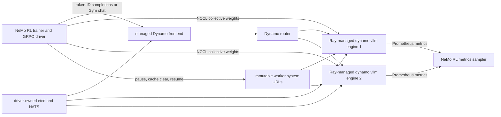

**Experimental.** NeMo RL includes a merged, runnable Dynamo generation backend with a pinned dependency environment and dedicated GPU functional test. The integration is deliberately narrow: NeMo RL launches and owns a fixed Dynamo vLLM fleet inside its Ray allocation on Slurm. It does not connect to an existing Dynamo deployment, deploy Kubernetes resources, or establish compatibility with current Dynamo `main`.

Treat the pinned NeMo RL snapshot as the implementation and launch source of truth. This page explains the Dynamo boundary, preserves the exact evidence, and identifies what still prevents a Supported label.

## Reviewed Artifact and Current Gate

| Item | Pin or status |
|---|---|
| NeMo RL snapshot reviewed | [`6ae035784fe40fd9c9e31d27fffa4a403243a0bd`](https://github.com/NVIDIA-NeMo/RL/tree/6ae035784fe40fd9c9e31d27fffa4a403243a0bd) |
| Managed Dynamo integration merge | [PR #3391](https://github.com/NVIDIA-NeMo/RL/pull/3391), merged as [`85e02cca39968ec5997cc0833bef419895f566f7`](https://github.com/NVIDIA-NeMo/RL/commit/85e02cca39968ec5997cc0833bef419895f566f7) |
| Dynamo runtime | `ai-dynamo[vllm]==1.3.0.post1`, corresponding to Dynamo source commit [`d14d9290c7a616db2225f459f8a66d8c1bc63fda`](https://github.com/ai-dynamo/dynamo/commit/d14d9290c7a616db2225f459f8a66d8c1bc63fda) |
| Coupled runtime dependencies | vLLM `0.23.0`, `nvidia-nccl-cu13==2.30.7`, etcd `3.5.21`, and NATS Server `2.11.6` |
| Required vLLM correction | Backport of vLLM PR #44814 at merge commit [`c9e5bf813530fb9ce06024e075da0f520b0718c8`](https://github.com/vllm-project/vllm/commit/c9e5bf813530fb9ce06024e075da0f520b0718c8); the NeMo RL installer applies it only after an applicability check |
| Upstream functional evidence | `L1_Functional_Tests_Dynamo` passed on the integration PR; its two-step GRPO test checks a refit, one cache invalidation per refit, `max(train/token_mult_prob_error) < 1.05`, generation metrics, and process cleanup |
| Larger upstream evidence | The integration PR records a four-step, three-node/eight-GPU-per-node Nemotron Nano SWE run with four refits and four cache invalidations |
| Independent Dynamo-docs reproduction | Not recorded; required before Supported status |

The NeMo RL pin matters independently of this Dynamo documentation branch. Do not replace `1.3.0.post1` with current Dynamo `main` or a newer wheel without revalidating the response fields, CLI arguments, vLLM backport, packed-transfer constants, and complete training iteration.

## Supported Shape in This Integration

| Dimension | Validated boundary |
|---|---|
| Scheduler and deployment | Slurm allocation with a Ray virtual cluster; the NeMo RL driver owns the Dynamo processes |
| Generation backend | Managed `dynamo.vllm` only |
| Algorithms | Direct synchronous or asynchronous GRPO, plus NeMo Gym rollouts through a token wrapper |
| Placement | Non-colocated training and generation resources |
| Engine parallelism | Each TP × PP engine group fits completely on one node; EP is `1` or equals TP |
| Precision | BF16 generation and `kv_cache_dtype: auto` |
| Routing | Managed Dynamo frontend with a configured router mode; the example selects `kv` |
| Live update | NeMo RL collective sender to every fixed vLLM engine through NCCL |

The current adapter rejects or excludes external Dynamo deployments, Kubernetes, DGD, SGLang, TensorRT-LLM, speculative decoding, quantized generation, colocated generation, custom refit transports, and engine groups that span nodes. These are unimplemented combinations, not undocumented setup choices.

## Architecture and Ownership



| Concern | Owner in this integration |
|---|---|
| Training algorithm, prompts, rewards, advantages, optimizer steps, checkpoints, and sample acceptance | NeMo RL |
| Service ports, namespace, etcd, NATS, frontend, and worker subprocess lifecycle | NeMo RL's `ManagedDynamoRuntime` |
| GPU reservation and fixed worker placement | NeMo RL's Ray worker pool |
| Request routing and cache-aware scheduling | Managed Dynamo frontend and router |
| Token IDs, processed rollout log probabilities, and backend engine metadata | Dynamo vLLM, validated by the NeMo RL response adapters |
| Target policy state, collective sender, update timing, and training barrier | NeMo RL |
| Per-engine update RPCs and cache-control execution | Dynamo vLLM system servers, called through NeMo RL's immutable endpoint list |
| Framework retry, duplicate-sample handling, and policy-lag acceptance | NeMo RL; Dynamo does not infer these semantics |

Constructing the runtime is inert. NeMo RL's explicit start sequence allocates ports, starts etcd and NATS, reserves generation GPUs, launches one `dynamo.vllm` process per model-parallel group, and starts the frontend. Readiness requires the same expected instance IDs at Dynamo's generation and RL endpoints and the configured model in `/v1/models`. A listening frontend alone is not considered ready.

Managed does not mean authenticated. The runtime owns these ranges inside the allocation: `1313-1399` for etcd and NATS, `3000-3999` for the frontend and token wrapper, `4000-4099` for node-local worker system servers, and `7000 + slot × 100` for node-local vLLM rendezvous. Keep the control and system ports on a trusted job network, do not expose them to rollout clients, and do not start a second etcd, NATS, frontend, or worker fleet for this mode.

## Build the Pinned Runtime

Clone and check out the reviewed NeMo RL snapshot:

```bash
git clone https://github.com/NVIDIA-NeMo/RL.git
git -C RL checkout 6ae035784fe40fd9c9e31d27fffa4a403243a0bd
cd RL
```

Build the opt-in Dynamo image layer from that checkout:

```bash
docker buildx build \
  --build-context nemo-rl=. \
  --build-arg BUILD_DYNAMO=1 \
  --target release \
  --file docker/Dockerfile \
  --tag registry.example.com/nemo-rl:dynamo-6ae03578 \
  .
```

The standard image remains unchanged when `BUILD_DYNAMO` is not set. The opt-in layer creates an isolated Python 3.12 environment at `/opt/dynamo_venv`; it does not replace NeMo RL's normal actor environments. The normal NeMo RL vLLM environment and the managed Dynamo vLLM environment intentionally use different vLLM releases while sharing the exact NCCL release.

For a local source environment instead of the image layer:

```bash
bash docker/dynamo/install.sh
```

Set `NEMO_RL_DYNAMO_VENV_DIR` before running the installer to choose a location other than `venvs/dynamo`. Do not manually omit the vLLM patch step: the installer fails if the patch neither applies cleanly nor is already recorded in `VLLM_BACKPORTS`.

## Configure the Managed Backend

Start from the pinned [`grpo_math_1B_dynamo.yaml`](https://github.com/NVIDIA-NeMo/RL/blob/6ae035784fe40fd9c9e31d27fffa4a403243a0bd/examples/configs/grpo_math_1B_dynamo.yaml). Its essential boundary is:

```yaml
policy:
  generation:
    backend: dynamo
    dynamo_cfg:
      engine: vllm
      frontend_args:
        router_mode: kv
    vllm_cfg:
      tensor_parallel_size: 1
      pipeline_parallel_size: 1
      expert_parallel_size: 1
      precision: bfloat16
      kv_cache_dtype: auto
    colocated:
      enabled: false
      resources:
        gpus_per_node: 1
        num_nodes: 1
```

NeMo RL divides vLLM settings into translated, moved, unsupported, managed, and inapplicable classes. A setting inherited from another backend can therefore warn, fail with the Dynamo replacement, or be intentionally ignored. Treat those messages as configuration evidence; do not assume every `vllm_cfg` field reaches `dynamo.vllm`.

The managed frontend supports `round-robin`, `random`, `power-of-two`, `kv`, `direct`, `least-loaded`, and `device-aware-weighted` values through `dynamo_cfg.frontend_args.router_mode`. Start with a round-robin control before claiming a benefit from `kv`. The current merged adapter does not forward a NeMo RL rollout session ID to Dynamo, so do not claim session-affinity behavior or a framework-to-request identity join from this configuration.

## Run the Two-GPU Training Smoke

Convert the image to the format required by the Slurm site, then submit the pinned two-step recipe from the NeMo RL repository root:

```bash
export CONTAINER=/shared/images/nemo-rl-dynamo-6ae03578.sqsh
export MOUNTS="$PWD:$PWD"
export GPUS_PER_NODE=2
export BASE_LOG_DIR="$PWD/results/dynamo-smoke/logs"
printf -v COMMAND '%q ' \
  /opt/nemo_rl_venv/bin/python -u "$PWD/examples/run_grpo.py" \
  --config "$PWD/examples/configs/grpo_math_1B_dynamo.yaml"
export COMMAND

sbatch \
  --nodes=1 \
  --gres=gpu:2 \
  --exclusive \
  --account=<account> \
  --partition=<partition> \
  ray.sub
```

The recipe assigns one GPU to training and one to a TP1 Dynamo vLLM engine. Two steps are intended to cover pre-update generation, training, a policy refit, cache invalidation, and post-update generation. Preserve the Ray driver log, trainer metrics, Dynamo frontend log, every worker log, image digest, GPU inventory, model revision, and final process inventory.

The upstream functional check uses the same recipe with `Qwen/Qwen3-0.6B` model and tokenizer overrides. It is the authoritative assertion source for the current integration:

```bash
uv run --no-sync bash tests/functional/grpo_dynamo.sh
```

Run that command only inside the purpose-built Dynamo image on its expected two-GPU host. A successful command proves the assertions in the pinned script; it does not prove a different model, topology, Dynamo release, or Slurm environment.

## Verify the Token Contract

Direct GRPO generation sends one token-ID prompt at a time to `/v1/completions`, asks for `nvext.completion_token_ids`, and consumes `choice.logprobs.token_logprobs`. The adapter rejects a response when the token IDs are missing, the logprob vector is missing, lengths differ, or a log probability is not numeric.

NeMo Gym takes a different path. Its local wrapper renders the policy tokenizer's chat template, sends the exact result in `nvext.token_data`, requests `nvext.engine_data`, and maps these engine fields back to Gym message metadata:

- `prompt_token_ids`
- `completion_token_ids`
- `completion_logprobs`

The merged wrapper supports `n=1` and rejects streaming. It preserves caller `nvext.extra_fields`, strips Gym-only message token metadata before forwarding, and can replace a rendered assistant prefix with caller-provided token IDs. Validate direct GRPO and Gym as different request contracts.

The direct completion client retries transport failures, JSON-decode failures, HTTP `408`, `429`, and `5xx` responses up to three attempts. That retry does not create a framework-wide idempotency or deduplication guarantee. Record attempt counts and decide how NeMo RL should treat a completion that may have executed before its response was lost.

## Verify the Policy Refit

The merged update path is NeMo RL collective transfer, not ModelExpress and not the generic shared-disk route:

1. NeMo RL fixes worker membership and records each engine's immutable `system_url` before collective setup.
2. The trainer and inference ranks join one NCCL world. For engine world size `E`, worker `i` begins at `training_world_size + i × E`.
3. The sender and vLLM receivers use the same peer protocol and fixed packing geometry: two 1-GiB buffers.
4. Generation is drained before refit.
5. Each worker executes vLLM's `start_weight_update`, `update_weights`, and `finish_weight_update` transaction through its direct system server.
6. The framework invalidates caches separately by sending `pause_generation` with `mode: wait` and `clear_cache: true`, then resumes every worker that paused successfully.
7. New generation is allowed only after the framework's update and cache barriers complete.

Before every update, the channel revalidates process liveness, GPU reservations, instance identity, and endpoint membership. A dead, replaced, or reordered worker fails the update instead of silently joining with initial weights. This protects the fixed-fleet assumption; it is not elastic recovery.

The transaction returns per-worker futures, and cache invalidation aggregates pause and resume failures. The integration does not expose a fleet-wide policy-version transaction or automatic rollback. Your validation record must show that every intended worker reached the target state, that a failed update keeps new rollout admission gated, and that a post-update request used the refreshed fleet.

See [Update rollout weights](weight-updates.md#nemo-rl-managed-nccl-refit) for the cross-framework lifecycle and failure requirements.

## Route and Observe the Run

The example enables `router_mode: kv` and `router_reset_states: true`. For a routing experiment, compare it with `round-robin` while holding model, prompts, sample grouping, seed, concurrency, output limits, engine count, parallelism, update cadence, and cache reset behavior fixed. Use [Route RL rollouts](routing.md) for the required workload, topology, metric, and causal-evidence record.

When `enable_vllm_metrics_logger` is true, NeMo RL polls each worker's direct `/metrics` endpoint and records per-worker timelines under `generation_metrics/*`. Curated defaults include Dynamo inflight requests, queue depth, request counts, time to first response, GPU cache usage, and corresponding vLLM running, waiting, token, cache, and inter-token-latency metrics. The sampler also creates NeMo RL aliases such as `inflight_batch_sizes`, `num_pending_samples`, `kv_cache_usage_perc`, and `generation_tokens` when the source metric exists.

These metrics establish serving behavior and worker ordinal, not rollout identity or policy version. The current merged adapter does not forward a stable rollout/session ID into Dynamo request records. Preserve a NeMo RL-side ledger for trainer step, rollout identity, request attempt, target policy, and accepted sample, and treat the live framework-to-Dynamo trace join as an open graduation gate. See [Observe, debug, replay, and simulate RL rollouts](operations-and-simulation.md).

## Recover from Common Failures

| Symptom | Likely boundary | Check first | Required recovery proof |
|---|---|---|---|
| Frontend never becomes ready | Managed service startup or registration | etcd and NATS health, worker process exit, generation/RL registration counts, `/v1/models` | A clean relaunch reaches the exact fixed membership and expected model. |
| Completion returns text but training cannot score it | Token response adaptation | named completion token IDs, token/logprob vector lengths, parser-v2 environment, tokenizer identity | One deterministic sample reaches the trainer with exact aligned engine tokens and log probabilities. |
| Refit hangs or fails | NCCL geometry, worker liveness, or per-engine update RPC | training and inference world sizes, fixed endpoint list, vLLM patch marker, first failed future | New rollouts stay gated until every intended engine reaches one verified target or the run is terminated. |
| Post-update outputs are inconsistent | Partial update or stale cache | refit count, one cache invalidation per refit, pause/resume errors, post-update sample | A fresh run or controlled recovery excludes stale workers and passes post-update generation. |
| A worker exits | Fixed-fleet lifecycle | Ray actor, reservation actor, process group, frontend registration | The job fails the affected operation; current integration does not replace the worker in place. |
| Shutdown leaves ports or GPU processes | Managed teardown | frontend, worker process groups, NATS, etcd, temporary directories | The next clean job starts without stale processes or port conflicts. |

The current design explicitly leaves fault tolerance and multi-controller ownership as follow-up work. A retrying generation client and idempotent shutdown do not turn this fixed fleet into an elastic service.

## Graduation Checklist

This page can move from Experimental to Supported only after a maintained release and an independently reviewed run preserve:

- exact NeMo RL, Dynamo, vLLM, NCCL, etcd, NATS, patch, image, CUDA/driver, model, dataset, hardware, and topology pins
- successful pinned functional test and one complete training iteration with pre-update and post-update generation
- exact token-ID and logprob alignment for every published direct-GRPO or NeMo-Gym request path
- successful all-worker refit, cache invalidation, and post-update verification
- a forced request failure, worker failure, refit failure, and cache-control failure with documented admission and recovery behavior
- a stable framework rollout/session identity forwarded into Dynamo or another measured, lossless framework-to-request join
- matched routing evidence for every routing recommendation
- named NeMo RL, Dynamo RL, and independent reproduction owners

Until those gates pass, the merged adapter and upstream GPU evidence justify a runnable Experimental guide, not a general compatibility promise.

## Upstream References

- [Managed Dynamo generation guide](https://github.com/NVIDIA-NeMo/RL/blob/6ae035784fe40fd9c9e31d27fffa4a403243a0bd/docs/guides/dynamo-generation.md)
- [Managed Dynamo design](https://github.com/NVIDIA-NeMo/RL/blob/6ae035784fe40fd9c9e31d27fffa4a403243a0bd/docs/design-docs/dynamo-integration.md)
- [Two-GPU configuration](https://github.com/NVIDIA-NeMo/RL/blob/6ae035784fe40fd9c9e31d27fffa4a403243a0bd/examples/configs/grpo_math_1B_dynamo.yaml)
- [Dedicated functional test](https://github.com/NVIDIA-NeMo/RL/blob/6ae035784fe40fd9c9e31d27fffa4a403243a0bd/tests/functional/grpo_dynamo.sh)
- [Validated configuration boundary](https://github.com/NVIDIA-NeMo/RL/blob/6ae035784fe40fd9c9e31d27fffa4a403243a0bd/nemo_rl/models/generation/dynamo/config.py)
- [Managed runtime lifecycle](https://github.com/NVIDIA-NeMo/RL/blob/6ae035784fe40fd9c9e31d27fffa4a403243a0bd/nemo_rl/models/generation/dynamo/managed_runtime.py)
- [Token wrapper contract](https://github.com/NVIDIA-NeMo/RL/blob/6ae035784fe40fd9c9e31d27fffa4a403243a0bd/nemo_rl/models/generation/dynamo/token_wrapper.py)
- [NCCL refit and cache-control path](https://github.com/NVIDIA-NeMo/RL/blob/6ae035784fe40fd9c9e31d27fffa4a403243a0bd/nemo_rl/models/generation/dynamo/refit.py)
- [Worker telemetry sampler](https://github.com/NVIDIA-NeMo/RL/blob/6ae035784fe40fd9c9e31d27fffa4a403243a0bd/nemo_rl/models/generation/dynamo/metrics.py)
