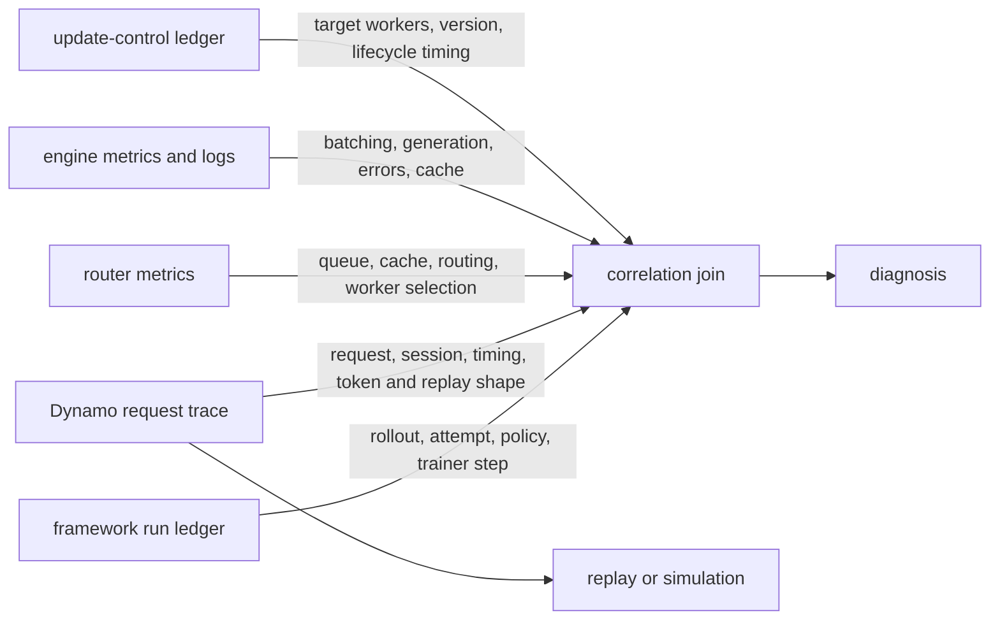

**Experimental.** Start with the live run: establish framework-to-Dynamo identity, localize the bottleneck, and validate the trace. Only then replay or simulate the request plane. Current Dynamo tooling can reproduce request timing, token lengths, prefix-sharing structure, and session relationships; it does not reproduce the trainer, reward pipeline, policy transitions, sample acceptance, or model-dependent branch decisions.

## Use One Correlation Model

An RL system spans data that no single component owns:



Keep high-cardinality identifiers such as job, rollout, sample, attempt, request, and policy version in framework records, traces, or logs. Use Prometheus labels only for bounded dimensions such as model, backend, route, worker role, status class, and a small policy-class taxonomy.

## Know What Dynamo Emits Today

| Source | Current useful fields or signals | RL boundary |
|---|---|---|
| Request trace `request_end` | Request ID, receive time, output tokens, input/output lengths, sequence hashes, KV block size, and optional timing/KV/worker data | No stable typed framework, rollout, sample, trainer-step, or policy-version fields |
| Request trace `request_payload` | Request ID, endpoint, model, optional request/response payload, and explicitly allowlisted HTTP headers | Payloads and captured headers are unredacted; capture only approved data |
| Dynamo session context | Session ID, parent session ID, final marker, compaction, KV hints, and input trigger where supplied | Session identity is not an RL rollout schema and does not enable affinity by itself |
| Frontend/router metrics | Request, queue, routing overhead, cache and per-worker signals | Aggregate behavior; do not add rollout IDs as labels |
| Backend metrics/logs | Engine queue/batch/cache/generation state and backend errors | Names and availability differ across vLLM, SGLang, and versions |
| vLLM weight controls | Per-call result and caller-supplied version readback | Not emitted as a standardized request-trace event; not a content digest |
| Framework ledger | Job, rollout/sample, attempt, trainer step, target policy, acceptance, reward, update phase | Framework-owned; Dynamo cannot reconstruct it after the fact |

Use the [request trace reference](../../reference/observability/request-traces.mdx) for the exact `dynamo.request.trace.v1` schema and the [metrics catalog](../../reference/observability/metrics-catalog.mdx) for current names.

## Establish Framework-to-Dynamo Identity

For multi-turn trajectories, send Dynamo's session headers when their semantics match:

```text
X-Dynamo-Session-ID: rollout-run42-sample7
X-Dynamo-Parent-Session-ID: rollout-run42-parent2
```

The session ID groups requests and can support replay relationships. Supplying it does not enable session affinity unless the frontend is configured for affinity, and it does not cause Dynamo to validate a policy version.

For framework fields that are not typed by Dynamo, use an application-owned run ledger. If a direct trace join is needed, send non-secret application headers and explicitly allowlist them for `request_payload` capture:

```bash
export DYN_REQUEST_TRACE=1
export DYN_REQUEST_TRACE_RECORDS=request_end,request_payload
export DYN_REQUEST_TRACE_SINKS=file
export DYN_REQUEST_TRACE_FILE_PATH=/tmp/rl-run/request-trace
export DYN_REQUEST_TRACE_HTTP_HEADER_CAPTURE_LIST=x-rl-rollout-id,x-rl-attempt-id,x-rl-policy-version
```

`X-RL-Rollout-ID`, `X-RL-Attempt-ID`, and `X-RL-Policy-Version` in this example are application conventions, not Dynamo routing or validation fields. The framework must still preserve the authoritative values and their meaning.

> [!WARNING]
> Allowlisted header values and request/response payloads are unredacted. Never capture authorization, cookies, credentials, private prompts, reward secrets, or user data without an approved retention and access policy. Prefer opaque IDs that join to a protected framework ledger.

## Build the Join

Use `request_id` as the join key between the two Dynamo record types:

- `request_end.request.request_id`
- `request_payload.payload.request_id`

Then join the captured application rollout/attempt header to the framework run ledger. A conceptual query has this shape:

```sql
SELECT
  framework.run_id,
  framework.rollout_id,
  framework.attempt_id,
  framework.target_policy_version,
  payload.payload.request_id AS dynamo_request_id,
  request_end.event_time_unix_ms,
  request_end.request.output_tokens,
  request_end.request.replay.input_length
FROM framework_attempts AS framework
JOIN dynamo_request_payload AS payload
  ON framework.rollout_id = payload.payload.http_request_headers['x-rl-rollout-id']
 AND framework.attempt_id = payload.payload.http_request_headers['x-rl-attempt-id']
JOIN dynamo_request_end AS request_end
  ON payload.payload.request_id = request_end.request.request_id;
```

Field extraction syntax depends on the trace store. Validate the join with counts before using timing results:

1. Framework dispatched attempt count equals joined payload count for the traced frontend.
2. Joined terminal `request_end` count matches the set expected to complete.
3. Canceled, failed, and timed-out attempts remain distinguishable from successful terminal samples.
4. Session and per-session turn counts match the framework ledger.
5. Target policy identity comes from the framework/update ledger, not an inferred request timestamp.

A missing join can indicate that the framework reached a different frontend, tracing started late, headers were not allowlisted, payload capture was disabled, the process did not flush, or an attempt never emitted a terminal record.

### Run the checked synthetic join

The repository includes a dependency-free correlation example and safe synthetic inputs. Use it to verify the file format and join logic before handling a real run:

```bash
python3 docs/fern/scripts/rl_trace_join.py \
  --framework-attempts docs/fern/scripts/fixtures/rl_trace_join/framework-attempts.jsonl \
  --request-trace docs/fern/scripts/fixtures/rl_trace_join/request-trace.jsonl \
  --joined-jsonl /tmp/rl-trace-join/joined.jsonl \
  --summary-json /tmp/rl-trace-join/summary.json \
  --strict
```

The example joins opaque rollout and attempt headers case-insensitively, uses the Dynamo request ID to find `request_end`, checks the captured policy header against the framework target, preserves compact terminal metrics, and excludes captured request and response bodies from its output. It accepts `.jsonl` and `.jsonl.gz` trace shards. Strict mode fails for a missing payload join, a missing required terminal, an unexpected terminal, or a missing/mismatched policy header.

The checked fixture contains two completed requests and one intentionally incomplete timed-out attempt. Its repeated sequence hashes, different KV hit rates, queue depths, and timing values are synthetic signals for exercising a query—not measurements and not evidence that a framework integration works. Replace both inputs with a real framework ledger and trace, inspect the joined rows, and preserve the resulting summary with the run record. The [join script](https://github.com/ai-dynamo/dynamo/blob/main/docs/fern/scripts/rl_trace_join.py), [framework-attempt fixture](https://github.com/ai-dynamo/dynamo/blob/main/docs/fern/scripts/fixtures/rl_trace_join/framework-attempts.jsonl), and [trace fixture](https://github.com/ai-dynamo/dynamo/blob/main/docs/fern/scripts/fixtures/rl_trace_join/request-trace.jsonl) are maintained with this guide.

### Generate a checked request-plane operations report

Turn the body-free joined rows into a compact operations artifact before interpreting individual requests:

```bash
python3 docs/fern/scripts/rl_ops_report.py \
  --joined-jsonl /tmp/rl-trace-join/joined.jsonl \
  --report-json /tmp/rl-trace-join/operations-report.json \
  --strict
```

The `dynamo.rl.operations-report.v1` artifact reports join and framework terminal status, accepted/rejected counts, target and observed policy-header counts, finish reasons, per-worker activity, and field coverage plus min/mean/p50/p95/max for the current request-trace token, queue, prefill, decode, KV, transfer-estimate, and latency fields. Percentiles use linear interpolation over the observed terminal rows. Missing optional fields have zero coverage and null statistics; they are never imputed as measured zero. Strict mode requires at least one terminal, accepts only complete or expected-incomplete joins, and rejects policy-header mismatches.

This report contains no captured request or response body and does not invent diagnosis thresholds. It also does not join aggregate Prometheus series. Most importantly, the current request trace has no standardized weight-update phase, duration, result, or served-content event; preserve update lifecycle timing and content verification in the framework/control ledger and review it beside this report. The checked [report script](https://github.com/ai-dynamo/dynamo/blob/main/docs/fern/scripts/rl_ops_report.py) and [expected synthetic report](https://github.com/ai-dynamo/dynamo/blob/main/docs/fern/scripts/fixtures/rl_trace_join/expected-operations-report.json) define the maintained request-plane query artifact.

## Diagnose the Live Run

Work from the outside in:

1. **Framework:** Was the request dispatched, accepted, canceled, retried, rejected as stale, or blocked on the trainer/environment?
2. **Frontend:** Did the traced request arrive with the expected model, session, and payload shape?
3. **Router:** Was it queued, which worker was eligible/selected, what cache/load signal drove the decision, and how much routing overhead was added?
4. **Engine:** Did it queue, prefill, decode, cancel, error, or restart? Did token/logprob output satisfy the adapter contract?
5. **Weight lifecycle:** Which worker set and target version were active, and was the request allowed before verification completed?

Align framework, trace, router, worker, and update-control clocks before interpreting sub-second timing. Record time synchronization and any known offset.

### Request or engine queueing

**Controlled symptom:** rollout wall time grows while request arrival rate is bursty and GPU utilization alone does not explain the tail.

Inspect:

- framework dispatch and completion timestamps
- request receive and terminal timing from the trace
- router pending queue depth, queue duration, status/rejections, and policy class
- per-worker active prefill/decode work and engine queue metrics
- prompt/output length distribution and cancellations/timeouts

Interpretation:

- Router queue time means Dynamo intentionally deferred dispatch because every eligible worker crossed the configured threshold or the class already had backlog.
- Engine queueing after dispatch points to backend batching/capacity, long decode work, or worker imbalance.
- A framework gap before frontend receipt belongs outside Dynamo, such as environment/tool/reward or scheduler delay.

Controlled experiment: replay the same request schedule with queueing disabled and enabled, keeping the worker set and cache state fixed. Compare errors, TTFT/tail, completed tokens, and accepted/fresh trajectories rather than only mean latency.

### KV-routing miss or cache loss

**Controlled symptom:** repeated prompts perform full prefill, or cache hit rate collapses after worker churn or a policy update.

Inspect:

- trace input sequence hashes and block size for supposedly shared prompts
- model, tokenizer, cache salt, LoRA, and routing-group identity
- KV event health and router hit/query/overlap metrics
- worker chosen for sibling or multi-turn requests
- predicted-routing configuration and arrival/event timing
- cache reset, offload flush, worker restart, and warm-up boundaries

Controlled experiment: use a fixed parallel-sample group with a known shared token prefix. Compare round-robin, default KV routing, and KV routing with a short predicted TTL. The causal evidence should show whether shared prompts co-located and whether repeated prefill work decreased. After a policy update, expect old-policy KV state to be invalidated; separate the required cold warm-up from a regression.

### Blocked or failed weight refresh

**Controlled symptom:** rollout generation pauses longer than expected, workers report mixed versions, or the next phase fails immediately after update.

Inspect:

- framework gate start/end and target policy identity
- worker set before group initialization and after failure
- per-worker pause, group-init, transfer, cache-reset, version, liveness, resume, and post-update smoke results
- `DYN_RL_INIT_WEIGHTS_TIMEOUT_S` and worker restart when vLLM group initialization blocks
- gaps and failures in request traces around the update window
- backend logs for collective/rank/IPC/NIXL/NCCL errors

The current request trace has no standardized weight-update event. Preserve these timestamps in the control-service or framework ledger and plot them on the same time axis. A version string without transfer and post-update evidence is insufficient. See [Update rollout weights](weight-updates.md) for lifecycle and recovery semantics.

## Minimum RL Operations View

A useful dashboard or query pack should answer:

| Question | Source |
|---|---|
| How many rollout attempts were dispatched, completed, canceled, retried, accepted, or rejected? | Framework ledger joined to request traces |
| Where is time spent before and inside serving? | Framework timestamps, trace timing, router queue, engine metrics |
| Are prompts reusing KV state as intended? | Trace hashes, router overlap/hit/query signals, worker cache metrics |
| Are workers balanced? | Per-worker request, active work, token, queue, and utilization metrics |
| Which target policy should be active and which workers passed verification? | Framework/update-control ledger |
| How long do gate, transfer, cache reset, verification, and warm-up take? | Update ledger plus logs and post-update traces |
| Is serving speed improving useful training work? | Accepted/fresh samples or trajectories per GPU-hour and full-step time from the framework |

Do not use one generic “RL throughput” chart without defining its numerator, denominator, freshness, and phase boundaries.

Use the checked request-plane operations report for joined terminal, policy-header, trace timing, KV, and worker data. Add the framework/update-control ledger for acceptance, trainer, and weight lifecycle semantics, and use the current metrics catalog for bounded aggregate router and backend series. Do not merge those sources by timestamp without clock-synchronization evidence.

## Capture a Replayable Request Plane

For replay, the compact `request_end` trace is the essential artifact. It preserves request schedule, input and output token lengths, sequence hashes, and block size; session-aware rows can preserve session relationships. A context-free replay row must represent one model request. Requests with unsupported multi-choice, embeddings, multimodal inputs, or missing tracker/block data are skipped.

Capture to rotating compressed JSONL:

```bash
export DYN_REQUEST_TRACE=1
export DYN_REQUEST_TRACE_RECORDS=request_end
export DYN_REQUEST_TRACE_SINKS=file
export DYN_REQUEST_TRACE_FILE_PATH=/tmp/rl-replay/request-trace
export DYN_REQUEST_TRACE_FILE_FORMAT=jsonl_gz
```

Run the real framework workload through that frontend, then stop or otherwise allow the process to flush. Before replaying, verify:

- trace request count against framework completed/incomplete attempt counts
- total input/output tokens against framework serving totals
- expected session and turn counts
- one consistent trace block size
- sequence-sharing structure for known sibling prompts
- complete final shards and no mixed session-aware/context-free trace set

Payload records are not required for content-free replay. Avoid them when token lengths and prefix structure are sufficient.

## Replay and Simulate the Request Plane

One validated trace can support two different experiments:

| Path | Runs | Measures or predicts | Required conclusion boundary |
|---|---|---|---|
| Live replay | Synthetic requests against a real Dynamo endpoint and GPUs | Actual serving latency, throughput, cache behavior, and regressions for the replayed request graph | Does not rerun trainer, tools, rewards, or original model decisions |
| Offline DynoSim | Request graph against simulated router, scheduler, KV cache, and timing models | Directional comparison of worker counts, topology, routing, cache capacity, and Planner choices | Not a hardware measurement; calibrate shortlisted candidates live |

### Offline DynoSim

DynoSim accepts the Dynamo trace shards directly:

```bash
python -m dynamo.replay /tmp/rl-replay/request-trace.*.jsonl.gz \
  --trace-format dynamo \
  --replay-mode offline \
  --router-mode kv_router \
  --num-workers 4 \
  --report-json /tmp/rl-replay/dynosim-report.json
```

First confirm request, token, session, and cache-sharing totals. Then change one serving factor at a time, such as worker count, aggregated versus disaggregated topology, router configuration, KV capacity, or timing model. See [DynoSim](../../cli/operations/simulation-with-dynosim/overview.md) and [DynoSim Runs](../../cli/operations/simulation-with-dynosim/dynosim-replay.mdx) for the complete interface.

### Live replay

Live replay converts the content-free graph to synthetic requests and sends them on the recorded schedule. The current agent replay guide documents the active AIPerf conversion path, including any branch/version qualification that still applies. Follow [Agent Trace Replay](../agents/agent-simulation.mdx) and the upstream [AIPerf trace replay guide](https://github.com/ai-dynamo/aiperf/blob/main/docs/benchmark-modes/trace-replay.md) rather than copying a stale converter command into an RL recipe.

Use the same model/tokenizer, block size, worker topology, initial cache state, and schedule when measuring fidelity. Synthetic prompts preserve complete-block sharing, not original semantics. If a changed model response would choose a different tool, environment action, or branch, capture another live framework run.

## Control Repeatability and Report Variance

A fixed trace makes the request graph reproducible; it does not make a live serving run bitwise deterministic. Backend scheduling, concurrent arrivals, cache warm-up, network timing, sampled generation, and worker recovery can still change measured outcomes. Likewise, an offline simulation can be repeatable for one pinned configuration without proving that its timing model matches hardware.

For every replay or simulation comparison, preserve:

- the trace-file digest, replay/simulation tool commit, Dynamo and backend pins, model/tokenizer revision, and complete configuration
- schedule scaling, concurrency, router tie-breaking inputs, initial cache state, worker count/topology, and any seed accepted by the selected tool or backend
- warm-up policy, start/stop boundary, successful and skipped request counts, and the reason for every skipped row
- at least three measured repetitions for each live and simulated configuration, with the same aggregation method and spread statistic
- whether repeat runs preserved request/token/session totals and whether any decision metric crossed its predeclared material-error threshold

Call a result deterministic only for the artifact and layer actually checked. Stable trace lowering does not imply deterministic model outputs, and repeated simulation output does not imply live fidelity. If variance changes the configuration ranking, report the comparison as inconclusive and gather more live evidence instead of selecting the favorable repetition.

## RL Replay and Simulation Fidelity

| Dimension | Captured/replayed today | Omitted or approximated |
|---|---|---|
| Request arrivals | Recorded receive schedule; replay can use relative timing | Framework scheduling cause and trainer barriers are not reconstructed |
| Token shape | Input/output lengths and block-level sequence hashes | Original text, exact tokens, rewards, and semantic correctness |
| Prefix sharing | Complete-block sharing structure | Partial-block content and changed tokenizer/chat-template effects |
| Sessions | Session order and supported parent relationships when supplied | Arbitrary framework rollout DAGs without mapped session identity |
| Tools/environments | Time can remain as gaps or optional tool-wait records | Tools and environments are not executed; decisions are not recomputed |
| Routing and KV | Live router or simulated router/cache can be compared | Policy-version eligibility and framework sample acceptance |
| Engine timing | Measured live or predicted by the selected simulation model | Kernel/network/content effects not represented by the model |
| Weight updates | Their request-traffic gap can appear in the schedule | Transfer, cache reset, version transition, group failure, and trainer/rollout overlap are not simulated as RL events |
| Training | None | Optimizer, reward, advantage, checkpoint creation, convergence, and training quality |

Do not describe this workflow as full closed-loop RL simulation. It answers serving questions for a captured workload. A closed-loop model would require explicit rollout/trainer phase events, policy-version transitions, update timing/failure, sample completion/acceptance, deterministic packaging, and calibration against live end-to-end runs.

## Calibrate Before Making Claims

For each simulated configuration that informs a decision:

1. Run the captured trace through the baseline live deployment.
2. Run the same trace through the matching DynoSim configuration.
3. Compare request/token totals, schedule, queueing, cache hits, TTFT, ITL, end-to-end latency, and utilization where modeled.
4. Report absolute and relative error for the metrics used in the decision.
5. Recalibrate when the model, backend, hardware, topology, router behavior, or timing model changes.
6. Validate the shortlisted variant on real GPUs before publishing a performance number or deploying it.

State whether results are directional, calibrated predictions, or live measurements. Include repeated-run spread and disclose material error instead of presenting a simulation point estimate as hardware truth.

## Finalize the Cross-Cutting Program Record

Use one checked record to close the program-level routing, weight-transfer, observability, replay, and simulation gates. Copy the template before running the experiments, keep it in `planned` state while evidence is missing, and store the completed record beside the immutable artifacts it references:

```bash
cp docs/fern/scripts/rl_program_record.template.json \
  /approved/artifacts/rl-program-record.json

python3 docs/fern/scripts/check_rl_program_record.py \
  /approved/artifacts/rl-program-record.json
```

The combined operations section must include:

- clock-synchronization evidence and matched traced/untraced overhead measurements with at least three repetitions each
- passed controlled diagnoses for request/engine queueing, KV-routing miss/cache loss, and blocked/failed weight refresh, each with a conclusion and artifact URIs
- capture reconciliation between framework attempts, expected replayable requests, trace requests, token totals, sessions, and block size
- at least three repetitions of both live replay and the matching DynoSim configuration
- live and simulated values for each decision metric, with mathematically consistent absolute and relative error, a predeclared material-error threshold, disclosure, and conclusion

After all cross-cutting sections are backed by artifacts, set `record_state` and each section status to `passed`, record an independent clean-room reviewer, and run:

```bash
python3 docs/fern/scripts/check_rl_program_record.py \
  /approved/artifacts/rl-program-record.json \
  --publication-gate
```

The checker validates completeness and arithmetic; it does not inspect the truth of external artifact URIs or replace human review. A planned template passing the structure check is not performance or compatibility evidence. Keep the completed record out of the repository when its artifacts contain customer data, prompts, credentials, or restricted logs; link an approved durable location from the evidence ledger instead.

## Prioritized Product Gaps and Closed-Loop Decision

These are issue-ready proposals, not committed roadmap items or assigned owners. The checked [product-gap register](https://github.com/ai-dynamo/dynamo/blob/main/docs/fern/scripts/rl_product_gaps.json) records the source assertions, dependencies, acceptance evidence, owner teams, documentation behavior, and expiration trigger behind each summary:

| Gap | Priority | Vehicle | Contract needed | Documentation boundary until accepted |
|---|---|---|---|---|
| DYN-RL-GAP-001: typed RL correlation and freshness context | P0 | DEP | Additive mixed-version-safe framework/job/rollout/sample/request-role/policy/trainer-step/lag context and enforcement semantics | Keep RL identity application-owned; opaque headers are correlation conventions, not router fields. |
| DYN-RL-GAP-002: served policy-content identity | P0 | DEP | Immutable served-policy identity or attestation joined to each completion without full-weight hashing on the request path | Treat version text as caller-supplied correlation and require update, cache, numerical/output, and post-update proof. |
| DYN-RL-GAP-003: standard weight-update lifecycle events | P0 | Implementation issue | Backend-neutral gate/pause/transfer/cache/verify/fail/rollback/resume/warm-up events with bounded identifiers and safe errors | Preserve per-worker lifecycle timing in the framework/control ledger; never infer it from traffic gaps. |
| DYN-RL-GAP-004: RL lifecycle replay event contract | P1 | Implementation issue | Optional framework-owned phase, transition, update-window, sample-terminal, and acceptance events with deterministic lowering | Replay the request plane only; do not claim trainer, reward, acceptance, or policy-transition reproduction. |
| DYN-RL-GAP-005: closed-loop simulator ownership and package | P2 | DEP after gaps 001–004 | Package/DRI decision, semantic ownership, deterministic artifact, security model, fidelity metrics, and live calibration | Keep closed-loop simulation outside the shipped RL docs surface. |

The recorded decision is **request plane now; closed loop as a follow-on DEP**. Capture, live replay, and DynoSim request-plane workflows remain in this documentation goal. Do not preassign the future package to DynoSim, AI simulation, or a new project before the DEP resolves semantic ownership and all four prerequisite contracts have implementation evidence. Validate the register with `python3 docs/fern/scripts/check_rl_product_gaps.py`; the check fails when the pinned source or documented limitation changes, a dependency becomes cyclic or lower priority than its dependent, acceptance evidence becomes incomplete, or the closed-loop decision is weakened.

Until the gaps close, keep framework semantics in the framework ledger, use current Dynamo trace/header capabilities for correlation, require current weight lifecycle evidence, and limit replay/simulation claims to the serving request plane.
