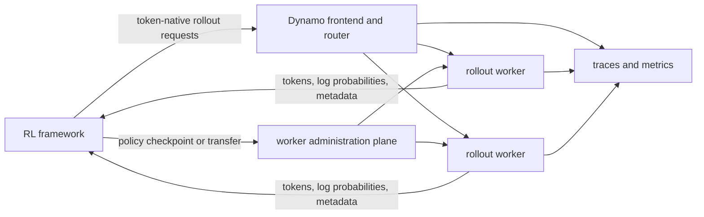

**Experimental.** NVIDIA Dynamo provides the rollout-serving infrastructure around an RL framework. The framework still owns the training algorithm, datasets, environments, rewards, trajectory semantics, policy updates, and checkpoint production. Dynamo supplies inference-facing routing, token-native transport, backend telemetry, serving failure propagation, and backend-specific worker discovery and control where supported. It does not own framework retry policy, sample acceptance, fleet-wide update atomicity, or recovery policy.

Use these guides when a static model endpoint is no longer enough: rollout traffic is bursty, many samples share prefixes, generation must return exact token IDs and log probabilities, workers need live policy refreshes, or the serving workload must be diagnosed and replayed independently of the trainer.

## Decide Whether Dynamo Is the Right Layer

Dynamo earns its place when rollout serving has become a distinct distributed-systems job. Do not add it only because an RL framework can call an OpenAI-compatible endpoint.

| Current situation | Recommended path | Decision signal |
|---|---|---|
| One static rollout worker, no live refresh, and no routing or fleet-operability problem | Keep the direct backend path until a concrete serving limitation appears | Another control plane would add deployment and debugging work without changing the limiting step. |
| Multiple workers serve bursty or prefix-sharing rollout groups | Evaluate one Dynamo frontend with a matched direct-backend baseline | Proceed only if routing, queueing, cache reuse, or worker supervision improves a declared serving or framework-goodput metric. |
| A colocated framework already owns sleep, wake, and CUDA-IPC policy transfer | Use Dynamo for the request plane while preserving the proven framework control path | The verl recipe is this shape; request routing and weight synchronization do not need the same owner. |
| An external rollout fleet needs discovery and targeted updates | Integrate the request, discovery, and administration planes explicitly | The framework must still own membership, the fleet update barrier, recovery, and sample-freshness policy. |
| The primary need is trainer, reward, acceptance, or convergence simulation | Keep that work in the framework or a future closed-loop design | Current Dynamo replay and DynoSim model the serving request plane, not RL algorithm semantics. |

Before adopting Dynamo, name the current bottleneck, the baseline, the metric that would justify the change, and the team that will maintain the integration. A successful endpoint smoke proves connectivity; it does not by itself justify changing the rollout architecture.

## Where Dynamo Fits

| Responsibility | RL framework | Dynamo | Inference backend |
|---|---:|---:|---:|
| Training step, rewards, advantages, and sample acceptance | Owns | Does not own | Does not own |
| Rollout request construction and retry/deduplication policy | Owns | Enforces the serving contract | Executes accepted requests |
| Shared frontend, routing, discovery, and request-plane health | Integrates | Owns | Publishes worker state and capabilities |
| Token IDs, log probabilities, terminal reasons, and backend metadata | Consumes and verifies | Transports and normalizes where supported | Produces |
| Policy refresh trigger and target version | Owns | Exposes control surfaces | Applies backend-specific update |
| Fleet-wide update barrier and freshness policy | Owns or orchestrates | Does not currently provide a global transaction | Reports per-worker results where supported |

## Choose a Framework Path

Framework maturity is evidence-based, not a statement that any OpenAI-compatible client can send a request.

| Framework | Start here | Maturity | What the label means |
|---|---|---|---|
| verl | [Integrate with verl](verl.md) | Experimental | A public recipe exists and includes smoke, training, routing, and weight-update paths. The Dynamo guide remains experimental until its pinned clean-room validation record is complete. |
| SLIME | [Review SLIME integration status](slime.md) | Integration in progress | Public prototype PRs demonstrate the intended streaming and discovery contracts, but the accepted upstream path is not settled. |
| Prime-RL | [Review Prime-RL integration status](prime-rl.md) | Integration in progress | Discovery, recipes, and sidecar work remain in open PRs. The page documents architecture and graduation gates, not a supported launch procedure. |
| NeMo RL | [Compatibility status](integration-reference.md#framework-compatibility) | Design research | NeMo RL exposes compatible generation and lifecycle concepts, but this documentation set has no validated public Dynamo adapter or recipe. |

See the [authoritative framework compatibility table](integration-reference.md#framework-compatibility) for pinned evidence, backend and topology constraints, validation dates, and ownership. Frameworks such as Miles, ProRL, OpenRLHF, and SkyRL remain candidates until a maintained public integration passes the same evidence gate.

## Choose a Generation Contract

| Need | Recommended starting point |
|---|---|
| Native SGLang token-input streaming | SGLang-compatible `POST /generate`; see [Choose a request interface](integration-reference.md#choose-a-request-interface). |
| Cross-backend token-input generation | OpenAI-compatible `/v1/completions` with integer token arrays or `nvext.token_data`. |
| Completion token IDs and prompt/completion log probabilities | Request the named `nvext` response fields and verify backend support in the [backend compatibility table](integration-reference.md#backend-compatibility). |
| Worker discovery and direct lifecycle control | Use the dedicated vLLM discovery listener and each worker's system URL; do not send mutating calls through the inference frontend. |
| Large SGLang rollout metadata | Use the opt-in `nvext.metadata_upload` path on a trusted control-plane request. |

The [RL integration and compatibility reference](integration-reference.md) defines token authority, streaming, cancellation, discovery, administration, retry, security, and conformance requirements once for every framework.

## Choose an Optimization or Operations Path

| Job | Guide | Outcome |
|---|---|---|
| Increase cache reuse and control queueing | [Route RL rollouts](routing.md) | Select a baseline, match routing to rollout shape, tune with causal metrics, and avoid implying that routing enforces policy freshness. |
| Refresh rollout workers after a policy update | [Update rollout weights](weight-updates.md) | Choose a framework/backend-specific transfer path, coordinate pause/update/cache/version/resume, and recover from partial failure. |
| Localize a serving bottleneck | [Observe, debug, replay, and simulate RL rollouts](operations-and-simulation.md) | Join framework rollout identity to current Dynamo traces and metrics, then diagnose queue, KV-cache, engine, or update behavior. |
| Reproduce a rollout-serving workload | [Observe, debug, replay, and simulate RL rollouts](operations-and-simulation.md#replay-and-simulate-the-request-plane) | Capture the request plane, replay or simulate it, disclose fidelity limits, and calibrate conclusions against a live run. |

## Maturity Labels

| Label | Required evidence |
|---|---|
| Supported | Merged and released implementation, maintained owner, pinned end-to-end validation through a policy update, compatibility record, and recovery path. |
| Experimental | Runnable pinned artifact with validation evidence and explicit limitations, but no general compatibility promise. |
| Integration in progress | Architecture and current status only. Open branches and PRs are evidence, not a production contract. |
| Design research | A candidate contract or gap analysis with no implication that the integration ships. |

No framework path in this documentation set is labeled supported yet. This is deliberate: token/logprob correctness, a complete training iteration, policy refresh, post-update generation, and recovery must all be independently recorded before graduation.

## Global Boundaries

- Dynamo does not decide whether a trajectory is valid, accepted, on-policy, or fresh enough for training.
- The current request schema does not expose a stable typed RL context containing framework, rollout ID, policy version, trainer step, or maximum policy lag. Use documented session IDs and explicitly allowlisted application headers for correlation; do not assume Dynamo routes on those values.
- Worker discovery and system-server routes are administrative interfaces without a separate authentication layer. Keep them on a trusted orchestrator network and expose only required backend methods.
- A successful HTTP request does not prove a complete RL sample. The framework must verify terminal state, token/logprob alignment, masks where applicable, and its own duplicate-sample policy.
- DynoSim and request replay reproduce the serving workload, not the trainer, reward computation, policy transitions, or model-dependent branch decisions.
- ModelExpress accelerates model loading and fleet distribution. It is not the default live-policy refresh mechanism for the framework integrations documented here.

## Next Step

If you are implementing an adapter, start with the [RL integration and compatibility reference](integration-reference.md). If you are running an existing integration, open the matching framework page and check its maturity and validation record before using its commands.
