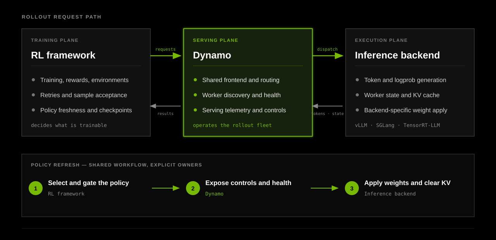

Dynamo provides routing, worker management, weight-update controls, and serving telemetry for reinforcement learning (RL) rollouts. Your RL framework continues to own training, rewards, environments, trajectory semantics, checkpoints, and sample acceptance.

Use Dynamo when rollout serving has become a distributed-systems problem: many workers serve bursty traffic, samples share large prompt prefixes, policies must refresh without rebuilding the serving stack, or you need to diagnose and replay the serving workload independently of the trainer.

## Proven on Real RL Workloads

In production, [Cognition used Dynamo while training SWE-1.7](https://cognition.com/blog/swe-1-7) to manage inference-engine lifecycles and route inference across a multi-cluster RL system. When a replica failed, Dynamo rerouted inference to another worker and rescheduled the replica so the rollout pipeline could remain available while the latest policy state was restored.

Dynamo also connects to a growing RL framework ecosystem. [NeMo RL](https://github.com/NVIDIA-NeMo/RL/tree/main/nemo_rl/models/generation/dynamo) includes a managed Dynamo generation backend, [verl](https://github.com/verl-project/verl-recipe/tree/main/dynamo) publishes a Dynamo rollout recipe, and [Prime-RL](https://www.primeintellect.ai/blog/rl-at-1t-scale) supports the Dynamo router as a drop-in routing option. Integration work with [SLIME](integration-reference.md#framework-compatibility) extends the same serving capabilities to SGLang-based rollout stacks. Together, these paths demonstrate that Dynamo can support different training frameworks and deployment models while leaving RL semantics with the trainer.

## Decide Whether to Add Dynamo

| Current setup | Recommended path |
|---|---|
| One rollout worker with no routing or live-update problem | Keep the framework's direct backend path. |
| Multiple workers serving repeated or bursty prompts | Evaluate Dynamo routing against the current direct-backend baseline. |
| A colocated framework already owns policy transfer | Use Dynamo for generation and routing while keeping the proven framework update path. |
| An external rollout fleet needs discovery and direct control | Integrate Dynamo's request, discovery, and worker-administration surfaces explicitly. |

Start with a specific bottleneck and a baseline metric. Measure cache reuse, worker imbalance, policy-refresh time, or time to diagnose a failure before adding Dynamo.

## Who Owns What

> [!IMPORTANT]
> Dynamo does not decide whether a trajectory is on-policy, accepted, or fresh enough for training. The framework must gate requests around synchronous updates or enforce its own bounded-staleness policy.

## Framework Integrations

| Framework | Status | Start here |
|---|---|---|
| verl | Experimental | [verl Integration](verl.md) for the public colocated Dynamo/vLLM recipe. |
| NeMo RL | Experimental | [NeMo RL Integration](nemo-rl.md) for the managed Slurm/Ray Dynamo backend. |
| SLIME | Integration in progress | Review the current boundary in [Framework Compatibility](integration-reference.md#framework-compatibility). |
| Prime-RL | Routing available; integration in progress | See [Prime-RL's routing overview](https://www.primeintellect.ai/blog/rl-at-1t-scale) and the current boundary in [Framework Compatibility](integration-reference.md#framework-compatibility). |

Experimental guides have runnable upstream artifacts but do not make a general compatibility promise. Integrations in progress remain in the compatibility table until a maintained path lands.

> [!NOTE]
> Kubernetes is optional for these RL integrations. Use it only when the selected framework or deployment environment requires it.

## Next Steps

<CardGroup cols={2}>
  <Card title="Enable KV-Aware Load Balancing" icon="regular sliders" href="routing.md">
    Route repeated rollout prefixes to cache-rich workers while accounting for live load and queue pressure.
  </Card>
  <Card title="Distribute and Update Rollout Weights" icon="regular database" href="weight-updates.md">
    Use ModelExpress for fleet distribution, then coordinate integration-specific live policy refresh and recovery.
  </Card>
  <Card title="Profile RL Rollouts" icon="regular chart-line" href="operations-and-simulation.md">
    Join framework records with Dynamo traces and metrics, inspect Perfetto timelines, and replay or simulate the serving workload.
  </Card>
  <Card title="Build a Framework Integration" icon="regular terminal" href="integration-reference.md">
    Preserve token, retry, discovery, and policy-update contracts when adding Dynamo to another RL framework.
  </Card>
</CardGroup>
