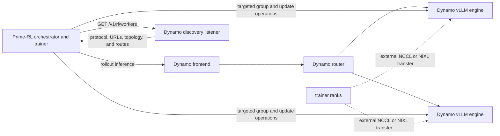

**Integration in progress.** Prime-RL's Dynamo integration is represented by open discovery and recipe PRs plus a draft combined sidecar PR. This page documents the intended boundary, review checklist, and graduation path. It intentionally does not convert unmerged branch commands into a supported production guide.

## Current Evidence

| Artifact | State checked 2026-08-27 | Role in the proposed integration |
|---|---|---|
| [Discovery integration PR #3176 at `828ddc7`](https://github.com/PrimeIntellect-ai/prime-rl/pull/3176) | Open | Resolve Dynamo rollout engines and separate frontend inference from direct engine administration. |
| [Training recipes PR #3180 at `2f67c72`](https://github.com/PrimeIntellect-ai/prime-rl/pull/3180) | Open | Example configurations for external Dynamo/vLLM rollout serving. |
| [Combined sidecar PR #3181 at `b17ceea`](https://github.com/PrimeIntellect-ai/prime-rl/pull/3181) | Open draft | Assemble generation, discovery, and external weight-update behavior in one integration branch. |
| [Dynamo native-vLLM umbrella PR #13481 at `b3d6a63`](https://github.com/ai-dynamo/dynamo/pull/13481) | Open; review required | Compose the Dynamo discovery, native-generate, routed-output, and sidecar leaves. Its PR record reports a three-step Qwen3-MoE run, a NIXL update to policy version 1, later version-1 rollouts, and post-update generation on the composite branch. |
| [Dynamo discovery protocol PR #13606 at `5bc908ad`](https://github.com/ai-dynamo/dynamo/pull/13606) | Merged | Version the worker list and define optional `world_size` and `admin_base_url` transfer metadata without changing existing Python-backed producers. |
| [Dynamo vLLM sidecar metadata PR #13607 at `862d2c2`](https://github.com/ai-dynamo/dynamo/pull/13607) | Open | Publish the sidecar's computed inference world size and optional controller-routable vLLM HTTP compatibility endpoint. |
| [vLLM world-size PR #53204 at merge `9dba2c9b`](https://github.com/vllm-project/vllm/pull/53204) | Merged | Expose the authoritative per-engine world size over gRPC so consumers include TP, PP, and prefill-context parallelism rather than reconstructing an incomplete count. |
| [Prime-RL documentation at `95734aa1`](https://github.com/PrimeIntellect-ai/prime-rl/tree/95734aa1dd3de26afee31e99b7b63b86ad8f4a2e/docs) | Project documentation snapshot | Framework-owned trainer and orchestration behavior outside the Dynamo adapter. |

The upstream vLLM world-size prerequisite is merged, but the Dynamo producer remains open and is not part of the reviewed `5bc908ad` runtime. The umbrella PR's reported live run is useful branch-level evidence, but it is not an independent reproduction and does not make its still-open Dynamo and vLLM leaves available on `main`. The evidence owner is the Prime-RL integration contributor set together with Dynamo RL maintainers. A release audit must recheck whether these PRs merged, were superseded, or changed config/API shape before this page's status changes.

## Intended Architecture

This design correctly keeps inference on the shared frontend while sending mutating operations to selected engines. The framework remains responsible for the worker set used by a policy version, group membership, transfer orchestration, partial-failure policy, and whether rollout generation pauses during the update.

## Ownership Contract

| Concern | Intended owner |
|---|---|
| Training, rewards, checkpoints, and target policy identity | Prime-RL |
| Rollout request and attempt identity | Prime-RL |
| Shared frontend and rollout routing | Dynamo |
| Live vLLM worker descriptor and system URL | Dynamo discovery listener, consumed and refreshed by Prime-RL |
| Distributed group membership and transfer parameters | Prime-RL integration, constrained by backend APIs |
| Per-worker update application, cache reset, and version response | Dynamo vLLM control route where used |
| Fleet-wide atomicity, readiness, rollback, and staleness policy | Prime-RL orchestration; not supplied by the discovery endpoint |
| Request, router, and engine telemetry | Dynamo plus vLLM; Prime-RL supplies rollout/policy context in its ledger |

## Dynamo Surfaces the Integration Can Use

### Generation

Send all rollout inference through the Dynamo frontend using the exact token/logprob contract selected by the recipe. Verify completion token IDs and logprob alignment as described in [Define token authority](integration-reference.md#define-token-authority).

### Worker discovery

The discovery listener returns protocol version `1`, stable Dynamo endpoint identity, advertised route names, and capability-dependent direct metadata. `system_url` targets Dynamo `/engine/<route>` calls. Optional `admin_base_url` identifies a backend HTTP compatibility surface and is valid only with optional positive `world_size`; neither field is a fleet transaction or transfer-backend declaration. Model identity can be omitted when registration is missing or ambiguous.

Prime-RL should reject an unknown protocol version, scope and refresh discovery before each control phase, require the complete capability set for the selected path, and detect identity or world-size changes before committing a target worker set. It must not send update calls to the frontend, derive a missing URL, interpret `world_size` as the number of discovered workers, reconstruct it as only TP × PP when prefill-context or data parallelism is present, or assume that one discovery response is durable. Because the reviewed vLLM sidecar producer is not merged, a public recipe must pin the producer it relies on instead of requiring optional transfer metadata from every current vLLM worker.

### Weight update control

Dynamo vLLM currently exposes direct routes for pause/resume, disk and distributed update, update-group lifecycle, and weight-version readback. The proposed Prime-RL path must pin which of these routes it uses, the underlying engine RPC names and bodies, and whether NIXL or NCCL is the actual tensor transport. See [Update rollout weights](weight-updates.md#vllm-distributed-update-control).

## Required Recipe Record

A public Prime-RL recipe should record all of the following in one place:

- Prime-RL commit or release, Dynamo commit or release, vLLM version, image digest, CUDA/driver, and Python package lock
- model and tokenizer revision, precision, dense/MoE architecture, and checkpoint format
- trainer and rollout tensor/data/expert parallel layouts
- node and GPU topology, including whether trainer and rollout workers are colocated or external
- Dynamo frontend, discovery listener, and system-server network boundaries
- generation schema, streaming/cancellation behavior, and requested metadata fields
- exact discovery refresh and worker-set selection logic
- group initialization, transfer, cache invalidation, version verification, teardown, and resume sequence
- one small smoke and one representative training run, with expected success and failure evidence
- owner, last-validated date, and an expiration trigger tied to the relevant releases and PRs

## Validation Sequence After Merge

1. Launch the pinned Dynamo frontend, discovery listener, and at least two RL-enabled vLLM engines.
2. Confirm discovery protocol version `1`, endpoint identities, selected worker count, required routes, and any producer-supplied world size match the intended deployment; define selection independently when `model` is omitted.
3. Send a known token-input generation request and verify token/logprob alignment.
4. Ask Prime-RL to discover workers and prove it calls only the returned direct system URLs for administration.
5. Initialize the selected distributed group using the exact trainer and rollout rank mapping.
6. Gate new rollout requests, update every selected worker to one target policy, reset stale KV state, and read back the version.
7. Destroy the update group if the transport lifecycle requires it, resume generation, and run a post-update smoke.
8. Complete one trainer iteration and prove the next accepted rollouts came from the target version.
9. Repeat with one worker unavailable before discovery, one worker failing during transfer, and one worker restarting after transfer.
10. Capture framework, Dynamo, backend, and update timing evidence and publish it with the recipe.

## Failure Semantics to Resolve

| Failure | Required integration decision |
|---|---|
| Discovery returns a worker with an error or missing route | Exclude it from the target set or fail the update before any transfer begins. |
| Membership changes after group initialization | Abort and rebuild the group; do not silently reuse stale rank mappings. |
| One worker accepts the target while another fails | Keep the fleet gated and choose explicit retry, replacement, or rollback behavior. |
| Group initialization times out | Treat the worker as unhealthy; vLLM can terminate on a blocked engine-core initialization timeout. |
| Transfer succeeds but cache reset fails | Do not admit the worker because old-policy KV state can be invalid. |
| Version readback differs | Do not resume mixed-version rollout generation unless Prime-RL explicitly implements and observes bounded staleness. |
| Post-update generation fails | Keep the target worker out of the next rollout phase and preserve diagnostics. |

## Routing and Freshness

Dynamo can route by cache/load/topology signals, but the current public router does not filter on Prime-RL policy version or trainer step. Prime-RL must therefore gate generation around synchronous updates or implement its own explicitly validated bounded-staleness policy. Do not describe “Dynamo async rollout” as automatic on-policy enforcement.

Use [Route RL rollouts](routing.md) to select and benchmark routing independently of the training algorithm. Use accepted fresh trajectories per GPU-hour, or another framework-owned goodput measure, when a faster request path could increase stale or rejected samples.

## Observability Contract

Prime-RL should maintain a run ledger mapping its job, global step, rollout/sample, attempt, target policy version, and selected worker set. Carry a safe application rollout ID through an allowlisted request header or Dynamo session identity where semantics match, then join it to Dynamo request traces. The current Dynamo schema does not type or enforce Prime-RL's policy fields.

See [Observe, debug, replay, and simulate RL rollouts](operations-and-simulation.md) for the current trace join and the difference between request-plane replay and a full RL loop.

## Known Unsettled Areas

- None of the three cited Prime-RL integration PRs is merged or released as of the evidence date.
- Open recipe configurations can change without a deprecation period and are not a stable compatibility surface.
- The final transport selection, group schema, resharding constraints, and recovery behavior must be recorded from the accepted implementation.
- Dynamo discovery is read-only and does not create a fleet transaction.
- Dynamo routing does not enforce Prime-RL policy freshness.
- No support claim is made for every model, MoE layout, P/D topology, or multi-node rank mapping shown in an open recipe.

## Graduation Gate

Change this page to experimental after the prerequisite integration path lands in a public maintained artifact and a pinned run is reproducible. Change it to supported only after a clean-room run proves a complete trainer iteration, token/logprob correctness, target-version refresh, post-update generation, membership and failure recovery, documented topology, observability correlation, and named Prime-RL and Dynamo owners.
