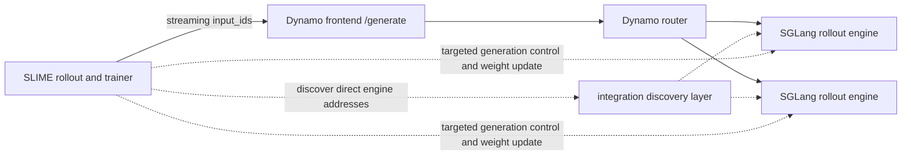

**Integration in progress.** Do not treat this page as a supported SLIME launch guide. Public prototype work demonstrates key pieces of a Dynamo integration, but the original endpoint PR and its streaming successor are closed without merge, while dynamic discovery remains open. The accepted upstream contract, version set, and maintained recipe must be settled before copy-paste instructions are published here.

## Current Evidence

| Artifact | State checked 2026-08-27 | What it establishes | What it does not establish |
|---|---|---|---|
| [Shared external rollout endpoint PR #1 at `971bf61`](https://github.com/Aphoh/slime/pull/1) | Closed, superseded | Original shared Dynamo-style SGLang endpoint direction | Current integration path or supported code |
| [Streaming external rollout PR #2 at `4d39b5a`](https://github.com/Aphoh/slime/pull/2) | Closed without merge | Extensive prototype validation for streaming token/logprob behavior and full training | Accepted upstream API, release compatibility, or maintained recipe |
| [Dynamic engine discovery PR #3 at `06d397f`](https://github.com/Aphoh/slime/pull/3) | Open | Proposed separation of shared generation from discovered per-engine control | Released discovery and failure semantics |
| [SLIME upstream main](https://github.com/THUDM/slime) | Active project | Framework architecture and native rollout behavior | A merged Dynamo integration |

Freshness ownership remains with the SLIME integration contributors and Dynamo RL maintainers. The next review must recheck PR disposition, replacement work, accepted config keys, and an upstream owner before changing maturity.

## Intended System Boundary

The intended split is sound: all generation requests use one Dynamo frontend so routing and cache-aware placement remain centralized, while mutating SGLang operations target individual engine system URLs. What remains unsettled is how SLIME obtains and refreshes those URLs, negotiates route capabilities, coordinates distributed weight updates, and handles membership changes during an update.

## Dynamo Capabilities Available for an Integration

| Need | Current Dynamo surface | Qualification |
|---|---|---|
| Native token-input streaming | SGLang-compatible `/generate` through an eligible in-process worker or experimental sidecar | The in-process path has one Dynamo RL TITO E2E test. The sidecar advertises this route only after discovering a healthy SGLang HTTP endpoint with incremental streaming enabled; review [integration requirements](integration-reference.md#sglang-native-token-streaming). |
| Completion token IDs and selected log probabilities | Native SGLang streaming objects or named OpenAI-compatible `nvext` fields | Validate exact alignment on the pinned SLIME/SGLang versions. |
| Large final `meta_info` payload | `nvext.metadata_upload.url` on the OpenAI-compatible path | Uses trusted fsspec destinations; not part of native `/generate`. |
| Request cancellation | Dynamo cancellation propagation | Remote prefill cancellation in SGLang P/D remains a known limitation. |
| SGLang weight control | Fixed `/engine/control/*` routes or explicit `DYN_SGLANG_ENGINE_ROUTES` allowlist | Backend-specific request bodies and success shapes; no public system port. |
| Generic vLLM RL discovery endpoint | `/v1/rl/workers` | Does not currently register SGLang workers; the SLIME integration must not assume otherwise. |

See the [SGLang backend reference](../../developer-guide/knowledge-base/modular-components/backends/sglang/reference-guide.md#engine-routes) for current fixed and configurable engine routes.

The current sidecar proxy closes a Dynamo transport gap for out-of-process SGLang workers. It does not resolve SLIME's upstream adapter, system-URL discovery, fleet membership, weight-update coordination, or clean-room validation gates, so it does not change this page's integration-in-progress maturity.

## Contract Decisions Required Before a Runnable Guide

### Generation

- Choose native `/generate` or the OpenAI-compatible TITO path and pin the exact request/response schema.
- Define how SLIME maps each streaming event to output token IDs, selected log probabilities, top-k data, terminal reasons, and response masks.
- Define cancellation and retry behavior so an incomplete attempt cannot be scored or counted twice.
- Validate aggregated and P/D deployments separately; do not infer prompt-logprob or cancellation parity.

### Discovery and membership

- Define the authoritative worker registry and how SLIME obtains routable system URLs.
- Negotiate required methods per worker instead of assuming one SGLang version exposes all methods.
- Define what happens when a worker joins, leaves, or restarts during generation or a policy refresh.
- Keep the discovery and system-server network private and explicitly allowlist only required methods.

### Weight updates

- Pin the distributed transport and trainer/rollout parallel-layout constraints.
- Define group initialization, transfer, cache invalidation, version update, teardown, and resume ordering.
- Record whether the update is stop-the-world or permits bounded overlap; Dynamo does not currently enforce SLIME's policy freshness.
- Define fleet-level recovery when one engine fails after other engines accept the new policy.

### Observability

- Carry a stable application rollout/attempt identity and join it to Dynamo request identity.
- Record policy version in the SLIME run ledger. An allowlisted application header can aid trace joins, but it is not a typed routing contract.
- Correlate rollout time, Dynamo queue/router time, SGLang generation metrics, and weight-update time without using rollout IDs as Prometheus labels.

## Contributor Validation Plan

When an accepted upstream implementation is available, validate in this order:

1. Pin SLIME, Dynamo, SGLang, model, container/CUDA, hardware, and topology.
2. Run one `/generate` request with known `input_ids`; prove token/logprob alignment and terminal handling.
3. Run a parallel sample group through two or more workers and confirm all inference traffic uses the shared frontend.
4. Cancel one request during decode and document P/D behavior separately.
5. Initialize the chosen weight-update group, apply one target policy to every engine, invalidate old KV state, verify the version, and destroy the group.
6. Run post-update generation and show that no old-version worker admitted a sample.
7. Complete at least one training iteration including reward, trainer update, rollout refresh, and subsequent generation.
8. Kill one rollout engine during generation and one during update; verify membership and recovery behavior.
9. Capture a trace and join one SLIME rollout/attempt to frontend, router, worker, and update evidence.

Record commands, expected output, failure output, and artifacts in a public maintained recipe. PR comments alone are not a durable validation report.

## Known Unsupported or Unsettled Areas

- There is no merged upstream SLIME/Dynamo recipe represented by this page.
- The original PR #1 is stale and must not be labeled open or current.
- Dynamic SGLang worker discovery is not a shipped Dynamo `/v1/rl/workers` capability.
- No cross-version promise is made for SGLang tokenizer-manager method names or request schemas.
- No fleet-wide atomic update, policy-version routing, or maximum-lag enforcement is documented as shipped.
- No claim is made that one validation topology covers P/D, multi-node, MoE, or different parallel layouts.

## Graduation Gate

Change this page to experimental only after an upstream runnable artifact is accepted and pinned. Change it to supported only after an independently reviewed clean-room run completes one training iteration, token/logprob verification, policy refresh, post-update generation, failure recovery, topology qualification, and observability correlation with named SLIME and Dynamo owners.

Until then, use the [RL integration and compatibility reference](integration-reference.md) to review the contract and the [SLIME upstream project](https://github.com/THUDM/slime) for framework-owned training behavior.
