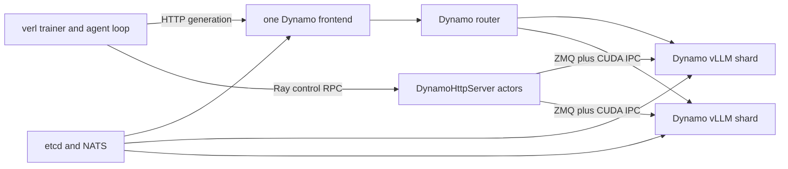

**Experimental.** verl-recipe contains a first-class async Dynamo rollout backend, but this Dynamo page is not labeled supported until a clean environment independently completes the validation checklist below. Treat the pinned upstream recipe as the implementation source of truth and this page as the Dynamo-side architecture, workflow, and verification guide.

## Reviewed Artifact and Current Gate

| Item | Pin or status |
|---|---|
| verl-recipe snapshot reviewed | [`461b830cfee4f5a67c21edc300c24373230babc7`](https://github.com/verl-project/verl-recipe/tree/461b830cfee4f5a67c21edc300c24373230babc7/dynamo) |
| Latest Dynamo recipe content change in that snapshot | [`52cdedf7e0cfbc3b7d518faefcb2035b12f689f4`](https://github.com/verl-project/verl-recipe/commit/52cdedf7e0cfbc3b7d518faefcb2035b12f689f4) |
| Canonical verl core pin | Read [`dynamo/REQUIRED_VERL.txt`](https://github.com/verl-project/verl-recipe/blob/461b830cfee4f5a67c21edc300c24373230babc7/dynamo/REQUIRED_VERL.txt); at review time it selected `d82d2777b5dc3e96a8a45168d02660312707ab98` |
| Recipe backend | Dynamo vLLM rollout workers behind one shared frontend |
| Weight path | verl colocated CUDA IPC through recipe-owned Ray/ZMQ control; not ModelExpress |
| Source review | 2026-08-27 by Dynamo RL documentation maintainers |
| Independent clean-room run | Not recorded in this page; required before supported status |

The upstream recipe also documents a ThunderAgent extension that requires a specific Dynamo source commit. Treat that as a separate pinned experimental variant; do not assume the Dynamo version used by another recipe path satisfies its lifecycle requirements.

## Architecture and Ownership



| Concern | Owner in this integration |
|---|---|
| Training loop, GRPO/PPO configuration, rewards, datasets, and checkpoints | verl |
| Agent-loop request creation and sample lifecycle | verl recipe adapter |
| Shared inference URL and worker supervision | `DynamoHttpServer` in verl-recipe |
| Request routing and KV-aware scheduling | Dynamo frontend/router, unless ThunderAgent is explicitly selected |
| Rollout worker process and token/logprob production | Dynamo vLLM backend |
| Sleep, wake, and current weight update | verl recipe control bridge and colocated CUDA IPC |
| Cross-node service discovery and messaging | Recipe-managed etcd and NATS |
| Trainer-to-request correlation and acceptance | verl/recipe; Dynamo does not infer rollout or policy semantics |

The recipe launches one Ray actor per node to supervise subprocesses. The actor reserves no GPUs itself; it forwards the colocated trainer allocation into Dynamo vLLM shards. Generation goes through the shared frontend, while control operations go through the recipe's Ray and ZMQ path. With ThunderAgent disabled, request routing belongs to Dynamo's native router; with ThunderAgent enabled, its program-aware scheduler owns the internal routing decision. The current weight transfer uses the same recipe-owned CUDA-IPC path in either variant, not Dynamo's public discovery endpoint or ModelExpress.

## Choose One Recipe Variant

The reviewed `dynamo_trainer.yaml` enables ThunderAgent by default. That default is a separate execution path from the native Dynamo router used by the validation-only smoke and the baseline workflow in this guide.

| Variant | Required setting | Routing owner | Dynamo version rule |
|---|---|---|---|
| Native Dynamo router | `thunderagent.enabled=false` | Dynamo native router selected by `router_mode` | Pin the exact Dynamo source commit used by the run and validate it with the recipe; the recipe does not publish a native-path Dynamo pin. |
| ThunderAgent | `thunderagent.enabled=true` | ThunderAgent program-aware scheduler behind the frontend | Use the exact Dynamo source requirement documented by the pinned recipe and validate this as a distinct framework variant. |

Unless a section explicitly says ThunderAgent, commands in this guide select the native path with `++actor_rollout_ref.rollout.engine_kwargs.dynamo.thunderagent.enabled=false`. Do not compare or combine results across the two variants as if only the routing policy changed: they have different scheduling ownership and version requirements.

## Prerequisites

- A Linux environment with the GPU, driver, CUDA, PyTorch, vLLM, and Dynamo versions required by the selected recipe snapshot.
- `git`, Python, and the standard verl build dependencies.
- `etcd` and `nats-server` executables on `PATH`; the recipe supervises them as subprocesses.
- The model, training dataset, and validation dataset available on every node at the paths supplied to verl.
- Enough GPUs for the chosen trainer and rollout tensor/data parallel layout. The upstream one-GPU command is validation-only; a complete training step needs the resources required by the selected trainer configuration.
- Network reachability from every recipe actor to the master frontend, etcd, and NATS endpoints for multi-node runs.

Use the upstream `REQUIRED_VERL.txt` rather than guessing a compatible verl release. The recipe repository provides an installer that reads the pin without evaluating the file as shell code.

## Select a Reproducible Environment

The reviewed recipe snapshot pins the core verl commit, but it does not pin a complete Dynamo runtime image, a native-path Dynamo commit, the CUDA/driver pair, or the resulting vLLM dependency set. Its `install_verl.sh` installs verl only; the clone and installer commands below are therefore not a complete environment bootstrap. Before using them, choose one variant, start from a clean Linux GPU environment, pin a Dynamo source commit, and install its vLLM backend using [Building from Source](../../developer-guide/advanced-customizations/building-from-source.md). Ensure `etcd` and `nats-server` are installed separately.

Do not assume that a stable verl image or the latest Dynamo vLLM image satisfies both projects merely because each works independently. Resolve the combined environment, preserve its immutable image digest and package inventory, and require the host inventory below to match the validation report before treating the smoke as evidence. The missing upstream end-to-end image pin is one reason this page remains experimental.

From a clean parent directory, clone the reviewed recipe snapshot and ask its installer to create the matching editable verl checkout:

```bash
git clone https://github.com/verl-project/verl-recipe.git
git -C verl-recipe checkout 461b830cfee4f5a67c21edc300c24373230babc7

cd verl-recipe
./install_verl.sh --recipe dynamo --method git --dest ../verl
```

Before installing GPU packages or launching a job, inspect the exact command and pin:

```bash
./install_verl.sh --recipe dynamo --show
sed -n '1,120p' dynamo/REQUIRED_VERL.txt
```

Run subsequent commands from the resulting `verl` checkout, where the compatible recipe is available as `recipe/dynamo`. Record the resulting core verl and recipe submodule commits in the run artifact; do not record only the branch name.

## Prepare the Validation Run

Before allocating GPUs, create a validation report in a durable location appropriate for the data. Record the planned environment, topology, owners, artifact destinations, and each gate as `not run`. As commands run, preserve exact commands and immutable software, model, image, dataset, and hardware pins; link artifacts for each gate; and retain failures rather than deleting them.

## Verify the GPU Host Before the Run

After installing the pinned environment but before launching the smoke, record all three clean Git heads, the installed backend version, PyTorch's compiled CUDA version, required binary versions, image digest, visible GPU count and model, driver version, `nvidia-smi topo -m`, interconnect, and network. Keep the three source checkouts clean and store artifacts outside them. Obtain the image digest from the scheduler, container runtime, or registry resolution used for the allocation and preserve that provenance beside the hardware inventory.

Host and pin agreement is only a precondition. It does not prove generation, training, correctness, performance, failure recovery, or ownership. Before a support claim, an independent reviewer must reproduce a real generation smoke; exact completion token IDs and aligned log probabilities; at least one optimizer step through rollout, reward/advantage, actor update, weight synchronization, and post-update rollout; consistent per-worker update verification and cache handling; retry/cancellation behavior; recovery from request, worker, and update failures; a complete framework-to-trace join with measured overhead; immutable environment and topology pins; and named framework and Dynamo owners. Do not mark an item complete without linking its run artifact.

## Understand the Configuration Surface

Register the external rollout backend:

```bash
export VERL_USE_EXTERNAL_MODULES=recipe.dynamo.register
```

The essential verl selections are:

```text
actor_rollout_ref.rollout.name=dynamo
actor_rollout_ref.rollout.mode=async
```

The recipe reads Dynamo settings under `actor_rollout_ref.rollout.engine_kwargs.dynamo`. Important keys in the reviewed snapshot include:

| Key | Role | Verification |
|---|---|---|
| `router_mode` | Chooses `kv`, `round-robin`, `random`, or `least-loaded` routing | Confirm the frontend launch log and compare matched runs before changing the default. |
| `request_engine_data` | Requests backend metadata used by the recipe's RL response path | Verify returned token/logprob fields, not only that the request completed. |
| `request_completion_token_ids` | Requests raw generated token IDs | Enable when the framework must score the exact engine tokens. |
| `free_engine_on_train` | Releases rollout-engine memory during the trainer phase | Verify sleep/wake timing and failure recovery in colocated runs. |
| `enable_worker_system_metrics` | Exposes per-worker system metrics for the recipe sidecar | Confirm endpoint files and scrape output before trusting dashboards. |
| `kv_offload_backend` | Selects optional offload such as Mooncake or FlexKV | Validate reset behavior across every policy update. |
| `thunderagent.enabled` | Moves internal scheduling to the recipe's ThunderAgent extension | Treat as a distinct architecture and pin the required Dynamo commit. |

For current router semantics, use [Route RL rollouts](routing.md) and the [router configuration reference](../../developer-guide/knowledge-base/modular-components/router/configuration-and-tuning.md). Do not copy old CLI assumptions from the recipe into a different Dynamo release without checking both parsers.

## Run the Validation-Only Smoke

The upstream `smoke_dynamo_v1.sh` starts the recipe-managed etcd, NATS, Dynamo vLLM worker, and shared frontend, then runs a validation-only GRPO path. It does not perform an optimizer step because it sets `trainer.val_only=True`.

Provide explicit local paths rather than relying on the script defaults:

```bash
cd /path/to/verl

MODEL_PATH=/models/Qwen2.5-0.5B-Instruct \
TRAIN_FILE=/data/dapo-math-17k.parquet \
TEST_FILE=/data/aime-2024.parquet \
RAY_DATA_HOME=/data/verl \
bash recipe/dynamo/smoke_dynamo_v1.sh
```

The final `PASS: Dynamo validation smoke completed` line proves that the validation command returned successfully. It does not by itself prove token/logprob alignment, a policy update, multi-worker routing, or a training iteration. Preserve the frontend and worker logs referenced by the recipe when investigating startup failures.

## Run a Minimal Complete Training Iteration

After the validation-only smoke passes, run at least one optimizer step with the same pinned environment. The upstream README provides a two-step example; supply real dataset paths and resource values appropriate for the model:

```bash
export VERL_USE_EXTERNAL_MODULES=recipe.dynamo.register

python3 -m recipe.dynamo.main_dynamo \
  algorithm.adv_estimator=grpo \
  data.train_files=/data/gsm8k/train.parquet \
  data.val_files=/data/gsm8k/test.parquet \
  actor_rollout_ref.model.path=Qwen/Qwen2.5-0.5B-Instruct \
  actor_rollout_ref.rollout.name=dynamo \
  actor_rollout_ref.rollout.mode=async \
  actor_rollout_ref.rollout.engine_kwargs.dynamo.router_mode=kv \
  ++actor_rollout_ref.rollout.engine_kwargs.dynamo.thunderagent.enabled=false \
  trainer.n_gpus_per_node=2 \
  trainer.nnodes=1 \
  trainer.total_training_steps=2
```

Treat this as a recipe shape, not a universal resource prescription. The run record must show that at least one rollout phase, reward/advantage computation, actor update, recipe weight synchronization, and post-update rollout all completed. If the selected configuration does not actually apply new weights, it does not pass the framework publication gate.

## Verify Generation Correctness

Collect a small deterministic sample before scaling concurrency. For each response, record and compare:

- input token IDs passed by verl versus prompt token IDs observed by the backend
- completion token IDs versus the token sequence used for old/new log probability computation
- selected completion log probabilities versus their token positions
- prompt log probability alignment if the algorithm consumes it
- response mask, stop reason, and any truncated or canceled terminal state
- request count, attempt count, and duplicate suppression after a forced timeout

Set `request_completion_token_ids=true` when exact generated token IDs are required. `engine_data` is backend-specific; prefer normalized named fields where the recipe supports them. The cross-backend requirements are defined in the [integration reference](integration-reference.md#define-token-authority).

## Verify the Policy Update

The reviewed recipe sends control RPCs to its per-node actors and updates colocated Dynamo vLLM workers through CUDA IPC. Verify this path as a recipe-owned lifecycle:

1. Record the trainer global step and a stable checkpoint or policy digest before transfer.
2. Confirm new rollout requests are gated during the trainer/update phase.
3. Capture sleep/pause, update, cache-reset, and wake/resume timings from recipe and worker logs.
4. Confirm every intended shard acknowledges the same trainer step or policy identity through the recipe's available state.
5. Generate a post-update sample and prove the request reached the refreshed worker pool.
6. Force one update failure and verify that the job does not silently mix old and new workers.

Do not use the public vLLM `/v1/rl/workers` workflow as a substitute for this recipe path unless the recipe is explicitly redesigned to do so. See [Update rollout weights](weight-updates.md#verl-colocated-cuda-ipc) for the boundary.

## Configure Routing

This section assumes `thunderagent.enabled=false`. When ThunderAgent is enabled, `router_mode` does not identify the same internal scheduling decision, so validate and report that path separately.

Start with two matched variants:

1. `router_mode=round-robin` as the distribution baseline.
2. `router_mode=kv` for workloads with repeated prefixes.

Keep model, data order, seeds, batch size, concurrency, output limits, worker count, tensor parallelism, cache state, and weight-update schedule fixed. Compare completed fresh trajectories per unit time together with generated tokens, KV-cache hit/query counts, queue time, and response lengths. A faster rollout phase that increases stale or rejected samples is not a training-system improvement.

The upstream recipe publishes a matched KV-routing comparison and ThunderAgent results, but those numbers describe their recorded models, hardware, concurrency, and software pins. Use them as evidence that the path can be measured, not as a general Dynamo performance claim.

## Enable Correlation and Metrics

Set a stable Dynamo session ID for each multi-turn agent trajectory when the recipe adapter supports forwarding it. Use application-owned rollout and policy IDs in the framework ledger; the current Dynamo schema does not define typed versions of those fields.

When `enable_worker_system_metrics=true`, the recipe writes worker endpoint files under `VERL_DYNAMO_WORKER_METRICS_DIR`. Run its metrics sidecar to collect JSONL:

```bash
python3 recipe/dynamo/metrics_sidecar.py \
  --endpoints-glob "$VERL_DYNAMO_WORKER_METRICS_DIR/*.endpoints" \
  --output /tmp/verl-dynamo/kv-metrics.jsonl \
  --label dynamo-kv \
  --interval 30 &
```

For Dynamo request traces and a current-state join strategy, see [Observe, debug, replay, and simulate RL rollouts](operations-and-simulation.md).

## Scale Beyond the Smoke

Before moving to a multi-node or large-model recipe, record:

- trainer and rollout GPUs per node, tensor parallel size, data-parallel shard count, and node count
- master frontend, etcd, and NATS reachability from every node
- deterministic port allocation or collision handling for colocated subprocesses
- shared model/data/checkpoint visibility
- rollout concurrency and sequence-length distribution
- worker registration count before the first rollout
- update duration and success for every shard
- cache-reset and engine-wake duration after each trainer phase

Scale one dimension at a time. A successful single-worker generation smoke does not validate multi-node discovery, collective weight transfer, or failure recovery.

## Recover from Common Failures

| Symptom | Likely boundary | Check first | Recovery proof required |
|---|---|---|---|
| Frontend never becomes ready | Recipe supervision or service discovery | etcd/NATS processes, worker subprocess logs, expected registration count, port reachability | Relaunch from a clean process set and reach the expected worker count. |
| Generation succeeds but trainer token scores differ | Token authority or response adaptation | exact completion IDs, logprob lengths/order, tokenizer/model pin | Deterministic sample produces identical scoring inputs. |
| Low KV hit rate under sibling sampling | Routing/configuration | router mode, KV events, predicted routing, prompt-prefix distribution | Matched run changes only the intended routing factor. |
| Update hangs or one shard remains stale | Recipe control/IPC | Ray actor, ZMQ sidecar, CUDA rank mapping, per-shard acknowledgements | All shards reach one verified target before generation resumes. |
| Post-update quality or outputs are inconsistent | Cache invalidation or mixed versions | cache reset, worker restart, version/digest ledger | Post-update smoke passes after old-version workers are excluded. |
| Job shutdown leaves processes | Recipe watchdog and teardown | frontend, worker, NATS, then etcd shutdown order | Subsequent clean run starts without port/process collisions. |

## Graduation Checklist

This page can move from experimental to supported only when an independently reviewed run includes:

- the exact verl core, recipe, Dynamo, vLLM, container/CUDA, model, dataset, hardware, and topology pins
- successful validation-only smoke and one complete training iteration
- exact token ID and logprob verification
- a successful policy update and post-update generation
- the documented routing configuration and request-distribution evidence; any routing performance claim must also include a matched experiment and causal metrics
- one request failure, worker failure, and update failure recovery
- framework-to-Dynamo trace correlation
- an upstream recipe maintainer and Dynamo RL maintainer as freshness owners

Until that record exists, the public recipe is usable experimental evidence, not a compatibility promise.

## Complete an Independent Clean-Room Review

After the framework-specific and cross-cutting validation checklists are complete, assign a reviewer who did not author the integration or its evidence to execute this guide from a fresh workspace. The review must establish that the guide is reachable in no more than two navigation clicks, every executed command is documented, no tribal setup or recovery step was required, all seven user-journey gates have immutable artifacts, and every blocking or major finding is resolved. Preserve the reviewed guide commit, framework and Dynamo pins, image digest, model revision, hardware description, reviewer identity, findings, waivers, and final decision in a durable access-controlled location appropriate for the data.

## Upstream References

- [Dynamo rollout backend README](https://github.com/verl-project/verl-recipe/blob/461b830cfee4f5a67c21edc300c24373230babc7/dynamo/README.md)
- [Canonical verl pin](https://github.com/verl-project/verl-recipe/blob/461b830cfee4f5a67c21edc300c24373230babc7/dynamo/REQUIRED_VERL.txt)
- [Validation-only smoke script](https://github.com/verl-project/verl-recipe/blob/461b830cfee4f5a67c21edc300c24373230babc7/dynamo/smoke_dynamo_v1.sh)
- [Dynamo trainer configuration](https://github.com/verl-project/verl-recipe/blob/461b830cfee4f5a67c21edc300c24373230babc7/dynamo/config/dynamo_trainer.yaml)
- [Rollout adapter](https://github.com/verl-project/verl-recipe/blob/461b830cfee4f5a67c21edc300c24373230babc7/dynamo/dynamo_rollout.py)
