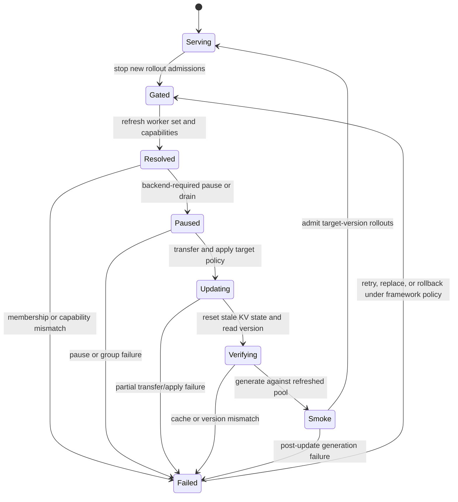

**Experimental.** A live policy refresh is a lifecycle, not only a tensor transport. The RL framework or its orchestrator must select the target worker set, gate generation, apply one target policy, verify readiness and version, handle partial failure, and decide when new rollouts are admissible. Dynamo exposes backend control surfaces but does not currently provide a fleet-wide atomic policy transaction.

This guide distinguishes live policy refresh from model distribution and documents the current framework/backend paths without implying that one mechanism applies everywhere.

Kubernetes is not required for the live-update paths in this guide. Deployment-level model rollout may use Kubernetes, another orchestrator, or direct process management; the framework-owned policy-update lifecycle remains the same boundary.

## Initial Load Is Not Live Policy Refresh

| Job | Typical trigger | Required guarantee | Current Dynamo role |
|---|---|---|---|
| Initial model loading | Worker startup, scale-up, or model deployment | Worker is ready before entering the request pool | Backend loader, Model Caching, ModelExpress, ModelStreamer, health/readiness |
| Fleet model rollout | Deploy a new model/checkpoint as a new serving revision | Deployment-level readiness, rollout, and rollback | Kubernetes/operator and loading stack |
| Live RL policy refresh | Trainer produces a new policy during a running job | Correct target worker set, update barrier or bounded lag, cache validity, version evidence, post-update generation | Direct backend controls plus framework-owned orchestration |

[ModelExpress](../../developer-guide/knowledge-base/kubernetes/model-loading/modelexpress.md) accelerates startup and fleet distribution through storage, P2P NIXL/RDMA, and optional ModelStreamer paths. It can help stage model data, but it is not the current hot-refit mechanism used by the verl or NeMo RL guides, and this page does not claim it implements an atomic RL policy update.

## Choose the Actual Update Path

| Integration or backend | Transfer/apply path | Discovery/control path | Current boundary |
|---|---|---|---|
| verl recipe | Colocated CUDA IPC coordinated by recipe-owned Ray/ZMQ control | Recipe actors, not public Dynamo worker discovery | Current public recipe path; trainer/rollout GPU layouts must satisfy the recipe's rank mapping. |
| NeMo RL managed backend | Packed checkpoint-format tensors through NeMo RL's NCCL collective sender | Fixed Ray-managed worker membership and immutable per-engine system URLs, not public frontend discovery | Pinned `ai-dynamo[vllm]==1.3.0.post1`, vLLM `0.23.0`, BF16, non-colocated, Slurm-managed path only. |
| Dynamo vLLM from shared disk | `update_weights_from_disk` direct worker route | `/v1/rl/workers`, then each `system_url` | Per-worker pause/update/cache reset/version; no fleet transaction. |
| Dynamo vLLM distributed | Group lifecycle plus `update_weights_from_distributed` | `/v1/rl/workers`, then each `system_url` | Backend RPC/body and rank mapping are integration-specific; group initialization has a watchdog. |
| Dynamo SGLang | Fixed `/engine/control/update_weights_from_*` routes or startup-allowlisted SGLang methods | Integration must know or discover each SGLang system URL; not `/v1/rl/workers` today | Request/response schemas come from the pinned SGLang version. |
| Prime-RL proposals | External NCCL/NIXL path through open integration work | Proposed Dynamo discovery plus per-engine control | Integration in progress; not a released contract. |
| ModelExpress | Model source distribution and loader path | Deployment/operator configuration | Initial load and fleet distribution; do not substitute it for framework hot-refit semantics without a validated integration. |

The transport name alone does not determine support. Record checkpoint format, source/destination parallel layouts, whether resharding occurs, tensor dtype, rank mapping, group membership, network transport, and failure behavior.

## Use a Fleet-Level State Machine



The framework should persist the target policy identity and every worker transition. Do not infer fleet success from one worker, one HTTP 200, or one successful trainer send.

## vLLM Shared-Disk Update

Start the discovery listener and an RL-enabled vLLM worker on a trusted network:

```bash
DYN_ENABLE_RL=true DYN_RL_PORT=8001 python -m dynamo.frontend
```

```bash
DYN_SYSTEM_PORT=8081 python -m dynamo.vllm \
  --model Qwen/Qwen3-0.6B \
  --enable-rl
```

Discover workers at `GET http://localhost:8001/v1/rl/workers`. Require protocol version `1`. For each selected worker, require `pause_generation`, `update_weights_from_disk`, `get_weight_version`, and `resume_generation` in its `routes` list and use its returned `system_url`.

The same descriptor can optionally contain `world_size` and `admin_base_url`. Those fields describe producer-supplied transfer topology and a backend HTTP compatibility endpoint; they neither replace `system_url` for the routes below nor identify NCCL versus NIXL. Existing Python-backed workers do not automatically publish them at the reviewed source pin, so an integration must either make them optional or pin a producer that supplies them.

The following example updates one worker and checks both HTTP failure and the JSON status. It intentionally resumes only after the update and version checks pass; if a command fails, the worker remains paused and must be repaired, replaced, or explicitly recovered before it can serve again:

```bash
set -euo pipefail

WORKER_URL=http://10.0.0.12:8081
TARGET_VERSION=step-42
TARGET_PATH=/models/checkpoint-42

PAUSE_RESPONSE=$(curl --fail-with-body "$WORKER_URL/engine/pause_generation" \
  -H 'Content-Type: application/json' \
  -d '{"mode":"keep","clear_cache":false}')
jq -e '.status == "ok"' <<<"$PAUSE_RESPONSE" >/dev/null

UPDATE_RESPONSE=$(curl --fail-with-body "$WORKER_URL/engine/update_weights_from_disk" \
  -H 'Content-Type: application/json' \
  -d "{\"model_path\":\"$TARGET_PATH\",\"weight_version\":\"$TARGET_VERSION\"}")
jq -e --arg version "$TARGET_VERSION" '.status == "ok" and .version == $version' <<<"$UPDATE_RESPONSE" >/dev/null

VERSION_RESPONSE=$(curl --fail-with-body "$WORKER_URL/engine/get_weight_version" \
  -H 'Content-Type: application/json' \
  -d '{}')
jq -e --arg version "$TARGET_VERSION" '.status == "ok" and .version == $version' <<<"$VERSION_RESPONSE" >/dev/null

RESUME_RESPONSE=$(curl --fail-with-body "$WORKER_URL/engine/resume_generation" \
  -H 'Content-Type: application/json' \
  -d '{}')
jq -e '.status == "ok"' <<<"$RESUME_RESPONSE" >/dev/null
```

The vLLM handler serializes pause, resume, cache flush, and weight update with a per-worker lock. `update_weights_from_disk` requires the worker to be paused, applies the backend collective RPC, resets the prefix cache before releasing the lock, and then records the supplied version. That provides useful per-worker ordering; it does not prevent other frontend workers from serving, coordinate a whole fleet, or prove that the checkpoint contents match the version string.

### Choose a pause mode

| Mode | Intended behavior | RL consideration |
|---|---|---|
| `keep` | Pause without explicitly waiting for or aborting current generation | Use only when the integration already gates the rollout phase and the backend behavior is validated. |
| `wait` | Ask the backend to wait for in-flight generation before the pause completes | Preserves current attempts but can extend the update barrier. Bound and observe the wait. |
| `abort` | Abort current generation as part of pausing | Mark affected framework attempts incomplete and deduplicate any retries. |

`clear_cache` can request cache clearing during pause, but the shared-disk update also resets the prefix cache after weights change. Preserve the default lifecycle unless the pinned backend is tested with a different sequence.

## vLLM Distributed Update Control

An integration that receives weights over a distributed transport can use these advertised routes:

- `init_weights_update_group`
- `update_weights_from_distributed`
- `destroy_weights_update_group`
- `get_weight_version`
- `pause_generation` and `resume_generation`

Route bodies are integration-specific and are forwarded to the selected engine RPC after Dynamo removes its reserved control keys. The integration must pin and test the exact body for its vLLM version; do not copy an NCCL or NIXL schema from another framework solely because the route name matches.

If discovery supplies `world_size`, validate it against the framework's intended inference-rank mapping before group initialization. Treat a change as topology drift and fail the update barrier. If discovery supplies `admin_base_url`, use it only for the pinned backend compatibility API that requires direct HTTP; do not append Dynamo `/engine/<route>` paths there. The protocol intentionally does not publish a transfer-backend name, collective rank map, or trainer world size.

The group initialization route defaults to a 30-second watchdog. If initialization does not complete, Dynamo cancels the task and terminates the worker because the engine core can remain blocked. Set `DYN_RL_INIT_WEIGHTS_TIMEOUT_S` on the worker when the validated rendezvous legitimately requires more time, and treat the timeout as worker failure rather than retrying against an unknown group state.

`update_weights_from_distributed` normally requires a paused worker and resets prefix cache. It accepts `allow_unpaused` and `reset_prefix_cache` control keys, but unpaused update with cache reset is rejected. An unpaused update without cache reset can mix generation with weight mutation and retain old-policy cache state; do not use it for an RL integration unless the backend and framework explicitly prove safe atomic semantics.

The `update_weights_from_tensor` vLLM route is advertised but returns “not implemented” in the current handler. Capability discovery alone is therefore not enough for semantic support; the integration must exercise the route it intends to use.

## SGLang Weight Controls

Dynamo SGLang workers register fixed system-server routes:

| Fixed route | Backend operation | Result shape |
|---|---|---|
| `/engine/control/update_weights_from_disk` | SGLang disk update request | `success`, `message`, and paused-request count |
| `/engine/control/update_weights_from_tensor` | SGLang tensor update request | `success` and `message` |
| `/engine/control/update_weights_from_distributed` | SGLang distributed update request | `success` and `message` |
| `/engine/control/update_weights_from_ipc` | SGLang IPC/checkpoint-engine request | `success` and `message` |
| `/engine/control/update_weight_version` | Update SGLang version metadata and optionally abort requests | `success`, `message`, and `new_version` |

These routes construct request objects from the installed SGLang version, so the accepted JSON fields can change with that dependency. Check `success`; do not expect the vLLM `status` schema.

For generation pause, group lifecycle, and tokenizer-manager methods, expose only the required allowlist at worker startup:

```bash
export DYN_SGLANG_ENGINE_ROUTES="server_info=get_server_info pause_generation:tm flush_cache init_weights_update_group update_weights_from_distributed:tm destroy_weights_update_group continue_generation:tm"

DYN_SYSTEM_PORT=8081 python -m dynamo.sglang \
  --model-path Qwen/Qwen3-0.6B
```

Each descriptor becomes a direct `/engine/<path>` route. Startup rejects unknown, private, duplicate, or non-callable methods. This is safer than a request-selected method proxy, but every exposed method is still administrative access. See [SGLang engine routes](../../developer-guide/knowledge-base/modular-components/backends/sglang/reference-guide.md#engine-routes) for descriptor syntax and current method behavior.

SGLang workers do not currently register with the vLLM `/v1/rl/workers` discovery path. The framework integration must provide and refresh the exact SGLang system URLs by another validated mechanism.

## verl Colocated CUDA IPC

The public [verl-recipe Dynamo backend](https://github.com/verl-project/verl-recipe/blob/461b830cfee4f5a67c21edc300c24373230babc7/dynamo/README.md) keeps trainer and rollout workers colocated and time-multiplexed. Generation uses the shared Dynamo frontend, but sleep/wake and `update_weights` use recipe-owned Ray actors and a ZMQ bridge into CUDA IPC receivers.

For this integration:

- follow the recipe's `REQUIRED_VERL.txt`, CUDA rank mapping, and hybrid-engine requirements
- do not replace its control path with public worker discovery in documentation unless the code changes
- verify every DP shard receives the trainer step and resumes after update
- measure cache/offload reset across the update when using Mooncake or FlexKV
- treat the upstream benchmark topology and results as recipe-specific evidence

See [Integrate with verl](verl.md#verify-the-policy-update) for the framework validation sequence.

## NeMo RL Managed NCCL Refit

The pinned [NeMo RL managed backend](nemo-rl.md) creates a fixed vLLM fleet and records each engine's direct system URL before initializing one trainer-plus-inference NCCL world. If engine world size is `E`, engine `i` begins at rank `training_world_size + i × E`. NeMo RL and its pinned vLLM environment both enforce a peer protocol with two 1-GiB packed transfer buffers; those constants are recomputed rather than negotiated.

The framework lifecycle is:

1. Gate or drain generation under the NeMo RL training barrier.
2. Revalidate every worker process, GPU reservation, instance identity, and system URL against the fixed membership captured during setup.
3. Serialize checkpoint-format tensor names, dtypes, and shapes.
4. Send `start_weight_update`, `update_weights`, and `finish_weight_update` through each worker's `update_weights_from_distributed` engine route.
5. In a separate cache phase, send `pause_generation` with `mode: wait` and `clear_cache: true` to every fixed worker.
6. Resume only the workers whose pause-and-clear call succeeded, then fail the cache barrier if any pause or resume failed.
7. Admit new generation only after NeMo RL has collected every update result and completed its cache policy.

The per-engine update call sets `reset_prefix_cache: false` because cache invalidation is a separate framework step. Do not collapse those operations in a rewritten example: the GRPO cache mode determines when invalidation runs, and the dedicated functional test requires one successful cache invalidation for every refit.

Membership validation prevents a dead or replaced engine from silently joining with initial weights, but the path is not elastic and does not expose a fleet-wide version transaction or rollback. On one failed future, keep new rollout admission gated, preserve all per-engine results, and either terminate the fixed-fleet run or execute a separately validated full-fleet recovery. A surviving subset is not a valid success condition.

See [Integrate with NeMo RL](nemo-rl.md#verify-the-policy-refit) for its exact pins, rank geometry, functional evidence, and graduation gates.

## Version Semantics

A useful policy version must be stable, comparable, and tied to the trainer artifact. Prefer an immutable checkpoint ID or content digest over a mutable path such as `latest`. Record at least:

- framework run and trainer global step
- checkpoint URI and immutable digest or version
- intended worker set and discovery snapshot time
- per-worker previous and target version
- transfer start/end, cache reset, readiness, and resume times
- post-update generation request and result

The current vLLM `get_weight_version` returns the tag supplied by the control caller; it does not hash the applied tensors. Pair it with transport/application success and a post-update smoke. SGLang version metadata can also be updated separately from weight content, so do not treat a version string alone as cryptographic proof.

At the reviewed `5bc908ad` source pin, an update that omits `weight_version` can expose the string `unknown`, while an untouched worker reports `initial`; neither value proves which tensors are resident. [Dynamo PR #13041 at `9672792`](https://github.com/ai-dynamo/dynamo/pull/13041) proposes a distinct undeclared state and a separate version-declaration route, but it remains open, review required, and blocked. Do not use its proposed `null` or `version_declared` response fields until their final contract merges and is pinned.

The current Dynamo router does not select workers by this version. The framework must gate synchronous rollouts or maintain and enforce bounded staleness in its own orchestration and sample-acceptance logic.

## Cache Correctness

KV entries computed under one policy are not valid under another policy even when token IDs are identical. Every update path must answer:

1. Which device, host, disk, or shared KV tiers contain old-policy state?
2. Which route resets each tier, and does it complete before generation resumes?
3. Does the router's cache index receive the removal/reset events it needs?
4. How are offload backends flushed, and what happens on timeout?
5. Is the first post-update measurement a cold-cache warm-up or part of the reported steady state?

The vLLM disk route resets the engine prefix cache after applying weights. Other backend, framework, and offload paths require separate validation; do not infer complete multi-tier invalidation from that one handler.

## Handle Partial Failure

| Failure point | Safe default | Evidence to preserve |
|---|---|---|
| Worker disappears before update | Refresh membership and rebuild the target set before any transfer | Discovery snapshots and selected set |
| Pause fails | Do not transfer to that worker or admit new rollouts | HTTP status, JSON result, in-flight request state |
| Group initialization times out | Treat the worker as failed and rebuild with a known group | timeout, worker termination/restart, rank map |
| One transfer fails after peers succeed | Keep the rollout phase gated; retry, replace, or rollback under one explicit policy | per-worker old/target version and transport result |
| Cache reset fails | Exclude the worker even if transfer succeeded | cache/reset result and router/KV events |
| Version readback mismatches | Do not reopen a synchronous rollout fleet | requested/returned version and checkpoint digest |
| Resume fails | Keep the worker out of the target pool and repair/restart it | readiness and liveness results |
| Post-update generation fails | Do not count the update as complete | request trace, engine log, target-version ledger |

HTTP callbacks can return an error object with HTTP 200. Always check both transport status and the backend-specific result (`status == "ok"` for the vLLM routes described here, `success == true` for the SGLang fixed update routes).

There is no general rollback route that reconstructs a previous in-memory policy. A practical rollback can require reapplying the previous checkpoint, replacing the worker, or restarting a prior deployment. Document and test the chosen mechanism before enabling asynchronous updates.

## Verify an Update End to End

For every published integration, capture one validation report with:

- target policy ID and immutable checkpoint/transfer identity
- pre-update generation and worker-version evidence
- request gate or bounded-staleness configuration
- discovered/selected worker set and required routes
- pause/drain/abort behavior and in-flight sample disposition
- group lifecycle and transfer parameters where applicable
- per-worker apply, cache reset, version, liveness, and resume results
- post-update generation for every worker or a routing strategy that proves the refreshed set
- failure injection for one missing worker, one transfer failure, and one post-update failure
- update duration distribution and effect on completed fresh trajectories

Do not label an update path supported when only transfer bandwidth was measured. Readiness, atomicity, failure, retry, cache, version, and sample-freshness semantics are part of the product contract.

## Qualify Every Claimed Update Path

Validate every topology and transport named by an integration; do not generalize one passing path into a broader support claim. A program-level claim that Dynamo covers both colocated and disaggregated RL serving should include at least two distinct paths: one colocated path and a different disaggregated serving path. Those paths may use different framework/backend combinations, so every path must independently pin its framework commit, backend version, container image digest, model revision, transport, model class, and source and target TP, PP, DP, and EP layouts.

For each path, preserve evidence that all targeted workers were verified, cache handling completed, the requested version was read back, the output changed or a numerical tensor validation passed, a partial failure recovered under the declared policy, and generation succeeded after the update. A transport benchmark or one-worker success cannot satisfy this record.

Have an independent reviewer confirm every claimed path report before using “supported” language. For a program-level colocated-and-disaggregated claim, the review must cover both path reports plus the matched routing experiment and [combined observability, replay, and simulation evidence](operations-and-simulation.md#complete-the-cross-cutting-validation-report), keeping the conclusion tied to one pinned program rather than unrelated demonstrations.

## Observe Update Time

Current request traces do not define standardized weight-update events or typed served-policy fields. Record update lifecycle in the framework/control-service ledger and correlate its timestamps with Dynamo logs, worker metrics, request gaps, and post-update request traces. See [Diagnose a blocked or failed weight refresh](operations-and-simulation.md#blocked-or-failed-weight-refresh) for a current-state workflow.
