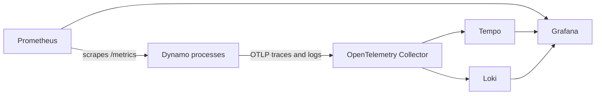

The local observability stack combines metrics, logs, and traces from CLI deployments. Install it
with the [Observability installation guide](../../cli/observability.mdx), then use the Operations
guides to configure Dynamo processes.

## Services and Ports

| Service | Host endpoint | Purpose |
| --- | --- | --- |
| Grafana | `http://localhost:3000` | Dashboards and signal exploration |
| Prometheus | `http://localhost:9090` | Metrics collection and PromQL queries |
| Tempo | `http://localhost:3200` | Trace storage and query API |
| Loki | `http://localhost:3100` | Log storage and query API |
| OpenTelemetry Collector | `localhost:4317` (gRPC), `localhost:4318` (HTTP) | OTLP ingestion for traces and logs |
| NATS Prometheus exporter | `http://localhost:7777/metrics` | NATS metrics |
| DCGM exporter | `http://localhost:9401/metrics` | Optional NVIDIA GPU metrics |

Grafana uses `dynamo` for both the default username and password. The DCGM exporter uses port `9401`
instead of its default port `9400` to avoid conflicts with another exporter on the host.

## Signal Flow

Prometheus scrapes Dynamo metrics directly. Dynamo sends traces and exported logs to the
OpenTelemetry Collector, which routes them to Tempo and Loki. Grafana queries all three backends.

## Configuration Files

| File | Purpose |
| --- | --- |
| [`dev/docker-observability.yml`](https://github.com/ai-dynamo/dynamo/blob/main/dev/docker-observability.yml) | Defines the local observability services, network, volumes, and optional profiles |
| [`dev/observability/prometheus.yml`](https://github.com/ai-dynamo/dynamo/blob/main/dev/observability/prometheus.yml) | Defines Prometheus scrape targets and intervals |
| [`dev/observability/grafana-datasources.yml`](https://github.com/ai-dynamo/dynamo/blob/main/dev/observability/grafana-datasources.yml) | Provisions the Prometheus data source |
| [`dev/observability/tempo-datasource.yml`](https://github.com/ai-dynamo/dynamo/blob/main/dev/observability/tempo-datasource.yml) | Provisions the Tempo data source |
| [`dev/observability/loki-datasource.yml`](https://github.com/ai-dynamo/dynamo/blob/main/dev/observability/loki-datasource.yml) | Provisions the Loki data source and trace links |
| [`dev/observability/otel-collector.yaml`](https://github.com/ai-dynamo/dynamo/blob/main/dev/observability/otel-collector.yaml) | Routes OTLP traces to Tempo and logs to Loki |
| [`dev/observability/loki.yaml`](https://github.com/ai-dynamo/dynamo/blob/main/dev/observability/loki.yaml) | Configures local Loki storage |
| [`dev/observability/grafana_dashboards/`](https://github.com/ai-dynamo/dynamo/tree/main/dev/observability/grafana_dashboards) | Contains the provisioned Dynamo, GPU, and KVBM dashboards |

## Optional Profiles

The `nvidia` profile starts the DCGM exporter for NVIDIA GPU metrics. The `resource-monitor` profile
starts a second Prometheus instance on port `9091` for high-frequency local resource monitoring. See
the [Local Resource Monitor Reference](local-resource-monitor.mdx) for its configuration and usage.
